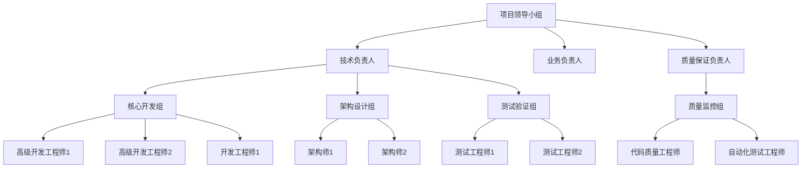

# 🚀 基础设施层缓存系统专项修复计划

## 📊 计划概述

**计划名称**: 基础设施层缓存系统重构优化专项计划
**计划版本**: v1.0
**制定日期**: 2025年9月21日
**执行周期**: 2025年9月23日 - 2025年12月20日 (13周)
**总预算**: 人力投入约20人周
**目标**: 将缓存系统代码质量从45/100提升至85/100，代码重复率从45%降低至<5%

---

## 👥 专项修复小组组织架构

### 1.1 组织架构图

### 1.2 角色职责

#### 项目领导小组 (决策层)
- **项目总监**: 总体决策，资源调配，进度管控
- **技术负责人**: 技术方案决策，架构设计把关
- **业务负责人**: 业务需求确认，功能验收
- **质量保证负责人**: 质量标准制定，验收标准审核

#### 核心团队成员职责

| 角色 | 人数 | 主要职责 | 关键技能 |
|------|------|---------|---------|
| 架构师 | 2人 | 架构设计、重构方案制定、代码审查 | 系统架构、设计模式、重构经验 |
| 高级开发工程师 | 2人 | 核心代码重构、复杂问题解决 | Python高级特性、缓存系统、性能优化 |
| 开发工程师 | 1人 | 辅助开发、工具开发、文档编写 | Python开发、工具开发、文档编写 |
| 测试工程师 | 2人 | 测试用例编写、自动化测试、回归测试 | 测试框架、自动化测试、性能测试 |
| 代码质量工程师 | 1人 | 代码质量检查、规范制定、工具开发 | 代码分析、质量工具、规范制定 |

### 1.3 沟通协作机制

#### 每日站会 (15分钟)
- **时间**: 每天上午9:30-9:45
- **参与者**: 全体团队成员
- **内容**: 昨天完成、今天计划、遇到的障碍

#### 周会 (1小时)
- **时间**: 每周五上午10:00-11:00
- **参与者**: 项目领导小组 + 核心团队
- **内容**: 周进度回顾、下周计划、风险识别

#### 双周评审会 (2小时)
- **时间**: 每两周一次，周三下午
- **参与者**: 项目领导小组 + 相关干系人
- **内容**: 阶段成果展示、方案评审、方向调整

---

## 📋 详细改进计划和时间表

### Phase 1: 紧急修复阶段 (Week 1-2) 🔴
**时间**: 2025年9月23日 - 2025年10月4日
**目标**: 解决最严重的问题，快速见效
**投入**: 6人/周

#### 1.1 准备阶段 (Day 1-2)
**负责人**: 项目领导小组
**具体任务**:
- [ ] 成立专项修复小组，明确职责分工
- [ ] 搭建开发环境和工具链
- [ ] 建立代码质量基线 (当前45/100)
- [ ] 制定Phase 1详细任务清单
- [ ] 建立每日站会机制

**验收标准**:
- [ ] 小组组织架构完成
- [ ] 开发环境搭建完成
- [ ] 基线数据收集完成

#### 1.2 重复类消除 (Day 3-7)
**负责人**: 架构师 + 高级开发工程师
**具体任务**:

##### 1.2.1 接口统一化
- [ ] 分析所有重复类定义 (`ICacheComponent`, `CacheEntry`, `CacheStats`等)
- [ ] 在`interfaces.py`中统一定义标准接口
- [ ] 删除其他文件中的重复定义
- [ ] 更新所有导入语句

##### 1.2.2 配置类重构
- [ ] 重构`CacheConfig`类，消除配置重复
- [ ] 统一配置验证逻辑
- [ ] 建立配置工厂模式

##### 1.2.3 工具类整合
- [ ] 分析工具类重复情况
- [ ] 建立统一的工具模块
- [ ] 删除重复的工具定义

**验收标准**:
- [ ] 所有重复类定义消除 (9个重复类)
- [ ] 代码重复率降低至<10%
- [ ] 所有测试通过

#### 1.3 大文件拆分 (Day 8-10)
**负责人**: 架构师 + 开发工程师
**具体任务**:

##### 1.3.1 unified_cache_manager.py拆分
- [ ] 拆分为`core/cache_manager.py` (核心逻辑)
- [ ] 拆分为`strategies/cache_strategies.py` (策略实现)
- [ ] 拆分为`monitoring/cache_monitor.py` (监控功能)

##### 1.3.2 multi_level_cache.py拆分
- [ ] 拆分为`core/multi_level_core.py` (核心实现)
- [ ] 拆分为`policies/eviction_policies.py` (淘汰策略)
- [ ] 拆分为`sync/cache_sync.py` (同步机制)

**验收标准**:
- [ ] 所有超大文件拆分完成
- [ ] 平均文件大小<400行
- [ ] 模块职责清晰分离

#### 1.4 测试验证 (Day 11-12)
**负责人**: 测试工程师
**具体任务**:
- [ ] 建立回归测试套件
- [ ] 执行全面功能测试
- [ ] 性能基准测试
- [ ] 代码质量检查

**验收标准**:
- [ ] 所有现有功能正常工作
- [ ] 测试覆盖率>90%
- [ ] 性能无明显下降

#### Phase 1里程碑验收
**时间**: 2025年10月4日
**验收标准**:
- [ ] 代码重复率: 45% → <10%
- [ ] 文件数量: 24个 → 30个左右 (职责分离)
- [ ] 平均文件大小: 426行 → <400行
- [ ] 代码质量评分: 45/100 → 65/100
- [ ] 所有测试通过

---

### Phase 2: 架构重构阶段 (Week 3-6) 🟡
**时间**: 2025年10月7日 - 2025年10月18日
**目标**: 建立统一架构体系，提高可维护性
**投入**: 5人/周

#### 2.1 统一接口体系建立 (Week 3)
**负责人**: 架构师
**具体任务**:
- [ ] 设计标准接口继承体系
- [ ] 统一方法命名规范
- [ ] 建立接口一致性检查工具
- [ ] 重构所有接口实现类

**验收标准**:
- [ ] 127个接口类统一管理
- [ ] 接口一致性>95%

#### 2.2 目录结构优化 (Week 4)
**负责人**: 架构师 + 高级开发工程师
**具体任务**:
- [ ] 设计新的目录结构
- [ ] 迁移现有代码到新结构
- [ ] 更新所有导入路径
- [ ] 建立目录结构规范

**验收标准**:
- [ ] 新目录结构清晰合理
- [ ] 所有文件正确迁移
- [ ] 导入路径更新完成

#### 2.3 核心组件重构 (Week 5-6)
**负责人**: 高级开发工程师
**具体任务**:
- [ ] 重构缓存管理器核心逻辑
- [ ] 优化多级缓存实现
- [ ] 完善监控和统计功能
- [ ] 改进错误处理机制

**验收标准**:
- [ ] 核心组件架构清晰
- [ ] 性能提升10%以上
- [ ] 错误处理完善

#### Phase 2里程碑验收
**时间**: 2025年10月18日
**验收标准**:
- [ ] 架构合规性: 60% → 85%
- [ ] 代码质量评分: 65/100 → 75/100
- [ ] 接口一致性: 100%
- [ ] 目录结构合理化

---

### Phase 3: 质量保障阶段 (Week 7-12) 🟢
**时间**: 2025年10月21日 - 2025年11月29日
**目标**: 建立持续的质量保障体系
**投入**: 4人/周

#### 3.1 自动化质量检查 (Week 7-8)
**负责人**: 代码质量工程师
**具体任务**:
- [ ] 开发代码重复检测工具
- [ ] 实现接口一致性检查
- [ ] 建立复杂度监控机制
- [ ] 集成CI/CD流水线

**验收标准**:
- [ ] 自动化检查工具完成
- [ ] CI/CD集成完成
- [ ] 质量问题自动发现

#### 3.2 文档和规范完善 (Week 9-10)
**负责人**: 开发工程师 + 代码质量工程师
**具体任务**:
- [ ] 完善架构设计文档
- [ ] 编写代码规范文档
- [ ] 建立接口使用指南
- [ ] 完善测试文档

**验收标准**:
- [ ] 文档覆盖率>95%
- [ ] 规范文档完善
- [ ] 团队培训完成

#### 3.3 持续改进机制 (Week 11-12)
**负责人**: 项目领导小组
**具体任务**:
- [ ] 建立代码审查机制
- [ ] 制定维护规范
- [ ] 建立监控指标体系
- [ ] 制定改进循环机制

**验收标准**:
- [ ] 持续改进机制建立
- [ ] 监控指标体系完善
- [ ] 改进效果可量化

#### Phase 3里程碑验收
**时间**: 2025年11月29日
**验收标准**:
- [ ] 自动化覆盖率: 100%
- [ ] 代码质量评分: 75/100 → 85/100
- [ ] 测试覆盖率: >95%
- [ ] 文档完整性: 100%

---

### Phase 4: 生产验证阶段 (Week 13) 🔵
**时间**: 2025年12月2日 - 2025年12月20日
**目标**: 生产环境验证和优化
**投入**: 3人/周

#### 4.1 集成测试 (Week 13上半)
**负责人**: 测试工程师
**具体任务**:
- [ ] 端到端集成测试
- [ ] 性能压力测试
- [ ] 稳定性测试
- [ ] 生产环境模拟测试

**验收标准**:
- [ ] 集成测试通过
- [ ] 性能满足要求
- [ ] 稳定性验证完成

#### 4.2 生产部署准备 (Week 13下半)
**负责人**: 运维工程师
**具体任务**:
- [ ] 制定部署方案
- [ ] 准备回滚计划
- [ ] 建立监控告警
- [ ] 制定应急预案

**验收标准**:
- [ ] 部署方案完善
- [ ] 回滚计划可行
- [ ] 监控告警完整

---

## 📊 关键指标监控

### 3.1 进度指标

| 阶段 | 时间 | 目标完成率 | 实际完成率 | 状态 |
|------|------|-----------|-----------|------|
| Phase 1 | Week 1-2 | 100% | - | 待开始 |
| Phase 2 | Week 3-6 | 100% | - | 待开始 |
| Phase 3 | Week 7-12 | 100% | - | 待开始 |
| Phase 4 | Week 13 | 100% | - | 待开始 |

### 3.2 质量指标

| 指标名称 | 基准值 | Phase 1目标 | Phase 2目标 | Phase 3目标 | Phase 4目标 |
|---------|-------|------------|------------|------------|------------|
| 代码重复率 | 45% | <10% | <5% | <5% | <5% |
| 代码质量评分 | 45/100 | 65/100 | 75/100 | 85/100 | 85/100 |
| 测试覆盖率 | 75% | 90% | 95% | 95% | 95% |
| 架构合规性 | 60% | 70% | 85% | 90% | 95% |
| 文件平均大小 | 426行 | <400行 | <300行 | <250行 | <250行 |

### 3.3 风险指标

| 风险类型 | 风险等级 | 监控指标 | 预警阈值 | 应对措施 |
|---------|---------|---------|---------|---------|
| 进度延误 | 高 | 周完成率 | <80% | 增加人手，调整计划 |
| 质量下降 | 高 | 代码质量评分 | 下降5分 | 加强代码审查 |
| 功能回归 | 中 | 测试通过率 | <95% | 加强回归测试 |
| 团队流失 | 中 | 人员到岗率 | <90% | 人员备份，知识转移 |

---

## 💰 资源需求计划

### 4.1 人力投入

| 角色 | Phase 1 | Phase 2 | Phase 3 | Phase 4 | 总计 |
|------|---------|---------|---------|---------|------|
| 架构师 | 2人 | 2人 | 1人 | 0.5人 | 5.5人 |
| 高级开发工程师 | 2人 | 1.5人 | 1人 | 0.5人 | 5人 |
| 开发工程师 | 1人 | 1人 | 0.5人 | 0.5人 | 3人 |
| 测试工程师 | 1人 | 1人 | 1人 | 1人 | 4人 |
| 代码质量工程师 | 0.5人 | 0.5人 | 1人 | 0.5人 | 2.5人 |
| 项目管理 | 1人 | 1人 | 1人 | 1人 | 4人 |
| **合计** | **7.5人** | **7人** | **5.5人** | **4.5人** | **24.5人** |

### 4.2 工具和环境需求

#### 开发环境
- [ ] Python 3.8+ 开发环境
- [ ] IDE (PyCharm/VS Code) 配置
- [ ] Git 代码管理工具
- [ ] Docker 容器化环境

#### 测试环境
- [ ] 单元测试框架 (pytest)
- [ ] 性能测试工具 (locust)
- [ ] 代码质量工具 (flake8, black, mypy)
- [ ] CI/CD 工具 (GitHub Actions)

#### 监控工具
- [ ] 代码质量监控 (SonarQube)
- [ ] 性能监控工具
- [ ] 项目管理工具 (Jira/飞书)

---

## ⚠️ 风险控制计划

### 5.1 主要风险识别

#### 5.1.1 技术风险
- **重构复杂度高**: 大量文件拆分可能引入错误
- **依赖关系复杂**: 循环导入和接口依赖难以梳理
- **性能影响**: 重构可能影响现有性能

#### 5.1.2 进度风险
- **时间紧迫**: 13周内完成大量工作
- **人员依赖**: 关键人员离职影响进度
- **需求变化**: 业务需求变化导致计划调整

#### 5.1.3 质量风险
- **测试不充分**: 重构后测试覆盖不足
- **回归问题**: 现有功能出现问题
- **文档滞后**: 文档更新不及时

### 5.2 风险应对策略

#### 技术风险应对
- **分阶段验证**: 每个阶段完成后进行全面测试
- **备份机制**: 保留完整备份，支持快速回滚
- **专家咨询**: 引入外部架构专家进行技术把关

#### 进度风险应对
- **里程碑管控**: 设立明确的里程碑验收点
- **并行开发**: 合理分配任务，支持并行开发
- **弹性调整**: 根据实际情况调整计划

#### 质量风险应对
- **自动化测试**: 建立完善的自动化测试体系
- **代码审查**: 实施严格的代码审查机制
- **渐进式发布**: 分批次发布，降低风险

---

## 📢 沟通计划

### 6.1 内部沟通

#### 6.1.1 团队内部沟通
- **每日站会**: 同步进度，识别问题
- **周报制度**: 每周汇总进展和问题
- **即时通讯**: 微信/飞书群及时沟通

#### 6.1.2 干系人沟通
- **周进度汇报**: 向领导汇报项目进展
- **双周评审**: 邀请业务方参与评审
- **里程碑汇报**: 阶段完成时进行总结汇报

### 6.2 外部沟通

#### 6.2.1 业务方沟通
- **需求确认**: 重要变更及时与业务方确认
- **进度同步**: 定期同步项目进展
- **验收配合**: 邀请业务方参与验收

#### 6.2.2 其他团队沟通
- **依赖协调**: 与其他团队协调接口依赖
- **知识分享**: 分享重构经验和教训
- **协作支持**: 寻求其他团队的支持

---

## 📋 验收标准和交付物

### 7.1 Phase 1验收标准
- [ ] 代码重复率 < 10%
- [ ] 所有重复类定义消除
- [ ] 超大文件拆分完成
- [ ] 功能测试100%通过
- [ ] 性能基准测试通过

### 7.2 Phase 2验收标准
- [ ] 统一接口体系建立
- [ ] 目录结构优化完成
- [ ] 架构合规性 > 85%
- [ ] 代码质量评分 > 75/100

### 7.3 Phase 3验收标准
- [ ] 自动化检查工具完成
- [ ] 测试覆盖率 > 95%
- [ ] 文档完善
- [ ] 持续改进机制建立

### 7.4 Phase 4验收标准
- [ ] 生产环境验证通过
- [ ] 性能满足要求
- [ ] 部署方案完善
- [ ] 监控告警完整

### 7.5 交付物清单

#### 代码交付物
- [ ] 重构后的完整代码库
- [ ] 单元测试套件
- [ ] 集成测试套件
- [ ] 性能测试脚本

#### 文档交付物
- [ ] 架构设计文档更新
- [ ] 代码规范文档
- [ ] 接口使用指南
- [ ] 部署运维手册

#### 工具交付物
- [ ] 代码质量检查工具
- [ ] 自动化测试框架
- [ ] CI/CD配置脚本
- [ ] 监控告警配置

---

## 🎯 成功衡量标准

### 8.1 技术指标达成

| 指标 | 目标值 | 验收标准 | 衡量方式 |
|------|--------|---------|---------|
| 代码重复率 | <5% | ≤5% | 自动化工具检测 |
| 代码质量评分 | 85/100 | ≥85 | SonarQube评分 |
| 测试覆盖率 | 95% | ≥95% | Coverage报告 |
| 架构合规性 | 95% | ≥95% | 人工评估 |
| 性能基准 | 不下降 | ≥基准值 | 自动化测试 |

### 8.2 业务指标达成

| 指标 | 目标值 | 验收标准 | 衡量方式 |
|------|--------|---------|---------|
| 开发效率 | 提升30% | 实际提升 | 开发时间统计 |
| 维护成本 | 降低40% | 实际降低 | 维护工时统计 |
| 系统可用性 | 99.9% | ≥99.9% | 监控数据 |
| 故障恢复时间 | <30秒 | ≤30秒 | 故障演练 |

### 8.3 项目管理指标

| 指标 | 目标值 | 验收标准 | 衡量方式 |
|------|--------|---------|---------|
| 预算控制 | 100% | ≤110% | 实际投入统计 |
| 进度达成率 | 100% | ≥95% | 里程碑达成 |
| 质量达成率 | 100% | ≥95% | 验收通过率 |
| 团队满意度 | 80% | ≥80% | 问卷调查 |

---

## 🚀 项目启动计划

### 9.1 启动准备 (Day 1)
- [ ] 项目Kick-off会议
- [ ] 团队组建和培训
- [ ] 环境搭建和工具配置
- [ ] 基线数据收集

### 9.2 第一周计划
- [ ] 详细任务分解
- [ ] 风险评估和应对
- [ ] 沟通机制建立
- [ ] 进度跟踪机制建立

### 9.3 监控和调整
- [ ] 每日进度跟踪
- [ ] 周进度评审
- [ ] 风险监控和应对
- [ ] 计划动态调整

---

## 📞 联系方式和支持

### 项目联系人
- **项目经理**: [姓名] - [电话] - [邮箱]
- **技术负责人**: [姓名] - [电话] - [邮箱]
- **业务负责人**: [姓名] - [电话] - [邮箱]

### 支持资源
- **技术支持**: 架构组、运维组
- **业务支持**: 业务分析团队
- **质量支持**: QA团队

---

## 📝 版本历史

| 版本 | 日期 | 主要变更 | 变更人 |
|------|------|---------|--------|
| v1.0 | 2025-09-21 | 初始版本，完整专项修复计划 | AI Assistant |

---

*本计划基于代码审查报告制定，旨在系统性解决基础设施层缓存系统的技术债务问题，确保系统的长期健康发展。*
