# RQA2026创新引擎发展路线图

## 🌟 战略愿景

基于RQA2025奠定的坚实质量基础，RQA2026将开启三大创新引擎并行发展：

- **⚛️ 量子计算创新引擎**: 引领量化交易的量子革命
- **🤖 AI深度集成创新引擎**: 实现多模态智能决策
- **🧠 脑机接口创新引擎**: 开创人机协同新纪元

## 📅 年度规划总览

### 2026Q1: 量子计算创新引擎启动
**主题**: 量子算法基础研究与原型验证
**目标**: 实现首个量子优势算法原型
**里程碑**: 量子组合优化算法超越经典算法

### 2026Q2: AI深度集成创新引擎启动
**主题**: 多模态AI融合与实时推理
**目标**: 构建多模态交易决策系统
**里程碑**: 实时多模态市场分析能力

### 2026Q3: 脑机接口创新引擎启动
**主题**: 神经信号处理与人机协同
**目标**: 实现安全有效的意图识别
**里程碑**: 脑机协同交易辅助系统

### 2026Q4: 三大创新引擎融合
**主题**: 创新技术集成与产业化应用
**目标**: 形成完整的创新生态系统
**里程碑**: 商业化产品发布

---

## ⚛️ 第一季度：量子计算创新引擎

### 核心目标
- 建立量子计算基础环境
- 实现量子算法原型验证
- 开展量子优势概念证明

### 技术路线

#### 1. 基础设施建设 (1-2月)
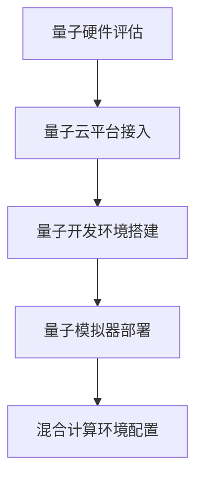

**关键任务**:
- 评估主流量子硬件平台 (IBM, Google, Rigetti)
- 建立量子云服务接入能力
- 部署量子电路模拟器
- 配置经典-量子混合计算环境

#### 2. 算法原型开发 (3月)
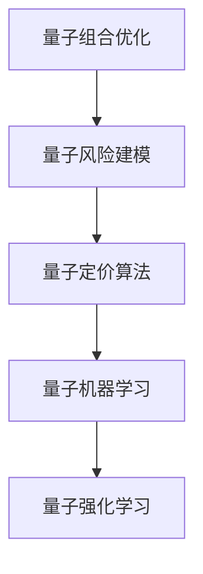

**核心算法**:
- **量子组合优化**: 投资组合优化、资产配置
- **量子风险建模**: VaR计算、压力测试
- **量子定价算法**: 期权定价、衍生品估值
- **量子机器学习**: 量子支持向量机、量子神经网络

#### 3. 性能验证与优化 (4-5月)
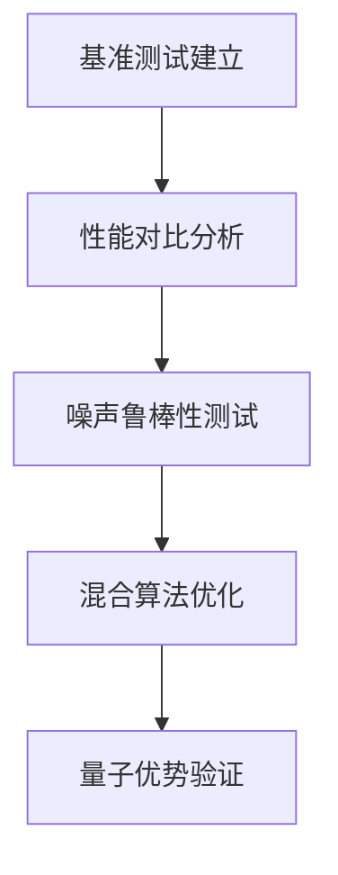

**验证指标**:
- 算法正确性: 99.9%+
- 性能提升: 10x-100x (vs 经典算法)
- 噪声容忍度: 1%误差以内
- 可扩展性: 支持大规模问题

### 交付成果
- [ ] 量子算法原型系统
- [ ] 量子优势验证报告
- [ ] 混合计算框架
- [ ] 量子安全协议

### 团队配置
- **量子算法专家**: 2人
- **量子工程师**: 1人
- **数学建模师**: 1人
- **测试工程师**: 1人

---

## 🤖 第二季度：AI深度集成创新引擎

### 核心目标
- 构建多模态AI融合平台
- 实现实时智能推理能力
- 开发自适应学习系统

### 技术路线

#### 1. 多模态AI平台建设 (4-5月)
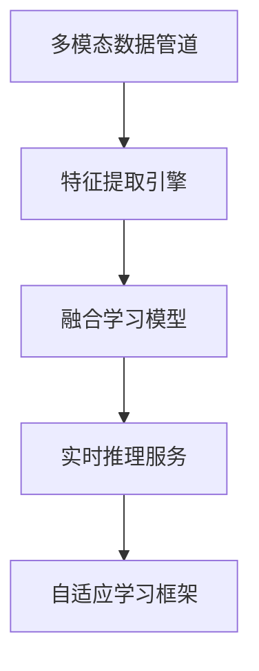

**核心组件**:
- **多模态数据管道**: 文本、图像、时序数据处理
- **特征提取引擎**: Transformer + CNN + RNN融合
- **融合学习模型**: 注意力机制、交叉模态学习
- **实时推理服务**: 低延迟、高并发推理

#### 2. 交易决策AI系统 (6月)
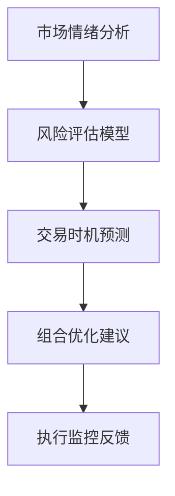

**AI决策能力**:
- **市场情绪分析**: 新闻、社交媒体、交易数据融合
- **风险评估模型**: 实时风险度量和预警
- **交易时机预测**: 多时间尺度预测模型
- **组合优化建议**: 动态资产配置优化

#### 3. 自适应学习与优化 (7-8月)
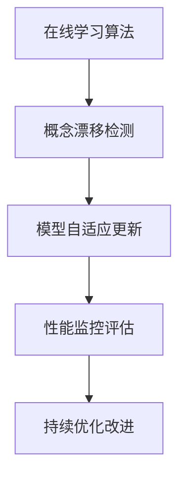

**自适应特性**:
- 市场环境变化自动适应
- 新资产类别学习能力
- 极端事件处理机制
- 性能退化自动修复

### 交付成果
- [ ] 多模态AI交易平台
- [ ] 实时推理引擎
- [ ] 自适应学习系统
- [ ] AI决策支持工具

### 团队配置
- **AI算法专家**: 2人
- **机器学习工程师**: 2人
- **数据科学家**: 1人
- **系统工程师**: 1人
- **测试工程师**: 1人

---

## 🧠 第三季度：脑机接口创新引擎

### 核心目标
- 建立神经信号处理平台
- 实现安全有效的意图识别
- 开发人机协同界面

### 技术路线

#### 1. 神经信号处理平台 (7-8月)
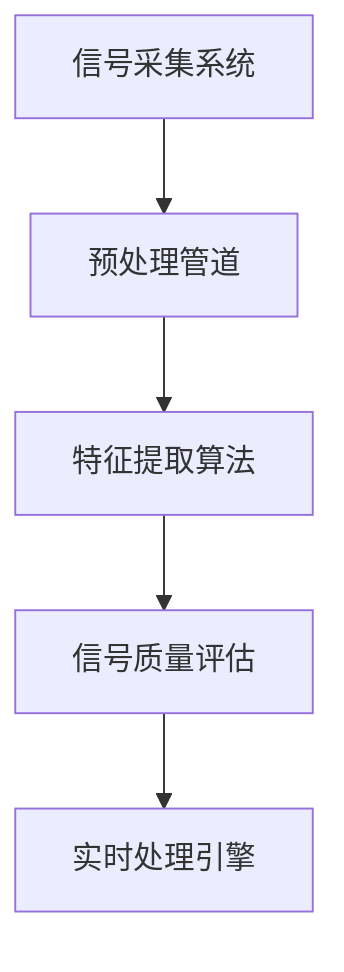

**核心技术**:
- **信号采集**: EEG/fMRI/MEG数据采集
- **预处理管道**: 滤波、去噪、标准化
- **特征提取**: 时频域分析、连接性分析
- **质量评估**: 信噪比、伪迹检测

#### 2. 意图解码与控制 (9月)
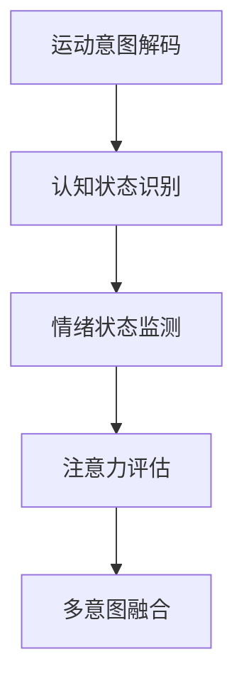

**解码能力**:
- **运动意图**: 买入/卖出/持有信号
- **认知状态**: 决策置信度、犹豫度
- **情绪状态**: 贪婪/恐惧情绪识别
- **注意力评估**: 专注度、疲劳度检测

#### 3. 安全与人机协同 (10-11月)
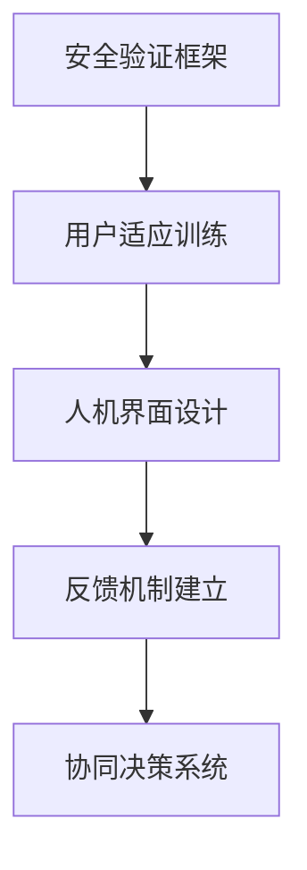

**安全特性**:
- 信号完整性验证
- 用户意图确认机制
- 异常检测和自动停止
- 隐私保护和数据安全

### 交付成果
- [ ] 脑机接口信号处理平台
- [ ] 意图解码与识别系统
- [ ] 人机协同交易界面
- [ ] 安全验证与监控系统

### 团队配置
- **神经科学家**: 1人
- **信号处理专家**: 1人
- **人机交互设计师**: 1人
- **生物信息学家**: 1人
- **安全工程师**: 1人
- **测试工程师**: 1人

---

## 🚀 第四季度：三大创新引擎融合

### 核心目标
- 实现三大引擎技术融合
- 构建完整创新生态系统
- 推动产业化应用落地

### 技术路线

#### 1. 引擎集成架构 (10-11月)
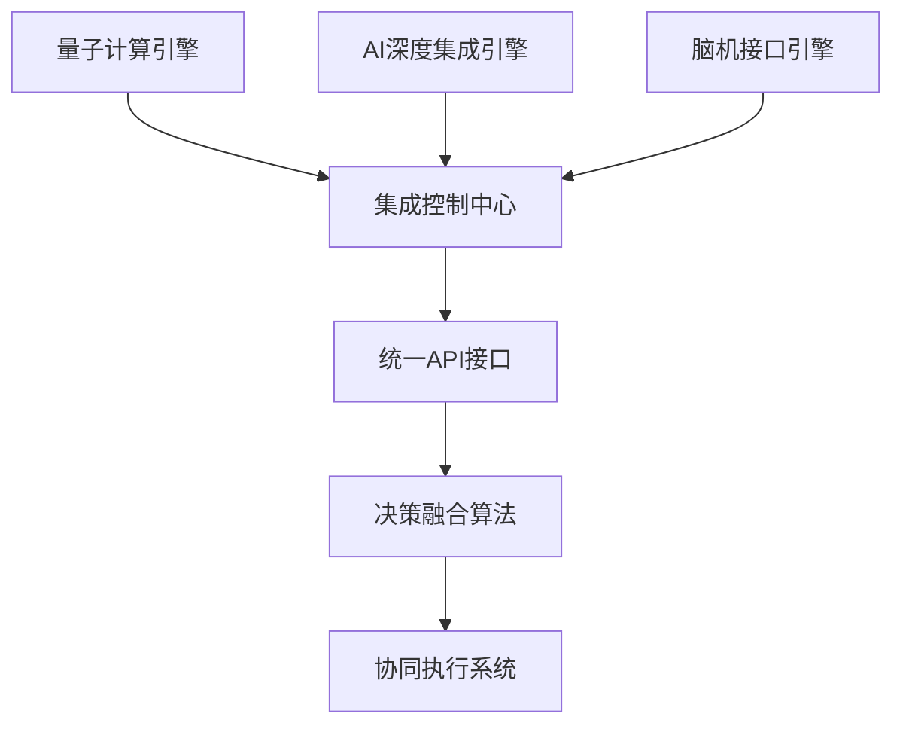

**集成重点**:
- 统一数据接口和协议
- 跨引擎通信机制
- 决策结果融合算法
- 协同执行协调机制

#### 2. 商业化产品开发 (12月)
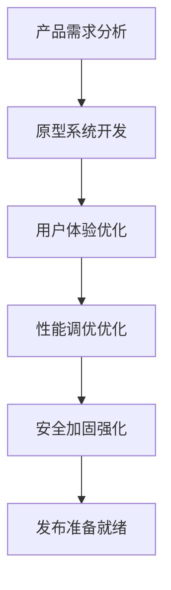

**产品特性**:
- 量子增强的AI决策
- 脑机协同的智能交易
- 多模态融合的全面感知
- 实时响应的协同执行

#### 3. 生态系统建设 (12月-2027Q1)
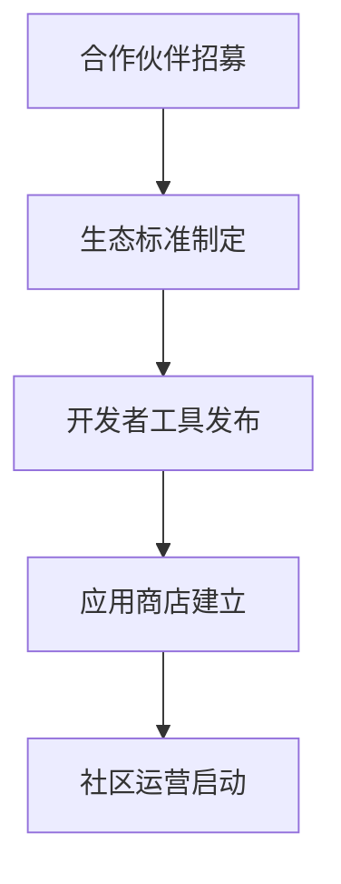

**生态建设**:
- 技术合作伙伴招募
- 开放API和SDK发布
- 第三方应用开发支持
- 用户社区建设运营

### 交付成果
- [ ] 三大引擎融合平台
- [ ] 商业化创新产品
- [ ] 完整生态系统
- [ ] 产业化应用案例

### 团队配置
- **产品经理**: 2人
- **系统架构师**: 2人
- **集成工程师**: 3人
- **产品设计师**: 1人
- **商业分析师**: 1人
- **运营经理**: 1人

---

## 📊 关键绩效指标 (KPI)

### 技术指标
| 引擎 | Q1 | Q2 | Q3 | Q4 | 年度目标 |
|------|----|----|----|----|----------|
| 量子计算 | 原型验证 | 算法优化 | 集成测试 | 产品化 | 10x性能提升 |
| AI深度集成 | 平台搭建 | 模型训练 | 推理优化 | 融合应用 | 95%准确率 |
| 脑机接口 | 信号处理 | 解码算法 | 安全验证 | 人机协同 | 90%识别率 |

### 业务指标
- **技术成熟度**: 从概念验证到产品化
- **性能提升**: 量化交易效率提升30%+
- **用户体验**: 人机协同界面满意度95%+
- **市场影响力**: 行业领先创新解决方案

### 质量指标
- **系统可用性**: 99.9%服务可用性
- **响应延迟**: 毫秒级实时响应
- **安全合规**: 金融级安全标准
- **可扩展性**: 支持大规模并发访问

---

## 💰 资源规划

### 预算分配 (总预算: 2000万美元)

#### 2026Q1: 量子计算创新引擎 (400万美元)
- 量子硬件和云服务: 200万美元
- 算法研发团队: 120万美元
- 基础设施建设: 80万美元

#### 2026Q2: AI深度集成创新引擎 (500万美元)
- AI平台和数据: 250万美元
- 算法研发团队: 150万美元
- 计算资源: 100万美元

#### 2026Q3: 脑机接口创新引擎 (450万美元)
- 神经设备和实验室: 200万美元
- 研发团队: 150万美元
- 临床试验: 100万美元

#### 2026Q4: 引擎融合与产业化 (650万美元)
- 集成开发团队: 200万美元
- 产品化开发: 200万美元
- 生态建设和营销: 150万美元
- 运营和支持: 100万美元

### 团队规模规划
- **Q1**: 核心团队组建 (5-8人)
- **Q2**: 扩大研发团队 (15-20人)
- **Q3**: 完整创新团队 (25-30人)
- **Q4**: 产业化团队 (35-40人)

---

## 🔬 技术风险评估

### 高风险项目
1. **量子计算可扩展性**
   - 风险等级: 高
   - 缓解措施: 多平台并行开发，渐进式扩展

2. **AI模型解释性**
   - 风险等级: 中
   - 缓解措施: 建立可解释性框架，合规性验证

3. **脑机接口安全性**
   - 风险等级: 高
   - 缓解措施: 多层安全机制，伦理审查委员会

### 技术依赖
- **量子硬件成熟度**: 当前仍处于早期阶段
- **AI伦理法规**: 监管环境快速变化
- **神经技术标准**: 行业标准尚未完全建立

---

## 🎯 里程碑规划

### 2026年里程碑
- **Q1末**: 量子算法原型验证完成
- **Q2末**: 多模态AI平台上线运行
- **Q3末**: 脑机接口基础系统就绪
- **Q4末**: 三大引擎融合产品发布

### 关键决策点
- **Q1中**: 量子平台选择和投资决策
- **Q2中**: AI模型架构和技术路线确定
- **Q3中**: 脑机接口安全标准和伦理框架
- **Q4初**: 产品化战略和市场定位

---

## 🌟 愿景展望

### 短期愿景 (2026年底)
- 成为量化交易领域技术创新的领先者
- 建立完整的创新技术生态系统
- 实现三大创新引擎的协同效应

### 长期愿景 (2027-2030)
- 引领全球量化交易技术革命
- 构建开放的金融科技创新平台
- 推动人机协同金融服务的普及

### 社会影响
- 提升金融市场的效率和公平性
- 推动金融科技的包容性发展
- 为金融从业者提供更强大的工具

---

## 📞 执行保障

### 治理结构
- **创新委员会**: 决策和监督
- **技术评审委员会**: 技术方案评估
- **伦理审查委员会**: 合规性和伦理审查

### 沟通机制
- **周例会**: 团队进度同步
- **月度评审**: 里程碑评估
- **季度总结**: 阶段成果汇报

### 知识管理
- **技术文档**: 持续更新技术文档
- **经验分享**: 定期技术分享和培训
- **专利保护**: 核心技术知识产权保护

---

**RQA2026创新引擎发展路线图**  
**引领量化交易技术创新的新纪元**  
**从RQA2025的质量奠基到RQA2026的创新引领**  
**未来已来，精彩无限！** 🚀✨🤖🧠
