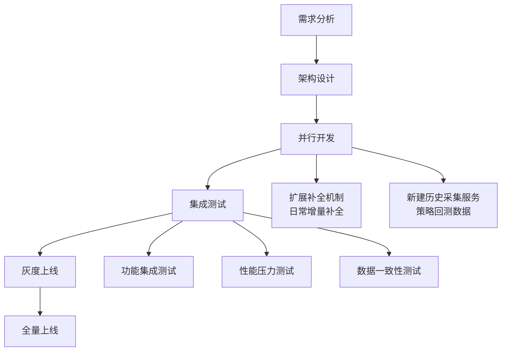

# 策略回测历史数据采集机制设计

## 📊 需求分析

策略回测需要股票过去10年的大量历史数据，这与日常增量采集有本质区别：

### **当前补全机制局限性**
- **时间范围有限**：当前补全主要处理最近30-180天的增量数据
- **频率控制严格**：增量采集限制在10天以内，避免影响系统稳定性
- **优先级调度**：日常补全任务与实时采集任务竞争资源

### **策略回测数据需求特点**
- **数据量巨大**：单只股票10年数据约2500个交易日
- **一次性采集**：回测前批量采集，之后主要用于读取
- **历史完整性**：需要确保数据的连续性和准确性
- **计算密集型**：回测计算对数据质量要求极高

---

## 🏗️ 解决方案设计

### **方案一：扩展现有补全机制** ⭐推荐

#### **1. 新增历史补全模式**

在`data_complement_scheduler.py`中增加历史补全模式：

```python
class ComplementMode(Enum):
    NONE = "none"
    MONTHLY = "monthly"          # 月度补全（30天）
    WEEKLY = "weekly"            # 每周补全（7天）
    QUARTERLY = "quarterly"      # 季度补全（90天）
    SEMI_ANNUAL = "semi_annual"  # 半年补全（180天）
    FULL_HISTORY = "full_history"  # 全历史补全（10年+）
    STRATEGY_BACKTEST = "strategy_backtest"  # 策略回测专用
```

#### **2. 策略回测专用配置**

```json
{
  "strategy_backtest": {
    "mode": "STRATEGY_BACKTEST",
    "priority": "HIGH",
    "schedule_interval_days": 365,  // 每年检查一次
    "complement_window_days": 3650, // 10年数据
    "min_gap_days": 330,
    "batch_size_days": 365,         // 按年分批
    "max_concurrent_batches": 2,    // 限制并发
    "description": "策略回测历史数据补全"
  }
}
```

#### **3. 历史数据采集优化**

```python
class HistoricalDataCollector:
    """历史数据采集器"""

    def __init__(self, config: Dict[str, Any]):
        self.config = config
        self.batch_size = config.get('batch_size_days', 365)  # 按年采集
        self.max_workers = config.get('max_concurrent_batches', 2)
        self.retry_policy = {
            'max_retries': 5,
            'retry_delay': 60,
            'backoff_factor': 2
        }

    async def collect_historical_data(self, source_id: str,
                                    start_date: datetime,
                                    end_date: datetime) -> List[Dict[str, Any]]:
        """采集历史数据"""
        # 按年分批处理
        yearly_batches = self._split_by_years(start_date, end_date)

        all_data = []
        semaphore = asyncio.Semaphore(self.max_workers)

        async def collect_year_batch(year_start: datetime, year_end: datetime):
            async with semaphore:
                return await self._collect_single_year(
                    source_id, year_start, year_end
                )

        # 并行采集各年度数据
        tasks = [
            collect_year_batch(batch_start, batch_end)
            for batch_start, batch_end in yearly_batches
        ]

        batch_results = await asyncio.gather(*tasks, return_exceptions=True)

        for result in batch_results:
            if isinstance(result, Exception):
                logger.error(f"历史数据采集失败: {result}")
            else:
                all_data.extend(result)

        return all_data

    def _split_by_years(self, start_date: datetime, end_date: datetime) -> List[Tuple[datetime, datetime]]:
        """按年份分割时间范围"""
        batches = []
        current_date = start_date

        while current_date < end_date:
            year_end = min(
                datetime(current_date.year + 1, 1, 1),
                end_date
            )
            batches.append((current_date, year_end))
            current_date = year_end

        return batches

    async def _collect_single_year(self, source_id: str,
                                 start_date: datetime,
                                 end_date: datetime) -> List[Dict[str, Any]]:
        """采集单年度数据"""
        max_retries = self.retry_policy['max_retries']
        retry_delay = self.retry_policy['retry_delay']

        for attempt in range(max_retries):
            try:
                # 调用数据源API获取历史数据
                data = await self._fetch_year_data_from_source(
                    source_id, start_date, end_date
                )

                # 数据验证和清洗
                validated_data = await self._validate_historical_data(data)

                logger.info(f"成功采集 {source_id} {start_date.year}年数据: {len(validated_data)}条")
                return validated_data

            except Exception as e:
                if attempt < max_retries - 1:
                    delay = retry_delay * (self.retry_policy['backoff_factor'] ** attempt)
                    logger.warning(f"采集失败，重试 {attempt + 1}/{max_retries}，等待 {delay}秒: {e}")
                    await asyncio.sleep(delay)
                else:
                    logger.error(f"采集失败，已达到最大重试次数: {e}")
                    raise

        return []
```

### **方案二：建立独立的历史数据采集机制** ⭐并行推荐

#### **1. 专门的历史数据采集服务**

创建独立的历史数据采集服务，专门处理批量历史数据需求：

```python
class HistoricalDataAcquisitionService:
    """历史数据采集服务"""

    def __init__(self):
        self.collectors = {
            'akshare': AKShareHistoricalCollector(),
            'yahoo': YahooHistoricalCollector(),
            'tushare': TuShareHistoricalCollector(),
            'local_backup': LocalBackupCollector()
        }
        self.storage = HistoricalDataStorage()

    async def acquire_strategy_backtest_data(self,
                                           symbols: List[str],
                                           start_date: str,
                                           end_date: str,
                                           data_types: List[str] = None) -> Dict[str, Any]:
        """
        为策略回测采集历史数据

        Args:
            symbols: 股票代码列表
            start_date: 开始日期
            end_date: 结束日期
            data_types: 数据类型 ['price', 'volume', 'fundamental']

        Returns:
            采集结果统计
        """
        if data_types is None:
            data_types = ['price', 'volume']

        results = {
            'total_symbols': len(symbols),
            'successful_symbols': 0,
            'failed_symbols': [],
            'total_records': 0,
            'data_quality_score': 0.0,
            'collection_duration': 0,
            'data_by_symbol': {}
        }

        start_time = datetime.now()

        # 并行采集多个股票数据
        semaphore = asyncio.Semaphore(5)  # 限制并发数量

        async def collect_symbol_data(symbol: str):
            async with semaphore:
                try:
                    symbol_data = await self._collect_single_symbol_data(
                        symbol, start_date, end_date, data_types
                    )
                    results['successful_symbols'] += 1
                    results['total_records'] += symbol_data['record_count']
                    results['data_by_symbol'][symbol] = symbol_data
                except Exception as e:
                    results['failed_symbols'].append({
                        'symbol': symbol,
                        'error': str(e)
                    })

        # 创建采集任务
        tasks = [collect_symbol_data(symbol) for symbol in symbols]
        await asyncio.gather(*tasks)

        # 计算整体统计
        results['collection_duration'] = (datetime.now() - start_time).total_seconds()
        results['data_quality_score'] = self._calculate_overall_quality(results)

        return results

    async def _collect_single_symbol_data(self, symbol: str,
                                        start_date: str, end_date: str,
                                        data_types: List[str]) -> Dict[str, Any]:
        """采集单个股票的历史数据"""
        symbol_data = {
            'symbol': symbol,
            'record_count': 0,
            'data_types': data_types,
            'date_range': f"{start_date} to {end_date}",
            'data_quality': {},
            'collection_sources': []
        }

        for data_type in data_types:
            try:
                # 尝试多个数据源
                data = None
                source_used = None

                for source_name, collector in self.collectors.items():
                    try:
                        data = await collector.collect_historical_data(
                            symbol, data_type, start_date, end_date
                        )
                        source_used = source_name
                        break
                    except Exception as e:
                        logger.debug(f"{source_name} 数据源采集失败: {e}")
                        continue

                if data:
                    # 数据验证和存储
                    validated_data = await self._validate_and_store_data(
                        symbol, data_type, data
                    )

                    symbol_data['record_count'] += len(validated_data)
                    symbol_data['data_quality'][data_type] = self._assess_data_quality(validated_data)
                    symbol_data['collection_sources'].append(source_used)

            except Exception as e:
                logger.error(f"采集 {symbol} {data_type} 数据失败: {e}")
                symbol_data['data_quality'][data_type] = {'error': str(e)}

        return symbol_data

    async def _validate_and_store_data(self, symbol: str, data_type: str,
                                     raw_data: List[Dict]) -> List[Dict[str, Any]]:
        """验证并存储数据"""
        # 数据清洗和验证
        validated_data = []
        for record in raw_data:
            if self._validate_record(record):
                validated_data.append(record)

        # 存储到历史数据库
        await self.storage.store_historical_data(symbol, data_type, validated_data)

        return validated_data

    def _validate_record(self, record: Dict) -> bool:
        """验证单条记录"""
        required_fields = ['date', 'symbol']

        # 检查必需字段
        for field in required_fields:
            if field not in record or record[field] is None:
                return False

        # 检查日期格式
        try:
            if isinstance(record['date'], str):
                datetime.fromisoformat(record['date'].replace('Z', '+00:00'))
        except:
            return False

        return True

    def _assess_data_quality(self, data: List[Dict]) -> Dict[str, Any]:
        """评估数据质量"""
        if not data:
            return {'score': 0.0, 'issues': ['no_data']}

        quality_metrics = {
            'completeness': self._check_completeness(data),
            'accuracy': self._check_accuracy(data),
            'consistency': self._check_consistency(data)
        }

        # 计算综合质量分数
        weights = {'completeness': 0.4, 'accuracy': 0.4, 'consistency': 0.2}
        overall_score = sum(
            quality_metrics[metric] * weights[metric]
            for metric in weights.keys()
        )

        return {
            'score': overall_score,
            'metrics': quality_metrics
        }

    def _check_completeness(self, data: List[Dict]) -> float:
        """检查数据完整性"""
        if not data:
            return 0.0

        # 检查是否有缺失的必需字段
        required_fields = ['open', 'high', 'low', 'close', 'volume']
        complete_records = 0

        for record in data:
            if all(field in record and record[field] is not None for field in required_fields):
                complete_records += 1

        return complete_records / len(data)

    def _check_accuracy(self, data: List[Dict]) -> float:
        """检查数据准确性"""
        if not data:
            return 0.0

        accuracy_score = 1.0
        issues = 0

        for record in data:
            # 检查价格逻辑关系
            if ('high' in record and 'low' in record and
                record['high'] is not None and record['low'] is not None):
                if record['high'] < record['low']:
                    issues += 1

            # 检查成交量合理性
            if 'volume' in record and record['volume'] is not None:
                if record['volume'] < 0:
                    issues += 1

        # 每发现一个问题扣分
        accuracy_score = max(0.0, 1.0 - (issues / len(data)) * 0.1)

        return accuracy_score

    def _check_consistency(self, data: List[Dict]) -> float:
        """检查数据一致性"""
        if len(data) < 2:
            return 1.0

        # 检查日期排序
        dates = [record.get('date') for record in data if record.get('date')]
        if len(dates) != len(data):
            return 0.8  # 有缺失日期

        try:
            sorted_dates = sorted(dates)
            if dates != sorted_dates:
                return 0.9  # 日期无序但可排序
        except:
            return 0.7  # 日期格式问题

        return 1.0

    def _calculate_overall_quality(self, results: Dict) -> float:
        """计算整体数据质量"""
        if results['successful_symbols'] == 0:
            return 0.0

        total_quality = 0.0
        quality_count = 0

        for symbol_data in results['data_by_symbol'].values():
            for data_type, quality_info in symbol_data['data_quality'].items():
                if isinstance(quality_info, dict) and 'score' in quality_info:
                    total_quality += quality_info['score']
                    quality_count += 1

        return total_quality / quality_count if quality_count > 0 else 0.0
```

#### **2. 策略回测数据准备工作流**

```python
class StrategyBacktestDataWorkflow:
    """策略回测数据准备工作流"""

    def __init__(self):
        self.historical_service = HistoricalDataAcquisitionService()
        self.quality_checker = DataQualityChecker()
        self.storage_optimizer = HistoricalDataStorageOptimizer()

    async def prepare_backtest_data(self, config: Dict[str, Any]) -> Dict[str, Any]:
        """
        准备策略回测数据

        Args:
            config: 回测数据配置
                {
                    "symbols": ["000001.SZ", "000858.SZ", ...],
                    "start_date": "2014-01-01",
                    "end_date": "2024-01-01",
                    "data_types": ["price", "volume", "fundamental"],
                    "quality_threshold": 0.85,
                    "max_workers": 5
                }
        """
        logger.info("开始准备策略回测历史数据")

        # 步骤1: 采集历史数据
        collection_result = await self.historical_service.acquire_strategy_backtest_data(
            symbols=config['symbols'],
            start_date=config['start_date'],
            end_date=config['end_date'],
            data_types=config['data_types']
        )

        logger.info(f"历史数据采集完成: {collection_result['successful_symbols']}/{collection_result['total_symbols']} 个股票成功")

        # 步骤2: 质量检查
        quality_report = await self.quality_checker.check_batch_quality(
            collection_result['data_by_symbol'],
            threshold=config['quality_threshold']
        )

        # 步骤3: 数据优化存储
        optimization_result = await self.storage_optimizer.optimize_storage(
            collection_result['data_by_symbol']
        )

        # 步骤4: 生成回测就绪报告
        readiness_report = self._generate_readiness_report(
            collection_result, quality_report, optimization_result
        )

        return readiness_report

    def _generate_readiness_report(self, collection: Dict, quality: Dict,
                                 optimization: Dict) -> Dict[str, Any]:
        """生成回测数据就绪报告"""
        return {
            "collection_summary": {
                "total_symbols": collection['total_symbols'],
                "successful_collection": collection['successful_symbols'],
                "total_records": collection['total_records'],
                "collection_duration": collection['collection_duration'],
                "data_quality_score": collection['data_quality_score']
            },
            "quality_assessment": {
                "overall_quality": quality.get('overall_score', 0),
                "quality_distribution": quality.get('score_distribution', {}),
                "quality_issues": quality.get('identified_issues', [])
            },
            "storage_optimization": {
                "compression_ratio": optimization.get('compression_ratio', 1.0),
                "indexing_status": optimization.get('indexing_completed', False),
                "query_performance": optimization.get('estimated_query_time', 0)
            },
            "backtest_readiness": {
                "is_ready": (collection['successful_symbols'] > 0 and
                           quality.get('overall_score', 0) >= 0.8),
                "recommended_config": {
                    "data_quality_threshold": 0.85,
                    "max_parallel_workers": 4,
                    "cache_strategy": "memory_mapped"
                }
            }
        }
```

---

## 📊 两种方案对比分析

### **方案一：扩展现有补全机制**

**优点**：
- ✅ **架构一致性**：复用现有补全框架，无需新建系统
- ✅ **统一管理**：所有补全任务统一调度和管理
- ✅ **资源共享**：与日常补全共享资源池和监控体系

**缺点**：
- ⚠️ **性能影响**：大量历史数据采集可能影响日常增量采集
- ⚠️ **调度复杂**：不同时间尺度的任务调度逻辑复杂
- ⚠️ **存储压力**：10年数据一次性采集对存储系统压力大

**适用场景**：
- 小规模历史数据补全（<100只股票）
- 与日常补全结合使用
- 资源充足的系统环境

### **方案二：独立历史数据采集机制**

**优点**：
- ✅ **性能隔离**：不影响日常增量采集性能
- ✅ **专业优化**：专门针对批量历史数据采集优化
- ✅ **灵活调度**：可独立控制采集频率和资源分配
- ✅ **扩展性好**：支持多种数据源和存储后端

**缺点**：
- ⚠️ **架构复杂**：需要维护两套采集系统
- ⚠️ **重复开发**：部分功能与现有系统重复
- ⚠️ **运维成本**：增加系统维护复杂度

**适用场景**：
- 大规模历史数据采集（>500只股票）
- 策略回测等批量数据需求
- 对性能要求极高的场景

---

## 🎯 推荐实施方案

### **混合方案：双轨并行** ⭐最优选择

#### **1. 日常补全：扩展现有机制**
- 处理日常增量数据补全（最近30-180天）
- 保持现有补全机制不变
- 支持月度/季度/半年补全模式

#### **2. 历史数据：独立采集服务**
- 专门处理策略回测等历史数据需求（10年+）
- 独立的历史数据采集服务
- 支持批量、多源、并行采集

#### **3. 统一数据存储和管理**
- 所有数据存储到统一的时序数据库
- 通过数据标签区分数据来源和用途
- 统一的访问接口和权限控制

### **实施路线图**



### **技术栈选择**

#### **数据采集层**
- **多源支持**：AKShare, Yahoo Finance, TuShare, 东方财富
- **容错机制**：自动重试、数据源切换、异常处理
- **并发控制**：asyncio + semaphore 控制并发数量

#### **数据存储层**
- **时序数据库**：TimescaleDB 或 ClickHouse
- **对象存储**：MinIO 或 AWS S3（大文件存储）
- **缓存层**：Redis Cluster（热点数据缓存）

#### **数据处理层**
- **ETL处理**：Pandas + Dask（大数据处理）
- **质量检查**：自定义质量验证规则
- **索引优化**：复合索引 + 分区表

### **运维监控体系**

#### **采集监控**
- 采集进度实时监控
- 失败率和重试统计
- 数据质量趋势分析

#### **性能监控**
- 系统资源使用率
- 采集速度和吞吐量
- 存储空间使用情况

#### **告警机制**
- 采集失败告警
- 数据质量下降告警
- 系统性能异常告警

---

## 📋 实施建议

### **第一阶段：架构设计（1-2周）**
1. **需求调研**：明确策略回测数据需求规格
2. **架构设计**：设计双轨并行采集架构
3. **技术选型**：确定数据源、存储方案、处理框架

### **第二阶段：核心开发（4-6周）**
1. **历史采集服务**：开发独立的历史数据采集服务
2. **数据质量体系**：建立完整的数据质量检查体系
3. **存储优化**：优化历史数据存储和访问性能

### **第三阶段：集成测试（2-3周）**
1. **功能测试**：测试各项功能是否正常工作
2. **性能测试**：测试大数据量采集性能表现
3. **稳定性测试**：测试长期运行稳定性和异常处理

### **第四阶段：灰度上线（1-2周）**
1. **小批量试点**：选择部分股票进行试点采集
2. **效果验证**：验证数据质量和采集效率
3. **问题修复**：根据试点结果修复发现的问题

### **第五阶段：全量上线（1周）**
1. **全量采集**：对所有目标股票进行历史数据采集
2. **服务切换**：将策略回测系统切换到新数据源
3. **效果评估**：评估整体实施效果和收益

---

## 🎯 成功关键因素

1. **数据源多样性**：集成多个数据源，确保数据获取的可靠性
2. **质量保障机制**：建立完整的数据质量检查和修复体系
3. **性能优化策略**：针对大数据量采集进行专门的性能优化
4. **监控运维体系**：建立完善的监控、告警和运维体系
5. **业务配合机制**：与策略回测团队密切配合，确保需求对齐

通过双轨并行的混合方案，既能满足日常增量补全的需求，又能高效处理策略回测等批量历史数据采集需求，实现数据采集系统的全面升级。