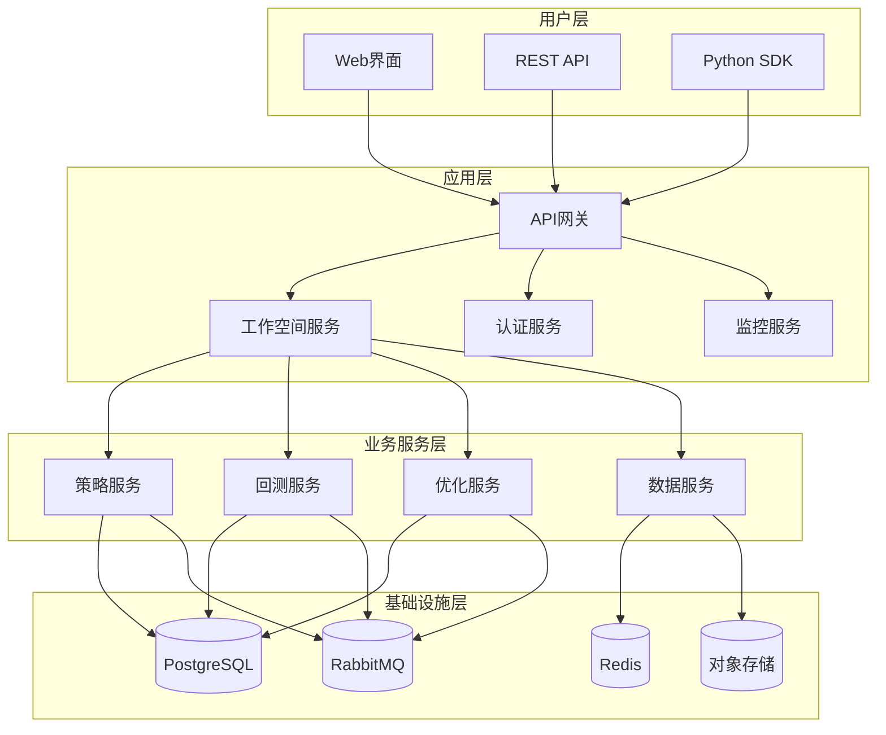
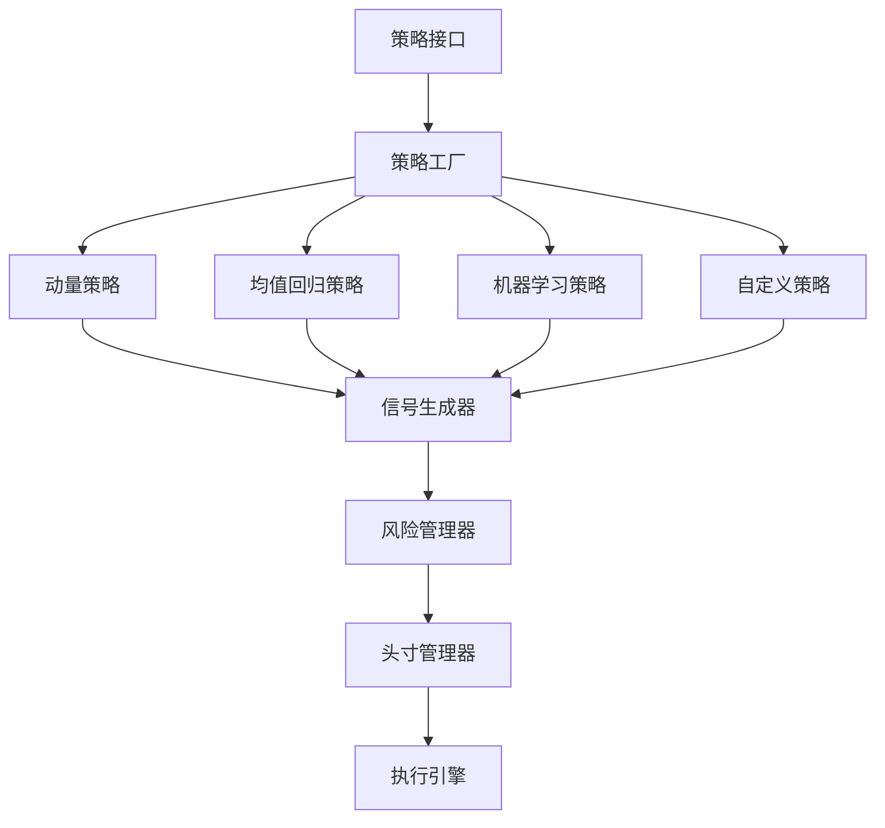
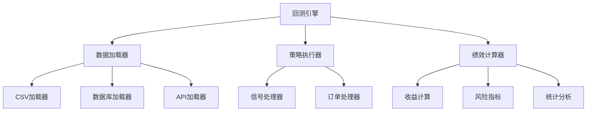
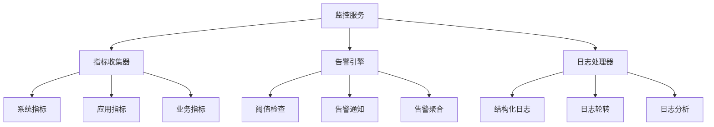
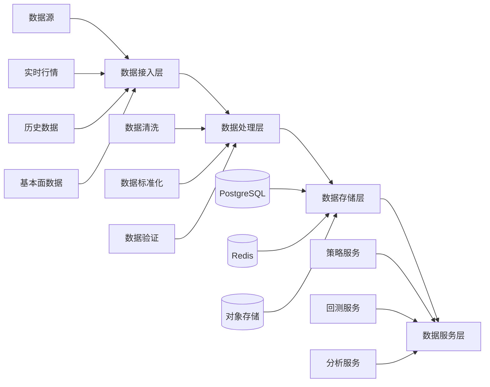
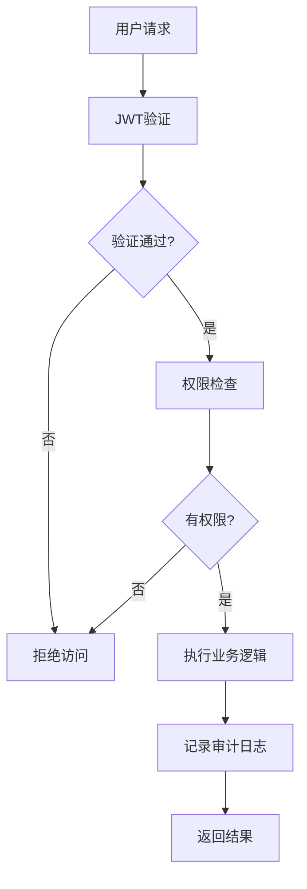
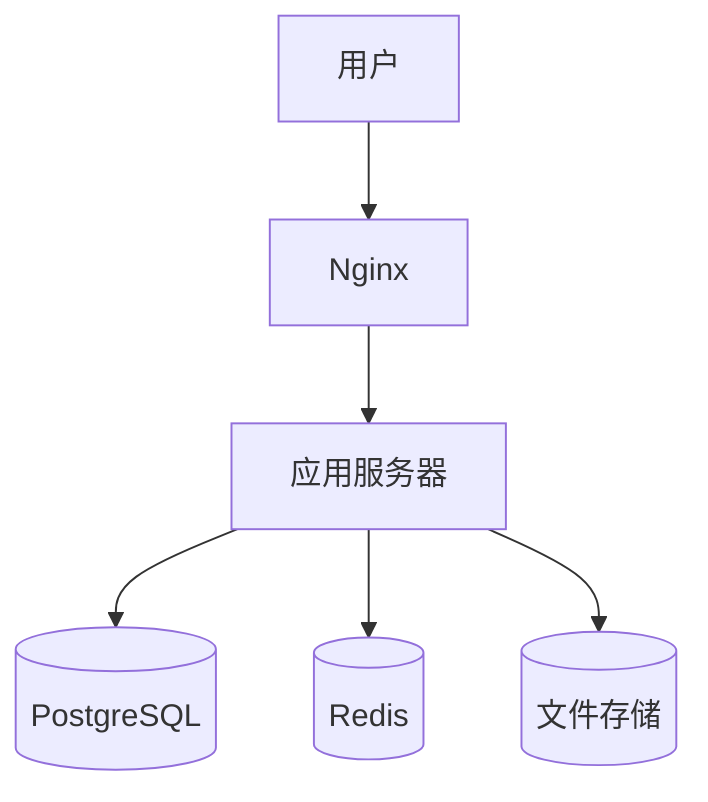
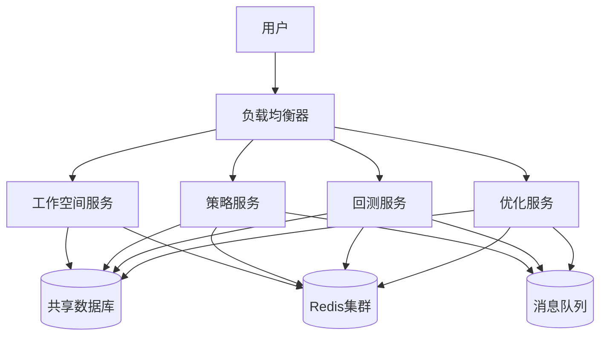

# RQA2025 架构设计

## 概述

RQA2025 采用现代化的微服务架构设计，基于业务流程驱动的理念，提供了完整的量化策略开发、回测、优化和监控能力。

## 总体架构



## 服务架构

### 微服务划分

#### 1. 工作空间服务 (Workspace Service)

**职责**: 提供Web界面和API接口

**技术栈**:
- **框架**: FastAPI
- **前端**: HTML5 + Bootstrap + Chart.js
- **认证**: JWT
- **文档**: OpenAPI/Swagger

**接口**:
```python
class WorkspaceAPI:
    # 策略管理
    @app.post("/api/strategies")
    @app.get("/api/strategies")
    @app.get("/api/strategies/{id}")

    # 回测分析
    @app.post("/api/backtests")
    @app.get("/api/backtests/{id}")

    # 参数优化
    @app.post("/api/optimizations")
    @app.get("/api/optimizations/{id}")

    # 可视化
    @app.get("/api/visualization/chart")
    @app.get("/api/visualization/dashboard")
```

#### 2. 策略服务 (Strategy Service)

**职责**: 策略的创建、执行和管理

**核心组件**:
```python
class UnifiedStrategyService(IStrategyService):
    def create_strategy(self, config: StrategyConfig)
    def execute_strategy(self, strategy_id: str)
    def get_strategy_performance(self, strategy_id: str)
    def validate_strategy(self, strategy_id: str)
```

**策略架构**:


#### 3. 回测服务 (Backtest Service)

**职责**: 历史数据回测和性能分析

**架构设计**:


#### 4. 优化服务 (Optimization Service)

**职责**: 参数优化和策略改进

**优化算法**:
```python
class OptimizationService:
    # 网格搜索
    def grid_search(self, param_ranges, target_func)

    # 随机搜索
    def random_search(self, param_ranges, target_func, n_iterations)

    # 贝叶斯优化
    def bayesian_optimization(self, param_ranges, target_func, n_iterations)

    # 遗传算法
    def genetic_algorithm(self, param_ranges, target_func, **kwargs)
```

#### 5. 监控服务 (Monitoring Service)

**职责**: 系统监控和告警

**监控架构**:


## 数据架构

### 数据流设计



### 数据模型

#### 策略数据模型

```sql
-- 策略表
CREATE TABLE strategies (
    strategy_id VARCHAR(50) PRIMARY KEY,
    strategy_name VARCHAR(100) NOT NULL,
    strategy_type VARCHAR(50) NOT NULL,
    parameters JSONB,
    risk_limits JSONB,
    status VARCHAR(20) DEFAULT 'active',
    created_at TIMESTAMP DEFAULT NOW(),
    updated_at TIMESTAMP DEFAULT NOW()
);

-- 策略执行记录
CREATE TABLE strategy_executions (
    execution_id VARCHAR(50) PRIMARY KEY,
    strategy_id VARCHAR(50) REFERENCES strategies(strategy_id),
    start_time TIMESTAMP NOT NULL,
    end_time TIMESTAMP,
    status VARCHAR(20),
    result JSONB,
    performance_metrics JSONB,
    created_at TIMESTAMP DEFAULT NOW()
);
```

#### 回测数据模型

```sql
-- 回测任务表
CREATE TABLE backtests (
    backtest_id VARCHAR(50) PRIMARY KEY,
    strategy_id VARCHAR(50) REFERENCES strategies(strategy_id),
    start_date DATE NOT NULL,
    end_date DATE NOT NULL,
    initial_capital DECIMAL(15,2),
    commission DECIMAL(10,4),
    slippage DECIMAL(10,4),
    status VARCHAR(20) DEFAULT 'pending',
    created_at TIMESTAMP DEFAULT NOW(),
    completed_at TIMESTAMP
);

-- 回测结果表
CREATE TABLE backtest_results (
    result_id VARCHAR(50) PRIMARY KEY,
    backtest_id VARCHAR(50) REFERENCES backtests(backtest_id),
    returns_data JSONB,
    positions_data JSONB,
    trades_data JSONB,
    metrics JSONB,
    risk_metrics JSONB,
    created_at TIMESTAMP DEFAULT NOW()
);
```

## 安全架构

### 认证和授权



### 安全措施

#### 1. 传输安全
- HTTPS/TLS 1.3 加密传输
- API 请求签名验证
- 请求频率限制

#### 2. 数据安全
- 敏感数据加密存储
- 数据库访问控制
- 数据脱敏处理

#### 3. 应用安全
- 输入验证和过滤
- SQL注入防护
- XSS/CSRF防护

#### 4. 运维安全
- 容器安全扫描
- 密钥安全管理
- 访问日志审计

## 部署架构

### 单机部署



### 分布式部署



### 云原生部署

```yaml
# Kubernetes部署配置
apiVersion: apps/v1
kind: Deployment
metadata:
  name: rqa2025-backend
spec:
  replicas: 3
  selector:
    matchLabels:
      app: rqa2025-backend
  template:
    metadata:
      labels:
        app: rqa2025-backend
    spec:
      containers:
      - name: api
        image: rqa2025/api:latest
        ports:
        - containerPort: 8000
        env:
        - name: DATABASE_URL
          valueFrom:
            secretKeyRef:
              name: db-secret
              key: url
        resources:
          requests:
            memory: "512Mi"
            cpu: "250m"
          limits:
            memory: "1Gi"
            cpu: "500m"
      - name: worker
        image: rqa2025/worker:latest
        env:
        - name: DATABASE_URL
          valueFrom:
            secretKeyRef:
              name: db-secret
              key: url
        resources:
          requests:
            memory: "256Mi"
            cpu: "100m"
          limits:
            memory: "512Mi"
            cpu: "200m"
```

## 扩展性设计

### 水平扩展

1. **服务实例扩展**
   ```python
   # 使用负载均衡
   from loadbalancer import LoadBalancer

   lb = LoadBalancer()
   lb.add_service("strategy-service", "http://service1:8000")
   lb.add_service("strategy-service", "http://service2:8000")

   # 智能路由
   response = lb.call("strategy-service", "/api/strategies")
   ```

2. **数据分片**
   ```python
   # 数据库分片策略
   class DatabaseSharding:
       def get_shard(self, strategy_id):
           shard_id = hash(strategy_id) % self.num_shards
           return f"shard_{shard_id}"

       def get_connection(self, shard_id):
           return self.connections[shard_id]
   ```

### 垂直扩展

1. **缓存分层**
   ```python
   # 多级缓存架构
   class MultiLevelCache:
       def __init__(self):
           self.l1_cache = {}  # 内存缓存
           self.l2_cache = Redis()  # Redis缓存
           self.l3_cache = {}  # 文件缓存

       async def get(self, key):
           # L1缓存
           if key in self.l1_cache:
               return self.l1_cache[key]

           # L2缓存
           value = await self.l2_cache.get(key)
           if value:
               self.l1_cache[key] = value
               return value

           # L3缓存
           value = await self._load_from_file(key)
           if value:
               self.l1_cache[key] = value
               await self.l2_cache.set(key, value)
               return value

           return None
   ```

2. **异步处理**
   ```python
   # 异步任务队列
   from celery import Celery

   app = Celery('rqa2025')
   app.config_from_object('celeryconfig')

   @app.task
   def run_backtest_async(backtest_config):
       # 异步执行回测
       backtest_service = BacktestService()
       result = backtest_service.run_backtest(backtest_config)
       return result

   # 调用异步任务
   task = run_backtest_async.delay(backtest_config)
   result = task.get(timeout=300)  # 5分钟超时
   ```

## 监控和可观测性

### 指标收集

```python
from prometheus_client import Counter, Histogram, Gauge
import time

# 业务指标
STRATEGY_EXECUTIONS = Counter(
    'strategy_executions_total',
    'Total number of strategy executions',
    ['strategy_type', 'status']
)

EXECUTION_DURATION = Histogram(
    'strategy_execution_duration_seconds',
    'Strategy execution duration',
    ['strategy_type']
)

# 系统指标
MEMORY_USAGE = Gauge(
    'memory_usage_bytes',
    'Current memory usage')
CPU_USAGE = Gauge(
    'cpu_usage_percent',
    'Current CPU usage percentage'
)

# 自定义指标收集器
class MetricsCollector:
    def __init__(self):
        self.metrics = {}

    def record_execution(self, strategy_type: str, duration: float, status: str):
        STRATEGY_EXECUTIONS.labels(
            strategy_type=strategy_type,
            status=status
        ).inc()

        EXECUTION_DURATION.labels(
            strategy_type=strategy_type
        ).observe(duration)

    def update_system_metrics(self):
        import psutil

        MEMORY_USAGE.set(psutil.virtual_memory().used)
        CPU_USAGE.set(psutil.cpu_percent())
```

### 日志架构

```python
# 结构化日志配置
import logging
import json
from datetime import datetime

class StructuredLogger:
    def __init__(self, name: str):
        self.logger = logging.getLogger(name)

    def info(self, message: str, **kwargs):
        self._log(logging.INFO, message, **kwargs)

    def error(self, message: str, exc_info=None, **kwargs):
        self._log(logging.ERROR, message, exc_info=exc_info, **kwargs)

    def _log(self, level, message, exc_info=None, **kwargs):
        log_entry = {
            "timestamp": datetime.utcnow().isoformat(),
            "level": logging.getLevelName(level),
            "message": message,
            "service": self.logger.name,
            **kwargs
        }

        if exc_info:
            log_entry["exception"] = self._format_exception(exc_info)

        self.logger.log(level, json.dumps(log_entry))

    def _format_exception(self, exc_info):
        import traceback
        return "".join(traceback.format_exception(*exc_info))
```

### 分布式追踪

```python
# OpenTelemetry集成
from opentelemetry import trace
from opentelemetry.sdk.trace import TracerProvider
from opentelemetry.sdk.trace.export import BatchSpanProcessor
from opentelemetry.exporter.jaeger import JaegerExporter

# 配置追踪器
trace.set_tracer_provider(TracerProvider())
tracer = trace.get_tracer(__name__)

# 配置Jaeger导出器
jaeger_exporter = JaegerExporter(
    agent_host_name="localhost",
    agent_port=6831,
)

span_processor = BatchSpanProcessor(jaeger_exporter)
trace.get_tracer_provider().add_span_processor(span_processor)

# 在代码中使用追踪
@app.post("/api/strategies")
async def create_strategy(strategy_data: dict):
    with tracer.start_as_span("create_strategy") as span:
        span.set_attribute("strategy.name", strategy_data.get("strategy_name"))
        span.set_attribute("strategy.type", strategy_data.get("strategy_type"))

        # 业务逻辑
        result = await strategy_service.create_strategy(strategy_data)

        span.set_attribute("result.success", result.get("success", False))

        return result
```

## 性能优化策略

### 应用层优化

1. **异步处理**
   ```python
   @app.post("/api/backtests")
   async def create_backtest(backtest_config: dict):
       # 异步提交任务
       task_id = await backtest_service.submit_backtest_task(backtest_config)

       return {
           "task_id": task_id,
           "status": "submitted",
           "message": "回测任务已提交"
       }
   ```

2. **缓存策略**
   ```python
   from cachetools import TTLCache
   from functools import lru_cache

   # 内存缓存
   strategy_cache = TTLCache(maxsize=1000, ttl=300)

   @lru_cache(maxsize=500)
   def get_strategy_config(strategy_id: str):
       return strategy_service.get_strategy(strategy_id)
   ```

3. **连接池**
   ```python
   from sqlalchemy.pool import QueuePool

   # 数据库连接池
   engine = create_engine(
       DATABASE_URL,
       poolclass=QueuePool,
       pool_size=10,
       max_overflow=20,
       pool_timeout=30
   )
   ```

### 系统层优化

1. **内核调优**
   ```bash
   # /etc/sysctl.conf
   net.core.somaxconn = 1024
   net.ipv4.tcp_max_syn_backlog = 2048
   vm.swappiness = 10
   vm.dirty_ratio = 10
   vm.dirty_background_ratio = 5
   ```

2. **Nginx优化**
   ```nginx
   # /etc/nginx/nginx.conf
   worker_processes auto;
   worker_connections 1024;

   # Gzip压缩
   gzip on;
   gzip_types text/plain text/css application/json application/javascript;

   # 缓存静态文件
   location ~* \.(js|css|png|jpg|jpeg|gif|ico|svg)$ {{
       expires 1y;
       add_header Cache-Control "public, immutable";
   }}

   # 反向代理
   location /api {{
       proxy_pass http://backend;
       proxy_set_header Host $host;
       proxy_set_header X-Real-IP $remote_addr;
   }}
   ```

3. **监控和告警**
   ```python
   # Prometheus监控
   from prometheus_client import start_http_server, Summary, Counter

   REQUEST_TIME = Summary('request_processing_seconds', 'Time spent processing request')
   REQUEST_COUNT = Counter('request_count', 'Total number of requests')

   @REQUEST_TIME.time()
   def process_request():
       REQUEST_COUNT.inc()
       # 处理请求逻辑
   ```

---

*版本: v1.0.0*
*最后更新: {datetime.now().strftime('%Y-%m-%d')}*
