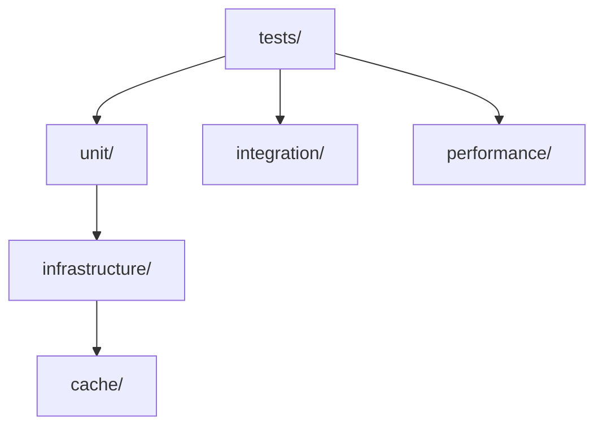
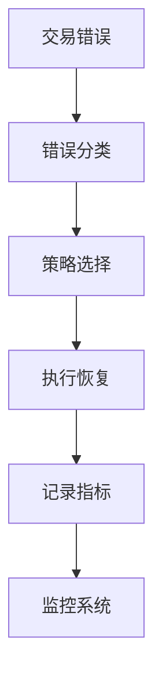

# RQA2025 量化交易系统测试框架
<!-- 
版本更新记录：
2024-06-15 v2.5.0 - 文档系统增强
    - 统一文档更新规范
    - 添加自动化检查脚本
    - 更新架构设计文档
2024-03-20 v2.1.0 - 标准化文档更新模式
2024-03-21 v2.2.0 - 新增数据库连接池功能
    - 线程安全连接管理
    - 健康状态监控接口
    - 自动连接回收机制
2024-03-28 v2.3.0 - 增强存储模块
    - 批量删除功能
    - 流水线操作支持
    - 集群模式优化
    - 监控指标增强
2024-04-02 v2.4.0 - 配置管理系统重构
    - 统一配置加载器接口
    - 新增批量加载功能
    - 增强元数据信息(加载时间、文件大小等)
    - 改进错误上下文处理
    - 更新相关文档和测试
2024-04-03 v2.4.1 - 配置管理增强
    - 新增线程安全的update()方法
    - 完善配置更新审计日志
    - 增强版本控制集成
    - 更新架构文档和测试
2024-04-10 v2.4.2 - 环境策略支持
    - 添加环境特定配置策略
    - 实现环境策略验证
    - 更新架构设计和测试
-->


## 功能概述

RQA2025测试框架是一个专为量化交易系统设计的自动化测试解决方案，主要功能包括：

### 测试结构规范


- **验证脚本**：`python scripts/check_test_structure.py`
- **CI集成**：自动验证测试目录结构

- ✅ **智能错误处理**：
  - 自动错误分类
  - 多策略恢复机制
  - 处理过程监控
  - 安全上下文管理

- ✅ **数据库连接池**：
  - 线程安全连接管理
  - 动态配置更新
  - 连接泄漏检测
  - 健康状态监控
- ✅ **智能缓存系统**：
  - 内存感知管理
  - 批量操作支持（读写/删除）
  - 流水线(pipeline)加速
  - 实时监控指标
  - 自动内存回收
  - LRU淘汰策略
  - 大对象压缩存储
  - 高频访问优化
  - 集群模式支持

- ✅ 熔断器实时监控
- ✅ 敏感数据安全过滤

## 文档导航
- [测试框架使用指南](docs/test_framework_usage.md)
- [CI/CD配置说明](docs/ci_configuration.md)
- [架构设计文档](docs/unified_architecture.md)

## 快速开始

### 1. MiniQMT集成示例
```python
from src.adapters.miniqmt import MiniQMTDataAdapter, MiniQMTTradeAdapter
from src.services.data_validation_service import DataValidationService

# 初始化MiniQMT适配器
data_adapter = MiniQMTDataAdapter(config={
    'host': '127.0.0.1',
    'port': 6001
})

trade_adapter = MiniQMTTradeAdapter(config={
    'account': '123456789',
    'trade_server': 'tcp://127.0.0.1:6002'
})

# 获取实时行情
data = data_adapter.get_realtime_data(['600519.SH'])
print(f"茅台实时行情: {data}")

# 下单示例
order = {
    'symbol': '600519.SH',
    'price': 1800.0,
    'quantity': 100,
    'order_type': 'LIMIT'
}
order_id = trade_adapter.place_order(order)
print(f"订单已提交，ID: {order_id}")

# 数据验证
validation = DataValidationService(
    primary_adapter=data_adapter,
    secondary_adapters=[wind_adapter]  # 假设已初始化Wind适配器
)
is_valid, details = validation.validate_realtime_data('600519.SH')
print(f"数据验证结果: {is_valid}, 详情: {details}")
```

### 2. 基础错误处理
```python
from infrastructure.trading import TradingErrorHandler
from infrastructure.trading.errors import OrderRejectedError

# 初始化处理器
handler = TradingErrorHandler()

# 自动处理订单拒绝
try:
    execute_order(order)
except OrderRejectedError as e:
    result = handler.handle_error(e, order, context)
    # 结果包含处理状态和详情
```

### 2. 缓存系统使用
```python
from infrastructure.cache import ThreadSafeTTLCache

# 初始化带内存限制和LRU的缓存
cache = ThreadSafeTTLCache(
    maxsize=1000,       # 最大缓存项数
    ttl=300,            # 默认5分钟过期
    max_memory_mb=512,  # 内存限制512MB
    enable_lru=True,    # 启用LRU淘汰
    compression_threshold=1024*1024  # 1MB以上自动压缩
)

# 批量设置缓存项
items = {
    "600519": {"price": 1820.5, "volume": 12000},  # 茅台
    "601318": {"price": 42.3, "volume": 50000},   # 平安
    "600036": {"price": 35.8, "volume": 80000}    # 招商
}
cache.bulk_set(items)

# 获取监控指标
metrics = cache.get_metrics()
print(f"内存使用: {metrics['memory_usage']:.2f}MB")
print(f"命中率: {metrics['hit_rate']:.2%}")

# 动态调整缓存参数
cache.update_config(
    max_memory_mb=1024,  # 扩容到1GB
    ttl=600             # 延长到10分钟
)

# 获取详细监控指标
metrics = cache.get_metrics()
print(f"写入次数: {metrics['write_count']}")
print(f"流水线操作: {metrics['pipeline_ops']}")

# Redis集群模式示例
redis_cluster = RedisAdapter(
    host='redis-cluster',
    port=7000,
    cluster_mode=True
)
```

### 3. 生产环境配置
```python
# 分层错误处理器
handlers = {
    "critical": TradingErrorHandler(
        default_strategy=critical_recovery
    ),
    "normal": TradingErrorHandler(
        default_strategy=standard_recovery
    )
}

# 根据错误严重程度路由
def handle_error(error, severity="normal"):
    return handlers[severity].handle_error(error)
```

## 配置管理

### 日志系统配置
```yaml
logging:
  level: INFO  # DEBUG/INFO/WARNING/ERROR/CRITICAL
  handlers:
    - type: file
      filename: logs/app.log
      max_size: 10MB
      backup_count: 5
    - type: console
  formatters:
    default:
      format: "%(asctime)s - %(name)s - %(levelname)s - %(message)s"
  sampling:  # 新增采样配置
    enabled: true
    default_rate: 0.3
    level_rates:
      DEBUG: 0.1
      INFO: 0.5
    trading_hours:
      enabled: true
      rate: 1.0
    dynamic_adjustment:
      enabled: true
      min_rate: 0.1
      max_rate: 1.0
```

**使用示例**:
```python
from infrastructure.m_logging import LogManager

# 从配置加载
LogManager.configure_from_file('config/logging.yaml')

# 直接配置
LogManager.configure({
    'level': 'DEBUG',
    'handlers': [{
        'type': 'file',
        'filename': 'debug.log'
    }]
})

# 获取日志器
logger = LogManager.get_logger('trading')
logger.info('Order executed', extra={'order_id': 123})
```

### 错误处理配置
```yaml
error_handling:
  strategies:
    order_rejected:
      - type: fund_reallocation
        max_attempts: 3
      - type: position_adjustment
        max_attempts: 2
    invalid_price:
      - type: price_correction
        adjustment: 0.05
  monitoring:
    enabled: true
    scrape_interval: 10s
```

### 告警规则配置
```yaml
alert_rules:
  error_handling:
    - name: high_failure_rate
      condition: rate(trading_errors_total[5m]) > 5
      severity: warning
    - name: recovery_failed
      condition: rate(trading_error_recovery_success[10m]) < 0.8
      severity: critical
```

## 架构设计



## 最佳实践

1. **关键路径处理**：
   ```python
   # 数据库错误特殊处理
   db_handler = TradingErrorHandler(
       default_strategy=db_failover,
       error_classifiers={
           "connection": is_database_connection_error
       }
   )
   ```

2. **分级处理策略**：
   ```python
   # 按业务重要性配置不同策略
   priority_handlers = {
       "payment": TradingErrorHandler(strategy=payment_recovery),
       "reporting": TradingErrorHandler(strategy=reporting_recovery)
   }
   ```

3. **测试验证**：
   ```python
   def test_error_handling_metrics():
       handler = TradingErrorHandler()
       error = OrderRejectedError(reason="INSUFFICIENT_FUNDS")
       
       handler.handle_error(error, test_order, {})
       assert handler._error_counter._metrics["order_rejected"] == 1
       assert handler._recovery_success._metrics[("order_rejected","fund_reallocation")] == 1
   ```

## 许可证

MIT License

Copyright (c) 2023 RQA2025 Team
