# RQA2025 数据架构设计

## 概述

本文档详细描述RQA2025系统的整体数据架构设计，包括数据模型、存储策略、数据流和治理体系。

## 🎯 数据架构目标

### 核心目标
1. **高性能数据处理** - 支持实时数据流和历史数据分析
2. **多源数据整合** - 统一不同数据源的数据格式和接口
3. **数据质量保证** - 确保数据的准确性、完整性和一致性
4. **可扩展性** - 支持业务增长和技术演进
5. **合规性** - 满足金融数据监管要求

## 🏗️ 数据架构设计

### 数据分层架构图

```mermaid
graph TB
    %% 数据应用层
    subgraph "数据应用层 (Data Application Layer)"
        direction LR

        subgraph "业务应用"
            direction TB
            BA1[量化策略<br/>信号生成/回测]
            BA2[风险管理<br/>VaR计算/压力测试]
            BA3[投资组合<br/>资产配置/再平衡]
            BA4[绩效分析<br/>收益归因/风险分析]
        end

        subgraph "分析应用"
            direction TB
            AA1[数据可视化<br/>Grafana/Kibana]
            AA2[业务报表<br/>财务报表/合规报表]
            AA3[实时监控<br/>系统监控/业务监控]
            AA4[决策支持<br/>业务决策分析]
        end

        subgraph "机器学习应用"
            direction TB
            MLA1[模型训练<br/>监督学习/无监督学习]
            MLA2[模型推理<br/>实时预测/批量预测]
            MLA3[模型评估<br/>准确性/稳定性测试]
            MLA4[A/B测试<br/>模型对比验证]
        end
    end

    %% 数据服务层
    subgraph "数据服务层 (Data Service Layer)"
        direction LR

        subgraph "数据接入服务"
            direction TB
            DS1[数据采集器<br/>实时数据流处理]
            DS2[数据适配器<br/>多源数据标准化]
            DS3[数据验证器<br/>数据质量检查]
            DS4[数据清洗器<br/>异常数据处理]
        end

        subgraph "数据处理服务"
            direction TB
            DP1[数据聚合器<br/>多源数据融合]
            DP2[特征工程器<br/>技术指标计算]
            DP3[数据增强器<br/>数据扩充/标签化]
            DP4[数据分区器<br/>数据分片/路由]
        end

        subgraph "数据查询服务"
            direction TB
            DQ1[SQL查询引擎<br/>复杂查询支持]
            DQ2[实时查询API<br/>低延迟查询]
            DQ3[批量查询服务<br/>大数据量处理]
            DQ4[缓存查询服务<br/>热点数据缓存]
        end

        subgraph "数据质量服务"
            direction TB
            DQ5[质量监控器<br/>数据质量指标]
            DQ6[一致性检查器<br/>跨源数据校验]
            DQ7[完整性验证器<br/>数据缺失检查]
            DQ8[准确性评估器<br/>数据精度验证]
        end
    end

    %% 数据存储层
    subgraph "数据存储层 (Data Storage Layer)"
        direction LR

        subgraph "关系型数据库"
            direction TB
            RDB1[(PostgreSQL<br/>交易数据<br/>用户数据<br/>配置数据)]
            RDB2[(MySQL<br/>业务数据<br/>元数据)]
        end

        subgraph "NoSQL数据库"
            direction TB
            NOSQL1[(MongoDB<br/>文档数据<br/>策略配置<br/>日志数据)]
            NOSQL2[(Cassandra<br/>时序数据<br/>高并发写入)]
        end

        subgraph "缓存数据库"
            direction TB
            CACHE1[(Redis Cluster<br/>热点数据缓存<br/>会话管理)]
            CACHE2[(Redis Sentinel<br/>高可用缓存<br/>分布式锁)]
        end

        subgraph "搜索引擎"
            direction TB
            SEARCH1[(Elasticsearch<br/>日志检索<br/>业务数据搜索)]
            SEARCH2[(Solr<br/>复杂查询<br/>全文检索)]
        end

        subgraph "时序数据库"
            direction TB
            TS1[(InfluxDB<br/>监控指标<br/>性能数据)]
            TS2[(OpenTSDB<br/>历史时序数据<br/>长期存储)]
        end

        subgraph "数据仓库"
            direction TB
            DW1[(ClickHouse<br/>OLAP分析<br/>海量数据查询)]
            DW2[(Greenplum<br/>大数据分析<br/>复杂计算)]
        end

        subgraph "对象存储"
            direction TB
            OBJ1[(MinIO<br/>模型文件<br/>备份数据)]
            OBJ2[(Ceph<br/>分布式存储<br/>高可用)]
        end

        subgraph "消息队列"
            direction TB
            MQ1[(Kafka<br/>实时数据流<br/>事件驱动)]
            MQ2[(RabbitMQ<br/>业务消息<br/>异步处理)]
        end
    end

    %% 数据源层
    subgraph "数据源层 (Data Source Layer)"
        direction LR

        subgraph "市场数据源"
            direction TB
            MDS1[沪深交易所<br/>Level 1/Level 2]
            MDS2[美股数据源<br/>NYSE/NASDAQ]
            MDS3[港股数据源<br/>HKEX]
            MDS4[期货数据源<br/>中金所/上期所]
            MDS5[期权数据源<br/>期权市场数据]
        end

        subgraph "金融数据源"
            direction TB
            FDS1[基本面数据<br/>公司财报/财务数据]
            FDS2[宏观经济数据<br/>GDP/利率/通胀]
            FDS3[行业数据<br/>行业分析报告]
            FDS4[新闻资讯<br/>财经新闻/公告]
            FDS5[评级数据<br/>信用评级/投资评级]
        end

        subgraph "另类数据源"
            direction TB
            ADS1[社交媒体数据<br/>Twitter/微博情绪]
            ADS2[卫星遥感数据<br/>天气/农业数据]
            ADS3[物联网数据<br/>供应链/物流数据]
            ADS4[区块链数据<br/>加密货币/数字资产]
            ADS5[地理位置数据<br/>移动轨迹/消费行为]
        end

        subgraph "内部数据源"
            direction TB
            IDS1[交易系统数据<br/>订单/成交/持仓]
            IDS2[风控系统数据<br/>风险指标/预警信息]
            IDS3[运营系统数据<br/>用户行为/系统日志]
            IDS4[管理数据<br/>财务数据/合规数据]
        end
    end

    %% 数据治理层
    subgraph "数据治理层 (Data Governance Layer)"
        direction LR

        subgraph "数据质量治理"
            direction TB
            DG1[数据血缘管理<br/>数据源流向追踪]
            DG2[数据质量监控<br/>质量指标监控]
            DG3[数据一致性检查<br/>跨系统数据校验]
            DG4[数据完整性验证<br/>数据缺失检测]
        end

        subgraph "数据安全治理"
            direction TB
            SG1[数据加密管理<br/>传输/存储加密]
            SG2[访问控制管理<br/>权限管理和审计]
            SG3[数据脱敏处理<br/>敏感数据保护]
            SG4[数据合规管理<br/>监管要求满足]
        end

        subgraph "元数据管理"
            direction TB
            MD1[数据字典管理<br/>数据定义和标准]
            MD2[数据目录管理<br/>数据资产目录]
            MD3[数据血缘分析<br/>数据依赖关系]
            MD4[数据生命周期管理<br/>数据保留策略]
        end
    end

    %% 连接关系

    %% 数据应用层到数据服务层
    BA1 --> DS1
    BA1 --> DS2
    BA1 --> DS3
    BA1 --> DS4
    BA1 --> DP1
    BA1 --> DP2
    BA1 --> DQ1
    BA1 --> DQ2

    BA2 --> DS3
    BA2 --> DP1
    BA2 --> DQ1
    BA2 --> DQ3

    BA3 --> DP1
    BA3 --> DP3
    BA3 --> DQ1
    BA3 --> DQ3

    BA4 --> DQ1
    BA4 --> DQ3
    BA4 --> DQ4

    AA1 --> DQ2
    AA1 --> DQ4

    AA2 --> DQ3
    AA2 --> DQ4

    AA3 --> DQ2
    AA3 --> DQ4

    AA4 --> DQ1
    AA4 --> DQ3

    MLA1 --> DP2
    MLA1 --> DP3
    MLA1 --> DQ3

    MLA2 --> DQ2
    MLA2 --> DQ4

    MLA3 --> DQ3
    MLA3 --> DQ4

    MLA4 --> DQ2
    MLA4 --> DQ3

    %% 数据服务层到数据存储层
    DS1 --> CACHE1
    DS1 --> MQ1
    DS1 --> RDB1
    DS1 --> NOSQL1

    DS2 --> CACHE2
    DS2 --> MQ2
    DS2 --> RDB2
    DS2 --> NOSQL2

    DS3 --> CACHE1
    DS3 --> RDB1

    DS4 --> CACHE2
    DS4 --> RDB2

    DP1 --> CACHE1
    DP1 --> RDB1
    DP1 --> NOSQL1
    DP1 --> SEARCH1

    DP2 --> CACHE1
    DP2 --> RDB1
    DP2 --> NOSQL1

    DP3 --> CACHE2
    DP3 --> NOSQL2
    DP3 --> SEARCH2

    DP4 --> CACHE1
    DP4 --> MQ1
    DP4 --> MQ2

    DQ1 --> RDB1
    DQ1 --> RDB2
    DQ1 --> NOSQL1
    DQ1 --> NOSQL2

    DQ2 --> CACHE1
    DQ2 --> CACHE2
    DQ2 --> RDB1
    DQ2 --> RDB2

    DQ3 --> DW1
    DQ3 --> DW2
    DQ3 --> NOSQL1
    DQ3 --> NOSQL2

    DQ4 --> CACHE1
    DQ4 --> CACHE2

    DQ5 --> RDB1
    DQ5 --> NOSQL1

    DQ6 --> RDB1
    DQ6 --> RDB2
    DQ6 --> NOSQL1
    DQ6 --> NOSQL2

    DQ7 --> RDB1
    DQ7 --> NOSQL1

    DQ8 --> RDB1
    DQ8 --> NOSQL1

    %% 数据存储层到数据源层
    RDB1 --> MDS1
    RDB1 --> MDS2
    RDB1 --> MDS3
    RDB1 --> MDS4
    RDB1 --> MDS5
    RDB1 --> FDS1
    RDB1 --> FDS2
    RDB1 --> FDS3
    RDB1 --> FDS4
    RDB1 --> FDS5
    RDB1 --> ADS1
    RDB1 --> ADS2
    RDB1 --> ADS3
    RDB1 --> ADS4
    RDB1 --> ADS5
    RDB1 --> IDS1
    RDB1 --> IDS2
    RDB1 --> IDS3
    RDB1 --> IDS4

    RDB2 --> MDS1
    RDB2 --> FDS1
    RDB2 --> IDS1
    RDB2 --> IDS2

    NOSQL1 --> FDS4
    NOSQL1 --> FDS5
    NOSQL1 --> ADS1
    NOSQL1 --> IDS3

    NOSQL2 --> MDS1
    NOSQL2 --> MDS2
    NOSQL2 --> MDS3
    NOSQL2 --> ADS2
    NOSQL2 --> ADS5

    CACHE1 --> MDS1
    CACHE1 --> MDS2
    CACHE1 --> MDS3
    CACHE1 --> FDS1
    CACHE1 --> IDS1

    CACHE2 --> MDS4
    CACHE2 --> MDS5
    CACHE2 --> FDS2
    CACHE2 --> IDS2

    SEARCH1 --> FDS4
    SEARCH1 --> IDS3
    SEARCH1 --> ADS1

    SEARCH2 --> FDS3
    SEARCH2 --> FDS5

    TS1 --> IDS3
    TS1 --> MDS1

    TS2 --> MDS1
    TS2 --> MDS2
    TS2 --> MDS3

    DW1 --> MDS1
    DW1 --> MDS2
    DW1 --> MDS3
    DW1 --> MDS4
    DW1 --> MDS5
    DW1 --> FDS1
    DW1 --> FDS2
    DW1 --> FDS3

    DW2 --> FDS1
    DW2 --> FDS2
    DW2 --> FDS3
    DW2 --> ADS1
    DW2 --> ADS2
    DW2 --> ADS3

    OBJ1 --> IDS4
    OBJ1 --> FDS1

    OBJ2 --> IDS4
    OBJ2 --> FDS1
    OBJ2 --> ADS4

    MQ1 --> MDS1
    MQ1 --> MDS2
    MQ1 --> MDS3
    MQ1 --> MDS4
    MQ1 --> MDS5
    MQ1 --> IDS1
    MQ1 --> IDS2

    MQ2 --> IDS1
    MQ2 --> IDS2
    MQ2 --> IDS3

    %% 数据治理层连接
    DG1 --> RDB1
    DG1 --> RDB2
    DG1 --> NOSQL1
    DG1 --> NOSQL2
    DG1 --> CACHE1
    DG1 --> CACHE2

    DG2 --> DS3
    DG2 --> DQ5
    DG2 --> DQ6
    DG2 --> DQ7
    DG2 --> DQ8

    DG3 --> RDB1
    DG3 --> RDB2
    DG3 --> NOSQL1
    DG3 --> NOSQL2

    DG4 --> RDB1
    DG4 --> NOSQL1

    SG1 --> RDB1
    SG1 --> RDB2
    SG1 --> NOSQL1
    SG1 --> NOSQL2
    SG1 --> CACHE1
    SG1 --> CACHE2
    SG1 --> OBJ1
    SG1 --> OBJ2

    SG2 --> RDB1
    SG2 --> RDB2
    SG2 --> NOSQL1
    SG2 --> NOSQL2
    SG2 --> SEARCH1
    SG2 --> SEARCH2
    SG2 --> DW1
    SG2 --> DW2
    SG2 --> OBJ1
    SG2 --> OBJ2

    SG3 --> RDB1
    SG3 --> RDB2
    SG3 --> NOSQL1
    SG3 --> NOSQL2

    SG4 --> RDB1
    SG4 --> RDB2
    SG4 --> NOSQL1
    SG4 --> NOSQL2
    SG4 --> SEARCH1
    SG4 --> SEARCH2
    SG4 --> DW1
    SG4 --> DW2

    MD1 --> RDB1
    MD1 --> RDB2
    MD1 --> NOSQL1
    MD1 --> NOSQL2
    MD1 --> CACHE1
    MD1 --> CACHE2
    MD1 --> SEARCH1
    MD1 --> SEARCH2
    MD1 --> TS1
    MD1 --> TS2
    MD1 --> DW1
    MD1 --> DW2
    MD1 --> OBJ1
    MD1 --> OBJ2
    MD1 --> MQ1
    MD1 --> MQ2

    MD2 --> RDB1
    MD2 --> RDB2
    MD2 --> NOSQL1
    MD2 --> NOSQL2
    MD2 --> CACHE1
    MD2 --> CACHE2
    MD2 --> SEARCH1
    MD2 --> SEARCH2
    MD2 --> TS1
    MD2 --> TS2
    MD2 --> DW1
    MD2 --> DW2
    MD2 --> OBJ1
    MD2 --> OBJ2
    MD2 --> MQ1
    MD2 --> MQ2

    MD3 --> RDB1
    MD3 --> RDB2
    MD3 --> NOSQL1
    MD3 --> NOSQL2
    MD3 --> MQ1
    MD3 --> MQ2

    MD4 --> RDB1
    MD4 --> RDB2
    MD4 --> NOSQL1
    MD4 --> NOSQL2
    MD4 --> CACHE1
    MD4 --> CACHE2
    MD4 --> SEARCH1
    MD4 --> SEARCH2
    MD4 --> TS1
    MD4 --> TS2
    MD4 --> DW1
    MD4 --> DW2
    MD4 --> OBJ1
    MD4 --> OBJ2
```

## 📊 数据存储架构

### 核心数据存储

#### 1. 时序数据库 (Time Series Database)
**适用场景**：市场数据、交易数据、指标数据
**技术选型**：InfluxDB / ClickHouse / TimescaleDB

`sql
-- 市场数据表结构
CREATE TABLE market_data (
    symbol String,
    timestamp DateTime64(3),
    open Float64,
    high Float64,
    low Float64,
    close Float64,
    volume Float64,
    trade_count UInt32,
    data_source String,
    created_at DateTime DEFAULT now()
) ENGINE = MergeTree()
PARTITION BY toYYYYMM(timestamp)
ORDER BY (symbol, timestamp);

-- 订单簿数据表结构
CREATE TABLE order_book (
    symbol String,
    timestamp DateTime64(6),
    bid_prices Array(Float64),
    bid_sizes Array(Float64),
    ask_prices Array(Float64),
    ask_sizes Array(Float64),
    spread Float64,
    mid_price Float64,
    data_source String
) ENGINE = MergeTree()
PARTITION BY toDate(timestamp)
ORDER BY (symbol, timestamp);
`

#### 2. 关系型数据库 (RDBMS)
**适用场景**：用户数据、策略配置、交易记录
**技术选型**：PostgreSQL / MySQL

`sql
-- 用户表
CREATE TABLE users (
    id SERIAL PRIMARY KEY,
    username VARCHAR(255) UNIQUE NOT NULL,
    email VARCHAR(255) UNIQUE NOT NULL,
    password_hash VARCHAR(255) NOT NULL,
    status VARCHAR(50) DEFAULT 'active',
    created_at TIMESTAMP DEFAULT CURRENT_TIMESTAMP,
    updated_at TIMESTAMP DEFAULT CURRENT_TIMESTAMP
);

-- 策略表
CREATE TABLE strategies (
    id SERIAL PRIMARY KEY,
    name VARCHAR(255) NOT NULL,
    description TEXT,
    user_id INTEGER REFERENCES users(id),
    status VARCHAR(50) DEFAULT 'draft',
    config JSONB,
    performance_metrics JSONB,
    created_at TIMESTAMP DEFAULT CURRENT_TIMESTAMP,
    updated_at TIMESTAMP DEFAULT CURRENT_TIMESTAMP
);

-- 交易记录表
CREATE TABLE trades (
    id SERIAL PRIMARY KEY,
    strategy_id INTEGER REFERENCES strategies(id),
    symbol VARCHAR(50) NOT NULL,
    side VARCHAR(10) NOT NULL,
    quantity DECIMAL(20,8) NOT NULL,
    price DECIMAL(20,8) NOT NULL,
    timestamp TIMESTAMP NOT NULL,
    exchange_order_id VARCHAR(255),
    status VARCHAR(50) DEFAULT 'filled',
    fees DECIMAL(20,8) DEFAULT 0,
    pnl DECIMAL(20,8),
    created_at TIMESTAMP DEFAULT CURRENT_TIMESTAMP
);
`

#### 3. 缓存系统 (Cache)
**适用场景**：热点数据、配置数据、会话数据
**技术选型**：Redis Cluster

`python
# Redis数据结构设计
class RedisDataManager:
    def __init__(self):
        self.redis_client = redis.RedisCluster()

    def cache_market_data(self, symbol: str, data: dict):
        """缓存市场数据"""
        key = f"market:{symbol}"
        self.redis_client.setex(key, 300, json.dumps(data))  # 5分钟过期

    def cache_user_session(self, session_id: str, user_data: dict):
        """缓存用户会话"""
        key = f"session:{session_id}"
        self.redis_client.setex(key, 3600, json.dumps(user_data))  # 1小时过期

    def get_strategy_config(self, strategy_id: str) -> dict:
        """获取策略配置"""
        key = f"strategy_config:{strategy_id}"
        config_str = self.redis_client.get(key)
        return json.loads(config_str) if config_str else {}
`

## 🔄 数据流架构

### 实时数据流

#### 市场数据流
`python
class MarketDataStream:
    def __init__(self):
        self.data_sources = {
            'bloomberg': BloombergAdapter(),
            'binance': BinanceAdapter(),
            'traditional': TraditionalDataSource()
        }
        self.data_processors = {
            'validator': DataValidator(),
            'cleaner': DataCleaner(),
            'enricher': DataEnricher()
        }
        self.data_publishers = {
            'timeseries': TimeSeriesPublisher(),
            'websocket': WebSocketPublisher(),
            'cache': CachePublisher()
        }

    async def process_market_data_stream(self):
        \"\"\"处理市场数据流\"\"\"
        while True:
            # 1. 收集数据
            raw_data = await self.collect_data_from_sources()

            # 2. 数据验证和清洗
            validated_data = await self.validate_and_clean_data(raw_data)

            # 3. 数据丰富和特征计算
            enriched_data = await self.enrich_data(validated_data)

            # 4. 数据发布
            await self.publish_data(enriched_data)

            await asyncio.sleep(0.001)  # 1ms循环
`

#### 交易数据流
`python
class TradingDataFlow:
    def __init__(self):
        self.order_processor = OrderProcessor()
        self.execution_tracker = ExecutionTracker()
        self.position_manager = PositionManager()
        self.risk_monitor = RiskMonitor()

    async def process_trading_flow(self, order: dict):
        \"\"\"处理交易流程\"\"\"
        # 1. 订单预处理
        processed_order = await self.order_processor.preprocess(order)

        # 2. 风险检查
        risk_check = await self.risk_monitor.check_risk(processed_order)

        if not risk_check['approved']:
            return {'status': 'rejected', 'reason': risk_check['reason']}

        # 3. 订单执行
        execution_result = await self.execution_tracker.execute(processed_order)

        # 4. 持仓更新
        await self.position_manager.update_position(execution_result)

        # 5. 结果反馈
        return execution_result
`

## 📋 数据质量管理

### 数据质量框架

`python
class DataQualityManager:
    def __init__(self):
        self.quality_checks = {
            'completeness': CompletenessCheck(),
            'accuracy': AccuracyCheck(),
            'consistency': ConsistencyCheck(),
            'timeliness': TimelinessCheck(),
            'validity': ValidityCheck()
        }
        self.quality_monitor = QualityMonitor()
        self.alert_system = AlertSystem()

    async def check_data_quality(self, data: dict, data_type: str):
        \"\"\"检查数据质量\"\"\"
        quality_results = {}

        for check_name, check_func in self.quality_checks.items():
            try:
                result = await check_func.check(data, data_type)
                quality_results[check_name] = result

                if not result['passed']:
                    await self.alert_system.send_alert({
                        'type': 'data_quality',
                        'check': check_name,
                        'data_type': data_type,
                        'issue': result['issue']
                    })

            except Exception as e:
                logger.error(f"数据质量检查失败 {check_name}: {e}")

        return quality_results

    def generate_quality_report(self, results: dict) -> dict:
        \"\"\"生成质量报告\"\"\"
        total_checks = len(results)
        passed_checks = sum(1 for r in results.values() if r['passed'])
        quality_score = passed_checks / total_checks if total_checks > 0 else 0

        return {
            'overall_score': quality_score,
            'total_checks': total_checks,
            'passed_checks': passed_checks,
            'failed_checks': total_checks - passed_checks,
            'details': results,
            'recommendations': self.generate_recommendations(results)
        }
`

### 数据治理体系

`python
class DataGovernanceFramework:
    def __init__(self):
        self.data_catalog = DataCatalog()
        self.metadata_manager = MetadataManager()
        self.lineage_tracker = LineageTracker()
        self.compliance_checker = ComplianceChecker()

    def register_data_asset(self, asset_info: dict):
        \"\"\"注册数据资产\"\"\"
        # 1. 验证合规性
        compliance_result = self.compliance_checker.check_compliance(asset_info)

        if not compliance_result['compliant']:
            raise ValueError(f"数据资产不符合合规要求: {compliance_result['issues']}")

        # 2. 注册到数据目录
        asset_id = self.data_catalog.register_asset(asset_info)

        # 3. 记录元数据
        self.metadata_manager.record_metadata(asset_id, asset_info)

        # 4. 建立数据血缘
        self.lineage_tracker.track_lineage(asset_id, asset_info.get('source', {}))

        return asset_id

    def audit_data_access(self, user_id: str, asset_id: str, action: str):
        \"\"\"审计数据访问\"\"\"
        audit_record = {
            'user_id': user_id,
            'asset_id': asset_id,
            'action': action,
            'timestamp': datetime.now(),
            'ip_address': self.get_client_ip(),
            'user_agent': self.get_user_agent()
        }

        self.metadata_manager.record_audit_log(audit_record)
`

## 🔍 数据查询和分析

### 查询引擎设计

`python
class DataQueryEngine:
    def __init__(self):
        self.timeseries_engine = TimeSeriesQueryEngine()
        self.relational_engine = RelationalQueryEngine()
        self.cache_engine = CacheQueryEngine()

    async def execute_query(self, query: dict):
        \"\"\"执行数据查询\"\"\"
        query_type = query.get('type', 'timeseries')

        if query_type == 'timeseries':
            return await self.timeseries_engine.query(query)
        elif query_type == 'relational':
            return await self.relational_engine.query(query)
        elif query_type == 'cached':
            return await self.cache_engine.query(query)
        else:
            raise ValueError(f"不支持的查询类型: {query_type}")

    async def execute_complex_query(self, query_plan: dict):
        \"\"\"执行复杂查询\"\"\"
        # 1. 查询规划
        optimized_plan = self.optimize_query_plan(query_plan)

        # 2. 并行执行
        tasks = []
        for sub_query in optimized_plan['sub_queries']:
            task = asyncio.create_task(self.execute_query(sub_query))
            tasks.append(task)

        # 3. 结果聚合
        results = await asyncio.gather(*tasks)
        return self.aggregate_results(results, optimized_plan)
`

### 分析引擎设计

`python
class AnalyticsEngine:
    def __init__(self):
        self.statistical_engine = StatisticalEngine()
        self.machine_learning_engine = MachineLearningEngine()
        self.risk_engine = RiskAnalyticsEngine()

    async def perform_analysis(self, analysis_config: dict):
        \"\"\"执行数据分析\"\"\"
        analysis_type = analysis_config.get('type')

        if analysis_type == 'statistical':
            return await self.statistical_engine.analyze(analysis_config)
        elif analysis_type == 'ml':
            return await self.machine_learning_engine.analyze(analysis_config)
        elif analysis_type == 'risk':
            return await self.risk_engine.analyze(analysis_config)
        else:
            raise ValueError(f"不支持的分析类型: {analysis_type}")

    def generate_insights(self, analysis_results: dict) -> list:
        \"\"\"生成数据洞察\"\"\"
        insights = []

        # 统计洞察
        if 'statistical' in analysis_results:
            insights.extend(self.extract_statistical_insights(analysis_results['statistical']))

        # ML洞察
        if 'ml' in analysis_results:
            insights.extend(self.extract_ml_insights(analysis_results['ml']))

        # 风险洞察
        if 'risk' in analysis_results:
            insights.extend(self.extract_risk_insights(analysis_results['risk']))

        return insights
`

## 📊 数据安全和合规

### 数据安全架构

`python
class DataSecurityManager:
    def __init__(self):
        self.encryption_manager = EncryptionManager()
        self.access_control = AccessControlManager()
        self.audit_logger = AuditLogger()
        self.masking_engine = DataMaskingEngine()

    def secure_data_storage(self, data: dict, security_level: str):
        \"\"\"安全数据存储\"\"\"
        # 1. 数据加密
        if security_level in ['high', 'critical']:
            data = self.encryption_manager.encrypt_sensitive_fields(data)

        # 2. 数据脱敏
        if security_level == 'public':
            data = self.masking_engine.mask_pii_data(data)

        # 3. 访问控制
        access_policy = self.access_control.generate_access_policy(data, security_level)

        return {
            'data': data,
            'access_policy': access_policy,
            'security_metadata': {
                'encryption_status': security_level in ['high', 'critical'],
                'masking_status': security_level == 'public',
                'access_level': security_level
            }
        }

    def validate_data_access(self, user_id: str, data_id: str, action: str) -> bool:
        \"\"\"验证数据访问权限\"\"\"
        # 1. 用户认证
        if not self.access_control.authenticate_user(user_id):
            return False

        # 2. 权限检查
        if not self.access_control.check_permission(user_id, data_id, action):
            return False

        # 3. 审计日志
        self.audit_logger.log_access(user_id, data_id, action)

        return True
`

## 📋 总结

### 数据架构的核心价值

1. **高性能**：时序数据库支持实时数据处理，缓存系统加速访问
2. **可扩展**：分层架构支持水平扩展，微服务解耦
3. **质量保证**：多层次数据质量检查和治理体系
4. **安全合规**：加密存储、访问控制、审计跟踪
5. **智能化**：集成分析引擎和机器学习能力

### 数据架构的技术特点

1. **多存储引擎**：时序数据库 + 关系型数据库 + 缓存系统
2. **实时流处理**：异步数据流处理，支持毫秒级延迟
3. **数据治理**：完整的数据血缘、质量监控和元数据管理
4. **API驱动**：统一的数据访问接口和API网关
5. **云原生**：容器化部署，支持多云和混合云架构

### 实施建议

#### 数据迁移策略
1. **渐进式迁移**：从传统数据库逐步迁移到时序数据库
2. **双写模式**：新老系统并行运行，确保数据一致性
3. **分批迁移**：按业务模块分批进行数据迁移
4. **回滚计划**：制定详细的数据回滚和恢复计划

#### 性能优化建议
1. **索引优化**：根据查询模式设计合适的索引
2. **分区策略**：基于时间和业务维度进行数据分区
3. **缓存策略**：热点数据缓存，冷数据归档
4. **压缩算法**：选择合适的压缩算法减少存储空间

**RQA2025的数据架构，将为AI量化交易提供坚实的数据底座！** 🎯✨
