# RQA2025 部署架构设计

## 概述

本文档详细描述RQA2025系统的部署架构设计，包括容器化、编排、监控和DevOps实践。

## 🐳 容器化架构

### Docker镜像设计

#### 基础镜像
`dockerfile
# 多阶段构建
FROM python:3.9-slim as builder
WORKDIR /app
COPY requirements*.txt ./
RUN pip install --user -r requirements.txt

FROM python:3.9-slim as runtime
WORKDIR /app
COPY --from=builder /root/.local /root/.local
COPY . .
EXPOSE 8080
CMD [\"python\", \"scripts/run_distributed_system.py\"]
`

#### 服务镜像
- **rqa2025-core**: 主应用服务
- **rqa2025-ml**: AI推理服务  
- **rqa2025-hft**: 高频交易服务
- **rqa2025-data**: 数据采集服务

## ☸️ Kubernetes部署

### 完整部署架构图

```mermaid
graph TB
    %% 用户层
    subgraph "用户层 (User Layer)"
        direction LR
        U1[Web浏览器<br/>PC端]
        U2[移动App<br/>iOS/Android]
        U3[第三方集成<br/>Excel插件/API]
        U4[量化终端<br/>专业工具]
    end

    %% CDN和DNS
    subgraph "网络层 (Network Layer)"
        direction LR
        CDN[CDN节点<br/>全球加速]
        DNS[DNS解析<br/>智能调度]
        LB[负载均衡器<br/>Nginx/HAProxy]
    end

    %% 入口层
    subgraph "入口层 (Ingress Layer)"
        direction LR
        IG[Ingress Controller<br/>流量入口管理]
        AG[API Gateway<br/>路由/限流/认证]
        AUTH[身份认证服务<br/>JWT/OAuth2]
        RATE[限流服务<br/>分布式限流]
    end

    %% 服务网格
    subgraph "服务网格 (Service Mesh)"
        direction LR
        ISTIO[Istio控制平面<br/>流量管理/安全]
        ENVOY[Envoy代理<br/>边车模式]
        KIALI[Kiali控制台<br/>网格监控]
    end

    %% 业务服务层
    subgraph "业务服务层 (Business Services)"
        direction LR

        subgraph "策略服务集群"
            direction TB
            ST1[信号生成服务<br/>src/backtest/engine.py]
            ST2[回测服务<br/>src/backtest/backtest_engine.py]
            ST3[策略优化服务<br/>src/backtest/optimization/]
            ST4[策略部署服务<br/>src/backtest/strategy_framework.py]
            ST5[机器学习服务<br/>src/ml/]
        end

        subgraph "交易服务集群"
            direction TB
            TR1[市场数据服务<br/>src/data/market_data.py]
            TR2[订单管理服务<br/>src/trading/]
            TR3[执行服务<br/>src/engine/realtime/]
            TR4[持仓服务<br/>src/trading/]
            TR5[高频交易引擎<br/>src/hft/]
        end

        subgraph "风控服务集群"
            direction TB
            RI1[实时风控服务<br/>src/risk/]
            RI2[合规服务<br/>src/risk/compliance/]
            RI3[告警服务<br/>src/risk/]
            RI4[风险报告服务<br/>src/risk/]
            RI5[市场风险服务<br/>src/risk/]
        end

        subgraph "数据服务集群"
            direction TB
            DA1[数据加载服务<br/>src/data/loader/]
            DA2[数据缓存服务<br/>src/data/cache/]
            DA3[数据质量服务<br/>src/data/quality/]
            DA4[数据同步服务<br/>src/data/sync/]
            DA5[数据验证服务<br/>src/data/validation/]
        end
    end

    %% 中间件层
    subgraph "中间件层 (Middleware Layer)"
        direction LR

        subgraph "消息中间件"
            direction TB
            MQ1[Kafka集群<br/>实时数据流]
            MQ2[RabbitMQ集群<br/>业务消息]
            MQ3[Redis Stream<br/>轻量级消息]
        end

        subgraph "缓存中间件"
            direction TB
            CACHE1[Redis Cluster<br/>分布式缓存]
            CACHE2[Memcached<br/>内存缓存]
            CACHE3[本地缓存<br/>Caffeine]
        end

        subgraph "配置中心"
            direction TB
            CONF1[Apollo配置中心<br/>配置管理]
            CONF2[Nacos注册中心<br/>服务发现]
            CONF3[Consul<br/>服务网格]
        end
    end

    %% 数据存储层
    subgraph "数据存储层 (Data Storage Layer)"
        direction LR

        subgraph "关系型数据库"
            direction TB
            DB1[(PostgreSQL主库<br/>交易数据/用户数据)]
            DB2[(PostgreSQL从库<br/>读写分离)]
            DB3[(MySQL<br/>业务数据/元数据)]
        end

        subgraph "NoSQL数据库"
            direction TB
            DB4[(MongoDB<br/>文档数据/配置)]
            DB5[(Cassandra<br/>时序数据/日志)]
            DB6[(ClickHouse<br/>分析数据/报表)]
        end

        subgraph "搜索引擎"
            direction TB
            DB7[(Elasticsearch<br/>日志检索/搜索)]
            DB8[(Solr<br/>复杂查询)]
        end

        subgraph "时序数据库"
            direction TB
            DB9[(InfluxDB<br/>监控指标)]
            DB10[(OpenTSDB<br/>历史时序数据)]
        end

        subgraph "对象存储"
            direction TB
            DB11[(MinIO S3<br/>模型文件/备份)]
            DB12[(Ceph<br/>分布式存储)]
        end
    end

    %% 监控告警体系
    subgraph "监控告警体系 (Monitoring & Alerting)"
        direction LR

        subgraph "监控收集"
            direction TB
            MON1[Prometheus<br/>指标收集]
            MON2[Zabbix<br/>系统监控]
            MON3[Nagios<br/>服务监控]
            MON4[APM工具<br/>应用性能]
        end

        subgraph "日志收集"
            direction TB
            LOG1[Fluentd<br/>日志聚合]
            LOG2[Logstash<br/>日志处理]
            LOG3[Filebeat<br/>日志收集]
        end

        subgraph "可视化展示"
            direction TB
            VIS1[Grafana<br/>仪表板]
            VIS2[Kibana<br/>日志分析]
            VIS3[Zipkin/Jaeger<br/>链路追踪]
        end

        subgraph "告警处理"
            direction TB
            ALT1[AlertManager<br/>告警管理]
            ALT2[PagerDuty<br/>告警通知]
            ALT3[企业微信<br/>消息推送]
        end
    end

    %% DevOps工具链
    subgraph "DevOps工具链 (DevOps Toolchain)"
        direction LR

        subgraph "CI/CD流水线"
            direction TB
            CI1[GitLab CI<br/>持续集成]
            CI2[Jenkins<br/>自动化构建]
            CI3[ArgoCD<br/>GitOps部署]
            CI4[Helm<br/>包管理]
        end

        subgraph "代码管理"
            direction TB
            CODE1[GitLab<br/>代码仓库]
            CODE2[SonarQube<br/>代码质量]
            CODE3[OWASP<br/>安全扫描]
            CODE4[Trivy<br/>容器扫描]
        end

        subgraph "测试环境"
            direction TB
            TEST1[单元测试<br/>pytest框架]
            TEST2[集成测试<br/>测试用例]
            TEST3[性能测试<br/>JMeter/Locust]
            TEST4[安全测试<br/>渗透测试]
        end
    end

    %% 安全防护
    subgraph "安全防护 (Security)"
        direction LR
        SEC1[WAF防火墙<br/>应用防护]
        SEC2[入侵检测<br/>IDS/IPS]
        SEC3[安全网关<br/>API安全]
        SEC4[堡垒机<br/>运维安全]
    end

    %% Kubernetes集群
    subgraph "Kubernetes集群 (K8s Cluster)"
        direction LR

        subgraph "控制平面"
            direction TB
            K8S1[API Server<br/>集群控制]
            K8S2[etcd<br/>配置存储]
            K8S3[Controller Manager<br/>控制器]
            K8S4[Scheduler<br/>调度器]
        end

        subgraph "工作节点"
            direction TB
            NODE1[Node 1<br/>工作负载]
            NODE2[Node 2<br/>工作负载]
            NODE3[Node 3<br/>工作负载]
            NODE4[Master节点<br/>集群管理]
        end

        subgraph "网络组件"
            direction TB
            NET1[CNI插件<br/>Calico/Flannel]
            NET2[CoreDNS<br/>服务发现]
            NET3[Ingress Controller<br/>流量入口]
        end

        subgraph "存储类"
            direction TB
            STOR1[本地存储<br/>Local PV]
            STOR2[NFS存储<br/>网络文件]
            STOR3[Ceph RBD<br/>块存储]
            STOR4[对象存储<br/>S3兼容]
        end
    end

    %% 外部系统
    subgraph "外部系统集成 (External Systems)"
        direction LR
        EXT1[市场数据源<br/>Bloomberg/Reuters]
        EXT2[交易接口<br/>券商API/交易所]
        EXT3[风控系统<br/>第三方风控]
        EXT4[云服务<br/>AWS/Azure/阿里云]
        EXT5[监控告警<br/>企业微信/邮件]
    end

    %% 连接关系

    %% 用户层连接
    U1 --> CDN
    U2 --> CDN
    U3 --> CDN
    U4 --> CDN

    CDN --> DNS
    DNS --> LB
    LB --> IG
    IG --> AG
    AG --> AUTH
    AUTH --> RATE

    %% 入口层到服务网格
    RATE --> ISTIO
    ISTIO --> ENVOY
    ENVOY --> KIALI

    %% 服务网格到业务服务
    ENVOY --> ST1
    ENVOY --> TR1
    ENVOY --> RI1
    ENVOY --> DA1

    %% 业务服务内部连接
    ST1 --> ST2
    ST1 --> ST3
    ST1 --> ST4
    ST1 --> ST5

    TR1 --> TR2
    TR1 --> TR3
    TR1 --> TR4
    TR1 --> TR5

    TR3 --> RI1
    TR3 --> RI2
    TR3 --> RI3

    DA1 --> DA2
    DA1 --> DA3
    DA1 --> DA4
    DA1 --> DA5

    %% 业务服务到中间件
    ST1 --> MQ1
    ST1 --> CACHE1
    ST1 --> CONF1

    TR1 --> MQ2
    TR1 --> CACHE2
    TR1 --> CONF2

    RI1 --> MQ3
    RI1 --> CACHE3
    RI1 --> CONF3

    DA1 --> MQ1
    DA1 --> CACHE1
    DA1 --> CONF1

    %% 中间件到数据存储
    MQ1 --> DB1
    MQ1 --> DB4
    MQ1 --> DB5

    MQ2 --> DB2
    MQ2 --> DB6

    MQ3 --> DB3
    MQ3 --> DB7

    CACHE1 --> DB1
    CACHE1 --> DB4

    CACHE2 --> DB2
    CACHE2 --> DB6

    CACHE3 --> DB3
    CACHE3 --> DB7

    CONF1 --> DB1
    CONF2 --> DB2
    CONF3 --> DB3

    %% 数据存储内部连接
    DB1 --> DB2
    DB4 --> DB5
    DB7 --> DB8

    %% 监控告警连接
    MON1 --> ST1
    MON1 --> TR1
    MON1 --> RI1
    MON1 --> DA1

    MON2 --> K8S1
    MON2 --> K8S2
    MON2 --> K8S3

    MON3 --> DB1
    MON3 --> DB2
    MON3 --> MQ1

    MON4 --> ST1
    MON4 --> TR1

    LOG1 --> ST1
    LOG1 --> TR1
    LOG1 --> RI1
    LOG1 --> DA1

    LOG2 --> LOG1
    LOG3 --> LOG1

    VIS1 --> MON1
    VIS1 --> LOG2

    VIS2 --> LOG2
    VIS2 --> DB7

    VIS3 --> ST1
    VIS3 --> TR1
    VIS3 --> RI1

    ALT1 --> MON1
    ALT1 --> MON2
    ALT1 --> MON3

    ALT2 --> ALT1
    ALT3 --> ALT1

    %% DevOps工具链连接
    CI1 --> CODE1
    CI2 --> CODE1
    CI3 --> CODE1
    CI4 --> CODE1

    CODE1 --> ST1
    CODE1 --> TR1
    CODE1 --> RI1
    CODE1 --> DA1

    CODE2 --> CODE1
    CODE3 --> CODE1
    CODE4 --> CODE1

    TEST1 --> CODE1
    TEST2 --> CODE1
    TEST3 --> CODE1
    TEST4 --> CODE1

    %% 安全防护连接
    SEC1 --> IG
    SEC1 --> AG

    SEC2 --> K8S1
    SEC2 --> K8S2

    SEC3 --> AG
    SEC3 --> AUTH

    SEC4 --> K8S1
    SEC4 --> K8S2
    SEC4 --> K8S3

    %% Kubernetes集群连接
    K8S1 --> K8S2
    K8S1 --> K8S3
    K8S1 --> K8S4

    K8S4 --> NODE1
    K8S4 --> NODE2
    K8S4 --> NODE3
    K8S4 --> NODE4

    NET1 --> NODE1
    NET1 --> NODE2
    NET1 --> NODE3

    NET2 --> NODE1
    NET2 --> NODE2
    NET2 --> NODE3

    NET3 --> NODE1
    NET3 --> NODE2
    NET3 --> NODE3

    STOR1 --> NODE1
    STOR1 --> NODE2
    STOR1 --> NODE3

    STOR2 --> NODE1
    STOR2 --> NODE2
    STOR2 --> NODE3

    STOR3 --> NODE1
    STOR3 --> NODE2
    STOR3 --> NODE3

    STOR4 --> NODE1
    STOR4 --> NODE2
    STOR4 --> NODE3

    %% 外部系统连接
    TR1 --> EXT1
    TR1 --> EXT2

    RI1 --> EXT3

    K8S1 --> EXT4

    ALT1 --> EXT5

    %% 业务服务到K8s集群
    ST1 --> NODE1
    ST2 --> NODE1
    ST3 --> NODE1
    ST4 --> NODE1
    ST5 --> NODE1

    TR1 --> NODE2
    TR2 --> NODE2
    TR3 --> NODE2
    TR4 --> NODE2
    TR5 --> NODE2

    RI1 --> NODE3
    RI2 --> NODE3
    RI3 --> NODE3
    RI4 --> NODE3
    RI5 --> NODE3

    DA1 --> NODE4
    DA2 --> NODE4
    DA3 --> NODE4
    DA4 --> NODE4
    DA5 --> NODE4
```

### 核心服务部署

#### ML推理服务
`yaml
apiVersion: apps/v1
kind: Deployment
metadata:
  name: rqa2025-ml-inference
spec:
  replicas: 5
  selector:
    matchLabels:
      app: ml-inference
  template:
    metadata:
      labels:
        app: ml-inference
    spec:
      nodeSelector:
        accelerator: gpu  # GPU节点
      containers:
      - name: ml-inference
        image: rqa2025/ml-inference:latest
        resources:
          limits:
            memory: \"8Gi\"
            cpu: \"2000m\"
            nvidia.com/gpu: 1
        ports:
        - containerPort: 8080
`

#### 高频交易服务
`yaml
apiVersion: apps/v1
kind: Deployment
metadata:
  name: rqa2025-hft-engine
spec:
  replicas: 10
  selector:
    matchLabels:
      app: hft-engine
  template:
    metadata:
      labels:
        app: hft-engine
    spec:
      nodeSelector:
        hft: \"true\"  # 低延迟节点
      containers:
      - name: hft-engine
        image: rqa2025/hft-engine:latest
        securityContext:
          privileged: true  # 网络优化权限
        resources:
          limits:
            memory: \"4Gi\"
            cpu: \"1000m\"
`

## 📊 监控和可观测性

### Prometheus监控

#### 核心指标
`yaml
# prometheus.yml
global:
  scrape_interval: 15s

scrape_configs:
  - job_name: 'rqa2025-services'
    static_configs:
      - targets: ['rqa2025-core:8080', 'rqa2025-ml:8081']
    
  - job_name: 'kubernetes'
    kubernetes_sd_configs:
      - role: node
`

#### 自定义指标
`python
from prometheus_client import Counter, Histogram, Gauge

# 业务指标
trades_total = Counter('rqa2025_trades_total', 'Total trades executed')
trade_latency = Histogram('rqa2025_trade_latency_seconds', 'Trade execution latency')
active_strategies = Gauge('rqa2025_active_strategies', 'Number of active strategies')

# 技术指标  
ml_inference_time = Histogram('rqa2025_ml_inference_time_seconds', 'ML inference time')
memory_usage = Gauge('rqa2025_memory_usage_bytes', 'Memory usage')
cpu_usage = Gauge('rqa2025_cpu_usage_percent', 'CPU usage percent')
`

### Grafana可视化

#### 监控面板
1. **系统概览面板** - CPU、内存、磁盘、网络使用率
2. **业务监控面板** - 交易量、成功率、延迟分布
3. **ML性能面板** - 模型准确率、推理延迟、资源使用
4. **风险监控面板** - 风险指标、告警统计、合规状态

## 🔒 安全和合规

### 网络安全

#### Service Mesh (Istio)
`yaml
apiVersion: networking.istio.io/v1alpha3
kind: VirtualService
metadata:
  name: rqa2025-gateway
spec:
  hosts:
    - \"*\"
  gateways:
    - rqa2025-gateway
  http:
    - match:
        - uri:
            prefix: \"/api\"
      route:
        - destination:
            host: rqa2025-core
            port:
              number: 8080
      corsPolicy:
        allowOrigins:
          - exact: \"https://rqa2025.com\"
        allowMethods: [\"GET\", \"POST\"]
        allowHeaders: [\"Authorization\"]
`

#### 网络策略
`yaml
apiVersion: networking.k8s.io/v1
kind: NetworkPolicy
metadata:
  name: rqa2025-network-policy
spec:
  podSelector:
    matchLabels:
      app: rqa2025-core
  policyTypes:
    - Ingress
    - Egress
  ingress:
    - from:
        - podSelector:
            matchLabels:
              app: istio-ingressgateway
      ports:
        - protocol: TCP
          port: 8080
`

### 数据安全

#### 加密配置
`yaml
# TLS证书管理
apiVersion: cert-manager.io/v1
kind: Certificate
metadata:
  name: rqa2025-tls
spec:
  secretName: rqa2025-tls-secret
  issuerRef:
    name: letsencrypt-prod
    kind: ClusterIssuer
  dnsNames:
    - api.rqa2025.com
    - app.rqa2025.com
`

## 🚀 DevOps实践

### CI/CD流水线

#### GitHub Actions
`yaml
name: RQA2025 CI/CD
on:
  push:
    branches: [ main, develop ]

jobs:
  test:
    runs-on: ubuntu-latest
    steps:
      - uses: actions/checkout@v2
      - name: Run tests
        run: |
          python -m pytest tests/ -v
          python -m pytest tests/integration/ -v --cov=src
      
      - name: Security scan
        run: |
          safety check
          bandit -r src/
  
  build:
    needs: test
    runs-on: ubuntu-latest
    steps:
      - name: Build Docker images
        run: |
          docker build -t rqa2025/core: .
          docker build -t rqa2025/ml: -f Dockerfile.ml .
      
      - name: Push to registry
        run: |
          docker push rqa2025/core:
          docker push rqa2025/ml:

  deploy:
    needs: build
    runs-on: ubuntu-latest
    steps:
      - name: Deploy to staging
        run: |
          kubectl set image deployment/rqa2025-core core=rqa2025/core:
          kubectl set image deployment/rqa2025-ml ml=rqa2025/ml:
      
      - name: Run integration tests
        run: |
          python tests/integration/test_deployment.py
      
      - name: Deploy to production
        if: github.ref == 'refs/heads/main'
        run: |
          kubectl apply -f k8s/production/
`

### 基础设施即代码

#### Terraform配置
`hcl
# 基础设施定义
resource \"aws_eks_cluster\" \"rqa2025\" {
  name     = \"rqa2025-cluster\"
  role_arn = aws_iam_role.eks_cluster.arn

  vpc_config {
    subnet_ids = aws_subnet.private[*].id
  }
}

# 节点组配置
resource \"aws_eks_node_group\" \"hft_nodes\" {
  cluster_name    = aws_eks_cluster.rqa2025.name
  node_group_name = \"hft-nodes\"
  subnets         = aws_subnet.private[*].id
  
  instance_types = [\"c5n.2xlarge\"]  # 高频交易优化实例
  capacity_type  = \"ON_DEMAND\"
  
  scaling_config {
    desired_size = 10
    max_size     = 50
    min_size     = 5
  }
}
`

## 📈 性能优化

### 自动伸缩

#### HPA配置
`yaml
apiVersion: autoscaling/v2
kind: HorizontalPodAutoscaler
metadata:
  name: rqa2025-core-hpa
spec:
  scaleTargetRef:
    apiVersion: apps/v1
    kind: Deployment
    name: rqa2025-core
  minReplicas: 3
  maxReplicas: 20
  metrics:
    - type: Resource
      resource:
        name: cpu
        target:
          type: Utilization
          averageUtilization: 70
    - type: Resource
      resource:
        name: memory
        target:
          type: Utilization
          averageUtilization: 80
`

#### 自定义指标伸缩
`yaml
apiVersion: autoscaling/v2
kind: HorizontalPodAutoscaler
metadata:
  name: rqa2025-ml-hpa
spec:
  scaleTargetRef:
    apiVersion: apps/v1
    kind: Deployment
    name: rqa2025-ml
  metrics:
    - type: Pods
      pods:
        metric:
          name: rqa2025_ml_inference_queue_length
        target:
          type: AverageValue
          averageValue: \"10\"
`

## 🏗️ 总结

### 部署架构的核心优势

1. **容器化**：Docker + Kubernetes实现应用封装和编排
2. **可观测性**：Prometheus + Grafana + ELK实现全方位监控
3. **安全性**：Istio服务网格 + 网络策略 + TLS加密
4. **自动化**：GitHub Actions CI/CD + Terraform IaC
5. **弹性伸缩**：HPA + 自定义指标实现智能扩缩容

### 部署策略

#### 蓝绿部署
`ash
# 创建新版本
kubectl create namespace production-green
kubectl apply -f k8s/green/ -n production-green

# 切换流量
kubectl patch service rqa2025-service -p '{\"spec\":{\"selector\":{\"version\":\"green\"}}}'

# 验证新版本
curl -f https://api.rqa2025.com/health

# 删除旧版本
kubectl delete namespace production-blue
`

#### 金丝雀部署
`ash
# 部署少量新版本
kubectl scale deployment rqa2025-core-v2 --replicas=2

# 逐步增加流量比例
kubectl apply -f istio/canary/

# 监控指标
kubectl get destinationrule

# 完全切换或回滚
kubectl apply -f istio/stable/
`

### 运维最佳实践

1. **GitOps**：所有配置版本化管理
2. **监控驱动**：基于指标的自动化运维
3. **混沌工程**：定期进行故障注入测试
4. **备份恢复**：多层次的备份和恢复策略
5. **安全扫描**：持续的安全漏洞扫描和修复

**RQA2025的部署架构，将构建企业级的AI量化交易基础设施！** 🚀✨
