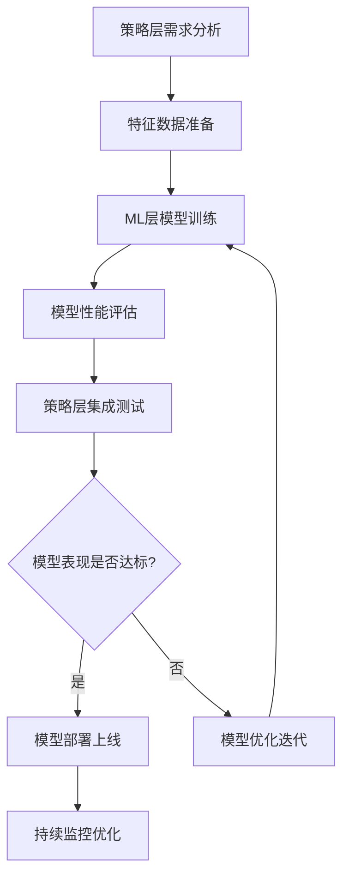
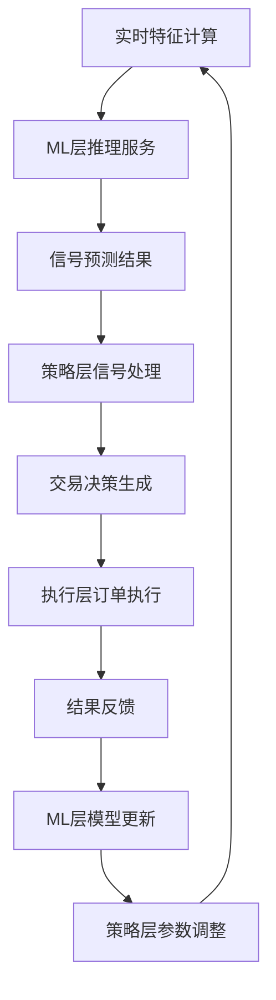
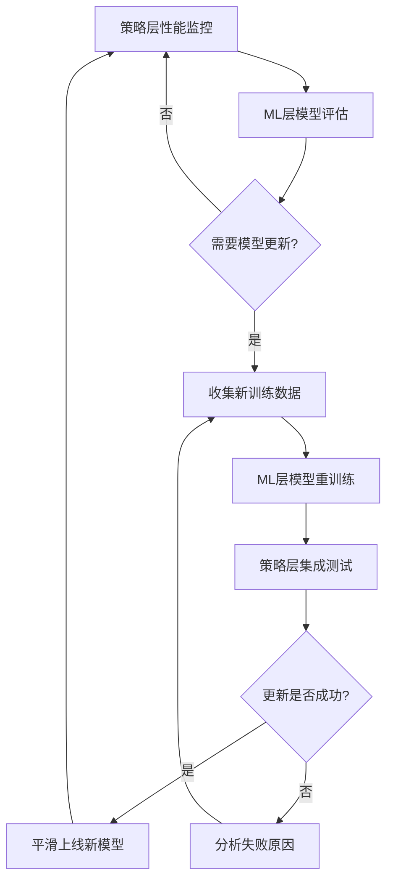

# RQA2025 ML层和策略层职责分工协作协议

## 协议概述

本文档定义了RQA2025量化交易系统中**机器学习层(ML层)**和**策略层(Strategy层)**的职责分工和协作机制，确保两个层级之间的职责边界清晰，避免功能重叠和冲突，提高系统整体的架构质量和维护效率。

### 协议版本
- **版本号**: v1.0.0
- **制定时间**: 2025年01月28日
- **生效时间**: 2025年01月28日
- **维护周期**: 每季度review一次

### 协议目标
1. **职责边界清晰化**: 明确ML层和策略层的职责分工
2. **接口标准化**: 建立标准化的层间协作接口
3. **协作机制规范化**: 制定规范的协作流程和机制
4. **维护效率提升**: 降低系统维护和扩展的复杂度

---

## 1. 职责分工定义

### 1.1 机器学习层 (ML Layer) 职责

#### 核心职责
```python
class MLLayerResponsibilities:
    """
    ML层核心职责定义
    重点：算法实现、模型训练、推理服务
    """

    # 1. 算法实现和优化
    def algorithm_implementation(self):
        """算法研发和实现"""
        # ✅ 监督学习算法 (回归、分类、排序)
        # ✅ 无监督学习算法 (聚类、降维)
        # ✅ 强化学习算法 (策略优化、价值函数)
        # ✅ 深度学习模型 (CNN、RNN、Transformer)
        # ✅ 集成学习算法 (Random Forest、XGBoost、LightGBM)
        # ✅ 传统机器学习算法 (SVM、KNN、朴素贝叶斯)
        pass

    # 2. 模型训练和优化
    def model_training_optimization(self):
        """模型训练和性能优化"""
        # ✅ 数据预处理和特征工程
        # ✅ 模型训练和调参
        # ✅ 模型验证和评估
        # ✅ 模型压缩和加速
        # ✅ 分布式训练支持
        pass

    # 3. 推理服务提供
    def inference_service_provision(self):
        """模型推理服务"""
        # ✅ 实时推理接口
        # ✅ 批量推理接口
        # ✅ 模型版本管理
        # ✅ 性能监控和优化
        # ✅ A/B测试支持
        pass
```

#### 技术栈和工具
```python
class MLTechStack:
    """
    ML层技术栈定义
    """

    # 深度学习框架
    deep_learning_frameworks = [
        "PyTorch",      # 主要框架
        "TensorFlow",   # 备选框架
        "JAX"          # 新兴框架
    ]

    # 机器学习库
    ml_libraries = [
        "scikit-learn",    # 传统ML
        "XGBoost",         # 梯度提升
        "LightGBM",        # 高效梯度提升
        "CatBoost"         # 类别特征处理
    ]

    # 分布式训练
    distributed_training = [
        "Ray",           # 分布式计算框架
        "Horovod",       # 分布式训练
        "PyTorch DDP"    # 原生分布式
    ]
```

### 1.2 策略层 (Strategy Layer) 职责

#### 核心职责
```python
class StrategyLayerResponsibilities:
    """
    策略层核心职责定义
    重点：策略逻辑、参数调优、风险控制
    """

    # 1. 策略逻辑实现
    def strategy_logic_implementation(self):
        """量化策略逻辑实现"""
        # ✅ 交易信号生成逻辑
        # ✅ 入场出场条件判断
        # ✅ 仓位管理策略
        # ✅ 止损止盈机制
        # ✅ 策略参数配置
        pass

    # 2. 策略参数调优
    def strategy_parameter_optimization(self):
        """策略参数优化"""
        # ✅ 参数搜索和优化
        # ✅ 回测验证和评估
        # ✅ 风险收益分析
        # ✅ 策略性能监控
        # ✅ 动态参数调整
        pass

    # 3. 策略风险控制
    def strategy_risk_management(self):
        """策略级风险控制"""
        # ✅ 策略级风险度量
        # ✅ 策略级风险限制
        # ✅ 策略级止损机制
        # ✅ 策略组合优化
        # ✅ 策略压力测试
        pass
```

#### 技术栈和工具
```python
class StrategyTechStack:
    """
    策略层技术栈定义
    """

    # 量化分析库
    quant_libraries = [
        "pandas",        # 数据分析
        "numpy",         # 数值计算
        "scipy",         # 科学计算
        "statsmodels"    # 统计建模
    ]

    # 回测框架
    backtest_frameworks = [
        "backtrader",    # 回测框架
        "zipline",       # 量化回测
        "pyfolio"        # 绩效分析
    ]

    # 优化库
    optimization_libraries = [
        "scipy.optimize",  # 数值优化
        "cvxpy",          # 凸优化
        "pulp"            # 线性规划
    ]
```

---

## 2. 协作接口定义

### 2.1 标准接口协议

#### ML层向策略层提供的接口
```python
class MLToStrategyInterface:
    """
    ML层向策略层提供的标准化接口
    """

    def predict_signal(self, features: Dict[str, Any], model_version: str = "latest") -> SignalPrediction:
        """
        信号预测接口
        Args:
            features: 特征数据字典
            model_version: 模型版本
        Returns:
            SignalPrediction: 信号预测结果
        """
        pass

    def get_model_metadata(self, model_id: str) -> ModelMetadata:
        """
        获取模型元数据
        Args:
            model_id: 模型ID
        Returns:
            ModelMetadata: 模型元数据信息
        """
        pass

    def update_model(self, model_id: str, new_data: pd.DataFrame) -> bool:
        """
        模型在线更新
        Args:
            model_id: 模型ID
            new_data: 新训练数据
        Returns:
            bool: 更新是否成功
        """
        pass

    def get_model_performance(self, model_id: str, time_range: str = "7d") -> ModelPerformance:
        """
        获取模型性能指标
        Args:
            model_id: 模型ID
            time_range: 时间范围
        Returns:
            ModelPerformance: 模型性能数据
        """
        pass
```

#### 策略层向ML层提供的接口
```python
class StrategyToMLInterface:
    """
    策略层向ML层提供的标准化接口
    """

    def get_training_data(self, strategy_id: str, time_range: Tuple[str, str]) -> pd.DataFrame:
        """
        获取策略训练数据
        Args:
            strategy_id: 策略ID
            time_range: 时间范围
        Returns:
            pd.DataFrame: 训练数据
        """
        pass

    def get_feature_labels(self, strategy_id: str) -> List[str]:
        """
        获取策略特征标签
        Args:
            strategy_id: 策略ID
        Returns:
            List[str]: 特征标签列表
        """
        pass

    def validate_predictions(self, predictions: List[SignalPrediction]) -> ValidationResult:
        """
        验证预测结果
        Args:
            predictions: 预测结果列表
        Returns:
            ValidationResult: 验证结果
        """
        pass

    def update_strategy_feedback(self, strategy_id: str, feedback_data: Dict[str, Any]) -> bool:
        """
        更新策略反馈数据
        Args:
            strategy_id: 策略ID
            feedback_data: 反馈数据
        Returns:
            bool: 更新是否成功
        """
        pass
```

### 2.2 数据格式标准

#### 特征数据格式
```python
@dataclass
class FeatureData:
    """
    特征数据标准格式
    """
    timestamp: datetime
    symbol: str
    features: Dict[str, float]
    labels: Optional[Dict[str, float]] = None
    metadata: Optional[Dict[str, Any]] = None

# 示例
feature_data = FeatureData(
    timestamp=datetime.now(),
    symbol="000001.SZ",
    features={
        "returns_1d": 0.023,
        "volatility_20d": 0.156,
        "volume_ratio": 1.234,
        "rsi_14": 67.5
    },
    labels={
        "target_return_1d": 0.015,
        "target_direction": 1  # 1: 上涨, 0: 下跌
    }
)
```

#### 信号预测格式
```python
@dataclass
class SignalPrediction:
    """
    信号预测结果标准格式
    """
    timestamp: datetime
    symbol: str
    signal_type: str  # "trend", "mean_reversion", "momentum"
    prediction: float  # 预测值 (-1, 1)
    confidence: float  # 置信度 (0, 1)
    model_version: str
    features_used: List[str]
    metadata: Optional[Dict[str, Any]] = None

# 示例
prediction = SignalPrediction(
    timestamp=datetime.now(),
    symbol="000001.SZ",
    signal_type="trend",
    prediction=0.78,
    confidence=0.85,
    model_version="v2.1.0",
    features_used=["returns_1d", "volatility_20d", "rsi_14"]
)
```

---

## 3. 协作流程规范

### 3.1 模型开发协作流程



#### 详细流程说明

**1. 策略层需求分析**
- 策略层定义预测目标和特征需求
- 明确模型性能指标和业务约束
- 制定数据收集和标注计划

**2. 特征数据准备**
- 策略层提供历史数据和特征计算逻辑
- ML层进行特征工程和数据预处理
- 共同定义数据质量标准

**3. ML层模型训练**
- ML层选择合适的算法和模型架构
- 进行模型训练和超参数优化
- 使用交叉验证评估模型性能

**4. 模型性能评估**
- 在验证集上评估模型性能
- 策略层从业务角度评估模型效果
- 共同分析模型优缺点

**5. 策略层集成测试**
- 将模型集成到策略框架中
- 进行回测验证和压力测试
- 评估对整体策略表现的影响

### 3.2 生产环境协作流程



#### 详细流程说明

**1. 实时特征计算**
- 策略层负责实时特征计算
- 确保特征数据质量和时效性
- 处理异常数据和缺失值

**2. ML层推理服务**
- 接收特征数据进行实时推理
- 返回预测结果和置信度
- 监控推理性能和延迟

**3. 策略层信号处理**
- 接收ML层预测结果
- 结合策略逻辑进行信号过滤
- 考虑市场条件和风险控制

**4. 交易决策生成**
- 生成具体的交易指令
- 设置止损止盈条件
- 确定仓位大小

### 3.3 模型更新协作流程



---

## 4. 质量保障机制

### 4.1 代码质量保障

#### 接口契约测试
```python
class InterfaceContractTest:
    """
    接口契约测试
    确保层间接口的兼容性和稳定性
    """

    def test_ml_to_strategy_interface(self):
        """测试ML层到策略层的接口"""
        # 测试接口方法存在性
        # 测试参数格式正确性
        # 测试返回值格式正确性
        pass

    def test_strategy_to_ml_interface(self):
        """测试策略层到ML层的接口"""
        # 测试接口方法存在性
        # 测试参数格式正确性
        # 测试返回值格式正确性
        pass
```

#### 集成测试
```python
class IntegrationTest:
    """
    ML层和策略层集成测试
    """

    def test_end_to_end_prediction(self):
        """端到端预测测试"""
        # 模拟完整预测流程
        # 验证数据流正确性
        # 检查性能指标
        pass

    def test_model_strategy_interaction(self):
        """模型策略交互测试"""
        # 测试模型调用频率
        # 测试异常处理机制
        # 测试性能监控
        pass
```

### 4.2 数据质量保障

#### 数据一致性检查
```python
class DataConsistencyCheck:
    """
    数据一致性检查机制
    """

    def check_feature_consistency(self, features: Dict[str, Any]) -> bool:
        """检查特征数据一致性"""
        # 检查特征名称一致性
        # 检查数据类型一致性
        # 检查数值范围合理性
        pass

    def check_prediction_consistency(self, prediction: SignalPrediction) -> bool:
        """检查预测结果一致性"""
        # 检查预测值范围
        # 检查置信度合理性
        # 检查时间戳时效性
        pass
```

#### 数据监控告警
```python
class DataQualityMonitor:
    """
    数据质量监控和告警
    """

    def monitor_data_quality(self):
        """数据质量监控"""
        # 监控数据完整性
        # 监控数据准确性
        # 监控数据时效性
        pass

    def alert_data_issues(self, issue_type: str, details: Dict[str, Any]):
        """数据问题告警"""
        # 发送告警通知
        # 记录问题详情
        # 触发自动修复流程
        pass
```

---

## 5. 性能和监控要求

### 5.1 性能指标要求

#### ML层性能要求
```python
class MLPerformanceRequirements:
    """
    ML层性能指标要求
    """

    # 推理延迟要求
    inference_latency = {
        "real_time": "< 10ms",    # 实时推理
        "batch": "< 100ms"       # 批量推理
    }

    # 模型更新频率
    model_update_frequency = {
        "online_learning": "实时",  # 在线学习
        "batch_update": "每日"      # 批量更新
    }

    # 资源使用限制
    resource_limits = {
        "cpu_usage": "< 70%",      # CPU使用率
        "memory_usage": "< 80%",   # 内存使用率
        "gpu_memory": "< 90%"      # GPU内存使用率
    }
```

#### 策略层性能要求
```python
class StrategyPerformanceRequirements:
    """
    策略层性能指标要求
    """

    # 信号生成延迟
    signal_generation_latency = "< 50ms"

    # 策略计算频率
    strategy_calculation_frequency = "每秒1000次"

    # 内存使用限制
    memory_limits = "< 1GB"

    # CPU使用限制
    cpu_limits = "< 50%"
```

### 5.2 监控指标定义

#### ML层监控指标
```python
class MLMonitoringMetrics:
    """
    ML层监控指标
    """

    # 模型性能指标
    model_metrics = [
        "accuracy",           # 准确率
        "precision",          # 精确率
        "recall",            # 召回率
        "f1_score",          # F1分数
        "auc_roc"           # AUC-ROC
    ]

    # 系统性能指标
    system_metrics = [
        "inference_latency",  # 推理延迟
        "throughput",         # 吞吐量
        "error_rate",         # 错误率
        "resource_usage"      # 资源使用率
    ]

    # 业务指标
    business_metrics = [
        "prediction_confidence",  # 预测置信度
        "feature_drift",          # 特征漂移
        "model_degradation"       # 模型退化
    ]
```

#### 策略层监控指标
```python
class StrategyMonitoringMetrics:
    """
    策略层监控指标
    """

    # 策略性能指标
    strategy_metrics = [
        "sharpe_ratio",       # 夏普比率
        "max_drawdown",       # 最大回撤
        "win_rate",           # 胜率
        "profit_factor",      # 盈利因子
        "calmar_ratio"        # 卡尔玛比率
    ]

    # 系统性能指标
    system_metrics = [
        "signal_latency",     # 信号延迟
        "calculation_time",   # 计算时间
        "memory_usage",       # 内存使用
        "cpu_usage"          # CPU使用
    ]

    # 业务指标
    business_metrics = [
        "trade_frequency",    # 交易频率
        "position_size",      # 仓位大小
        "risk_exposure"       # 风险暴露
    ]
```

---

## 6. 异常处理和故障恢复

### 6.1 异常处理策略

#### ML层异常处理
```python
class MLExceptionHandling:
    """
    ML层异常处理策略
    """

    def handle_inference_error(self, error: Exception, request_data: Dict[str, Any]):
        """处理推理异常"""
        # 记录错误信息
        # 尝试降级处理
        # 返回默认预测结果
        pass

    def handle_model_loading_error(self, model_id: str, error: Exception):
        """处理模型加载异常"""
        # 回滚到上一版本模型
        # 发送告警通知
        # 记录故障详情
        pass

    def handle_resource_exhaustion(self, resource_type: str):
        """处理资源耗尽异常"""
        # 释放非必要资源
        # 降低服务质量
        # 请求资源扩容
        pass
```

#### 策略层异常处理
```python
class StrategyExceptionHandling:
    """
    策略层异常处理策略
    """

    def handle_signal_generation_error(self, error: Exception, symbol: str):
        """处理信号生成异常"""
        # 记录错误信息
        # 使用备用信号生成逻辑
        # 暂停该symbol的交易
        pass

    def handle_data_missing_error(self, missing_fields: List[str]):
        """处理数据缺失异常"""
        # 尝试数据补全
        # 使用默认值替代
        # 降低信号置信度
        pass

    def handle_calculation_timeout(self, strategy_id: str, timeout: float):
        """处理计算超时异常"""
        # 中断当前计算
        # 简化计算逻辑
        # 记录性能问题
        pass
```

### 6.2 故障恢复机制

#### 自动故障恢复
```python
class AutomaticRecovery:
    """
    自动故障恢复机制
    """

    def recover_from_ml_failure(self):
        """从ML层故障中恢复"""
        # 检测ML服务状态
        # 自动重启服务
        # 验证服务恢复
        pass

    def recover_from_data_failure(self):
        """从数据故障中恢复"""
        # 检查数据源状态
        # 切换备用数据源
        # 重新初始化连接
        pass

    def recover_from_network_failure(self):
        """从网络故障中恢复"""
        # 检测网络连接
        # 重连网络服务
        # 恢复数据传输
        pass
```

---

## 7. 版本管理和兼容性

### 7.1 版本管理策略

#### 模型版本管理
```python
class ModelVersionManagement:
    """
    模型版本管理策略
    """

    def create_model_version(self, model_id: str, training_data: pd.DataFrame) -> str:
        """创建新模型版本"""
        # 生成版本号
        # 训练新模型
        # 保存模型文件
        # 更新版本元数据
        pass

    def deploy_model_version(self, model_id: str, version: str, traffic_percentage: float):
        """部署模型版本"""
        # 灰度发布新版本
        # 监控新版本表现
        # 根据表现调整流量
        pass

    def rollback_model_version(self, model_id: str, target_version: str):
        """回滚模型版本"""
        # 停止新版本流量
        # 恢复目标版本
        # 验证回滚成功
        pass
```

#### 接口版本管理
```python
class InterfaceVersionManagement:
    """
    接口版本管理策略
    """

    def manage_api_versions(self):
        """管理API版本"""
        # 支持多版本并存
        # 版本兼容性检查
        # 版本迁移计划
        pass

    def handle_version_deprecation(self, deprecated_version: str):
        """处理版本废弃"""
        # 通知下游系统
        # 设置废弃时间表
        # 提供迁移指导
        pass
```

### 7.2 兼容性保证

#### 向前兼容
- 新的接口版本必须兼容旧的调用方式
- 数据格式变更必须保持向后兼容
- 功能增强不能破坏现有功能

#### 向后兼容
- 支持旧版本接口的调用
- 维护历史数据的处理能力
- 保证配置文件的兼容性

---

## 8. 协作沟通机制

### 8.1 日常协作流程

#### 需求沟通机制
- **需求提出**: 策略层提出ML需求，ML层评估可行性
- **需求澄清**: 双方详细讨论需求细节和约束条件
- **需求确认**: 形成书面需求文档，双方签字确认

#### 开发协作机制
- **代码评审**: 跨层代码必须经过对方评审
- **联调测试**: 重要功能必须进行联调测试
- **文档同步**: 接口变更必须同步更新文档

#### 问题解决机制
- **问题报告**: 及时报告跨层问题
- **问题分析**: 双方共同分析问题根因
- **问题解决**: 制定解决方案并实施

### 8.2 定期评审机制

#### 季度评审
- **性能评估**: 评审ML层和策略层的性能表现
- **协作效率**: 评估跨层协作的效率和效果
- **问题总结**: 总结协作中的问题和改进点

#### 年度规划
- **技术规划**: 制定下一年的技术发展计划
- **资源规划**: 规划人力和资源投入
- **目标设定**: 设定下一年的协作目标和KPI

---

## 9. 协议执行和监督

### 9.1 执行监督机制

#### 协议遵守检查
- **定期审计**: 每季度进行一次协议遵守审计
- **问题记录**: 记录违反协议的行为和原因
- **改进措施**: 针对问题制定改进措施

#### 绩效评估
- **协作效率**: 评估跨层协作的效率指标
- **质量指标**: 评估代码质量和系统稳定性
- **业务价值**: 评估为业务带来的价值提升

### 9.2 协议更新机制

#### 协议更新流程
1. **变更提出**: 任何一方可以提出协议变更需求
2. **影响评估**: 评估变更对双方和系统的潜在影响
3. **方案制定**: 制定具体的变更实施方案
4. **评审通过**: 经过双方评审并达成共识
5. **实施执行**: 按照计划实施协议变更
6. **效果验证**: 验证变更效果并调整优化

#### 协议生效条件
- **双方同意**: 必须经过双方书面同意
- **测试验证**: 重要变更必须经过充分测试
- **文档更新**: 必须更新相关文档和代码注释
- **培训通知**: 必须通知相关人员并进行培训

---

**协议签署**:

**ML层负责人**: ____________________
**日期**: ____________________

**策略层负责人**: ____________________
**日期**: ____________________

**见证人**: ____________________
**日期**: ____________________

---

**附录**:

1. **接口定义详细文档**: 见 `docs/interfaces/ml_strategy_interfaces.md`
2. **数据格式规范**: 见 `docs/data_formats/ml_strategy_data_formats.md`
3. **测试用例**: 见 `tests/integration/ml_strategy_integration_tests/`
4. **性能基准**: 见 `docs/performance/ml_strategy_performance_benchmarks.md`
