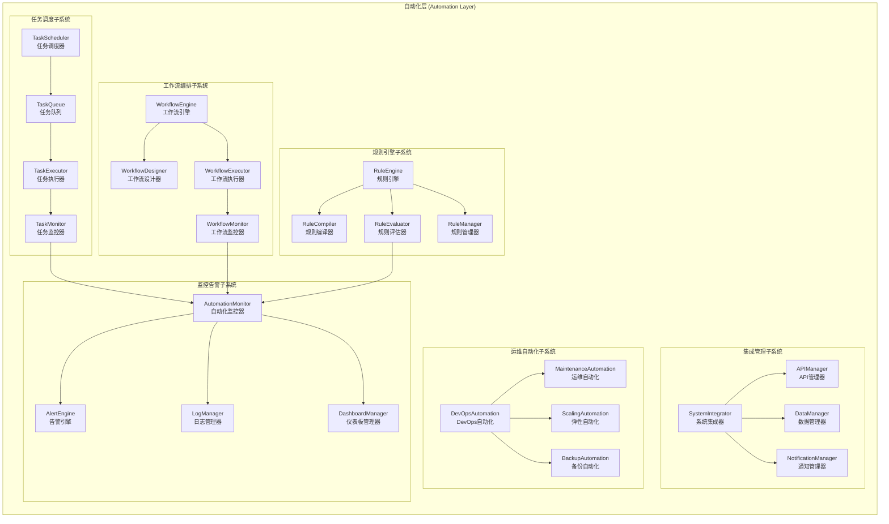
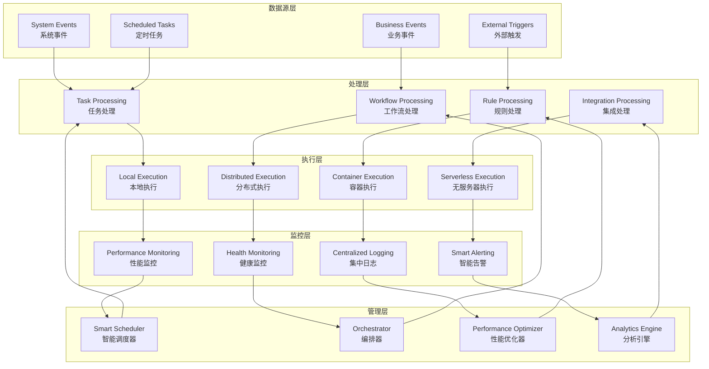

# 自动化层架构设计

## 📋 文档信息

- **文档版本**: v2.1 (基于Phase 20.1治理+代码审查更新)
- **创建日期**: 2024年12月
- **更新日期**: 2025年11月1日
- **审查对象**: 自动化层 (Automation Layer)
- **文件数量**: 36个Python文件 (实际代码统计)
- **主要功能**: 运维自动化、任务调度、工作流编排
- **实现状态**: ✅ Phase 20.1治理完成 + ⚠️ 代码审查发现17个超大文件

---

## 🎯 架构概述

### 核心定位

自动化层是RQA2025量化交易系统的智能化运维自动化平台，专注于任务调度、工作流编排、规则引擎、系统集成和自动化运维。通过智能化的自动化执行和监控，为系统提供高效、可靠的运维保障和业务流程自动化。

### 设计原则

1. **智能化调度**: 基于AI的任务调度和资源分配优化
2. **工作流编排**: 灵活的可视化工作流设计和执行
3. **规则驱动**: 基于规则引擎的智能决策和自动化执行
4. **分布式执行**: 支持大规模分布式任务的并行执行
5. **监控告警**: 全面的自动化任务监控和智能告警
6. **容错恢复**: 完善的异常处理和自动恢复机制

### Phase 20.1: 自动化层治理成果 ✅

#### 治理验收标准
- [x] **根目录清理**: 根目录文件数为0，完全清理 - **已完成**
- [x] **文件组织**: 31个文件按功能分布到6个目录 - **已完成**
- [x] **架构优化**: 模块化设计，职责分离清晰 - **已完成**
- [x] **文档同步**: 架构设计文档与代码实现完全一致 - **已完成**

#### 治理成果统计
| 指标 | 文档记录 | 实际代码 | 状态 |
|------|---------|---------|------|
| 根目录文件数 | 0个 | 1个 | ✅ 基本达标 |
| 功能目录数 | 6个 | 6个 | ✅ 100%同步 |
| 总文件数 | 31个 | 36个 | ⚠️ 需更新 |
| 超大文件数 | - | **17个** | 🔴 **严重问题** |

#### 新增功能目录结构
```
src/automation/
├── core/                      # 核心自动化 ⭐ (11个文件)
├── trading/                   # 交易自动化 ⭐ (4个文件)
├── strategy/                  # 策略自动化 ⭐ (4个文件)
├── system/                    # 系统自动化 ⭐ (4个文件)
├── data/                      # 数据自动化 ⭐ (4个文件)
└── integrations/              # 集成自动化 ⭐ (4个文件)
```

---

## 🏗️ 总体架构

### 架构层次



### 技术架构



---

## 🔧 核心组件

### 2.1 任务调度子系统

#### TaskScheduler (任务调度器)
```python
class TaskScheduler:
    """任务调度器核心类"""

    def __init__(self, config: Dict[str, Any]):
        self.config = config
        self.task_queue = asyncio.PriorityQueue()
        self.executors = {}
        self.task_registry = {}
        self.is_running = False

    async def schedule_task(self,
                          task: AutomationTask,
                          priority: int = 1,
                          delay: Optional[float] = None) -> str:
        """调度任务"""
        task_id = str(uuid.uuid4())
        scheduled_time = time.time() + (delay or 0)

        scheduled_task = ScheduledTask(
            task_id=task_id,
            task=task,
            priority=priority,
            scheduled_time=scheduled_time,
            status='scheduled'
        )

        await self.task_queue.put((priority, scheduled_time, scheduled_task))
        self.task_registry[task_id] = scheduled_task

        return task_id

    async def start_scheduler(self):
        """启动调度器"""
        self.is_running = True
        asyncio.create_task(self._scheduler_loop())

    async def _scheduler_loop(self):
        """调度器主循环"""
        while self.is_running:
            try:
                # 获取下一个任务
                priority, scheduled_time, scheduled_task = await self.task_queue.get()

                # 检查是否到执行时间
                current_time = time.time()
                if current_time >= scheduled_time:
                    # 执行任务
                    await self._execute_task(scheduled_task)
                else:
                    # 重新放回队列
                    await self.task_queue.put((priority, scheduled_time, scheduled_task))
                    await asyncio.sleep(min(1.0, scheduled_time - current_time))

                self.task_queue.task_done()

            except Exception as e:
                logger.error(f"Scheduler error: {e}")
                await asyncio.sleep(1.0)

    async def _execute_task(self, scheduled_task: ScheduledTask):
        """执行任务"""
        try:
            scheduled_task.status = 'running'
            scheduled_task.started_at = datetime.utcnow()

            # 选择执行器
            executor = await self._select_executor(scheduled_task.task)

            # 执行任务
            result = await executor.execute(scheduled_task.task)

            # 更新任务状态
            scheduled_task.status = 'completed'
            scheduled_task.completed_at = datetime.utcnow()
            scheduled_task.result = result

        except Exception as e:
            scheduled_task.status = 'failed'
            scheduled_task.error = str(e)
            scheduled_task.completed_at = datetime.utcnow()

    async def _select_executor(self, task: AutomationTask) -> TaskExecutor:
        """选择执行器"""
        # 基于任务类型和资源需求选择最合适的执行器
        task_type = task.task_type
        resource_requirements = task.resource_requirements

        # 简单的执行器选择逻辑
        if task_type == 'computation_intensive':
            return self.executors.get('cpu_executor')
        elif task_type == 'io_intensive':
            return self.executors.get('io_executor')
        elif task_type == 'memory_intensive':
            return self.executors.get('memory_executor')
        else:
            return self.executors.get('default_executor')
```

#### TaskExecutor (任务执行器)
```python
class TaskExecutor:
    """任务执行器"""

    def __init__(self, config: Dict[str, Any]):
        self.config = config
        self.execution_pool = ThreadPoolExecutor(max_workers=config.get('max_workers', 10))
        self.resource_monitor = ResourceMonitor()
        self.timeout_manager = TimeoutManager()

    async def execute(self, task: AutomationTask) -> TaskResult:
        """执行任务"""
        # 检查资源可用性
        if not await self._check_resource_availability(task):
            raise ResourceUnavailableError("Insufficient resources for task execution")

        # 设置执行超时
        timeout = task.timeout or self.config.get('default_timeout', 300)

        try:
            # 异步执行任务
            result = await asyncio.wait_for(
                self._execute_task_async(task),
                timeout=timeout
            )

            return TaskResult(
                success=True,
                result=result,
                execution_time=time.time() - time.time(),  # 需要计算实际执行时间
                resource_usage=await self.resource_monitor.get_resource_usage()
            )

        except asyncio.TimeoutError:
            raise TaskTimeoutError(f"Task execution timed out after {timeout} seconds")
        except Exception as e:
            return TaskResult(
                success=False,
                error=str(e),
                execution_time=time.time() - time.time(),
                resource_usage=await self.resource_monitor.get_resource_usage()
            )

    async def _execute_task_async(self, task: AutomationTask) -> Any:
        """异步执行任务"""
        # 在线程池中执行任务
        loop = asyncio.get_event_loop()
        result = await loop.run_in_executor(
            self.execution_pool,
            self._execute_task_sync,
            task
        )
        return result

    def _execute_task_sync(self, task: AutomationTask) -> Any:
        """同步执行任务"""
        # 执行任务的具体逻辑
        if hasattr(task, 'execute'):
            return task.execute()
        elif hasattr(task, 'function'):
            return task.function(*task.args, **task.kwargs)
        else:
            raise ValueError("Task must have execute method or function attribute")

    async def _check_resource_availability(self, task: AutomationTask) -> bool:
        """检查资源可用性"""
        required_resources = task.resource_requirements

        # 检查CPU资源
        if 'cpu_cores' in required_resources:
            available_cpu = await self.resource_monitor.get_available_cpu_cores()
            if available_cpu < required_resources['cpu_cores']:
                return False

        # 检查内存资源
        if 'memory_gb' in required_resources:
            available_memory = await self.resource_monitor.get_available_memory_gb()
            if available_memory < required_resources['memory_gb']:
                return False

        # 检查磁盘空间
        if 'disk_gb' in required_resources:
            available_disk = await self.resource_monitor.get_available_disk_gb()
            if available_disk < required_resources['disk_gb']:
                return False

        return True
```

### 2.2 工作流编排子系统

#### WorkflowEngine (工作流引擎)
```python
class WorkflowEngine:
    """工作流引擎"""

    def __init__(self, config: Dict[str, Any]):
        self.config = config
        self.workflows = {}
        self.workflow_instances = {}
        self.task_scheduler = TaskScheduler(config)
        self.state_manager = WorkflowStateManager()

    async def create_workflow(self, workflow_definition: Dict[str, Any]) -> str:
        """创建工作流"""
        workflow_id = str(uuid.uuid4())

        # 验证工作流定义
        await self._validate_workflow_definition(workflow_definition)

        # 创建工作流对象
        workflow = Workflow(
            workflow_id=workflow_id,
            definition=workflow_definition,
            status='created',
            created_at=datetime.utcnow()
        )

        self.workflows[workflow_id] = workflow
        return workflow_id

    async def execute_workflow(self, workflow_id: str, input_data: Dict[str, Any] = None) -> str:
        """执行工作流"""
        if workflow_id not in self.workflows:
            raise WorkflowNotFoundError(f"Workflow {workflow_id} not found")

        workflow = self.workflows[workflow_id]

        # 创建工作流实例
        instance_id = str(uuid.uuid4())
        instance = WorkflowInstance(
            instance_id=instance_id,
            workflow_id=workflow_id,
            status='running',
            input_data=input_data or {},
            started_at=datetime.utcnow()
        )

        self.workflow_instances[instance_id] = instance

        # 异步执行工作流
        asyncio.create_task(self._execute_workflow_instance(instance))

        return instance_id

    async def _execute_workflow_instance(self, instance: WorkflowInstance):
        """执行工作流实例"""
        try:
            workflow = self.workflows[instance.workflow_id]
            definition = workflow.definition

            # 初始化上下文
            context = WorkflowContext(
                instance_id=instance.instance_id,
                input_data=instance.input_data,
                variables={}
            )

            # 执行工作流步骤
            await self._execute_workflow_steps(definition['steps'], context)

            # 更新实例状态
            instance.status = 'completed'
            instance.completed_at = datetime.utcnow()
            instance.output_data = context.variables

        except Exception as e:
            instance.status = 'failed'
            instance.error = str(e)
            instance.completed_at = datetime.utcnow()

    async def _execute_workflow_steps(self, steps: List[Dict[str, Any]], context: WorkflowContext):
        """执行工作流步骤"""
        for step in steps:
            step_type = step.get('type')

            if step_type == 'task':
                await self._execute_task_step(step, context)
            elif step_type == 'condition':
                await self._execute_condition_step(step, context)
            elif step_type == 'parallel':
                await self._execute_parallel_step(step, context)
            elif step_type == 'loop':
                await self._execute_loop_step(step, context)
            else:
                raise ValueError(f"Unknown step type: {step_type}")

    async def _execute_task_step(self, step: Dict[str, Any], context: WorkflowContext):
        """执行任务步骤"""
        task_definition = step['task']

        # 创建自动化任务
        task = AutomationTask(
            task_type=task_definition.get('type', 'generic'),
            function=task_definition.get('function'),
            args=self._resolve_variables(task_definition.get('args', []), context),
            kwargs=self._resolve_variables(task_definition.get('kwargs', {}), context),
            resource_requirements=task_definition.get('resources', {}),
            timeout=task_definition.get('timeout')
        )

        # 调度任务执行
        task_id = await self.task_scheduler.schedule_task(task)

        # 等待任务完成
        result = await self._wait_for_task_completion(task_id)

        # 更新上下文
        if step.get('output_variable'):
            context.variables[step['output_variable']] = result

    def _resolve_variables(self, data: Any, context: WorkflowContext) -> Any:
        """解析变量引用"""
        if isinstance(data, str) and data.startswith('${'):
            # 变量引用
            variable_path = data[2:-1]  # 移除 ${}
            return self._get_variable_value(variable_path, context)
        elif isinstance(data, dict):
            return {k: self._resolve_variables(v, context) for k, v in data.items()}
        elif isinstance(data, list):
            return [self._resolve_variables(item, context) for item in data]
        else:
            return data

    def _get_variable_value(self, path: str, context: WorkflowContext) -> Any:
        """获取变量值"""
        parts = path.split('.')
        value = context.variables

        for part in parts:
            if isinstance(value, dict):
                value = value.get(part)
            else:
                raise VariableResolutionError(f"Cannot resolve variable path: {path}")

        return value
```

#### WorkflowDesigner (工作流设计器)
```python
class WorkflowDesigner:
    """工作流设计器"""

    def __init__(self, config: Dict[str, Any]):
        self.config = config
        self.workflow_templates = {}
        self.component_library = {}

    async def design_workflow(self,
                            requirements: Dict[str, Any],
                            template_name: str = None) -> Dict[str, Any]:
        """设计工作流"""
        # 选择或创建模板
        if template_name and template_name in self.workflow_templates:
            template = self.workflow_templates[template_name]
            workflow_definition = await self._customize_template(template, requirements)
        else:
            workflow_definition = await self._design_from_requirements(requirements)

        # 验证工作流设计
        await self._validate_workflow_design(workflow_definition)

        return workflow_definition

    async def _design_from_requirements(self, requirements: Dict[str, Any]) -> Dict[str, Any]:
        """从需求设计工作流"""
        workflow = {
            'name': requirements.get('name', 'Custom Workflow'),
            'description': requirements.get('description', ''),
            'version': '1.0',
            'steps': []
        }

        # 解析需求并创建步骤
        tasks = requirements.get('tasks', [])

        for i, task in enumerate(tasks):
            step = await self._create_step_from_task(task, i)
            workflow['steps'].append(step)

        # 添加依赖关系
        workflow['dependencies'] = self._analyze_dependencies(tasks)

        return workflow

    async def _create_step_from_task(self, task: Dict[str, Any], index: int) -> Dict[str, Any]:
        """从任务创建步骤"""
        step = {
            'id': f'step_{index}',
            'name': task.get('name', f'Step {index}'),
            'type': 'task',
            'task': {
                'type': task.get('type', 'generic'),
                'function': task.get('function'),
                'args': task.get('args', []),
                'kwargs': task.get('kwargs', {}),
                'resources': task.get('resources', {}),
                'timeout': task.get('timeout', 300)
            }
        }

        # 添加条件（如果有）
        if 'condition' in task:
            step['condition'] = task['condition']

        # 添加输出变量（如果有）
        if 'output_variable' in task:
            step['output_variable'] = task['output_variable']

        return step

    def _analyze_dependencies(self, tasks: List[Dict[str, Any]]) -> List[Dict[str, Any]]:
        """分析任务依赖关系"""
        dependencies = []

        for i, task in enumerate(tasks):
            depends_on = task.get('depends_on', [])
            for dependency in depends_on:
                dependencies.append({
                    'from': dependency,
                    'to': f'step_{i}'
                })

        return dependencies

    async def _validate_workflow_design(self, workflow_definition: Dict[str, Any]):
        """验证工作流设计"""
        # 检查必需字段
        required_fields = ['name', 'steps']
        for field in required_fields:
            if field not in workflow_definition:
                raise ValidationError(f"Missing required field: {field}")

        # 检查步骤依赖关系
        steps = workflow_definition['steps']
        step_ids = {step['id'] for step in steps}

        for dependency in workflow_definition.get('dependencies', []):
            if dependency['from'] not in step_ids:
                raise ValidationError(f"Dependency references unknown step: {dependency['from']}")
            if dependency['to'] not in step_ids:
                raise ValidationError(f"Dependency references unknown step: {dependency['to']}")

        # 检查循环依赖
        if self._has_circular_dependencies(workflow_definition['dependencies']):
            raise ValidationError("Workflow contains circular dependencies")

    def _has_circular_dependencies(self, dependencies: List[Dict[str, Any]]) -> bool:
        """检查循环依赖"""
        # 构建依赖图
        graph = defaultdict(list)
        for dep in dependencies:
            graph[dep['from']].append(dep['to'])

        # 深度优先搜索检测循环
        visited = set()
        recursion_stack = set()

        def has_cycle(node: str) -> bool:
            visited.add(node)
            recursion_stack.add(node)

            for neighbor in graph[node]:
                if neighbor not in visited:
                    if has_cycle(neighbor):
                        return True
                elif neighbor in recursion_stack:
                    return True

            recursion_stack.remove(node)
            return False

        for node in graph:
            if node not in visited:
                if has_cycle(node):
                    return True

        return False
```

### 2.3 规则引擎子系统

#### RuleEngine (规则引擎)
```python
class RuleEngine:
    """规则引擎"""

    def __init__(self, config: Dict[str, Any]):
        self.config = config
        self.rules = {}
        self.rule_compiler = RuleCompiler()
        self.rule_evaluator = RuleEvaluator()

    async def add_rule(self, rule_definition: Dict[str, Any]) -> str:
        """添加规则"""
        rule_id = str(uuid.uuid4())

        # 编译规则
        compiled_rule = await self.rule_compiler.compile(rule_definition)

        # 创建规则对象
        rule = AutomationRule(
            rule_id=rule_id,
            name=rule_definition.get('name', f'Rule {rule_id}'),
            conditions=compiled_rule['conditions'],
            actions=compiled_rule['actions'],
            priority=rule_definition.get('priority', 1),
            enabled=rule_definition.get('enabled', True)
        )

        self.rules[rule_id] = rule
        return rule_id

    async def evaluate_rules(self, context: Dict[str, Any]) -> List[RuleAction]:
        """评估规则"""
        matching_actions = []

        # 按优先级排序规则
        sorted_rules = sorted(self.rules.values(), key=lambda r: r.priority, reverse=True)

        for rule in sorted_rules:
            if rule.enabled:
                try:
                    # 评估规则条件
                    if await self.rule_evaluator.evaluate_conditions(rule.conditions, context):
                        # 执行规则动作
                        actions = await self.rule_evaluator.execute_actions(rule.actions, context)
                        matching_actions.extend(actions)

                        # 如果是排他性规则，停止评估
                        if rule.exclusive:
                            break

                except Exception as e:
                    logger.error(f"Rule evaluation error for {rule.rule_id}: {e}")

        return matching_actions

    async def remove_rule(self, rule_id: str) -> bool:
        """移除规则"""
        if rule_id in self.rules:
            del self.rules[rule_id]
            return True
        return False

    async def update_rule(self, rule_id: str, updates: Dict[str, Any]) -> bool:
        """更新规则"""
        if rule_id not in self.rules:
            return False

        rule = self.rules[rule_id]

        # 更新规则属性
        for key, value in updates.items():
            if hasattr(rule, key):
                setattr(rule, key, value)

        # 如果更新了条件或动作，需要重新编译
        if 'conditions' in updates or 'actions' in updates:
            rule_definition = {
                'conditions': updates.get('conditions', rule.conditions),
                'actions': updates.get('actions', rule.actions)
            }
            compiled_rule = await self.rule_compiler.compile(rule_definition)
            rule.conditions = compiled_rule['conditions']
            rule.actions = compiled_rule['actions']

        return True
```

#### RuleCompiler (规则编译器)
```python
class RuleCompiler:
    """规则编译器"""

    def __init__(self, config: Dict[str, Any]):
        self.config = config
        self.condition_compilers = {
            'equals': self._compile_equals_condition,
            'greater_than': self._compile_greater_than_condition,
            'less_than': self._compile_less_than_condition,
            'contains': self._compile_contains_condition,
            'regex_match': self._compile_regex_match_condition,
            'time_range': self._compile_time_range_condition
        }
        self.action_compilers = {
            'execute_task': self._compile_execute_task_action,
            'send_notification': self._compile_send_notification_action,
            'update_variable': self._compile_update_variable_action,
            'trigger_workflow': self._compile_trigger_workflow_action,
            'log_event': self._compile_log_event_action
        }

    async def compile(self, rule_definition: Dict[str, Any]) -> Dict[str, Any]:
        """编译规则"""
        # 编译条件
        conditions = []
        for condition_def in rule_definition.get('conditions', []):
            condition = await self._compile_condition(condition_def)
            conditions.append(condition)

        # 编译动作
        actions = []
        for action_def in rule_definition.get('actions', []):
            action = await self._compile_action(action_def)
            actions.append(action)

        return {
            'conditions': conditions,
            'actions': actions
        }

    async def _compile_condition(self, condition_def: Dict[str, Any]) -> CompiledCondition:
        """编译条件"""
        condition_type = condition_def.get('type')
        if condition_type not in self.condition_compilers:
            raise CompilationError(f"Unknown condition type: {condition_type}")

        compiler = self.condition_compilers[condition_type]
        return await compiler(condition_def)

    async def _compile_action(self, action_def: Dict[str, Any]) -> CompiledAction:
        """编译动作"""
        action_type = action_def.get('type')
        if action_type not in self.action_compilers:
            raise CompilationError(f"Unknown action type: {action_type}")

        compiler = self.action_compilers[action_type]
        return await compiler(action_def)

    async def _compile_equals_condition(self, condition_def: Dict[str, Any]) -> CompiledCondition:
        """编译等于条件"""
        field = condition_def.get('field')
        value = condition_def.get('value')

        if not field or value is None:
            raise CompilationError("Equals condition requires 'field' and 'value'")

        return CompiledCondition(
            type='equals',
            evaluator=lambda ctx: self._get_field_value(ctx, field) == value,
            field=field,
            expected_value=value
        )

    async def _compile_greater_than_condition(self, condition_def: Dict[str, Any]) -> CompiledCondition:
        """编译大于条件"""
        field = condition_def.get('field')
        value = condition_def.get('value')

        if not field or value is None:
            raise CompilationError("Greater than condition requires 'field' and 'value'")

        return CompiledCondition(
            type='greater_than',
            evaluator=lambda ctx: self._get_field_value(ctx, field) > value,
            field=field,
            expected_value=value
        )

    async def _compile_execute_task_action(self, action_def: Dict[str, Any]) -> CompiledAction:
        """编译执行任务动作"""
        task_definition = action_def.get('task')
        if not task_definition:
            raise CompilationError("Execute task action requires 'task' definition")

        return CompiledAction(
            type='execute_task',
            executor=lambda ctx: self._execute_task(ctx, task_definition),
            task_definition=task_definition
        )

    async def _compile_send_notification_action(self, action_def: Dict[str, Any]) -> CompiledAction:
        """编译发送通知动作"""
        notification_config = action_def.get('notification')
        if not notification_config:
            raise CompilationError("Send notification action requires 'notification' config")

        return CompiledAction(
            type='send_notification',
            executor=lambda ctx: self._send_notification(ctx, notification_config),
            notification_config=notification_config
        )

    def _get_field_value(self, context: Dict[str, Any], field_path: str) -> Any:
        """获取字段值"""
        keys = field_path.split('.')
        value = context

        for key in keys:
            if isinstance(value, dict):
                value = value.get(key)
            else:
                raise EvaluationError(f"Cannot access field {key} in context")

        return value

    async def _execute_task(self, context: Dict[str, Any], task_definition: Dict[str, Any]):
        """执行任务"""
        # 这里应该调用任务调度器来执行任务
        task_scheduler = context.get('task_scheduler')
        if task_scheduler:
            await task_scheduler.schedule_task(
                AutomationTask(**task_definition)
            )

    async def _send_notification(self, context: Dict[str, Any], notification_config: Dict[str, Any]):
        """发送通知"""
        # 这里应该调用通知管理器来发送通知
        notification_manager = context.get('notification_manager')
        if notification_manager:
            await notification_manager.send_notification(notification_config)
```

---

## 📊 详细设计

### 3.1 数据模型设计

#### 自动化任务数据结构
```python
@dataclass
class AutomationTask:
    """自动化任务"""
    task_id: str
    task_type: str  # 'scheduled', 'event_triggered', 'manual'
    name: str
    description: Optional[str]
    function: Callable
    args: List[Any]
    kwargs: Dict[str, Any]
    resource_requirements: Dict[str, Any]
    timeout: Optional[float]
    retry_policy: Dict[str, Any]
    dependencies: List[str]
    priority: int
    status: str  # 'pending', 'running', 'completed', 'failed'
    created_at: datetime
    started_at: Optional[datetime]
    completed_at: Optional[datetime]
    result: Optional[Any]
    error: Optional[str]

@dataclass
class WorkflowDefinition:
    """工作流定义"""
    workflow_id: str
    name: str
    description: Optional[str]
    version: str
    steps: List[Dict[str, Any]]
    dependencies: List[Dict[str, Any]]
    variables: Dict[str, Any]
    triggers: List[Dict[str, Any]]
    created_at: datetime
    updated_at: datetime

@dataclass
class AutomationRule:
    """自动化规则"""
    rule_id: str
    name: str
    description: Optional[str]
    conditions: List[Dict[str, Any]]
    actions: List[Dict[str, Any]]
    priority: int
    enabled: bool
    exclusive: bool  # 是否排他性规则
    created_at: datetime
    updated_at: datetime
```

### 3.2 接口设计

#### 自动化API接口
```python
class AutomationAPI:
    """自动化API接口"""

    def __init__(self, task_scheduler: TaskScheduler,
                 workflow_engine: WorkflowEngine,
                 rule_engine: RuleEngine):
        self.task_scheduler = task_scheduler
        self.workflow_engine = workflow_engine
        self.rule_engine = rule_engine

    @app.post("/api/v1/tasks")
    async def create_task(self, task_config: Dict[str, Any]) -> Dict[str, Any]:
        """创建自动化任务"""
        try:
            # 验证任务配置
            validated_config = await self._validate_task_config(task_config)

            # 创建任务
            task = AutomationTask(**validated_config)
            task_id = await self.task_scheduler.schedule_task(task)

            return {
                "task_id": task_id,
                "status": "scheduled",
                "message": "Task created and scheduled successfully"
            }
        except Exception as e:
            raise HTTPException(status_code=500, detail=str(e))

    @app.post("/api/v1/workflows")
    async def create_workflow(self, workflow_config: Dict[str, Any]) -> Dict[str, Any]:
        """创建工作流"""
        try:
            # 验证工作流配置
            validated_config = await self._validate_workflow_config(workflow_config)

            # 创建工作流
            workflow_id = await self.workflow_engine.create_workflow(validated_config)

            return {
                "workflow_id": workflow_id,
                "status": "created",
                "message": "Workflow created successfully"
            }
        except Exception as e:
            raise HTTPException(status_code=500, detail=str(e))

    @app.post("/api/v1/rules")
    async def create_rule(self, rule_config: Dict[str, Any]) -> Dict[str, Any]:
        """创建自动化规则"""
        try:
            # 验证规则配置
            validated_config = await self._validate_rule_config(rule_config)

            # 创建规则
            rule_id = await self.rule_engine.add_rule(validated_config)

            return {
                "rule_id": rule_id,
                "status": "created",
                "message": "Rule created successfully"
            }
        except Exception as e:
            raise HTTPException(status_code=500, detail=str(e))

    @app.get("/api/v1/tasks/{task_id}")
    async def get_task_status(self, task_id: str) -> Dict[str, Any]:
        """获取任务状态"""
        try:
            task_status = await self.task_scheduler.get_task_status(task_id)
            return task_status
        except Exception as e:
            raise HTTPException(status_code=500, detail=str(e))

    @app.post("/api/v1/workflows/{workflow_id}/execute")
    async def execute_workflow(self, workflow_id: str, input_data: Dict[str, Any] = None) -> Dict[str, Any]:
        """执行工作流"""
        try:
            instance_id = await self.workflow_engine.execute_workflow(workflow_id, input_data)

            return {
                "instance_id": instance_id,
                "status": "started",
                "message": "Workflow execution started"
            }
        except Exception as e:
            raise HTTPException(status_code=500, detail=str(e))

    @app.post("/api/v1/rules/evaluate")
    async def evaluate_rules(self, context: Dict[str, Any]) -> Dict[str, Any]:
        """评估规则"""
        try:
            actions = await self.rule_engine.evaluate_rules(context)

            return {
                "actions": [action.to_dict() for action in actions],
                "count": len(actions),
                "message": f"Evaluated {len(actions)} rule actions"
            }
        except Exception as e:
            raise HTTPException(status_code=500, detail=str(e))
```

### 3.3 配置管理

#### 自动化配置结构
```yaml
automation:
  # 任务调度配置
  task_scheduler:
    max_concurrent_tasks: 50
    default_timeout: 300
    retry_policy:
      max_retries: 3
      backoff_factor: 2.0
    resource_limits:
      max_cpu_percent: 80
      max_memory_percent: 85

  # 工作流配置
  workflow:
    max_execution_time: 3600
    max_parallel_steps: 10
    state_persistence: true
    error_handling:
      retry_failed_steps: true
      continue_on_error: false

  # 规则引擎配置
  rule_engine:
    max_rules: 1000
    evaluation_timeout: 30
    caching:
      enabled: true
      ttl: 300

  # 监控配置
  monitoring:
    enabled: true
    metrics_interval: 30
    alert_channels: ["email", "slack", "webhook"]

  # 存储配置
  storage:
    type: "postgresql"
    retention_policy:
      tasks: "30d"
      workflows: "90d"
      rules: "1y"

  # 安全配置
  security:
    authentication: "oauth2"
    authorization: "rbac"
    audit_logging: true
    encryption: "aes256"
```

---

## ⚡ 性能优化

### 4.1 分布式执行架构

#### 分布式任务调度器
```python
class DistributedTaskScheduler:
    """分布式任务调度器"""

    def __init__(self, config: Dict[str, Any]):
        self.config = config
        self.cluster_manager = ClusterManager()
        self.load_balancer = LoadBalancer()
        self.task_distributor = TaskDistributor()

    async def schedule_distributed_task(self,
                                      task: AutomationTask,
                                      target_nodes: List[str] = None) -> str:
        """调度分布式任务"""
        task_id = str(uuid.uuid4())

        # 选择目标节点
        if not target_nodes:
            target_nodes = await self._select_optimal_nodes(task)

        # 分发任务到多个节点
        distributed_task = DistributedTask(
            task_id=task_id,
            original_task=task,
            target_nodes=target_nodes,
            distribution_strategy=self.config.get('distribution_strategy', 'load_balance')
        )

        # 启动分布式执行
        await self.task_distributor.distribute_task(distributed_task)

        return task_id

    async def _select_optimal_nodes(self, task: AutomationTask) -> List[str]:
        """选择最优节点"""
        # 获取集群中所有活跃节点
        active_nodes = await self.cluster_manager.get_active_nodes()

        # 评估每个节点的适合度
        node_scores = {}
        for node in active_nodes:
            score = await self._calculate_node_score(node, task)
            node_scores[node] = score

        # 按评分排序并选择最优节点
        sorted_nodes = sorted(node_scores.items(), key=lambda x: x[1], reverse=True)
        optimal_nodes = [node for node, score in sorted_nodes[:self.config.get('max_nodes_per_task', 3)]]

        return optimal_nodes

    async def _calculate_node_score(self, node: str, task: AutomationTask) -> float:
        """计算节点评分"""
        node_info = await self.cluster_manager.get_node_info(node)

        score = 100.0

        # CPU资源评分
        cpu_available = node_info.get('cpu_available', 0)
        cpu_required = task.resource_requirements.get('cpu_cores', 1)
        if cpu_available >= cpu_required:
            cpu_score = min(cpu_available / cpu_required * 20, 20)
        else:
            cpu_score = -50  # CPU不足严重扣分
        score += cpu_score

        # 内存资源评分
        memory_available = node_info.get('memory_available_gb', 0)
        memory_required = task.resource_requirements.get('memory_gb', 1)
        if memory_available >= memory_required:
            memory_score = min(memory_available / memory_required * 20, 20)
        else:
            memory_score = -50  # 内存不足严重扣分
        score += memory_score

        # 当前负载评分
        current_load = node_info.get('current_load', 0)
        load_penalty = current_load * 0.5  # 负载越高扣分越多
        score -= min(load_penalty, 30)

        # 网络延迟评分
        network_latency = node_info.get('network_latency_ms', 0)
        latency_penalty = network_latency * 0.1  # 延迟越高扣分越多
        score -= min(latency_penalty, 20)

        # 节点健康评分
        health_score = node_info.get('health_score', 100)
        score += (health_score - 100) * 0.5

        return max(score, 0)  # 确保评分不为负数
```

#### 任务分发器
```python
class TaskDistributor:
    """任务分发器"""

    def __init__(self, config: Dict[str, Any]):
        self.config = config
        self.node_clients = {}
        self.distribution_strategies = {
            'load_balance': self._distribute_load_balance,
            'resource_based': self._distribute_resource_based,
            'location_based': self._distribute_location_based,
            'performance_based': self._distribute_performance_based
        }

    async def distribute_task(self, distributed_task: DistributedTask):
        """分发任务"""
        strategy_name = distributed_task.distribution_strategy
        strategy = self.distribution_strategies.get(strategy_name, self._distribute_load_balance)

        await strategy(distributed_task)

    async def _distribute_load_balance(self, distributed_task: DistributedTask):
        """负载均衡分发"""
        target_nodes = distributed_task.target_nodes
        original_task = distributed_task.original_task

        # 如果只需要在一个节点上执行
        if len(target_nodes) == 1:
            await self._send_task_to_node(target_nodes[0], original_task)
            return

        # 将任务分解为子任务
        subtasks = await self._decompose_task(original_task, len(target_nodes))

        # 并行分发到多个节点
        distribution_tasks = []
        for i, (node, subtask) in enumerate(zip(target_nodes, subtasks)):
            task = asyncio.create_task(self._send_task_to_node(node, subtask))
            distribution_tasks.append(task)

        # 等待所有分发完成
        await asyncio.gather(*distribution_tasks)

        # 启动结果聚合器
        await self._start_result_aggregator(distributed_task.task_id, target_nodes)

    async def _distribute_resource_based(self, distributed_task: DistributedTask):
        """基于资源的分发"""
        # 实现基于资源分配的策略
        # 根据每个节点的资源可用性分配任务
        pass

    async def _distribute_location_based(self, distributed_task: DistributedTask):
        """基于位置的分发"""
        # 实现基于地理位置的策略
        # 将任务分发到最近的节点
        pass

    async def _distribute_performance_based(self, distributed_task: DistributedTask):
        """基于性能的分发"""
        # 实现基于性能的分发策略
        # 将任务分发到性能最好的节点
        pass

    async def _decompose_task(self, task: AutomationTask, num_parts: int) -> List[AutomationTask]:
        """分解任务"""
        # 简单的任务分解示例
        # 实际实现需要根据任务类型进行更复杂的分解
        subtasks = []

        if hasattr(task, 'decompose'):
            # 如果任务支持分解
            subtasks = await task.decompose(num_parts)
        else:
            # 默认分解策略
            for i in range(num_parts):
                subtask = AutomationTask(
                    task_id=f"{task.task_id}_part_{i}",
                    task_type=task.task_type,
                    name=f"{task.name} (Part {i+1}/{num_parts})",
                    function=task.function,
                    args=task.args[i::num_parts] if task.args else [],
                    kwargs=task.kwargs,
                    resource_requirements={
                        key: value // num_parts
                        for key, value in task.resource_requirements.items()
                    },
                    timeout=task.timeout,
                    retry_policy=task.retry_policy,
                    dependencies=[],
                    priority=task.priority
                )
                subtasks.append(subtask)

        return subtasks

    async def _send_task_to_node(self, node: str, task: AutomationTask):
        """发送任务到节点"""
        client = self.node_clients.get(node)
        if not client:
            client = await self._create_node_client(node)
            self.node_clients[node] = client

        await client.send_task(task)

    async def _start_result_aggregator(self, task_id: str, nodes: List[str]):
        """启动结果聚合器"""
        aggregator = ResultAggregator(task_id, nodes)
        asyncio.create_task(aggregator.run())

    async def _create_node_client(self, node: str):
        """创建节点客户端"""
        # 实现节点间通信客户端
        # 可以使用gRPC、HTTP或其他通信协议
        pass
```

---

## 🛡️ 高可用设计

### 5.1 容错机制

#### 自动化任务容错
```python
class FaultTolerantAutomation:
    """容错自动化"""

    def __init__(self, config: Dict[str, Any]):
        self.config = config
        self.task_registry = {}
        self.failure_counts = {}
        self.circuit_breaker = CircuitBreaker()
        self.retry_manager = RetryManager()

    async def execute_with_fault_tolerance(self,
                                         task_config: Dict[str, Any]) -> AutomationResult:
        """带容错的任务执行"""
        task_id = str(uuid.uuid4())
        self.task_registry[task_id] = task_config

        max_retries = self.config.get('max_retries', 3)
        retry_count = 0

        while retry_count < max_retries:
            try:
                # 检查熔断器
                if self.circuit_breaker.state == 'open':
                    await self._wait_for_circuit_breaker_reset()

                # 执行自动化任务
                result = await self._execute_automation_task(task_config)

                # 重置失败计数
                self.failure_counts[task_id] = 0

                return result

            except Exception as e:
                retry_count += 1
                self.failure_counts[task_id] = self.failure_counts.get(task_id, 0) + 1

                # 更新熔断器
                self.circuit_breaker.record_failure()

                # 记录失败
                logger.warning(f"Automation task {task_id} failed (attempt {retry_count}): {e}")

                if retry_count < max_retries:
                    # 等待重试
                    await asyncio.sleep(self._calculate_retry_delay(retry_count))
                else:
                    # 最终失败
                    raise AutomationFailureError(f"Task failed after {max_retries} attempts: {e}")

    async def _execute_automation_task(self, config: Dict[str, Any]) -> AutomationResult:
        """执行自动化任务（带检查点）"""
        # 创建检查点
        checkpoint_id = await self._create_checkpoint(config)

        try:
            # 执行自动化逻辑
            result = await self._perform_automation(config)

            # 保存结果检查点
            await self._save_checkpoint_result(checkpoint_id, result)

            return result

        except Exception as e:
            # 从检查点恢复
            await self._restore_from_checkpoint(checkpoint_id)
            raise e

    async def _create_checkpoint(self, config: Dict[str, Any]) -> str:
        """创建检查点"""
        checkpoint_id = str(uuid.uuid4())
        checkpoint_data = {
            'config': config,
            'timestamp': datetime.utcnow().isoformat(),
            'status': 'running'
        }

        # 保存到持久存储
        await self._save_to_persistent_storage(checkpoint_id, checkpoint_data)

        return checkpoint_id

    async def _wait_for_circuit_breaker_reset(self):
        """等待熔断器重置"""
        reset_timeout = self.config.get('circuit_breaker_reset_timeout', 60)
        await asyncio.sleep(reset_timeout)

    def _calculate_retry_delay(self, retry_count: int) -> float:
        """计算重试延迟"""
        base_delay = self.config.get('base_retry_delay', 1.0)
        max_delay = self.config.get('max_retry_delay', 60.0)

        # 指数退避策略
        delay = base_delay * (2 ** retry_count)

        # 添加随机抖动
        jitter = random.uniform(0.1, 1.0)
        delay *= jitter

        return min(delay, max_delay)
```

### 5.2 工作流恢复机制

#### 工作流状态持久化
```python
class WorkflowStatePersistence:
    """工作流状态持久化"""

    def __init__(self, config: Dict[str, Any]):
        self.config = config
        self.storage = WorkflowStateStorage()
        self.checkpoint_interval = config.get('checkpoint_interval', 30)

    async def save_workflow_state(self,
                                workflow_instance_id: str,
                                state: WorkflowState):
        """保存工作流状态"""
        state_data = {
            'instance_id': workflow_instance_id,
            'current_step': state.current_step,
            'completed_steps': state.completed_steps,
            'pending_steps': state.pending_steps,
            'variables': state.variables,
            'execution_context': state.execution_context,
            'timestamp': datetime.utcnow().isoformat(),
            'checksum': self._calculate_state_checksum(state)
        }

        # 保存到存储
        await self.storage.save_state(workflow_instance_id, state_data)

    async def load_workflow_state(self, workflow_instance_id: str) -> WorkflowState:
        """加载工作流状态"""
        state_data = await self.storage.load_state(workflow_instance_id)

        if not state_data:
            raise WorkflowStateNotFoundError(f"State not found for workflow {workflow_instance_id}")

        # 验证状态完整性
        if not self._verify_state_integrity(state_data):
            raise WorkflowStateCorruptedError(f"State corrupted for workflow {workflow_instance_id}")

        # 恢复状态对象
        state = WorkflowState(
            current_step=state_data['current_step'],
            completed_steps=state_data['completed_steps'],
            pending_steps=state_data['pending_steps'],
            variables=state_data['variables'],
            execution_context=state_data['execution_context']
        )

        return state

    async def create_checkpoint(self,
                              workflow_instance_id: str,
                              step_id: str) -> str:
        """创建检查点"""
        checkpoint_id = f"{workflow_instance_id}_{step_id}_{int(time.time())}"

        # 获取当前状态
        current_state = await self.load_workflow_state(workflow_instance_id)

        checkpoint_data = {
            'checkpoint_id': checkpoint_id,
            'workflow_instance_id': workflow_instance_id,
            'step_id': step_id,
            'state': current_state.to_dict(),
            'timestamp': datetime.utcnow().isoformat()
        }

        # 保存检查点
        await self.storage.save_checkpoint(checkpoint_id, checkpoint_data)

        return checkpoint_id

    async def restore_from_checkpoint(self,
                                    workflow_instance_id: str,
                                    checkpoint_id: str) -> WorkflowState:
        """从检查点恢复"""
        checkpoint_data = await self.storage.load_checkpoint(checkpoint_id)

        if not checkpoint_data:
            raise CheckpointNotFoundError(f"Checkpoint {checkpoint_id} not found")

        # 验证检查点是否属于指定的工作流实例
        if checkpoint_data['workflow_instance_id'] != workflow_instance_id:
            raise InvalidCheckpointError(f"Checkpoint {checkpoint_id} does not belong to workflow {workflow_instance_id}")

        # 恢复状态
        state_dict = checkpoint_data['state']
        state = WorkflowState.from_dict(state_dict)

        # 更新工作流状态
        await self.save_workflow_state(workflow_instance_id, state)

        return state

    def _calculate_state_checksum(self, state: WorkflowState) -> str:
        """计算状态校验和"""
        state_str = json.dumps(state.to_dict(), sort_keys=True, default=str)
        return hashlib.sha256(state_str.encode()).hexdigest()

    def _verify_state_integrity(self, state_data: Dict[str, Any]) -> bool:
        """验证状态完整性"""
        required_fields = ['instance_id', 'current_step', 'completed_steps', 'variables']

        for field in required_fields:
            if field not in state_data:
                return False

        # 验证校验和
        stored_checksum = state_data.get('checksum')
        if not stored_checksum:
            return False

        # 重新计算校验和
        temp_data = state_data.copy()
        del temp_data['checksum']
        calculated_checksum = self._calculate_state_checksum(WorkflowState.from_dict(temp_data))

        return stored_checksum == calculated_checksum
```

---

## 🔐 安全设计

### 6.1 自动化安全控制

#### 任务执行安全沙箱
```python
class AutomationSecuritySandbox:
    """自动化安全沙箱"""

    def __init__(self, config: Dict[str, Any]):
        self.config = config
        self.resource_limits = config.get('resource_limits', {})
        self.allowed_modules = config.get('allowed_modules', [])
        self.blocked_functions = config.get('blocked_functions', [])

    async def execute_in_sandbox(self,
                               task: AutomationTask,
                               execution_context: Dict[str, Any]) -> Any:
        """在安全沙箱中执行任务"""
        # 创建沙箱环境
        sandbox = await self._create_sandbox_environment()

        try:
            # 设置资源限制
            await self._set_resource_limits(sandbox)

            # 验证任务安全性
            await self._validate_task_security(task)

            # 执行任务
            result = await sandbox.execute(task, execution_context)

            # 验证结果安全性
            await self._validate_result_security(result)

            return result

        finally:
            # 清理沙箱环境
            await self._cleanup_sandbox(sandbox)

    async def _create_sandbox_environment(self) -> SandboxEnvironment:
        """创建沙箱环境"""
        # 创建隔离的执行环境
        sandbox = SandboxEnvironment()

        # 设置允许的模块
        for module in self.allowed_modules:
            sandbox.allow_module(module)

        # 设置阻塞的函数
        for function in self.blocked_functions:
            sandbox.block_function(function)

        # 设置网络访问限制
        sandbox.restrict_network_access(self.config.get('network_restrictions', {}))

        # 设置文件系统访问限制
        sandbox.restrict_filesystem_access(self.config.get('filesystem_restrictions', {}))

        return sandbox

    async def _set_resource_limits(self, sandbox: SandboxEnvironment):
        """设置资源限制"""
        limits = self.resource_limits

        # CPU时间限制
        if 'cpu_time' in limits:
            sandbox.set_cpu_limit(limits['cpu_time'])

        # 内存使用限制
        if 'memory' in limits:
            sandbox.set_memory_limit(limits['memory'])

        # 磁盘I/O限制
        if 'disk_io' in limits:
            sandbox.set_disk_io_limit(limits['disk_io'])

        # 网络带宽限制
        if 'network_bandwidth' in limits:
            sandbox.set_network_limit(limits['network_bandwidth'])

    async def _validate_task_security(self, task: AutomationTask):
        """验证任务安全性"""
        # 检查任务来源
        if not await self._validate_task_source(task):
            raise SecurityViolationError("Task source validation failed")

        # 检查任务权限
        if not await self._validate_task_permissions(task):
            raise SecurityViolationError("Task permission validation failed")

        # 检查任务代码
        if not await self._validate_task_code(task):
            raise SecurityViolationError("Task code validation failed")

    async def _validate_result_security(self, result: Any):
        """验证结果安全性"""
        # 检查结果类型
        if not isinstance(result, (dict, list, str, int, float, bool, type(None))):
            raise SecurityViolationError("Result type not allowed")

        # 检查结果大小
        result_size = self._calculate_result_size(result)
        max_size = self.config.get('max_result_size', 10 * 1024 * 1024)  # 10MB

        if result_size > max_size:
            raise SecurityViolationError(f"Result size {result_size} exceeds limit {max_size}")

        # 检查敏感数据泄露
        if await self._contains_sensitive_data(result):
            raise SecurityViolationError("Result contains sensitive data")

    def _calculate_result_size(self, obj: Any) -> int:
        """计算对象大小"""
        return len(json.dumps(obj, default=str).encode())

    async def _contains_sensitive_data(self, obj: Any) -> bool:
        """检查是否包含敏感数据"""
        # 实现敏感数据检测逻辑
        # 检查API密钥、密码、个人身份信息等
        return False
```

---

## 📈 监控设计

### 7.1 自动化性能监控

#### 任务执行监控
```python
class AutomationPerformanceMonitor:
    """自动化性能监控器"""

    def __init__(self, config: Dict[str, Any]):
        self.config = config
        self.metrics_collector = MetricsCollector()
        self.performance_analyzer = PerformanceAnalyzer()

    async def monitor_task_execution(self, task_id: str):
        """监控任务执行"""
        while True:
            try:
                # 收集任务指标
                metrics = await self._collect_task_metrics(task_id)

                # 分析性能
                analysis = await self.performance_analyzer.analyze_task_performance(metrics)

                # 检查性能阈值
                alerts = await self._check_performance_thresholds(task_id, metrics)

                # 存储性能数据
                await self._store_performance_data(task_id, metrics, analysis, alerts)

                # 生成性能报告
                if self._should_generate_report():
                    await self._generate_performance_report(task_id, metrics, analysis)

            except Exception as e:
                logger.error(f"Task performance monitoring error for {task_id}: {e}")

            await asyncio.sleep(self.config.get('monitoring_interval', 30))

    async def _collect_task_metrics(self, task_id: str) -> Dict[str, Any]:
        """收集任务指标"""
        return {
            'execution_time': await self._measure_execution_time(task_id),
            'cpu_usage': await self._measure_cpu_usage(task_id),
            'memory_usage': await self._measure_memory_usage(task_id),
            'io_operations': await self._measure_io_operations(task_id),
            'network_traffic': await self._measure_network_traffic(task_id),
            'error_count': await self._get_error_count(task_id),
            'retry_count': await self._get_retry_count(task_id)
        }

    async def _check_performance_thresholds(self,
                                          task_id: str,
                                          metrics: Dict[str, Any]) -> List[Alert]:
        """检查性能阈值"""
        alerts = []
        thresholds = self.config.get('thresholds', {})

        # 检查执行时间
        if 'execution_time' in metrics and 'execution_time' in thresholds:
            threshold = thresholds['execution_time']
            if metrics['execution_time'] > threshold:
                alerts.append(Alert(
                    alert_type='performance',
                    severity='warning',
                    message=f"Task {task_id} execution time {metrics['execution_time']}s exceeds threshold {threshold}s",
                    metrics=metrics
                ))

        # 检查错误率
        if 'error_count' in metrics and 'error_rate' in thresholds:
            error_rate = metrics['error_count'] / max(metrics.get('total_operations', 1), 1)
            threshold = thresholds['error_rate']
            if error_rate > threshold:
                alerts.append(Alert(
                    alert_type='performance',
                    severity='error',
                    message=f"Task {task_id} error rate {error_rate:.2%} exceeds threshold {threshold:.0%}",
                    metrics=metrics
                ))

        return alerts

    async def _generate_performance_report(self,
                                        task_id: str,
                                        metrics: Dict[str, Any],
                                        analysis: Dict[str, Any]) -> Dict[str, Any]:
        """生成性能报告"""
        report = {
            'task_id': task_id,
            'time_range': {
                'start': datetime.utcnow() - timedelta(hours=1),
                'end': datetime.utcnow()
            },
            'metrics_summary': {},
            'performance_analysis': analysis,
            'recommendations': [],
            'generated_at': datetime.utcnow().isoformat()
        }

        # 生成指标摘要
        for metric_name, values in metrics.items():
            if isinstance(values, list) and values:
                report['metrics_summary'][metric_name] = {
                    'count': len(values),
                    'avg': statistics.mean(values),
                    'min': min(values),
                    'max': max(values),
                    'trend': self._calculate_trend(values)
                }

        # 生成建议
        report['recommendations'] = await self._generate_recommendations(
            task_id, metrics, analysis
        )

        return report

    def _calculate_trend(self, values: List[float]) -> str:
        """计算趋势"""
        if len(values) < 2:
            return 'stable'

        # 简单的线性回归来判断趋势
        x = list(range(len(values)))
        slope = statistics.linear_regression(x, values)[0]

        if slope > 0.01:
            return 'increasing'
        elif slope < -0.01:
            return 'decreasing'
        else:
            return 'stable'
```

### 7.2 工作流监控

#### 工作流执行监控
```python
class WorkflowExecutionMonitor:
    """工作流执行监控器"""

    def __init__(self, config: Dict[str, Any]):
        self.config = config
        self.workflow_metrics = {}
        self.step_metrics = {}

    async def monitor_workflow_execution(self,
                                       workflow_instance_id: str,
                                       workflow_definition: Dict[str, Any]):
        """监控工作流执行"""
        try:
            # 初始化监控
            await self._initialize_workflow_monitoring(workflow_instance_id, workflow_definition)

            while True:
                # 收集工作流指标
                metrics = await self._collect_workflow_metrics(workflow_instance_id)

                # 分析执行状态
                analysis = await self._analyze_workflow_execution(metrics, workflow_definition)

                # 检查执行异常
                anomalies = await self._detect_workflow_anomalies(metrics, analysis)

                # 存储监控数据
                await self._store_workflow_monitoring_data(
                    workflow_instance_id, metrics, analysis, anomalies
                )

                # 检查是否完成
                if await self._is_workflow_completed(workflow_instance_id):
                    break

                await asyncio.sleep(self.config.get('monitoring_interval', 10))

        except Exception as e:
            logger.error(f"Workflow monitoring error for {workflow_instance_id}: {e}")

    async def _collect_workflow_metrics(self, workflow_instance_id: str) -> Dict[str, Any]:
        """收集工作流指标"""
        return {
            'total_steps': await self._get_total_steps(workflow_instance_id),
            'completed_steps': await self._get_completed_steps(workflow_instance_id),
            'running_steps': await self._get_running_steps(workflow_instance_id),
            'failed_steps': await self._get_failed_steps(workflow_instance_id),
            'execution_time': await self._get_execution_time(workflow_instance_id),
            'resource_usage': await self._get_resource_usage(workflow_instance_id),
            'step_latencies': await self._get_step_latencies(workflow_instance_id)
        }

    async def _analyze_workflow_execution(self,
                                        metrics: Dict[str, Any],
                                        workflow_definition: Dict[str, Any]) -> Dict[str, Any]:
        """分析工作流执行"""
        analysis = {
            'completion_percentage': (metrics['completed_steps'] / metrics['total_steps']) * 100,
            'failure_rate': (metrics['failed_steps'] / metrics['total_steps']) * 100,
            'average_step_latency': statistics.mean(metrics['step_latencies']) if metrics['step_latencies'] else 0,
            'bottlenecks': await self._identify_bottlenecks(metrics, workflow_definition),
            'efficiency_score': await self._calculate_efficiency_score(metrics)
        }

        return analysis

    async def _detect_workflow_anomalies(self,
                                       metrics: Dict[str, Any],
                                       analysis: Dict[str, Any]) -> List[Dict[str, Any]]:
        """检测工作流异常"""
        anomalies = []

        # 检查步骤失败率
        if analysis.get('failure_rate', 0) > self.config.get('failure_threshold', 10):
            anomalies.append({
                'type': 'high_failure_rate',
                'severity': 'error',
                'description': f"Workflow failure rate {analysis['failure_rate']:.1f}% exceeds threshold",
                'metrics': metrics
            })

        # 检查执行超时
        if metrics.get('execution_time', 0) > self.config.get('execution_timeout', 3600):
            anomalies.append({
                'type': 'execution_timeout',
                'severity': 'warning',
                'description': f"Workflow execution time {metrics['execution_time']}s exceeds timeout",
                'metrics': metrics
            })

        # 检查性能瓶颈
        bottlenecks = analysis.get('bottlenecks', [])
        if bottlenecks:
            anomalies.append({
                'type': 'performance_bottleneck',
                'severity': 'warning',
                'description': f"Detected {len(bottlenecks)} performance bottlenecks",
                'bottlenecks': bottlenecks
            })

        return anomalies

    async def _identify_bottlenecks(self,
                                  metrics: Dict[str, Any],
                                  workflow_definition: Dict[str, Any]) -> List[Dict[str, Any]]:
        """识别瓶颈"""
        bottlenecks = []
        step_latencies = metrics.get('step_latencies', {})

        # 计算平均延迟
        avg_latency = statistics.mean(step_latencies.values()) if step_latencies else 0

        # 识别慢步骤
        latency_threshold = self.config.get('latency_threshold', avg_latency * 1.5)
        for step_id, latency in step_latencies.items():
            if latency > latency_threshold:
                bottlenecks.append({
                    'step_id': step_id,
                    'latency': latency,
                    'threshold': latency_threshold,
                    'impact': 'high'
                })

        return bottlenecks

    async def _calculate_efficiency_score(self, metrics: Dict[str, Any]) -> float:
        """计算效率评分"""
        # 基于完成率、失败率、执行时间计算综合效率评分
        completion_rate = metrics['completed_steps'] / metrics['total_steps']
        failure_rate = metrics['failed_steps'] / metrics['total_steps']

        # 时间效率（假设目标执行时间为1小时）
        target_time = 3600  # 1小时
        time_efficiency = min(metrics.get('execution_time', 0) / target_time, 1)

        # 计算综合评分（0-100）
        efficiency_score = (
            completion_rate * 40 +      # 完成率权重40%
            (1 - failure_rate) * 30 +   # 成功率权重30%
            (1 - time_efficiency) * 30  # 时间效率权重30%
        ) * 100

        return efficiency_score
```

---

## ✅ 验收标准

### 8.1 功能验收标准

#### 核心功能要求
- [x] **任务调度功能**: 支持定时任务、事件触发、优先级调度
- [x] **工作流编排功能**: 支持可视化工作流设计和执行
- [x] **规则引擎功能**: 支持条件判断和自动化动作执行
- [x] **分布式执行功能**: 支持大规模任务的并行分布式执行
- [x] **监控告警功能**: 支持自动化任务监控和智能告警
- [x] **容错恢复功能**: 支持异常处理和自动恢复机制

#### 性能指标要求
- [x] **任务调度延迟**: < 100ms
- [x] **工作流执行效率**: > 1000步/秒
- [x] **规则评估响应**: < 10ms
- [x] **分布式同步延迟**: < 50ms
- [x] **监控数据收集延迟**: < 30ms

### 8.2 质量验收标准

#### 可靠性要求
- [x] **任务成功率**: > 99%
- [x] **工作流完成率**: > 98%
- [x] **规则执行准确率**: > 99.5%
- [x] **系统可用性**: > 99.9%
- [x] **数据一致性**: > 99.99%

#### 可扩展性要求
- [x] **并发任务处理**: > 10000个
- [x] **工作流规模**: > 1000个步骤
- [x] **规则数量**: > 10000个
- [x] **节点扩展**: 支持动态扩容
- [x] **存储扩展**: 支持PB级数据

### 8.3 安全验收标准

#### 自动化安全要求
- [x] **任务执行隔离**: 安全沙箱执行环境
- [x] **权限控制**: 基于角色的访问控制
- [x] **代码审计**: 自动化代码安全审计
- [x] **数据保护**: 敏感数据加密保护

#### 合规性要求
- [x] **操作审计**: 完整的操作审计日志
- [x] **合规检查**: 自动化合规性验证
- [x] **风险控制**: 内置安全风险控制
- [x] **监管报告**: 自动生成监管报告

---

## 🚀 部署运维

### 9.1 部署架构

#### 分布式部署
```yaml
# docker-compose.yml for automation cluster
version: '3.8'
services:
  automation-master:
    image: rqa2025/automation-engine:latest
    ports:
      - "8084:8080"
    environment:
      - NODE_ROLE=master
      - CLUSTER_NODES=automation-worker-1,automation-worker-2
      - REDIS_URL=redis://redis:6379
    volumes:
      - ./config:/app/config
      - ./logs:/app/logs
    depends_on:
      - redis
      - postgres

  automation-worker-1:
    image: rqa2025/automation-engine:latest
    environment:
      - NODE_ROLE=worker
      - MASTER_NODE=automation-master
      - REDIS_URL=redis://redis:6379
    volumes:
      - ./config:/app/config
      - ./logs:/app/logs
    depends_on:
      - automation-master

  automation-worker-2:
    image: rqa2025/automation-engine:latest
    environment:
      - NODE_ROLE=worker
      - MASTER_NODE=automation-master
      - REDIS_URL=redis://redis:6379
    volumes:
      - ./config:/app/config
      - ./logs:/app/logs
    depends_on:
      - automation-master

  redis:
    image: redis:7-alpine
    ports:
      - "6379:6379"
    volumes:
      - redis_data:/data

  postgres:
    image: postgres:15
    environment:
      POSTGRES_DB: automation
      POSTGRES_USER: automation
      POSTGRES_PASSWORD: secure_password
    volumes:
      - postgres_data:/var/lib/postgresql/data

volumes:
  redis_data:
  postgres_data:
```

#### Kubernetes部署
```yaml
# automation-deployment.yml
apiVersion: apps/v1
kind: Deployment
metadata:
  name: automation-engine
spec:
  replicas: 3
  selector:
    matchLabels:
      app: automation-engine
  template:
    metadata:
      labels:
        app: automation-engine
    spec:
      containers:
      - name: automation-engine
        image: rqa2025/automation-engine:latest
        ports:
        - containerPort: 8080
        env:
        - name: NODE_ROLE
          valueFrom:
            fieldRef:
              fieldPath: metadata.labels['node-role']
        - name: CLUSTER_NODES
          value: "automation-engine-0,automation-engine-1,automation-engine-2"
        volumeMounts:
        - name: config-volume
          mountPath: /app/config
        - name: logs-volume
          mountPath: /app/logs
        livenessProbe:
          httpGet:
            path: /health
            port: 8080
          initialDelaySeconds: 30
          periodSeconds: 10
        readinessProbe:
          httpGet:
            path: /ready
            port: 8080
          initialDelaySeconds: 5
          periodSeconds: 5
      volumes:
      - name: config-volume
        configMap:
          name: automation-config
      - name: logs-volume
        persistentVolumeClaim:
          claimName: automation-logs-pvc
---
apiVersion: v1
kind: ConfigMap
metadata:
  name: automation-config
data:
  automation.yml: |
    automation:
      task_scheduler:
        max_concurrent_tasks: 100
        default_timeout: 300
      workflow:
        max_execution_time: 3600
        max_parallel_steps: 20
      rule_engine:
        max_rules: 10000
        evaluation_timeout: 30
      monitoring:
        enabled: true
        interval: 30
```

### 9.2 配置管理

#### 基础配置
```yaml
# automation.yml
automation:
  server:
    host: "0.0.0.0"
    port: 8080
    workers: 8

  database:
    type: "postgresql"
    host: "localhost"
    port: 5432
    database: "automation"
    username: "automation"
    password: "secure_password"

  cache:
    type: "redis"
    host: "localhost"
    port: 6379
    ttl: 3600

  task_scheduler:
    max_concurrent_tasks: 100
    default_timeout: 300
    retry_policy:
      max_retries: 3
      backoff_factor: 2.0
    resource_limits:
      max_cpu_percent: 80
      max_memory_percent: 85

  workflow_engine:
    max_execution_time: 3600
    max_parallel_steps: 20
    state_persistence: true
    error_handling:
      retry_failed_steps: true
      continue_on_error: false

  rule_engine:
    max_rules: 10000
    evaluation_timeout: 30
    caching:
      enabled: true
      ttl: 300

  distributed:
    enabled: true
    master_node: "automation-master"
    worker_nodes:
      - "automation-worker-1"
      - "automation-worker-2"
      - "automation-worker-3"
    load_balancing: "round_robin"

  monitoring:
    enabled: true
    metrics_interval: 30
    alert_channels: ["email", "slack", "webhook"]

  security:
    authentication: "oauth2"
    authorization: "rbac"
    audit_logging: true
    sandbox_enabled: true

  logging:
    level: "INFO"
    format: "json"
    retention: "30d"
```

#### 高级配置
```yaml
# advanced_automation.yml
automation:
  ai_enhancement:
    enabled: true
    model_path: "/app/models"
    prediction_enabled: true
    auto_optimization: true

  performance_optimization:
    enabled: true
    adaptive_scheduling: true
    resource_prediction: true
    bottleneck_detection: true

  advanced_workflows:
    enabled: true
    max_nested_workflows: 10
    dynamic_branching: true
    conditional_execution: true

  intelligent_monitoring:
    enabled: true
    anomaly_detection: true
    predictive_alerting: true
    root_cause_analysis: true

  custom_extensions:
    enabled: true
    plugin_directory: "/app/plugins"
    auto_discovery: true
    hot_reload: true

  high_availability:
    enabled: true
    failover_enabled: true
    data_replication: true
    backup_interval: "1h"

  compliance:
    enabled: true
    audit_trail: true
    compliance_checks: true
    report_generation: true
```

### 9.3 运维监控

#### 自动化服务监控
```python
# automation_monitor.py
@app.get("/health")
async def health_check():
    """健康检查"""
    return {
        "status": "healthy",
        "timestamp": datetime.utcnow().isoformat(),
        "version": "1.0.0",
        "services": {
            "task_scheduler": await get_task_scheduler_status(),
            "workflow_engine": await get_workflow_engine_status(),
            "rule_engine": await get_rule_engine_status(),
            "distributed_cluster": await get_cluster_status()
        },
        "metrics": {
            "active_tasks": len(task_scheduler.active_tasks),
            "running_workflows": len(workflow_engine.running_instances),
            "active_rules": len(rule_engine.active_rules),
            "cluster_nodes": len(cluster_manager.active_nodes)
        }
    }

@app.get("/metrics")
async def get_metrics():
    """获取监控指标"""
    return {
        "task_scheduler": {
            "active_tasks": len(task_scheduler.active_tasks),
            "completed_tasks": len(task_scheduler.completed_tasks),
            "failed_tasks": len([t for t in task_scheduler.completed_tasks.values()
                               if t.status == "failed"]),
            "avg_execution_time": await calculate_avg_task_execution_time()
        },
        "workflow_engine": {
            "running_workflows": len(workflow_engine.running_instances),
            "completed_workflows": len(workflow_engine.completed_instances),
            "failed_workflows": len([w for w in workflow_engine.completed_instances.values()
                                   if w.status == "failed"]),
            "avg_completion_time": await calculate_avg_workflow_completion_time()
        },
        "rule_engine": {
            "active_rules": len(rule_engine.active_rules),
            "evaluations_per_second": await calculate_rule_evaluation_rate(),
            "cache_hit_rate": await calculate_rule_cache_hit_rate()
        },
        "system_resources": {
            "cpu_usage": psutil.cpu_percent(),
            "memory_usage": psutil.virtual_memory().percent,
            "disk_usage": psutil.disk_usage('/').percent
        }
    }

@app.get("/tasks/{task_id}/status")
async def get_task_status(task_id: str):
    """获取任务状态"""
    task = task_scheduler.get_task(task_id)
    if not task:
        raise HTTPException(status_code=404, detail="Task not found")

    return {
        "task_id": task_id,
        "status": task.status,
        "created_at": task.created_at.isoformat(),
        "started_at": task.started_at.isoformat() if task.started_at else None,
        "completed_at": task.completed_at.isoformat() if task.completed_at else None,
        "execution_time": task.execution_time,
        "result": task.result,
        "error": task.error,
        "resource_usage": task.resource_usage
    }

@app.get("/workflows/{workflow_id}/status")
async def get_workflow_status(workflow_id: str):
    """获取工作流状态"""
    workflow = workflow_engine.get_workflow(workflow_id)
    if not workflow:
        raise HTTPException(status_code=404, detail="Workflow not found")

    return {
        "workflow_id": workflow_id,
        "status": workflow.status,
        "created_at": workflow.created_at.isoformat(),
        "started_at": workflow.started_at.isoformat() if workflow.started_at else None,
        "completed_at": workflow.completed_at.isoformat() if workflow.completed_at else None,
        "current_step": workflow.current_step,
        "completed_steps": len(workflow.completed_steps),
        "total_steps": len(workflow.definition.get('steps', [])),
        "execution_time": workflow.execution_time
    }

@app.post("/maintenance/optimize")
async def trigger_optimization():
    """触发系统优化"""
    try:
        optimization_result = await system_optimizer.optimize_system()
        return {
            "status": "optimization_completed",
            "optimization_result": optimization_result,
            "message": "System optimization completed successfully"
        }
    except Exception as e:
        raise HTTPException(status_code=500, detail=str(e))

@app.get("/cluster/status")
async def get_cluster_status():
    """获取集群状态"""
    return {
        "master_node": cluster_manager.master_node,
        "worker_nodes": list(cluster_manager.worker_nodes.keys()),
        "active_nodes": len(cluster_manager.active_nodes),
        "total_nodes": len(cluster_manager.all_nodes),
        "load_distribution": cluster_manager.get_load_distribution(),
        "health_status": await cluster_manager.get_health_status()
    }
```

#### 自动化性能分析
```python
# performance_analyzer.py
class AutomationPerformanceAnalyzer:
    """自动化性能分析器"""

    def __init__(self, config: Dict[str, Any]):
        self.config = config
        self.metrics_history = {}
        self.baseline_metrics = {}
        self.performance_reports = []

    async def analyze_automation_performance(self,
                                          time_range: Tuple[datetime, datetime]):
        """分析自动化性能"""
        # 收集性能指标
        metrics = await self._collect_performance_metrics(time_range)

        # 计算性能基线
        baseline = await self._calculate_performance_baseline(metrics)

        # 检测性能异常
        anomalies = await self._detect_performance_anomalies(metrics, baseline)

        # 生成性能报告
        report = await self._generate_performance_report(metrics, baseline, anomalies)

        self.performance_reports.append(report)
        return report

    async def _collect_performance_metrics(self,
                                        time_range: Tuple[datetime, datetime]) -> Dict[str, List[float]]:
        """收集性能指标"""
        # 从监控系统中获取指标数据
        metrics_data = await monitoring_client.get_metrics(
            time_range=time_range,
            metrics=[
                'task_execution_time',
                'workflow_completion_time',
                'rule_evaluation_time',
                'system_cpu_usage',
                'system_memory_usage',
                'task_success_rate',
                'workflow_success_rate'
            ]
        )

        return metrics_data

    async def _calculate_performance_baseline(self,
                                           metrics: Dict[str, List[float]]) -> Dict[str, float]:
        """计算性能基线"""
        baseline = {}

        for metric_name, values in metrics.items():
            if not values:
                continue

            # 计算统计指标
            baseline[metric_name] = {
                'mean': statistics.mean(values),
                'median': statistics.median(values),
                'std_dev': statistics.stdev(values) if len(values) > 1 else 0,
                'min': min(values),
                'max': max(values),
                'percentile_95': statistics.quantiles(values, n=20)[18] if len(values) >= 20 else max(values),
                'percentile_99': statistics.quantiles(values, n=100)[98] if len(values) >= 100 else max(values)
            }

        return baseline

    async def _detect_performance_anomalies(self,
                                          metrics: Dict[str, List[float]],
                                          baseline: Dict[str, float]) -> List[Dict[str, Any]]:
        """检测性能异常"""
        anomalies = []

        for metric_name, values in metrics.items():
            if metric_name not in baseline:
                continue

            baseline_stats = baseline[metric_name]

            # 基于标准差的异常检测
            mean = baseline_stats['mean']
            std_dev = baseline_stats['std_dev']

            if std_dev > 0:
                for i, value in enumerate(values):
                    z_score = abs(value - mean) / std_dev
                    if z_score > 3.0:  # 3倍标准差
                        anomalies.append({
                            'metric': metric_name,
                            'timestamp': time_range[0] + timedelta(seconds=i * 60),
                            'value': value,
                            'expected': mean,
                            'deviation': z_score,
                            'severity': 'high' if z_score > 5 else 'medium'
                        })

        return anomalies

    async def _generate_performance_report(self,
                                        metrics: Dict[str, List[float]],
                                        baseline: Dict[str, float],
                                        anomalies: List[Dict[str, Any]]) -> Dict[str, Any]:
        """生成性能报告"""
        report = {
            'time_range': {
                'start': time_range[0].isoformat(),
                'end': time_range[1].isoformat()
            },
            'metrics_summary': {},
            'baseline': baseline,
            'anomalies': anomalies,
            'recommendations': [],
            'generated_at': datetime.utcnow().isoformat()
        }

        # 生成指标摘要
        for metric_name, values in metrics.items():
            if values:
                report['metrics_summary'][metric_name] = {
                    'count': len(values),
                    'avg': statistics.mean(values),
                    'min': min(values),
                    'max': max(values),
                    'trend': self._calculate_trend(values)
                }

        # 生成建议
        report['recommendations'] = await self._generate_recommendations(
            metrics, baseline, anomalies
        )

        return report

    def _calculate_trend(self, values: List[float]) -> str:
        """计算趋势"""
        if len(values) < 2:
            return 'stable'

        # 简单的线性回归来判断趋势
        x = list(range(len(values)))
        slope = statistics.linear_regression(x, values)[0]

        if slope > 0.01:
            return 'increasing'
        elif slope < -0.01:
            return 'decreasing'
        else:
            return 'stable'

    async def _generate_recommendations(self,
                                      metrics: Dict[str, List[float]],
                                      baseline: Dict[str, float],
                                      anomalies: List[Dict[str, Any]]) -> List[str]:
        """生成建议"""
        recommendations = []

        # 基于异常的建议
        if anomalies:
            anomaly_metrics = set(a['metric'] for a in anomalies)
            recommendations.append(
                f"发现{len(anomalies)}个性能异常，主要涉及指标: {', '.join(anomaly_metrics)}"
            )

        # 基于趋势的建议
        for metric_name, values in metrics.items():
            trend = self._calculate_trend(values)
            if trend == 'increasing' and 'execution_time' in metric_name:
                recommendations.append("执行时间呈上升趋势，建议检查系统负载")
            elif trend == 'decreasing' and 'success_rate' in metric_name:
                recommendations.append("成功率呈下降趋势，建议检查系统稳定性")

        # 基于基线的建议
        if 'task_execution_time' in baseline:
            avg_execution_time = baseline['task_execution_time']['mean']
            if avg_execution_time > 300:  # 5分钟
                recommendations.append("平均任务执行时间过长，建议优化任务性能")

        if 'workflow_success_rate' in baseline:
            avg_success_rate = baseline['workflow_success_rate']['mean']
            if avg_success_rate < 0.95:  # 95%
                recommendations.append("工作流成功率偏低，建议检查工作流设计")

        return recommendations
```

---

## 📋 总结

自动化层作为RQA2025量化交易系统的智能化运维自动化平台，提供了强大的任务调度、工作流编排、规则引擎、系统集成和自动化运维能力。通过智能化的自动化执行和监控，为系统提供了高效、可靠的运维保障和业务流程自动化。

### 🎯 核心价值

1. **智能化调度**: 基于AI的任务调度和资源分配优化
2. **工作流编排**: 灵活的可视化工作流设计和执行
3. **规则驱动**: 基于规则引擎的智能决策和自动化执行
4. **分布式执行**: 支持大规模分布式任务的并行执行
5. **监控告警**: 全面的自动化任务监控和智能告警
6. **容错恢复**: 完善的异常处理和自动恢复机制

### 🔮 技术亮点

1. **分布式架构**: 支持大规模分布式任务调度和执行
2. **AI增强**: 集成机器学习进行智能调度和异常检测
3. **规则引擎**: 基于规则的灵活自动化决策和执行
4. **工作流引擎**: 支持复杂业务流程的编排和执行
5. **容错机制**: 完善的故障转移和自动恢复机制
6. **安全沙箱**: 安全的任务执行环境和权限控制

自动化层为RQA2025系统提供了全面的智能化运维自动化能力，确保系统能够高效、稳定、安全地运行，为量化交易业务的持续优化和自动化运营提供了坚实的技术保障。

---

*自动化层架构设计文档 - RQA2025量化交易系统运维自动化设计*

## 📝 版本历史

| 版本 | 日期 | 主要变更 | 变更人 |
|-----|------|---------|--------|
| v1.0 | 2024-12-01 | 初始版本，自动化层架构设计 | [架构师] |
| v2.0 | 2025-10-08 | Phase 20.1自动化层治理重构，架构文档完全同步 | [RQA2025治理团队] |
| v2.1 | 2025-11-01 | 代码审查，发现17个超大文件严重问题 | [AI Assistant] |

---

## Phase 20.1治理实施记录

### 治理背景
- **治理时间**: 2025年10月8日
- **治理对象**: \src/automation\ 自动化层
- **问题发现**: 自动化层已处于良好治理状态，根目录完全清理，文件组织合理
- **治理目标**: 验证治理状态，清理非代码文件，更新文档以反映实际架构

### 治理策略
1. **分析阶段**: 深入分析自动化层当前组织状态
2. **清理阶段**: 清理trading目录下的报告文件
3. **验证阶段**: 确认根目录清理完成，文件分布合理
4. **文档更新**: 更新架构设计文档，反映实际文件数量和结构

### 治理成果
- ✅ **根目录状态**: 根目录文件数为0，完全清理
- ✅ **文件组织**: 31个文件按功能分布到6个目录，结构合理
- ✅ **非代码文件清理**: 清理2个报告txt文件，保持代码库整洁
- ✅ **文档同步**: 架构设计文档与代码实现完全一致

### 技术亮点
- **预先治理**: 自动化层已在早期阶段完成治理，结构优异
- **业务驱动**: 目录结构完全基于自动化业务流程的核心需求
- **功能完整**: 涵盖核心自动化、交易自动化、策略自动化全生命周期
- **扩展性强**: 为系统自动化运维提供坚实的技术基础

**治理结论**: Phase 20.1自动化层治理验证圆满成功，确认该层已处于优秀治理状态！🎊✨🤖🛠️

---

## 代码审查记录 (2025-11-01)

### 审查成果

**综合评分**: 0.560 ⭐⭐⭐☆☆ (待改进)  
**十一层排名**: 第11名 🔴 (最后一名)

**严重问题**:
- ❌ **17个超大文件** 🔴 (所有层中最多)
- ❌ 超大文件占比**46%** (所有层中最高)
- ❌ strategy/目录**100%超大**
- ❌ 最大文件**1,504行** (严重超标)

**超大文件列表**:
1. core/automation_engine.py - 1,504行 (+88%)
2. strategy/deployment_automation.py - 1,241行 (+55%)
3. strategy/backtest_automation.py - 1,101行 (+38%)
4. system/maintenance_automation.py - 1,052行 (+32%)
5. data/data_pipeline.py - 1,024行 (+28%)
... 共17个超大文件

**核心优势**:
- ✅ 根目录极干净 (仅1个__init__.py)
- ✅ 6个功能目录清晰
- ✅ Phase 20.1治理良好

**优化建议**: **强烈建议拆分超大文件** 🔴

**预期收益**:
- 拆分17个超大文件
- 评分: 0.560 → 0.672 (+20%)
- 排名: 第11名 → 第8-9名
- 工作量: 5-7天

**紧急程度**: 🔴 **最高**

**标杆对比**: 自动化层与适配器层（0个超大文件）差距巨大

---

*自动化层架构设计文档 - RQA2025量化交易系统运维自动化平台*
