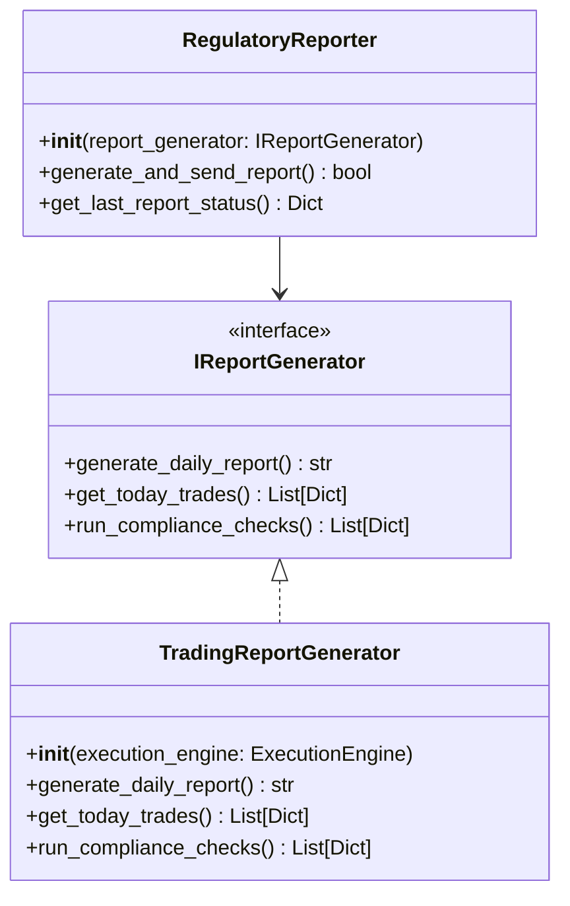

# 合规报告模块架构设计

## 1. 架构概览


## 2. 分层职责

| 层级 | 组件 | 职责 |
|------|------|------|
| 基础设施层 | RegulatoryReporter | 报告生成调度、通知发送 |
| 接口层 | IReportGenerator | 定义报告生成标准接口 |
| 业务层 | TradingReportGenerator | 实现具体交易报告生成逻辑 |

## 3. 关键接口定义

### `IReportGenerator` 接口
```python
class IReportGenerator(ABC):
    @abstractmethod
    def generate_daily_report(self) -> str:
        """生成每日合规报告
        Returns:
            str: 生成的报告文件路径
        """
        
    @abstractmethod 
    def get_today_trades(self) -> List[Dict]:
        """获取当日交易记录
        Returns:
            List[Dict]: 交易记录列表
        """
        
    @abstractmethod
    def run_compliance_checks(self, trades: List[Dict]) -> List[Dict]:
        """执行合规检查
        Args:
            trades: 要检查的交易记录
        Returns:
            List[Dict]: 违规记录列表
        """
```

## 4. 实现要求

1. **TradingReportGenerator** 必须:
   - 实现所有接口方法
   - 保证线程安全
   - 处理所有可能的异常
   - 生成标准格式报告

2. **PDF报告规范**:
   - 使用A4纸张
   - 包含公司logo
   - 标准页眉页脚
   - 机器可读的元数据

## 5. 典型调用流程

```python
sequenceDiagram
    participant App
    participant Reporter
    participant Generator
    participant Engine
    
    App->>Reporter: generate_and_send_report()
    Reporter->>Generator: generate_daily_report()
    Generator->>Engine: get_trades()
    Engine-->>Generator: trades
    Generator->>Generator: run_checks(trades)
    Generator-->>Reporter: report_path
    Reporter->>Reporter: send_notification()
    Reporter-->>App: success
```

## 6. 扩展指南

**添加新的报告生成器**:
1. 实现 `IReportGenerator` 接口
2. 在工厂中注册新实现
3. 通过配置选择实现

```python
class CustomReportGenerator(IReportGenerator):
    def __init__(self, custom_service):
        self.service = custom_service
        
    def generate_daily_report(self) -> str:
        # 自定义实现
        return "/custom/report.pdf"
```
