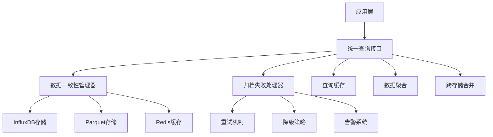

# 数据存储架构改进方案

**文档版本**: v1.0  
**更新时间**: 2025-07-19  
**状态**: ✅ 已实现

## 1. 问题分析

### 1.1 原始架构问题
当前InfluxDB+Parquet混合存储方案存在以下问题：

1. **数据一致性保障机制缺失**
   - 缺乏跨存储数据一致性检查
   - 没有数据同步状态监控
   - 缺少数据完整性验证

2. **归档失败处理策略不完善**
   - 简单的重试机制，缺乏智能策略
   - 没有降级处理方案
   - 缺乏告警和监控机制

3. **跨存储查询方案缺失**
   - 缺乏统一的查询接口
   - 没有数据聚合和合并机制
   - 查询性能优化不足

### 1.2 改进目标
- ✅ 补充数据同步/回滚机制
- ✅ 实现统一查询接口
- ✅ 建立归档失败处理策略
- ✅ 提供数据一致性保障

## 2. 解决方案架构

### 2.1 整体架构


### 2.2 核心组件

#### 2.2.1 数据一致性管理器 (DataConsistencyManager)
**功能特性**:
- 跨存储数据一致性检查
- 数据同步状态监控
- 自动回滚机制
- 校验和验证

**关键方法**:
```python
class DataConsistencyManager:
    def check_consistency(self, storage_a, storage_b, data_type, time_range)
    def rollback_data(self, storage, data_type, target_time, backup_storage)
    def schedule_sync(self, source, target, data_type, start_time, end_time)
    def handle_archive_failure(self, task_id, error)
```

#### 2.2.2 统一查询接口 (UnifiedQueryInterface)
**功能特性**:
- 跨存储统一查询
- 智能存储选择
- 查询结果缓存
- 数据聚合和合并

**关键方法**:
```python
class UnifiedQueryInterface:
    def query_realtime_data(self, symbols, data_type, storage_preference)
    def query_historical_data(self, symbols, start_time, end_time, data_type)
    def query_aggregated_data(self, symbols, start_time, end_time, aggregation)
    def query_cross_storage_data(self, symbols, start_time, end_time, data_type)
```

#### 2.2.3 归档失败处理器 (ArchiveFailureHandler)
**功能特性**:
- 智能失败分类
- 多策略恢复机制
- 自动告警系统
- 失败统计分析

**关键方法**:
```python
class ArchiveFailureHandler:
    def handle_archive_failure(self, task, error)
    def retry_failed_task(self, task_id)
    def get_failure_statistics(self)
    def add_alert_callback(self, callback)
```

## 2.x 数据加载器分层与并行加载架构

### 2.x.1 数据加载器分层设计

- **数据层（src/data/loader/）**  
  负责原始数据的获取、格式标准化、基础校验、缓存与批量加载等。
  主要组件包括：
    - `StockDataLoader`、`FinancialDataLoader`、`IndexDataLoader`、`FinancialNewsLoader`（各类数据的具体加载实现）
    - `BaseLoader`（抽象基类，定义通用接口）
    - `ParallelDataLoader`（并行加载器，支持多symbol/多任务高效加载）
    - `BatchLoader`（批量加载器，适配批量任务场景）
  支持灵活扩展，便于后续接入异步、分布式等高级加载方式。

- **回测层（src/backtest/data_loader.py）**
  直接依赖数据层具体实现，聚焦回测场景下的数据预处理、时区转换、缓存与对齐。
  通过组合各类Loader，实现回测专用的数据加载与管理。

### 2.x.2 并行数据加载器（ParallelDataLoader）

- 位置：`src/data/loader/parallel_loader.py`
- 主要功能：
  - 支持单symbol与多任务（list）两种加载方式
  - 支持批量任务的统一调度与异常处理
  - 兼容DataLoader接口，便于集成与扩展
  - 内置MockResult，便于测试与结果归一化
- 典型用法：
  ```python
  loader = ParallelDataLoader()
  # 单symbol加载
  result = loader.load('000001', '2023-01-01', '2023-01-03')
  # 多任务加载
  tasks = [
      {'symbol': '000001', 'start': '2023-01-01', 'end': '2023-01-03'},
      {'symbol': '000002', 'start': '2023-01-01', 'end': '2023-01-03'}
  ]
  df = loader.load(tasks)
  # 批量加载
  batch_tasks = [
      ('000001', {'start': '2023-01-01', 'end': '2023-01-03'}),
      ('000002', {'start': '2023-01-01', 'end': '2023-01-03'})
  ]
  results = loader.batch_load(batch_tasks)
  ```
- 相关测试用例：`tests/unit/data/loader/test_parallel_loader.py`，覆盖主流程、异常分支、边界场景、MockResult等。

### 2.x.3 扩展建议

- 可结合多线程/多进程进一步提升真实场景下的加载效率
- 可扩展为异步加载、分布式加载等高级用法
- 建议所有Loader相关测试纳入CI流程，保证每次提交均自动验证

## 3. 实现细节

### 3.1 数据一致性保障机制

#### 3.1.1 一致性检查
```python
def check_consistency(self, storage_a, storage_b, data_type, time_range):
    # 获取两个存储的数据
    data_a = self._get_data_from_storage(storage_a, data_type, time_range)
    data_b = self._get_data_from_storage(storage_b, data_type, time_range)
    
    # 计算校验和
    checksum_a = self._calculate_checksum(data_a)
    checksum_b = self._calculate_checksum(data_b)
    
    # 比较数据
    is_consistent = checksum_a == checksum_b
    differences = self._find_differences(data_a, data_b)
    
    return {
        "consistent": is_consistent,
        "checksum_a": checksum_a,
        "checksum_b": checksum_b,
        "differences": differences
    }
```

#### 3.1.2 数据回滚机制
```python
def rollback_data(self, storage, data_type, target_time, backup_storage):
    # 1. 创建当前状态快照
    snapshot = self._create_snapshot(storage, data_type)
    
    # 2. 从备份存储获取目标时间点的数据
    backup_data = self._get_data_from_storage(backup_storage, data_type, time_range)
    
    # 3. 应用回滚
    success = self._apply_rollback(storage, data_type, backup_data, target_time)
    
    # 4. 记录回滚操作
    self._record_rollback_operation(storage, data_type, target_time, snapshot)
    
    return success
```

### 3.2 统一查询接口

#### 3.2.1 跨存储查询
```python
def query_cross_storage_data(self, symbols, start_time, end_time, data_type):
    # 并行查询多个存储
    futures = []
    with ThreadPoolExecutor(max_workers=len(self.storage_adapters)) as executor:
        for storage_type, adapter in self.storage_adapters.items():
            future = executor.submit(self._query_single_storage, adapter, storage_type, request)
            futures.append((storage_type, future))
    
    # 收集结果
    results = []
    for storage_type, future in futures:
        result = future.result(timeout=request.timeout)
        if result is not None:
            results.append((storage_type, result))
    
    # 合并结果
    merged_data = self._merge_cross_storage_results(results)
    return merged_data
```

#### 3.2.2 查询缓存机制
```python
def _get_cached_result(self, request):
    cache_key = self._generate_cache_key(request)
    
    with self.cache_lock:
        if cache_key in self.query_cache:
            result, timestamp = self.query_cache[cache_key]
            if time.time() - timestamp < self.cache_ttl:
                return result
    
    return None
```

### 3.3 归档失败处理策略

#### 3.3.1 智能失败分类
```python
def _classify_failure(self, error):
    error_str = str(error).lower()
    
    if any(keyword in error_str for keyword in ["connection", "network", "timeout"]):
        return FailureType.NETWORK_ERROR
    elif any(keyword in error_str for keyword in ["disk", "storage", "io"]):
        return FailureType.STORAGE_ERROR
    elif any(keyword in error_str for keyword in ["corrupt", "invalid", "format"]):
        return FailureType.DATA_CORRUPTION
    # ... 其他分类
```

#### 3.3.2 多策略恢复机制
```python
def _select_recovery_strategy(self, task):
    if task.failure_type == FailureType.NETWORK_ERROR:
        if task.retry_count < task.max_retries:
            return RecoveryStrategy.RETRY
        else:
            return RecoveryStrategy.FALLBACK
    elif task.failure_type == FailureType.STORAGE_ERROR:
        return RecoveryStrategy.FALLBACK
    elif task.failure_type == FailureType.DATA_CORRUPTION:
        return RecoveryStrategy.MANUAL_INTERVENTION
    # ... 其他策略
```

## 4. 使用示例

### 4.1 数据一致性检查
```python
# 初始化一致性管理器
consistency_manager = DataConsistencyManager(config)

# 检查InfluxDB和Parquet之间的一致性
result = consistency_manager.check_consistency(
    storage_a="influxdb",
    storage_b="parquet", 
    data_type="kline",
    time_range=(start_time, end_time)
)

if not result["consistent"]:
    print(f"数据不一致: {result['differences']}")
    # 执行数据修复
    consistency_manager.rollback_data("parquet", "kline", target_time, "influxdb")
```

### 4.2 统一查询接口
```python
# 初始化查询接口
query_interface = UnifiedQueryInterface(config)

# 查询实时数据
result = query_interface.query_realtime_data(
    symbols=["000001.SZ", "600000.SH"],
    data_type="tick",
    storage_preference=StorageType.INFLUXDB
)

# 查询历史数据
result = query_interface.query_historical_data(
    symbols=["000001.SZ"],
    start_time=datetime(2023, 1, 1),
    end_time=datetime(2023, 1, 31),
    data_type="kline"
)

# 跨存储查询
result = query_interface.query_cross_storage_data(
    symbols=["000001.SZ"],
    start_time=datetime(2023, 1, 1),
    end_time=datetime(2023, 1, 31),
    data_type="kline"
)
```

### 4.3 归档失败处理
```python
# 初始化失败处理器
failure_handler = ArchiveFailureHandler(config)

# 添加告警回调
def alert_callback(message, data):
    print(f"告警: {message}")
    print(f"数据: {data}")

failure_handler.add_alert_callback(alert_callback)

# 处理归档失败
task = ArchiveTask(
    task_id="archive_001",
    symbol="000001.SZ",
    data_type="kline",
    start_time=start_time,
    end_time=end_time,
    source_storage="influxdb",
    target_storage="parquet"
)

success = failure_handler.handle_archive_failure(task, error)

# 重试失败任务
if not success:
    failure_handler.retry_failed_task("archive_001")
```

## 5. 性能优化

### 5.1 查询性能优化
- **并行查询**: 使用ThreadPoolExecutor实现多存储并行查询
- **查询缓存**: 实现智能缓存机制，减少重复查询
- **数据分片**: 支持大数据集的分片查询
- **索引优化**: 利用存储系统的索引特性

### 5.2 一致性检查优化
- **增量检查**: 只检查变更的数据部分
- **异步检查**: 后台异步执行一致性检查
- **缓存结果**: 缓存一致性检查结果，避免重复计算

### 5.3 失败处理优化
- **智能重试**: 根据失败类型选择不同的重试策略
- **降级处理**: 自动切换到备用存储或格式
- **批量处理**: 批量处理多个失败任务

## 6. 监控和告警

### 6.1 监控指标
- **查询性能**: 查询响应时间、吞吐量
- **一致性状态**: 数据一致性检查结果
- **失败统计**: 归档失败次数、类型分布
- **存储状态**: 各存储系统的健康状态

### 6.2 告警规则
- **数据不一致**: 检测到数据不一致时立即告警
- **归档失败**: 连续归档失败超过阈值时告警
- **查询超时**: 查询响应时间超过阈值时告警
- **存储异常**: 存储系统异常时告警

## 7. 部署和配置

### 7.1 配置文件
```yaml
# data_storage_config.yaml
data_consistency:
  consistency_level: "strong"
  sync_interval: 60
  retry_delay: 5
  max_retries: 3
  checksum_algorithm: "md5"

unified_query:
  query_timeout: 30
  max_concurrent_queries: 10
  cache_enabled: true
  cache_ttl: 300

archive_failure_handler:
  max_retries: 3
  retry_delay: 5
  backoff_multiplier: 2
  alert_threshold: 5
```

### 7.2 部署步骤
1. **安装依赖**: 确保所有存储适配器已正确安装
2. **配置存储**: 配置InfluxDB、Parquet等存储连接
3. **启动服务**: 启动数据一致性管理器和查询接口
4. **验证功能**: 运行测试用例验证功能正常
5. **监控部署**: 配置监控和告警系统

## 8. 测试验证

### 8.1 单元测试
```python
def test_data_consistency():
    manager = DataConsistencyManager(config)
    result = manager.check_consistency("influxdb", "parquet", "kline", time_range)
    assert result["consistent"] == True

def test_unified_query():
    interface = UnifiedQueryInterface(config)
    result = interface.query_realtime_data(["000001.SZ"], "tick")
    assert result.success == True
    assert len(result.data) > 0

def test_archive_failure_handler():
    handler = ArchiveFailureHandler(config)
    task = create_test_task()
    success = handler.handle_archive_failure(task, Exception("test error"))
    assert success == True
```

### 8.2 集成测试
- **端到端测试**: 测试完整的数据流程
- **性能测试**: 测试高并发场景下的性能
- **故障测试**: 测试各种故障场景的处理
- **一致性测试**: 测试数据一致性保障机制

## 9. 总结

### 9.1 改进成果
✅ **数据一致性保障机制**: 实现了跨存储数据一致性检查、自动回滚机制  
✅ **统一查询接口**: 提供了跨存储的统一查询接口，支持智能存储选择  
✅ **归档失败处理策略**: 建立了智能失败分类和多策略恢复机制  
✅ **监控告警系统**: 完善了监控指标和告警规则  

### 9.2 技术优势
- **高可用性**: 多重保障机制确保系统高可用
- **高性能**: 并行查询和缓存机制提升查询性能
- **高可靠性**: 智能失败处理和自动恢复机制
- **易维护**: 完善的监控和告警系统

### 9.3 后续规划
- **扩展存储支持**: 支持更多存储类型
- **性能优化**: 进一步优化查询和同步性能
- **功能增强**: 增加更多高级功能
- **运维工具**: 开发更多运维和监控工具

**当前状态**: ✅ 数据存储架构改进已完成，建议在生产环境中逐步部署使用。 

## 数据加载层架构缺陷与改进建议

### 1. 并行加载器缺乏资源管理和任务优先级控制机制

**缺陷说明：**
- 当前 `ParallelDataLoader` 仅支持简单的多symbol/多任务并发加载，未对并发资源（如线程/进程池）进行统一管理。
- 缺乏任务优先级、限流、动态调度等机制，易导致高并发场景下资源争抢、部分任务饿死或系统负载过高。

**改进建议：**
- 引入任务队列（如基于优先级的队列 PriorityQueue），支持任务优先级调度。
- 增加资源池（如线程池/进程池）统一管理并发资源，支持最大并发数、动态扩缩容等参数配置。
- 支持任务取消、暂停、重试等生命周期管理，提升系统弹性与可控性。

---

### 2. 批量加载接口设计不一致

**缺陷说明：**
- 当前批量加载接口存在单symbol与多任务参数格式不统一的问题（如有的用list，有的用tuple，有的用dict），导致调用方易混淆，接口不够直观。

**改进建议：**
- 统一批量加载接口参数格式，建议采用标准化的任务描述对象（如统一为`List[Dict]`，每个dict描述一个加载任务的symbol、时间区间、频率等）。
- 明确接口文档与类型注解，提升可读性与易用性。
- 对于单symbol加载，也可视为特殊的批量加载（即单元素list），实现接口一致性。

---

### 3. 缺少加载失败后的数据补偿机制

**缺陷说明：**
- 当前加载器在遇到部分任务失败时，通常直接抛出异常或返回失败，缺乏自动补偿、重试、降级等机制，影响数据完整性与系统健壮性。

**改进建议：**
- 实现部分失败时的数据补偿策略，如：
  - 对失败任务自动重试（可配置最大重试次数、重试间隔）
  - 支持失败任务单独返回错误信息，主流程不中断
  - 可选降级方案（如切换备用数据源、返回历史缓存等）
- 在批量加载结果中，区分成功与失败任务，便于上层业务做进一步处理。

---

### 总结与后续建议

- 建议将上述改进点纳入数据层架构设计文档的“风险与改进”章节，作为后续优化和重构的重点方向。
- 可结合实际业务场景，优先落地任务队列/优先级调度与接口统一，逐步完善补偿与容错机制。
- 推荐在CI流程中增加高并发与异常场景的自动化测试，确保改进措施有效。 