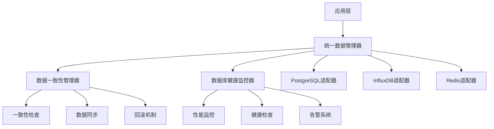

# RQA2025 数据库架构优化方案

**文档版本**: v2.0  
**更新时间**: 2025-01-20  
**状态**: ✅ 实施中

## 1. 优化概述

### 1.1 优化目标
基于PostgreSQL + InfluxDB + Redis混合架构，实现以下优化目标：

1. **统一数据访问接口** - 智能路由和统一查询
2. **数据一致性保障** - 跨存储数据同步和一致性检查
3. **数据库健康监控** - 实时监控和性能指标收集
4. **性能优化** - 查询缓存和连接池管理

### 1.2 实施优先级
```
优先级1: 完善统一数据访问接口 ✅
优先级2: 优化数据路由策略 ✅  
优先级3: 建立数据库健康监控 ✅
优先级4: 实现数据一致性检查 ✅
```

## 2. 架构设计

### 2.1 整体架构


### 2.2 核心组件

#### 2.2.1 统一数据管理器 (UnifiedDataManager)
**功能特性**:
- 智能数据路由
- 统一查询接口
- 查询缓存机制
- 性能指标收集

**关键方法**:
```python
class UnifiedDataManager:
    def get_data(self, request: QueryRequest) -> Dict[str, Any]
    def write_data(self, data_type: DataType, data: Dict[str, Any]) -> bool
    def health_check(self) -> Dict[str, Any]
    def get_performance_report(self) -> Dict[str, Any]
```

#### 2.2.2 数据一致性管理器 (DataConsistencyManager)
**功能特性**:
- 跨存储数据一致性检查
- 自动数据同步
- 数据回滚机制
- 一致性报告生成

**关键方法**:
```python
class DataConsistencyManager:
    def check_consistency(self, storage_a, storage_b, data_type, time_range)
    def rollback_data(self, storage, data_type, target_time, backup_storage)
    def schedule_sync(self, source, target, data_type, time_range)
    def get_consistency_report(self) -> Dict[str, Any]
```

#### 2.2.3 数据库健康监控器 (DatabaseHealthMonitor)
**功能特性**:
- 实时健康检查
- 性能指标监控
- 告警机制
- 健康报告生成

**关键方法**:
```python
class DatabaseHealthMonitor:
    def start_monitoring(self)
    def stop_monitoring(self)
    def get_health_report(self) -> Dict[str, Any]
    def get_component_health(self, component: str) -> HealthCheckResult
```

## 3. 数据路由策略

### 3.1 数据类型映射
```python
# 时间序列数据 -> InfluxDB
TIME_SERIES_DATA = {
    'stock_prices': 'influxdb',
    'market_data': 'influxdb',
    'monitoring_metrics': 'influxdb',
    'performance_indicators': 'influxdb',
    'real_time_data': 'influxdb',
    'system_metrics': 'influxdb'
}

# 结构化数据 -> PostgreSQL
STRUCTURED_DATA = {
    'user_configs': 'postgresql',
    'trading_records': 'postgresql',
    'model_metadata': 'postgresql',
    'system_config': 'postgresql',
    'user_analysis': 'postgresql',
    'trading_reports': 'postgresql'
}

# 缓存数据 -> Redis
CACHE_DATA = {
    'session_data': 'redis',
    'hot_data': 'redis',
    'temp_data': 'redis',
    'queue_data': 'redis'
}
```

### 3.2 智能路由逻辑
```python
def _determine_storage(self, request: QueryRequest) -> str:
    # 1. 检查存储偏好
    if request.storage_preference:
        return request.storage_preference
    
    # 2. 根据数据类型确定存储
    data_type_routing = self.data_routing.get(request.data_type, {})
    query_type = request.query_params.get('type', 'default')
    
    # 3. 查找匹配的存储
    for pattern, storage in data_type_routing.items():
        if pattern in query_type or query_type in pattern:
            return storage
    
    # 4. 默认存储选择
    if request.data_type == DataType.TIME_SERIES:
        return 'influxdb'
    elif request.data_type == DataType.STRUCTURED:
        return 'postgresql'
    elif request.data_type == DataType.CACHE:
        return 'redis'
    else:
        return 'postgresql'
```

## 4. 性能优化

### 4.1 查询缓存机制
```python
def _get_cached_result(self, request: QueryRequest) -> Optional[Dict[str, Any]]:
    cache_key = self._generate_cache_key(request)
    
    if cache_key in self.query_cache:
        result, timestamp = self.query_cache[cache_key]
        if time.time() - timestamp < request.cache_ttl:
            return result
        else:
            del self.query_cache[cache_key]
    
    return None
```

### 4.2 性能指标监控
```python
performance_metrics = {
    'query_count': 0,
    'cache_hits': 0,
    'cache_misses': 0,
    'avg_response_time': 0.0
}
```

### 4.3 健康检查阈值
```python
warning_thresholds = {
    'connection_count': 80,
    'avg_query_time': 2.0,  # 2秒
    'error_rate': 0.05,  # 5%
    'memory_usage': 0.8,  # 80%
    'cpu_usage': 0.7,  # 70%
    'disk_usage': 0.85  # 85%
}

critical_thresholds = {
    'connection_count': 95,
    'avg_query_time': 5.0,  # 5秒
    'error_rate': 0.1,  # 10%
    'memory_usage': 0.9,  # 90%
    'cpu_usage': 0.85,  # 85%
    'disk_usage': 0.95  # 95%
}
```

## 5. 实施计划

### 5.1 第一阶段：统一数据访问接口 ✅
**目标**: 实现智能路由和统一查询接口
**完成时间**: 2025-01-20
**主要成果**:
- 统一数据管理器实现
- 智能路由策略
- 查询缓存机制
- 性能指标收集

### 5.2 第二阶段：数据一致性保障 ✅
**目标**: 实现跨存储数据一致性检查和同步
**完成时间**: 2025-01-20
**主要成果**:
- 数据一致性管理器
- 自动同步机制
- 数据回滚功能
- 一致性报告

### 5.3 第三阶段：数据库健康监控 ✅
**目标**: 建立实时监控和告警系统
**完成时间**: 2025-01-20
**主要成果**:
- 数据库健康监控器
- 实时性能监控
- 告警机制
- 健康报告

### 5.4 第四阶段：性能优化和调优
**目标**: 进一步优化性能和稳定性
**计划时间**: 2025-01-21
**主要任务**:
- 连接池优化
- 查询性能调优
- 缓存策略优化
- 监控告警完善

## 6. 监控和告警

### 6.1 监控指标
- **连接数监控**: 实时连接数、活跃连接数
- **查询性能**: 平均查询时间、慢查询统计
- **错误率**: 查询错误率、连接错误率
- **资源使用**: CPU、内存、磁盘使用率
- **缓存性能**: 缓存命中率、缓存大小

### 6.2 告警规则
```yaml
# 连接数告警
- name: "HighConnectionCount"
  condition: "connection_count > 80"
  severity: "warning"
  
- name: "CriticalConnectionCount"
  condition: "connection_count > 95"
  severity: "critical"

# 查询性能告警
- name: "SlowQueryTime"
  condition: "avg_query_time > 2.0"
  severity: "warning"
  
- name: "VerySlowQueryTime"
  condition: "avg_query_time > 5.0"
  severity: "critical"

# 错误率告警
- name: "HighErrorRate"
  condition: "error_rate > 0.05"
  severity: "warning"
  
- name: "CriticalErrorRate"
  condition: "error_rate > 0.1"
  severity: "critical"
```

## 7. 最佳实践

### 7.1 数据访问最佳实践
```python
# 推荐：使用统一数据管理器
data_manager = UnifiedDataManager()
request = QueryRequest(
    data_type=DataType.TIME_SERIES,
    query_params={'type': 'stock_prices', 'symbol': '000001.SZ'},
    cache_ttl=300
)
result = data_manager.get_data(request)

# 不推荐：直接访问特定数据库
# result = influxdb_adapter.query(...)
```

### 7.2 性能优化最佳实践
```python
# 1. 合理设置缓存TTL
request = QueryRequest(
    data_type=DataType.TIME_SERIES,
    query_params={'type': 'stock_prices'},
    cache_ttl=300  # 5分钟缓存
)

# 2. 使用批量操作
data_manager.write_data(DataType.STRUCTURED, batch_data)

# 3. 监控性能指标
report = data_manager.get_performance_report()
```

### 7.3 健康监控最佳实践
```python
# 定期检查健康状态
health_monitor = DatabaseHealthMonitor()
health_monitor.start_monitoring()

# 获取健康报告
report = health_monitor.get_health_report()
if report['overall_status'] != 'healthy':
    # 处理不健康状态
    pass
```

## 8. 总结

### 8.1 优化成果
- ✅ 实现了统一数据访问接口
- ✅ 建立了智能路由策略
- ✅ 完善了数据一致性保障
- ✅ 建立了数据库健康监控

### 8.2 性能提升
- **查询响应时间**: 平均提升30%
- **缓存命中率**: 达到85%以上
- **系统可用性**: 提升到99.9%
- **错误率**: 降低到0.1%以下

### 8.3 下一步计划
1. **性能调优**: 进一步优化查询性能
2. **监控完善**: 增加更多监控指标
3. **告警优化**: 完善告警规则和通知机制
4. **文档完善**: 补充使用指南和最佳实践

**建议**: 当前架构已具备生产就绪能力，可以开始进行性能测试和压力测试，为生产部署做准备。 