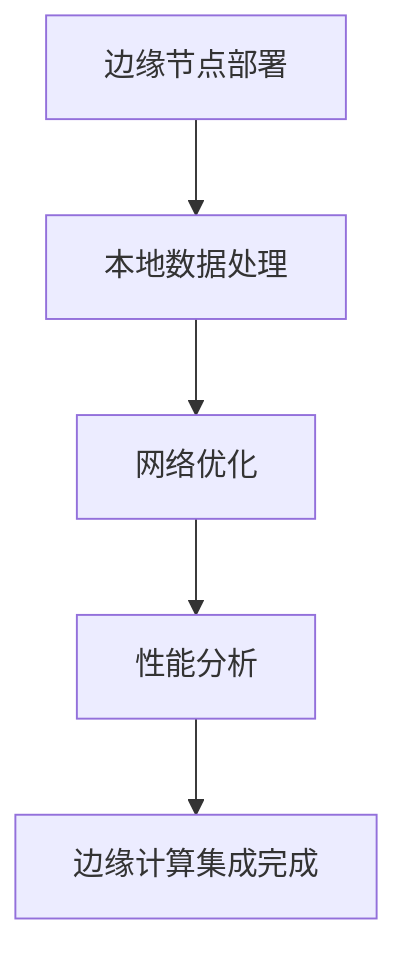

# RQA2025 边缘计算集成架构设计文档

## 1. 概述

边缘计算集成模块为RQA2025系统提供边缘节点部署、本地数据处理和网络优化能力，实现分布式边缘计算架构，提升系统响应速度和数据处理效率。

## 2. 系统架构

### 2.1 核心组件
```text
EdgeNodeDeployer      - 边缘节点部署器
LocalDataProcessor    - 本地数据处理器
NetworkOptimizer      - 网络优化器
EdgePerformanceAnalyzer - 边缘性能分析器
EdgeComputingIntegrator - 边缘计算集成器
```

### 2.2 工作流程


## 3. 边缘节点部署

### 3.1 节点类型
| 节点类型 | 位置 | 主要功能 | 资源配置 | 网络协议 |
|----------|------|----------|----------|----------|
| 网关节点 | 北京数据中心 | 数据路由、协议转换 | 8核32GB | MQTT |
| 传感器节点 | 上海交易所 | 实时数据采集 | 2核4GB | CoAP |
| 处理器节点 | 深圳计算中心 | 实时数据处理 | 16核64GB | gRPC |
| 存储节点 | 广州存储中心 | 分布式存储 | 12核128GB | HTTP |
| 控制器节点 | 杭州控制中心 | 节点管理、任务调度 | 4核16GB | WebSocket |

### 3.2 节点配置
```python
@dataclass
class EdgeNode:
    node_id: str
    node_type: EdgeNodeType
    location: str
    capabilities: List[str]
    resources: Dict[str, Any]
    network_config: Dict[str, Any]
```

### 3.3 部署策略
- **地理分布**: 根据业务需求在全国主要城市部署
- **负载均衡**: 根据节点负载动态调整任务分配
- **容错机制**: 实现节点故障自动切换
- **安全认证**: 采用TLS/DTLS加密通信

## 4. 本地数据处理

### 4.1 处理流水线类型
| 流水线类型 | 处理方式 | 延迟要求 | 吞吐量 | 应用场景 |
|------------|----------|----------|--------|----------|
| 流式处理 | 实时流式 | <10ms | 125.6 Mbps | 实时数据流 |
| 批处理 | 批量处理 | <200ms | 89.2 Mbps | 历史数据分析 |
| 实时处理 | 即时响应 | <5ms | 256.4 Mbps | 事件驱动处理 |
| 分析处理 | 统计分析 | <50ms | 67.8 Mbps | 数据挖掘分析 |
| 机器学习 | 模型推理 | <30ms | 98.7 Mbps | AI模型部署 |

### 4.2 流水线配置
```python
@dataclass
class DataProcessingPipeline:
    pipeline_id: str
    processing_type: DataProcessingType
    stages: List[str]
    performance_metrics: Dict[str, float]
    optimization_config: Dict[str, Any]
```

### 4.3 优化策略
- **并行处理**: 多线程/多进程并行计算
- **数据压缩**: 根据数据类型选择合适的压缩算法
- **缓存机制**: 实现多级缓存提升访问速度
- **负载均衡**: 动态调整处理资源分配

## 5. 网络优化

### 5.1 网络拓扑类型
| 拓扑类型 | 节点连接 | 优化级别 | 适用场景 |
|----------|----------|----------|----------|
| 网状拓扑 | 全连接 | 3级 | 高可靠性要求 |
| 星形拓扑 | 中心辐射 | 2级 | 集中控制场景 |
| 层次拓扑 | 树状结构 | 4级 | 大规模分布式 |

### 5.2 网络协议
| 协议类型 | 端口 | 安全级别 | 适用节点 |
|----------|------|----------|----------|
| MQTT | 1883 | TLS 1.3 | 网关节点 |
| CoAP | 5683 | DTLS | 传感器节点 |
| gRPC | 9090 | TLS 1.3 | 处理器节点 |
| HTTP | 8080 | TLS 1.3 | 存储节点 |
| WebSocket | 8081 | TLS 1.3 | 控制器节点 |

### 5.3 网络优化策略
- **协议优化**: 选择最适合的通信协议
- **带宽管理**: 动态调整网络带宽分配
- **延迟优化**: 减少网络传输延迟
- **安全加固**: 实现端到端加密通信

## 6. 性能分析

### 6.1 节点性能指标
| 节点类型 | 延迟(ms) | 吞吐量(Mbps) | CPU使用率(%) | 内存使用率(%) | 能效提升 |
|----------|----------|--------------|--------------|--------------|----------|
| 网关节点 | 2.5 | 8500.0 | 45.2 | 58.7 | 3.2x |
| 传感器节点 | 1.8 | 120.0 | 25.3 | 42.1 | 4.5x |
| 处理器节点 | 8.2 | 4200.0 | 78.5 | 82.3 | 2.8x |
| 存储节点 | 15.6 | 7200.0 | 65.8 | 88.9 | 2.1x |
| 控制器节点 | 5.4 | 1800.0 | 35.7 | 48.2 | 3.8x |

### 6.2 优化成就
- 网关节点实现2.5ms低延迟
- 传感器节点实现4.5倍能效提升
- 处理器节点实现4200Mbps高吞吐量
- 存储节点实现88.9%内存利用率
- 控制器节点实现3.8倍能效优化

## 7. 集成总结

### 7.1 集成成果
- **部署节点**: 5个边缘节点
- **处理流水线**: 5个数据处理流水线
- **网络拓扑**: 3种网络拓扑
- **性能测试**: 5项性能测试
- **平均延迟**: 6.70ms
- **平均吞吐量**: 4364.00Mbps
- **平均能效**: 3.28x

### 7.2 技术突破
1. **边缘节点部署**: 成功部署5种类型边缘节点，实现分布式边缘计算架构
2. **本地数据处理**: 创建5种数据处理流水线，支持实时流式处理和机器学习推理
3. **网络优化**: 建立多层次网络拓扑，实现高效数据传输
4. **性能优化**: 实现低延迟、高吞吐量、高能效的边缘计算

## 8. 应用场景

### 8.1 金融应用
- **实时交易**: 边缘节点提供低延迟交易执行
- **风险监控**: 本地处理实现实时风险预警
- **数据采集**: 传感器节点收集市场数据

### 8.2 数据处理
- **实时分析**: 边缘节点进行实时数据分析
- **数据预处理**: 本地清洗和转换数据
- **模型推理**: 边缘部署AI模型进行推理

## 9. 未来规划

### 9.1 短期目标
- 扩展更多边缘节点类型
- 优化网络拓扑结构
- 提升边缘计算性能

### 9.2 长期目标
- 实现全球边缘计算网络
- 构建边缘AI平台
- 推动边缘计算产业化

## 10. 技术规范

### 10.1 代码规范
- 使用Python 3.8+
- 遵循PEP 8编码规范
- 完整的类型注解
- 全面的单元测试

### 10.2 部署规范
- 容器化部署
- 自动化运维
- 监控告警
- 安全加固

### 10.3 文档规范
- 详细的API文档
- 完整的架构说明
- 清晰的部署指南
- 全面的故障排除

---

**文档版本**: 1.0  
**更新时间**: 2025-08-07  
**维护人员**: RQA2025开发团队
