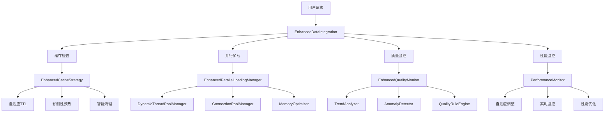
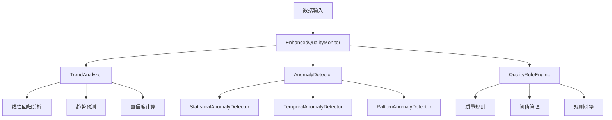
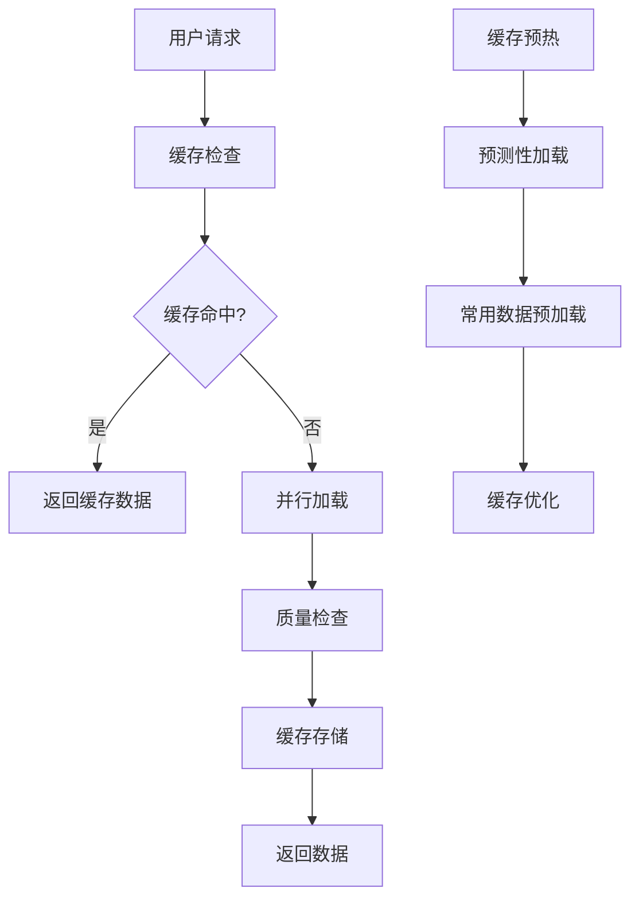
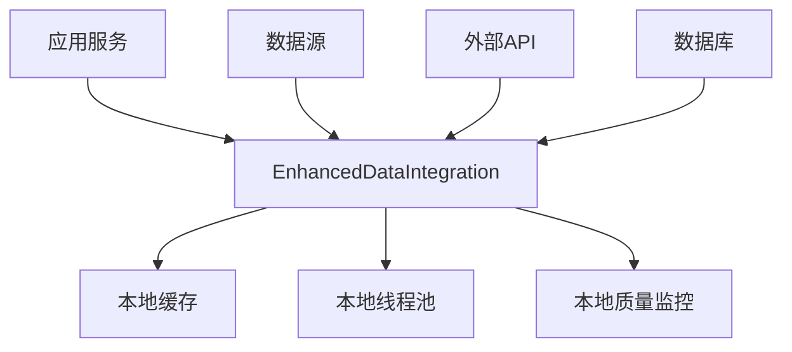
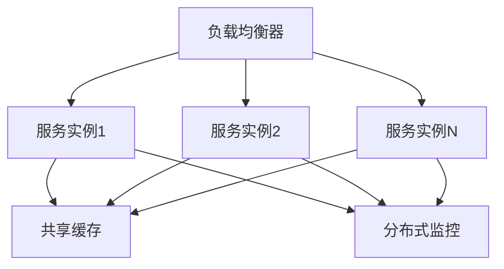

# 增强版数据层集成架构设计

## 1. 概述

增强版数据层集成模块是一个高性能、高可靠性的数据加载和集成系统，支持股票、指数、财务等多种数据类型的并行加载、缓存优化和质量监控。

## 2. 架构设计

### 2.1 整体架构



### 2.2 核心组件

#### 2.2.1 EnhancedDataIntegration
**主要功能**:
- 统一的数据加载接口
- 集成缓存、并行加载、质量监控
- 性能监控和自适应调整
- 缓存预热和预测性加载

**关键方法**:
```python
def load_stock_data(symbols, start_date, end_date, frequency, priority, enable_cache, enable_quality_check)
def load_index_data(indices, start_date, end_date, frequency, enable_cache, enable_quality_check)
def load_financial_data(symbols, start_date, end_date, data_type, enable_cache, enable_quality_check)
def get_integration_stats()
def shutdown()
```

#### 2.2.2 DynamicThreadPoolManager
**主要功能**:
- 动态线程池大小调整
- 基于负载的自适应优化
- 线程利用率监控
- 性能指标收集

**关键特性**:
- 初始线程数: 12
- 最大线程数: 24
- 最小线程数: 4
- 自适应调整间隔: 30秒

#### 2.2.3 ConnectionPoolManager
**主要功能**:
- 连接池管理
- 连接复用
- 连接超时处理
- 连接健康检查

**配置参数**:
- 最大连接数: 50
- 连接超时: 30秒
- 连接池大小: 动态调整

#### 2.2.4 MemoryOptimizer
**主要功能**:
- 数据压缩
- 内存使用监控
- 内存优化策略
- 缓存数据压缩

**压缩特性**:
- 启用数据压缩: True
- 压缩级别: 6
- 压缩算法: LZ4

#### 2.2.5 FinancialDataOptimizer
**主要功能**:
- 财务数据专门优化
- 并行加载优化
- 批处理优化
- 智能缓存策略

**优化策略**:
- 并行加载: True
- 批处理: True
- 数据压缩: True
- 智能缓存: True

## 3. 质量监控架构

### 3.1 质量监控组件



### 3.2 质量指标

#### 3.2.1 多维度质量检查
1. **完整性 (Completeness)**
   - 空值比例检查
   - 必要字段存在性检查
   - 数据完整性验证

2. **准确性 (Accuracy)**
   - 价格数据准确性检查
   - 成交量数据验证
   - 日期格式验证

3. **一致性 (Consistency)**
   - 数据类型一致性
   - 时间序列一致性
   - 数据范围一致性

4. **时效性 (Timeliness)**
   - 数据新鲜度检查
   - 时间延迟监控
   - 实时性评估

5. **有效性 (Validity)**
   - 数据格式有效性
   - 数值范围有效性
   - 业务规则验证

6. **唯一性 (Uniqueness)**
   - 重复数据检测
   - 数据去重验证
   - 唯一性检查

#### 3.2.2 趋势分析
- **线性回归分析**: 计算质量指标趋势
- **趋势强度**: 评估趋势变化强度
- **趋势方向**: 改善、下降、稳定
- **预测功能**: 预测未来质量指标
- **置信度**: 评估预测可靠性

#### 3.2.3 异常检测
- **统计异常检测**: 基于统计方法的异常检测
- **时间异常检测**: 基于时间模式的异常检测
- **模式异常检测**: 基于数据模式的异常检测

## 4. 缓存策略架构

### 4.1 缓存层次



### 4.2 缓存特性

#### 4.2.1 自适应TTL
- **基于访问频率**: 频繁访问的数据TTL更长
- **基于数据重要性**: 重要数据TTL更长
- **基于数据大小**: 大数据TTL更短
- **动态调整**: 根据性能指标动态调整

#### 4.2.2 预测性预热
- **常用数据识别**: 识别常用股票和指数
- **预加载策略**: 提前加载常用数据
- **预热进度监控**: 实时监控预热进度
- **智能预热**: 基于访问模式预测

#### 4.2.3 智能清理
- **过期数据清理**: 自动清理过期数据
- **内存压力清理**: 内存不足时主动清理
- **LRU策略**: 最近最少使用淘汰
- **压缩清理**: 压缩数据减少内存占用

## 5. 性能监控架构

### 5.1 监控指标

#### 5.1.1 性能指标
- **响应时间**: 平均响应时间、最大响应时间
- **吞吐量**: 请求处理速率
- **缓存命中率**: 缓存命中比例
- **错误率**: 请求错误比例
- **并发数**: 当前并发请求数

#### 5.1.2 资源指标
- **内存使用率**: 系统内存使用情况
- **CPU使用率**: CPU使用情况
- **线程利用率**: 线程池使用情况
- **连接池使用率**: 数据库连接使用情况

#### 5.1.3 质量指标
- **整体质量分数**: 综合质量评分
- **各维度质量**: 完整性、准确性等
- **质量趋势**: 质量变化趋势
- **异常数量**: 检测到的异常数量

### 5.2 自适应调整

#### 5.2.1 缓存策略调整
- **命中率低**: 增加缓存大小
- **内存压力大**: 减少缓存大小
- **响应时间长**: 优化TTL策略
- **质量下降**: 调整质量阈值

#### 5.2.2 线程池调整
- **响应时间长**: 增加线程数
- **CPU使用率高**: 减少线程数
- **内存压力大**: 优化线程策略
- **负载变化**: 动态调整线程数

#### 5.2.3 质量监控调整
- **质量下降**: 调整质量阈值
- **异常增多**: 优化异常检测
- **趋势变化**: 调整趋势分析参数
- **告警频繁**: 优化告警策略

## 6. 配置管理

### 6.1 集成配置

```python
@dataclass
class IntegrationConfig:
    # 并行加载配置
    parallel_loading: Dict[str, Any] = {
        'max_workers': 12,
        'enable_auto_scaling': True,
        'batch_size': 20,
        'max_queue_size': 2000,
        'enable_dynamic_threading': True,
        'thread_pool_strategy': 'adaptive'
    }
    
    # 缓存策略配置
    cache_strategy: Dict[str, Any] = {
        'strategy': 'adaptive',
        'max_size': 200 * 1024 * 1024,  # 200MB
        'max_items': 20000,
        'enable_preload': True,
        'enable_adaptive_ttl': True,
        'enable_cache_warming': True,
        'preload_strategy': 'predictive'
    }
    
    # 质量监控配置
    quality_monitor: Dict[str, Any] = {
        'enable_alerting': True,
        'enable_trend_analysis': True,
        'enable_advanced_metrics': True,
        'enable_anomaly_detection': True,
        'quality_threshold': 0.95
    }
    
    # 性能优化配置
    performance_optimization: Dict[str, Any] = {
        'enable_financial_optimization': True,
        'enable_parallel_optimization': True,
        'enable_memory_optimization': True,
        'enable_connection_pooling': True,
        'max_connection_pool_size': 50,
        'connection_timeout': 30,
        'enable_data_compression': True,
        'compression_level': 6
    }
```

### 6.2 自适应配置

```python
# 自适应缓存配置
_adaptive_cache_config = {
    'hit_rate_threshold': 0.8,
    'memory_threshold': 0.85,
    'response_time_threshold': 1000,  # ms
    'quality_threshold': 0.95
}

# 缓存预热状态
_cache_warming_status = {
    'is_warming': False,
    'warmed_items': 0,
    'total_items': 0,
    'warming_progress': 0.0
}
```

## 7. 部署架构

### 7.1 单机部署



### 7.2 分布式部署 (规划中)



## 8. 监控和告警

### 8.1 监控指标

#### 8.1.1 业务指标
- **数据加载成功率**: 数据加载成功比例
- **缓存命中率**: 缓存命中比例
- **质量分数**: 数据质量评分
- **响应时间**: 请求响应时间

#### 8.1.2 技术指标
- **内存使用率**: 系统内存使用情况
- **CPU使用率**: CPU使用情况
- **线程池使用率**: 线程池使用情况
- **连接池使用率**: 连接池使用情况

### 8.2 告警机制

#### 8.2.1 质量告警
- **质量分数过低**: 质量分数低于阈值
- **异常检测**: 检测到数据异常
- **趋势恶化**: 质量趋势持续下降

#### 8.2.2 性能告警
- **响应时间过长**: 响应时间超过阈值
- **缓存命中率低**: 缓存命中率过低
- **内存使用率过高**: 内存使用率过高

#### 8.2.3 系统告警
- **服务不可用**: 服务无法响应
- **连接失败**: 数据源连接失败
- **线程池满**: 线程池无法处理新请求

## 9. 最佳实践

### 9.1 性能优化

1. **合理配置线程池大小**
   - 根据CPU核心数设置
   - 监控线程利用率
   - 动态调整线程数

2. **优化缓存策略**
   - 设置合适的缓存大小
   - 启用预测性预热
   - 监控缓存命中率

3. **数据质量监控**
   - 设置合理的质量阈值
   - 定期检查质量趋势
   - 及时处理质量异常

### 9.2 可靠性保障

1. **错误处理**
   - 完善的异常处理机制
   - 优雅的降级策略
   - 详细的错误日志

2. **监控告警**
   - 实时性能监控
   - 及时告警通知
   - 自动恢复机制

3. **数据备份**
   - 重要数据备份
   - 缓存数据持久化
   - 配置数据备份

### 9.3 扩展性设计

1. **模块化设计**
   - 清晰的模块边界
   - 松耦合的组件设计
   - 可插拔的功能模块

2. **配置驱动**
   - 灵活的配置管理
   - 运行时配置调整
   - 环境适配配置

3. **接口标准化**
   - 统一的接口规范
   - 版本兼容性
   - 向后兼容设计

## 10. 总结

增强版数据层集成模块采用了现代化的架构设计，具备高性能、高可靠性、高可扩展性的特点。通过动态线程池管理、自适应缓存策略、多维度质量监控等企业级特性，为数据加载和处理提供了强大的支持。

系统的主要优势包括：

1. **高性能**: 并行加载、智能缓存、动态优化
2. **高可靠性**: 完善的错误处理、质量监控、自动恢复
3. **高可扩展性**: 模块化设计、配置驱动、接口标准化
4. **智能化**: 自适应调整、预测性缓存、趋势分析

该架构为后续的功能扩展和优化奠定了坚实的基础，能够满足企业级数据集成的高要求。 