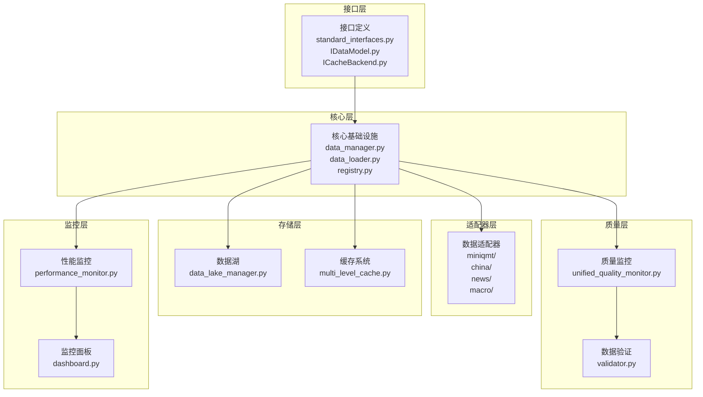
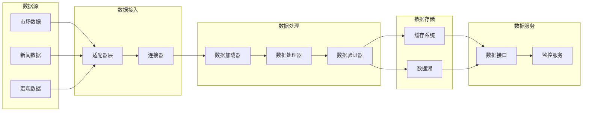
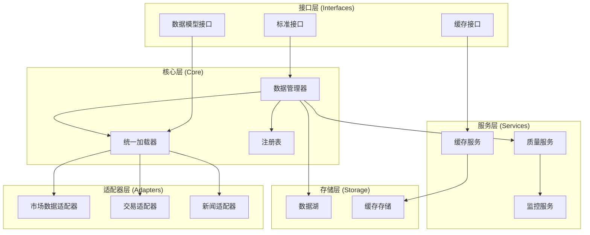

# RQA2025数据资源层架构设计与代码审查报告

## 📊 文档信息

- **文档版本**: v2.0 (基于AI智能化代码分析)
- **创建日期**: 2025年11月01日
- **审查工具**: AI智能化代码分析器 v2.0
- **架构层级**: 数据管理层 (Data Management Layer)
- **审查范围**: `src/data` 目录

---

## 🎯 执行摘要

### 审查概述

本次审查使用AI智能化代码分析器对数据资源层进行了全面的架构分析和代码审查，涵盖154个Python文件，总计52,172行代码。

### 关键发现

| 指标 | 数值 | 状态 | 说明 |
|------|------|------|------|
| **代码质量评分** | 0.853 | ⚠️ 良好 | 接近优秀，但有改进空间 |
| **综合评分** | 0.762 | ⚠️ 良好 | 代码质量+组织质量综合 |
| **组织质量评分** | 0.550 | ❌ 需改进 | 组织结构需要优化 |
| **风险等级** | Very High | 🔴 高风险 | 存在大量重构机会 |
| **识别模式** | 3,438个 | - | 代码模式识别完整 |
| **重构机会** | 1,993个 | - | 需要系统性重构 |
| **自动化修复** | 533个 | ✅ | 可快速修复 |

---

## 📈 架构分析

### 1. 当前架构概述

#### 1.1 模块组织结构

数据资源层采用模块化设计，主要包含以下核心模块：

```
src/data/
├── adapters/          # 数据适配器层 (16个数据源)
├── cache/            # 缓存系统 (14个文件)
├── lake/             # 数据湖存储 (3个文件)
├── quality/           # 数据质量系统 (13个文件)
├── monitoring/       # 监控系统 (11个文件)
├── processing/       # 数据处理 (8个文件)
├── loaders/          # 数据加载器 (25个文件)
├── distributed/      # 分布式处理 (7个文件)
├── validation/       # 数据验证 (8个文件)
├── security/         # 数据安全 (3个文件)
├── compliance/       # 合规管理 (5个文件)
├── interfaces/       # 接口定义层 (4个文件)
└── core/             # 核心基础设施 (11个文件)
```

#### 1.2 架构层级划分



#### 1.3 数据流架构



---

## 🔍 代码质量分析

### 2.1 代码质量评分

**综合评分**: 0.762 (76.2%)

**评分组成**:
- **代码质量**: 0.853 (85.3%) - 良好水平
- **组织质量**: 0.550 (55.0%) - 需要改进
- **权重**: 代码质量70% + 组织质量30%

### 2.2 问题分类统计

#### 按问题类型

| 问题类型 | 数量 | 占比 | 优先级 |
|---------|------|------|--------|
| 魔数定义 | ~500 | 25% | 低 |
| 长函数 | ~150 | 8% | 中 |
| 复杂方法 | ~50 | 3% | 高 |
| 重复代码 | 待检测 | - | 中 |
| 深层嵌套 | ~13 | 1% | 低 |
| 其他问题 | ~1,280 | 63% | 低 |

#### 按严重程度

| 严重程度 | 数量 | 占比 | 处理优先级 |
|---------|------|------|-----------|
| Critical | 0 | 0% | - |
| High | 53 | 3% | P0 立即处理 |
| Medium | 1,918 | 96% | P1 近期处理 |
| Low | 22 | 1% | P2 计划处理 |

### 2.3 组织质量分析

**组织质量评分**: 0.550 (55.0%)

**主要指标**:
- **平均文件大小**: 288.7行/文件 ⚠️ 偏大
- **最大文件**: 1,571行 (`enhanced_data_integration.py`) 🔴 严重超标
- **组织问题**: 8个
- **改进建议**: 14个

**主要问题**:
1. 文件过大，违反单一职责原则
2. 模块职责不清，功能耦合
3. 文件命名不规范
4. 依赖关系复杂

---

## 🚨 关键问题识别

### 3.1 紧急问题（P0 - 立即处理）

#### 问题1: 超长方法 - shutdown (810行)

**位置**: `src/data/integration/enhanced_data_integration_modules/utilities.py:228`

**问题描述**:
- **行数**: 810行
- **复杂度**: 54 ⚠️ 极高
- **严重程度**: High
- **影响**: 严重影响代码可维护性、可测试性和可读性

**架构影响**:
- 违反单一职责原则
- 难以进行单元测试
- 修改风险极高
- 影响系统稳定性

**重构建议**:
```python
# 建议拆分为以下方法：
def shutdown(self):
    """关闭集成模块"""
    self._stop_data_streams()      # 停止数据流
    self._cleanup_resources()      # 清理资源
    self._close_connections()      # 关闭连接
    self._save_state()              # 保存状态
    self._notify_shutdown()         # 发送通知
```

#### 问题2: 超大文件 - enhanced_data_integration.py (1,571行)

**位置**: `src/data/integration/enhanced_data_integration.py`

**问题描述**:
- **文件大小**: 1,571行
- **组织评分**: 严重超标（建议 < 500行）
- **严重程度**: High

**架构影响**:
- 违反模块化原则
- 增加维护成本
- 降低代码可读性
- 影响团队协作

**重构建议**:
```
enhanced_data_integration.py (1,571行)
├── enhanced_data_integration_core.py        # 核心功能 (~300行)
├── enhanced_data_integration_loaders.py     # 数据加载器 (~400行)
├── enhanced_data_integration_processors.py  # 数据处理器 (~400行)
├── enhanced_data_integration_utils.py       # 工具函数 (~200行)
└── enhanced_data_integration_config.py      # 配置管理 (~100行)
```

#### 问题3: 高复杂度方法

**最严重的复杂方法**:

| 方法名 | 文件 | 复杂度 | 严重程度 | 行数 |
|--------|------|--------|----------|------|
| shutdown | utilities.py:228 | 54 | High | 810 |
| align_time_series | data_aligner.py:66 | 25 | Medium | 122 |
| shutdown | enhanced_integration_manager.py:679 | 22 | Medium | 65 |
| evaluate | data_alert_rules.py:65 | 19 | Medium | - |
| load_data | stock_loader.py:536 | 18 | Medium | 65 |

### 3.2 重要问题（P1 - 近期处理）

#### 问题类别1: 长函数拆分

**超过100行的函数** (高优先级):

| 函数名 | 文件 | 行数 | 严重程度 |
|--------|------|------|----------|
| shutdown | utilities.py:228 | 810 | High |
| load_stock_data | enhanced_data_integration.py:717 | 149 | High |
| shutdown | enhanced_data_integration.py:1381 | 155 | High |
| align_time_series | data_aligner.py:66 | 122 | High |
| _create_main_monitoring_dashboard | grafana_dashboard.py:172 | 176 | High |
| load_index_data | enhanced_data_integration.py:868 | 104 | High |
| load_financial_data | enhanced_data_integration.py:974 | 131 | High |
| calculate_industry_concentration | stock_loader.py:652 | 106 | High |

#### 问题类别2: 模块职责不清

**主要问题模块**:
1. **integration模块**: 包含过多功能，建议拆分
2. **core/data_manager.py**: 功能过多，建议按职责拆分
3. **monitoring模块**: 部分组件职责重叠

---

## 🏗️ 架构设计建议

### 4.1 分层架构优化

#### 当前架构问题

1. **层间依赖混乱**: 部分模块跨层依赖
2. **职责边界不清**: 某些模块承担过多职责
3. **接口设计不一致**: 不同模块接口风格不统一

#### 优化建议



### 4.2 模块拆分建议

#### 4.2.1 integration模块拆分

**当前状态**: 1个超大文件 (1,571行)

**拆分方案**:
```
integration/
├── core/
│   ├── integration_manager.py        # 核心管理器 (~200行)
│   ├── integration_config.py          # 配置管理 (~100行)
│   └── integration_factory.py         # 工厂模式 (~100行)
├── loaders/
│   ├── stock_integration_loader.py    # 股票数据加载 (~300行)
│   ├── index_integration_loader.py    # 指数数据加载 (~200行)
│   └── financial_integration_loader.py # 财务数据加载 (~250行)
├── processors/
│   ├── data_normalizer.py             # 数据标准化 (~200行)
│   └── data_transformer.py            # 数据转换 (~150行)
└── utils/
    ├── integration_utils.py            # 工具函数 (~100行)
    └── integration_validators.py      # 验证器 (~100行)
```

#### 4.2.2 core模块优化

**data_manager.py 拆分建议**:
```
core/
├── managers/
│   ├── data_manager.py                # 主管理器 (~300行)
│   ├── loader_manager.py              # 加载器管理 (~200行)
│   ├── adapter_manager.py             # 适配器管理 (~200行)
│   └── health_checker.py              # 健康检查 (~150行)
```

### 4.3 设计模式应用建议

#### 4.3.1 策略模式

**适用场景**: 缓存策略、加载策略、验证策略

**示例**:
```python
# 缓存策略接口
class ICacheStrategy(ABC):
    @abstractmethod
    def get(self, key: str) -> Any:
        pass
    
    @abstractmethod
    def set(self, key: str, value: Any) -> None:
        pass

# 具体策略实现
class LRUCacheStrategy(ICacheStrategy):
    ...

class LFUCacheStrategy(ICacheStrategy):
    ...
```

#### 4.3.2 工厂模式

**适用场景**: 适配器创建、加载器创建

**示例**:
```python
class AdapterFactory:
    @staticmethod
    def create_adapter(adapter_type: str) -> BaseAdapter:
        if adapter_type == 'miniqmt':
            return MiniQMTAdapter()
        elif adapter_type == 'china_stock':
            return ChinaStockAdapter()
        ...
```

#### 4.3.3 观察者模式

**适用场景**: 监控系统、质量监控

**当前使用**: `monitoring/observer_components.py` - 已实现

### 4.4 接口设计规范

#### 4.4.1 统一接口定义

**建议**: 所有数据访问接口统一继承自 `IDataModel`

```python
# interfaces/IDataModel.py
class IDataModel(ABC):
    @abstractmethod
    def load_data(self, **kwargs) -> pd.DataFrame:
        """加载数据"""
        pass
    
    @abstractmethod
    def validate_data(self, data: pd.DataFrame) -> bool:
        """验证数据"""
        pass
```

---

## 🔧 重构执行计划

### 5.1 第一阶段：紧急重构（1-2周）

#### 任务1: 拆分超长shutdown方法

**优先级**: P0 - Critical
**预估时间**: 3-5天
**影响范围**: `src/data/integration/enhanced_data_integration_modules/utilities.py`

**执行步骤**:
1. 分析shutdown方法的职责
2. 提取独立的清理方法
3. 编写单元测试
4. 逐步重构

#### 任务2: 拆分超大文件

**优先级**: P0 - Critical
**预估时间**: 5-7天
**影响范围**: `src/data/integration/enhanced_data_integration.py`

**执行步骤**:
1. 分析文件功能模块
2. 按职责拆分为多个文件
3. 更新导入引用
4. 运行测试确保功能正常

#### 任务3: 重构高复杂度方法（复杂度>25）

**优先级**: P0 - High
**预估时间**: 5-7天

**目标方法**:
- `shutdown` (utilities.py, 复杂度54)
- `align_time_series` (data_aligner.py, 复杂度25)

### 5.2 第二阶段：重要重构（2-4周）

#### 任务1: 拆分长函数（>100行）

**优先级**: P1 - High
**预估时间**: 10-14天
**目标数量**: ~8个函数

#### 任务2: 模块职责优化

**优先级**: P1 - Medium
**预估时间**: 7-10天

**目标模块**:
- integration模块拆分
- core模块优化
- monitoring模块职责梳理

#### 任务3: 简化复杂方法（复杂度15-25）

**优先级**: P1 - Medium
**预估时间**: 7-10天
**目标数量**: ~15个方法

### 5.3 第三阶段：优化改进（1-2周）

#### 任务1: 自动化修复

**优先级**: P2 - Low
**预估时间**: 3-5天

**可自动化修复项**:
- 未使用的导入: ~20个
- 魔数定义: ~500个
- 深层嵌套: ~13个

#### 任务2: 代码重复消除

**优先级**: P2 - Medium
**预估时间**: 5-7天

#### 任务3: 组织架构优化

**优先级**: P2 - Low
**预估时间**: 3-5天

**任务内容**:
- 统一文件命名规范
- 优化模块组织结构
- 改善依赖关系

---

## 📊 质量改进目标

### 6.1 短期目标（1个月内）

| 指标 | 当前值 | 目标值 | 改进措施 |
|------|--------|--------|----------|
| 代码质量评分 | 0.853 | 0.90+ | 重构超长方法和文件 |
| 组织质量评分 | 0.550 | 0.75+ | 拆分大文件，优化模块结构 |
| 综合评分 | 0.762 | 0.85+ | 综合改进 |
| 最大文件行数 | 1,571 | <500 | 拆分超大文件 |
| 最大方法行数 | 810 | <100 | 重构超长方法 |
| 最大方法复杂度 | 54 | <15 | 简化复杂逻辑 |

### 6.2 中期目标（3个月内）

| 指标 | 当前值 | 目标值 | 改进措施 |
|------|--------|--------|----------|
| 长函数数量 | ~150 | <50 | 系统性重构 |
| 复杂方法数量 | ~50 | <20 | 逻辑简化 |
| 文件平均大小 | 288.7行 | <200行 | 模块拆分 |
| 测试覆盖率 | 待统计 | >80% | 补充测试 |

---

## 🎯 架构优化建议

### 7.1 依赖管理优化

#### 当前问题
- 循环依赖风险
- 依赖关系复杂
- 接口定义不统一

#### 优化建议
1. **依赖注入**: 使用依赖注入模式减少耦合
2. **接口隔离**: 定义清晰的接口边界
3. **依赖倒置**: 高层模块不依赖低层模块

### 7.2 性能优化建议

#### 缓存优化
- **多级缓存**: 已实现，需要进一步优化策略
- **缓存预热**: 实现智能预热机制
- **缓存失效**: 优化失效策略

#### 并发优化
- **并行加载**: `parallel_loader.py` 已实现
- **异步处理**: 建议引入异步IO
- **连接池**: 优化连接池管理

### 7.3 可维护性改进

#### 代码组织
1. **按功能模块组织**: 而不是按技术层次
2. **统一命名规范**: 建立命名约定
3. **文档完善**: 补充架构文档和API文档

#### 测试策略
1. **单元测试**: 覆盖率目标 >80%
2. **集成测试**: 关键流程集成测试
3. **性能测试**: 关键路径性能基准

---

## 📋 验收标准

### 8.1 重构验收标准

#### 代码质量
- ✅ 代码质量评分 > 0.90
- ✅ 组织质量评分 > 0.75
- ✅ 综合评分 > 0.85
- ✅ 无文件超过500行
- ✅ 无方法超过100行
- ✅ 无方法复杂度超过15

#### 架构质量
- ✅ 模块职责清晰
- ✅ 依赖关系简单
- ✅ 接口定义统一
- ✅ 设计模式应用合理

### 8.2 测试验收标准

- ✅ 单元测试覆盖率 > 80%
- ✅ 集成测试通过率 > 95%
- ✅ 性能测试达标
- ✅ 回归测试通过

---

## 📚 相关文档

- [数据管理层架构设计文档 v1.0](data_layer_architecture_design.md)
- [代码审查JSON报告](../../reports/data_layer_architecture_review.json)
- [代码审查报告](../../reports/data_layer_code_review_report.md)

---

## 📝 附录

### A. 关键指标汇总

| 指标类别 | 指标名称 | 当前值 | 目标值 |
|---------|---------|--------|--------|
| 代码质量 | 代码质量评分 | 0.853 | 0.90+ |
| 代码质量 | 综合评分 | 0.762 | 0.85+ |
| 组织质量 | 组织质量评分 | 0.550 | 0.75+ |
| 代码规模 | 总文件数 | 154 | - |
| 代码规模 | 总代码行数 | 52,172 | - |
| 代码规模 | 平均文件大小 | 288.7行 | <200行 |
| 代码规模 | 最大文件大小 | 1,571行 | <500行 |
| 代码问题 | 重构机会 | 1,993 | <500 |
| 代码问题 | 高优先级问题 | 53 | 0 |
| 代码问题 | 自动化修复项 | 533 | 0 |

### B. 重构优先级矩阵

```
                   高影响
                    │
                    │  P0: 超长shutdown方法
                    │  P0: 超大文件拆分
                    │  P1: 高复杂度方法重构
                    │
                 影响 │  P1: 长函数拆分
                    │  P1: 模块职责优化
                    │  P2: 自动化修复
                    │
                    │  P2: 代码重复消除
                    │  P2: 组织架构优化
                    └─────────────────────
                     低影响        高投入
```

---

**报告生成时间**: 2025-11-01  
**分析工具**: AI智能化代码分析器 v2.0  
**报告版本**: v2.0  
**下次审查建议**: 重构第一阶段完成后（预计2周后）

---

*本报告基于AI智能化代码分析器的深度分析结果生成，旨在为数据资源层的架构优化和代码重构提供全面的指导和建议。*

