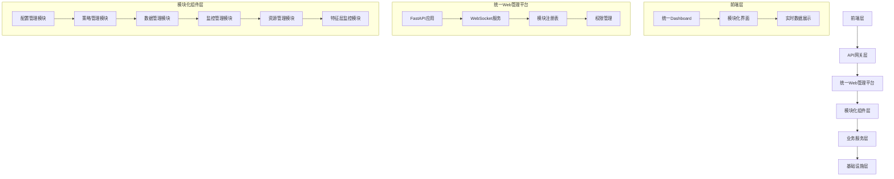

# RQA2025 统一Web管理界面架构设计

## 1. 设计目标

### 1.1 核心目标
- **统一入口**: 整合所有分散的Web管理界面，提供单一访问入口
- **现代化设计**: 采用响应式设计，支持多设备访问
- **模块化架构**: 支持动态注册和管理功能模块
- **实时更新**: 通过WebSocket实现实时数据推送
- **权限控制**: 统一的用户认证和权限管理

### 1.2 解决的问题
- **界面分散**: 各模块独立Web界面，用户体验不统一
- **技术栈不一致**: Flask、Dash、Streamlit等多种框架混用
- **维护困难**: 多个独立服务，运维复杂度高
- **数据孤岛**: 各界面数据不互通，缺乏统一视图

## 2. 整体架构

### 2.1 架构层次


### 2.2 技术栈选择
- **后端框架**: FastAPI (高性能、自动API文档)
- **前端框架**: 原生JavaScript + Tailwind CSS (轻量级、现代化)
- **实时通信**: WebSocket (低延迟、双向通信)
- **模板引擎**: Jinja2 (服务端渲染)
- **数据可视化**: Chart.js (轻量级图表库)

## 3. 模块化架构设计

### 3.1 核心组件

#### BaseModule (基础模块抽象)
```python
class BaseModule:
    """模块抽象基类"""
    
    def __init__(self, config: ModuleConfig):
        self.config = config
        self.router = APIRouter()
        self._register_routes()
    
    @abstractmethod
    def get_module_data(self) -> ModuleData:
        """获取模块数据"""
        pass
    
    @abstractmethod
    def get_module_status(self) -> ModuleStatus:
        """获取模块状态"""
        pass
    
    @abstractmethod
    def validate_permissions(self, user: str, action: str) -> bool:
        """权限验证"""
        pass
```

#### ModuleRegistry (模块注册表)
```python
class ModuleRegistry:
    """模块注册管理器"""
    
    def __init__(self):
        self.modules: Dict[str, BaseModule] = {}
        self.dependencies: Dict[str, List[str]] = {}
    
    def register_module(self, module: BaseModule, dependencies: List[str] = None):
        """注册模块"""
        pass
    
    async def initialize_all_modules(self) -> Dict[str, bool]:
        """初始化所有模块"""
        pass
    
    async def start_all_modules(self) -> Dict[str, bool]:
        """启动所有模块"""
        pass
```

#### ModuleFactory (模块工厂)
```python
class ModuleFactory:
    """模块工厂类"""
    
    def __init__(self):
        self.module_classes: Dict[str, Type[BaseModule]] = {}
        self.module_configs: Dict[str, ModuleConfig] = {}
    
    def register_module_class(self, name: str, module_class: Type[BaseModule]):
        """注册模块类"""
        pass
    
    def create_module(self, name: str, config: ModuleConfig) -> BaseModule:
        """创建模块实例"""
        pass
    
    def discover_modules(self, directory: str) -> List[str]:
        """自动发现模块"""
        pass
```

### 3.2 模块分类

#### 核心模块
- **系统概览模块**: 整体系统状态监控
- **配置管理模块**: 统一配置管理界面

#### 业务模块
- **策略管理模块**: 策略配置和监控
- **数据管理模块**: 数据源和数据集管理
- **回测管理模块**: 回测配置和结果查看

#### 运维模块
- **监控告警模块**: 系统监控和告警管理
- **资源管理模块**: 计算资源监控和管理
- **用户管理模块**: 用户权限和访问控制

## 4. 分散Web界面整合方案

### 4.1 现有分散界面分析

#### 已识别的分散界面
1. **FPGA Dashboard** (`src/acceleration/fpga/fpga_dashboard.py`)
   - 技术栈: Flask
   - 功能: FPGA性能监控
   - 端口: 5000

2. **Resource Dashboard** (`src/infrastructure/dashboard/resource_dashboard.py`)
   - 技术栈: Dash + Plotly
   - 功能: 系统资源监控
   - 端口: 8050

3. **GPU Memory Dashboard** (`src/acceleration/gpu/gpu_memory_dashboard_web.py`)
   - 技术栈: Streamlit
   - 功能: GPU显存监控
   - 端口: 8501

4. **Visual Monitor** (`src/infrastructure/visual_monitor.py`)
   - 技术栈: 自定义监控
   - 功能: 可视化监控
   - 端口: 自定义

### 4.2 整合策略

#### 策略1: 模块化集成
```python
# 将现有界面作为模块集成到统一平台
class FPGAModule(BaseModule):
    """FPGA监控模块"""
    
    def __init__(self, config: ModuleConfig):
        super().__init__(config)
        self.fpga_monitor = FPGAPerformanceMonitor()
    
    def get_module_data(self) -> ModuleData:
        return ModuleData(
            name="fpga",
            display_name="FPGA监控",
            data=self.fpga_monitor.generate_report()
        )
    
    def get_router(self) -> APIRouter:
        router = APIRouter(prefix="/fpga")
        
        @router.get("/metrics")
        async def get_metrics():
            return self.fpga_monitor.generate_report()
        
        @router.get("/alerts")
        async def get_alerts():
            return self.fpga_monitor.get_alerts()
        
        return router
```

#### 策略2: 数据接口统一
```python
# 统一数据接口，保持原有功能
class ResourceModule(BaseModule):
    """资源监控模块"""
    
    def __init__(self, config: ModuleConfig):
        super().__init__(config)
        self.resource_dashboard = ResourceDashboard()
    
    def get_module_data(self) -> ModuleData:
        return ModuleData(
            name="resources",
            display_name="资源监控",
            data=self.resource_dashboard.get_dashboard_data()
        )
```

#### 策略3: 前端组件复用
```javascript
// 复用现有图表组件
class ResourceChart extends BaseChart {
    constructor(container, config) {
        super(container, config);
        this.chartType = 'resource';
    }
    
    updateData(data) {
        // 复用Dash/Plotly图表逻辑
        this.chart.data = data;
        this.chart.update();
    }
}
```

### 4.3 迁移计划

#### 阶段1: 基础设施准备
- [x] 创建统一Web管理平台框架
- [x] 实现模块化架构基础组件
- [x] 建立WebSocket实时通信机制

#### 阶段2: 核心模块迁移
- [ ] 配置管理模块集成
- [ ] 系统概览模块开发
- [ ] 基础权限管理实现

#### 阶段3: 业务模块迁移
- [x] FPGA监控模块集成
- [x] 资源监控模块集成
- [x] 特征层监控模块集成
- [ ] GPU监控模块集成

#### 阶段4: 高级功能
- [ ] 实时数据推送优化
- [ ] 前端界面美化
- [ ] 性能优化

## 5. 前端设计

### 5.1 界面布局
```html
<!-- 主界面布局 -->
<div class="dashboard-container">
    <!-- 顶部导航栏 -->
    <nav class="top-nav">
        <div class="logo">RQA2025</div>
        <div class="nav-modules">
            <!-- 动态模块导航 -->
        </div>
        <div class="user-info">
            <!-- 用户信息和设置 -->
        </div>
    </nav>
    
    <!-- 主要内容区域 -->
    <main class="main-content">
        <!-- 系统概览面板 -->
        <section class="overview-panel">
            <!-- 系统状态卡片 -->
        </section>
        
        <!-- 模块内容区域 -->
        <section class="module-content">
            <!-- 动态模块内容 -->
        </section>
    </main>
    
    <!-- 侧边栏 -->
    <aside class="sidebar">
        <!-- 实时监控面板 -->
    </aside>
</div>
```

### 5.2 响应式设计
```css
/* 响应式布局 */
.dashboard-container {
    display: grid;
    grid-template-columns: 250px 1fr 300px;
    grid-template-rows: 60px 1fr;
    height: 100vh;
}

/* 移动端适配 */
@media (max-width: 768px) {
    .dashboard-container {
        grid-template-columns: 1fr;
        grid-template-rows: 60px 1fr;
    }
}
```

### 5.3 实时数据更新
```javascript
// WebSocket连接管理
class DashboardWebSocket {
    constructor() {
        this.ws = null;
        this.reconnectAttempts = 0;
        this.maxReconnectAttempts = 5;
    }
    
    connect() {
        this.ws = new WebSocket('ws://localhost:8080/ws');
        this.ws.onmessage = this.handleMessage.bind(this);
        this.ws.onclose = this.handleClose.bind(this);
    }
    
    handleMessage(event) {
        const data = JSON.parse(event.data);
        this.updateDashboard(data);
    }
    
    updateDashboard(data) {
        // 更新各个模块的数据
        Object.keys(data).forEach(moduleName => {
            const module = this.getModule(moduleName);
            if (module) {
                module.updateData(data[moduleName]);
            }
        });
    }
}
```

## 6. API设计

### 6.1 RESTful API
```python
# 系统概览API
@router.get("/api/system/overview")
async def get_system_overview():
    """获取系统概览信息"""
    return {
        "status": "healthy",
        "uptime": "2d 5h 30m",
        "active_modules": 8,
        "total_alerts": 3
    }

# 模块数据API
@router.get("/api/modules/{module_name}/data")
async def get_module_data(module_name: str):
    """获取指定模块数据"""
    module = module_registry.get_module(module_name)
    return module.get_module_data()

# 模块状态API
@router.get("/api/modules/{module_name}/status")
async def get_module_status(module_name: str):
    """获取指定模块状态"""
    module = module_registry.get_module(module_name)
    return module.get_module_status()
```

### 6.2 WebSocket API
```python
# WebSocket消息格式
{
    "type": "data_update",
    "module": "fpga",
    "data": {
        "latency": 0.5,
        "utilization": 85.2,
        "alerts": []
    },
    "timestamp": "2024-01-15T10:30:00Z"
}
```

## 7. 部署方案

### 7.1 开发环境
```bash
# 启动统一Web管理平台
python scripts/web/start_unified_dashboard.py \
    --host 0.0.0.0 \
    --port 8080 \
    --reload \
    --log-level debug
```

### 7.2 生产环境
```yaml
# Docker Compose配置
version: '3.8'
services:
  unified-dashboard:
    build: .
    ports:
      - "8080:8080"
    environment:
      - ENVIRONMENT=production
      - LOG_LEVEL=info
    volumes:
      - ./config:/app/config
      - ./logs:/app/logs
    depends_on:
      - redis
      - postgresql
```

### 7.3 负载均衡
```nginx
# Nginx配置
upstream dashboard_backend {
    server 127.0.0.1:8080;
    server 127.0.0.1:8081;
    server 127.0.0.1:8082;
}

server {
    listen 80;
    server_name dashboard.rqa2025.com;
    
    location / {
        proxy_pass http://dashboard_backend;
        proxy_set_header Host $host;
        proxy_set_header X-Real-IP $remote_addr;
    }
    
    location /ws {
        proxy_pass http://dashboard_backend;
        proxy_http_version 1.1;
        proxy_set_header Upgrade $http_upgrade;
        proxy_set_header Connection "upgrade";
    }
}
```

## 8. 安全设计

### 8.1 认证机制
```python
# JWT认证
class JWTAuth:
    def __init__(self, secret_key: str):
        self.secret_key = secret_key
    
    def create_token(self, user_id: str) -> str:
        payload = {
            "user_id": user_id,
            "exp": datetime.utcnow() + timedelta(hours=24)
        }
        return jwt.encode(payload, self.secret_key, algorithm="HS256")
    
    def verify_token(self, token: str) -> Dict:
        return jwt.decode(token, self.secret_key, algorithms=["HS256"])
```

### 8.2 权限控制
```python
# RBAC权限模型
class PermissionManager:
    def __init__(self):
        self.roles = {
            "admin": ["read", "write", "delete", "manage"],
            "user": ["read"],
            "operator": ["read", "write"]
        }
    
    def check_permission(self, user_role: str, action: str) -> bool:
        return action in self.roles.get(user_role, [])
```

## 9. 性能优化

### 9.1 缓存策略
```python
# Redis缓存
class CacheManager:
    def __init__(self, redis_client):
        self.redis = redis_client
    
    async def get_cached_data(self, key: str) -> Optional[Dict]:
        data = await self.redis.get(key)
        return json.loads(data) if data else None
    
    async def set_cached_data(self, key: str, data: Dict, ttl: int = 300):
        await self.redis.setex(key, ttl, json.dumps(data))
```

### 9.2 数据压缩
```python
# WebSocket消息压缩
import gzip

class CompressedWebSocket:
    def __init__(self, websocket: WebSocket):
        self.websocket = websocket
    
    async def send_compressed(self, data: Dict):
        message = json.dumps(data)
        compressed = gzip.compress(message.encode())
        await self.websocket.send_bytes(compressed)
```

## 10. 监控和日志

### 10.1 性能监控
```python
# 性能指标收集
class PerformanceMonitor:
    def __init__(self):
        self.metrics = {
            "request_count": 0,
            "response_time": [],
            "error_count": 0
        }
    
    def record_request(self, duration: float):
        self.metrics["request_count"] += 1
        self.metrics["response_time"].append(duration)
    
    def get_performance_stats(self) -> Dict:
        return {
            "total_requests": self.metrics["request_count"],
            "avg_response_time": sum(self.metrics["response_time"]) / len(self.metrics["response_time"]),
            "error_rate": self.metrics["error_count"] / self.metrics["request_count"]
        }
```

### 10.2 日志管理
```python
# 统一日志记录
class DashboardLogger:
    def __init__(self):
        self.logger = get_unified_logger("unified_dashboard")
    
    def log_module_event(self, module_name: str, event: str, details: Dict = None):
        self.logger.info(f"Module {module_name}: {event}", extra={
            "module": module_name,
            "event": event,
            "details": details
        })
```

## 11. 测试策略

### 11.1 单元测试
```python
# 模块测试
class TestFPGAModule:
    def test_module_initialization(self):
        config = ModuleConfig(name="fpga", enabled=True)
        module = FPGAModule(config)
        assert module.name == "fpga"
        assert module.enabled == True
    
    def test_data_retrieval(self):
        module = FPGAModule(ModuleConfig())
        data = module.get_module_data()
        assert "latency" in data.data
        assert "utilization" in data.data
```

### 11.2 集成测试
```python
# 端到端测试
class TestDashboardIntegration:
    async def test_module_registration(self):
        dashboard = UnifiedDashboard()
        module = FPGAModule(ModuleConfig())
        dashboard.module_registry.register_module(module)
        
        modules = dashboard.module_registry.get_enabled_modules()
        assert "fpga" in modules
    
    async def test_websocket_communication(self):
        # 测试WebSocket实时通信
        pass
```

## 12. 文档和维护

### 12.1 API文档
- 自动生成OpenAPI/Swagger文档
- 提供交互式API测试界面
- 详细的请求/响应示例

### 12.2 用户手册
- 模块使用指南
- 常见问题解答
- 故障排除指南

### 12.3 开发指南
- 模块开发规范
- 前端组件开发指南
- 部署和运维手册

## 13. 特征层监控模块集成

### 13.1 模块概述
特征层监控模块 (`FeaturesModule`) 是统一Web管理界面的重要组成部分，专门负责特征工程性能监控和数据质量监控。

### 13.2 功能特性
- **特征工程性能监控**: 实时监控特征工程处理时间、内存使用率、CPU使用率等关键指标
- **数据质量监控**: 监控数据完整性、准确性、一致性等质量指标
- **性能分析**: 提供性能趋势分析和瓶颈识别
- **告警管理**: 基于阈值的智能告警系统
- **实时数据推送**: 通过WebSocket实现实时数据更新

### 13.3 技术实现
```python
class FeaturesModule(BaseModule):
    """特征层监控模块"""
    
    def __init__(self, config: FeaturesModuleConfig):
        super().__init__(config)
        self.features_monitor = None
        self.persistence_manager = None
        self.dashboard = None
        
        if FEATURES_AVAILABLE:
            self._init_features_components()
        
        self.router = APIRouter(prefix="/features", tags=["特征层监控"])
        self._setup_routes()
```

### 13.4 API接口
- `GET /features/`: 特征层监控主页面
- `GET /features/api/status`: 获取模块状态
- `GET /features/api/metrics`: 获取当前监控指标
- `GET /features/api/alerts`: 获取告警信息
- `GET /features/api/performance`: 获取性能分析数据
- `GET /features/api/quality`: 获取数据质量数据
- `GET /features/api/config`: 获取配置状态
- `WebSocket /features/ws`: 实时数据推送

### 13.5 数据模型
```python
@dataclass
class FeaturesModuleData(ModuleData):
    """特征层监控数据"""
    current_metrics: Dict[str, Any]          # 当前指标
    historical_data: Dict[str, List[Dict]]   # 历史数据
    alerts: List[Dict[str, Any]]            # 告警信息
    system_status: Dict[str, str]           # 系统状态
    performance_trends: Dict[str, List[float]] # 性能趋势
    data_quality_scores: Dict[str, float]   # 数据质量分数
    config_status: Dict[str, Any]           # 配置状态
```

### 13.6 监控指标
- **特征工程时间**: 特征处理耗时 (ms)
- **数据质量分数**: 数据质量综合评分 (%)
- **内存使用率**: 系统内存使用情况 (%)
- **CPU使用率**: 系统CPU使用情况 (%)
- **错误率**: 处理错误率 (%)
- **处理记录数**: 已处理数据记录数
- **缓存命中率**: 缓存命中率 (%)

### 13.7 告警阈值
```python
alert_thresholds = {
    "feature_engineering_time": 1000.0,  # ms
    "data_quality_score": 80.0,          # %
    "memory_usage": 85.0,                # %
    "cpu_usage": 90.0,                   # %
    "error_rate": 5.0                    # %
}
```

### 13.8 前端界面
特征层监控模块提供现代化的Web界面，包括：
- **状态卡片**: 显示关键指标实时值
- **性能趋势图**: 使用Chart.js展示性能趋势
- **数据质量图**: 展示数据质量变化趋势
- **告警面板**: 实时显示系统告警信息
- **WebSocket实时更新**: 自动刷新数据

## 14. 总结

统一Web管理界面通过模块化架构设计，成功整合了分散的Web管理界面，提供了：

1. **统一访问入口**: 所有功能模块通过单一平台访问
2. **现代化界面**: 响应式设计，支持多设备访问
3. **实时数据更新**: WebSocket实现低延迟数据推送
4. **可扩展架构**: 支持动态注册新模块
5. **统一权限管理**: 集中化的用户认证和权限控制
6. **特征层监控集成**: 完整的特征工程性能和数据质量监控

该架构为RQA2025系统提供了完整的Web管理解决方案，解决了界面分散、技术栈不一致等问题，为系统的运维和管理提供了强有力的支持。特征层监控模块的成功集成进一步增强了系统的监控能力和数据质量保障。 