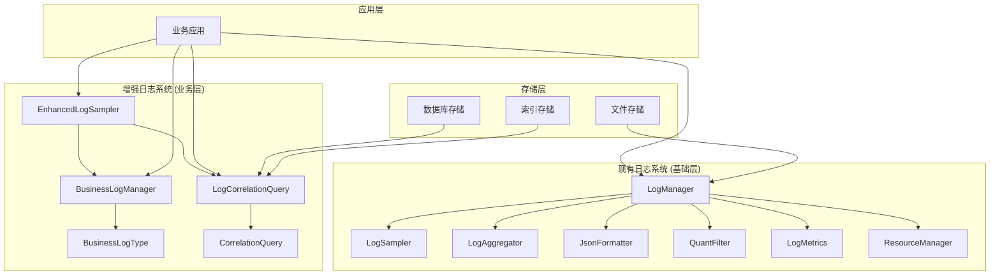
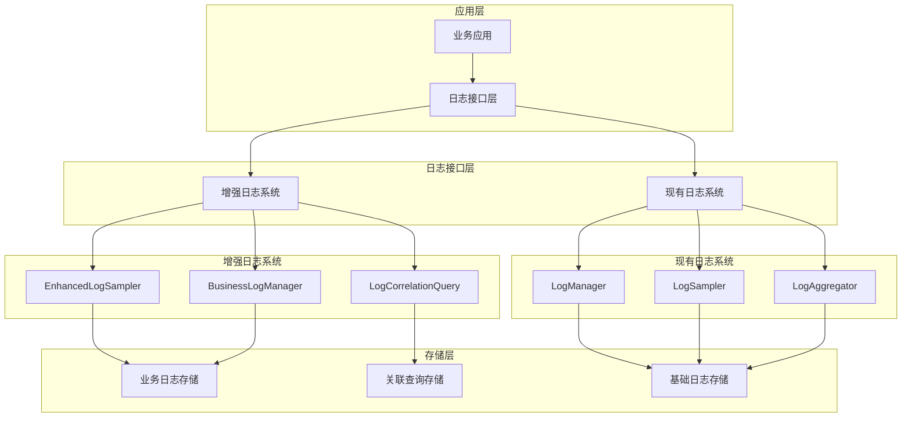

# 日志系统分工架构文档

## 1. 系统概述

### 1.1 架构目标
通过明确的分工设计，确保现有日志系统与增强日志系统各司其职，避免功能重复和职责混乱。

### 1.2 设计原则
- **职责单一**: 每个组件只负责特定的日志功能
- **层次清晰**: 基础日志功能与高级业务功能分离
- **向后兼容**: 增强系统不影响现有系统的使用
- **可扩展性**: 支持未来功能扩展和定制

## 2. 系统分工架构

### 2.1 整体架构图


### 2.2 职责分工表

| 组件 | 所属系统 | 主要职责 | 适用场景 |
|------|----------|----------|----------|
| **LogManager** | 现有系统 | 基础日志管理、格式化、输出 | 通用日志记录 |
| **LogSampler** | 现有系统 | 基础采样、负载调整 | 性能优化 |
| **LogAggregator** | 现有系统 | 日志聚合、批量处理 | 日志收集 |
| **JsonFormatter** | 现有系统 | JSON格式输出 | 结构化日志 |
| **QuantFilter** | 现有系统 | 量化日志过滤 | 专业领域过滤 |
| **LogMetrics** | 现有系统 | 日志指标收集 | 监控统计 |
| **ResourceManager** | 现有系统 | 资源管理 | 系统资源控制 |
| **EnhancedLogSampler** | 增强系统 | 业务采样、强制采样 | 关键业务日志 |
| **BusinessLogManager** | 增强系统 | 业务日志分类管理 | 业务操作记录 |
| **LogCorrelationQuery** | 增强系统 | 关联查询、追溯 | 问题排查 |

## 3. 详细分工说明

### 3.1 现有日志系统 (基础层)

#### 3.1.1 LogManager - 基础日志管理器
**职责范围**:
- 基础日志记录器的创建和管理
- 日志级别控制
- 处理器管理 (文件、控制台、轮转等)
- 格式化器配置
- 线程安全的日志操作

**核心功能**:
```python
class LogManager:
    def get_logger(self, name: str) -> logging.Logger
    def configure(self, config: Dict[str, Any]) -> None
    def set_level(self, name: str, level: str) -> bool
    def add_handler(self, name: str, handler: logging.Handler) -> bool
    def remove_handler(self, name: str, handler: logging.Handler) -> bool
```

**使用场景**:
- 系统启动日志
- 配置加载日志
- 错误异常日志
- 性能监控日志
- 通用调试日志

#### 3.1.2 LogSampler - 基础采样器
**职责范围**:
- 基于级别的采样
- 动态负载调整
- 基础采样规则管理
- 性能优化

**核心功能**:
```python
class LogSampler:
    def should_sample(self, record: Union[Dict, str]) -> bool
    def configure(self, config: Dict[str, Any]) -> None
    def adjust_for_load(self, current_load: float) -> None
    def filter(self, record) -> bool
```

**使用场景**:
- 高频率日志的采样
- 系统负载高时的日志降级
- 开发环境的调试日志控制
- 性能测试时的日志采样

#### 3.1.3 LogAggregator - 日志聚合器
**职责范围**:
- 日志批量收集
- 日志聚合处理
- 批量写入优化
- 队列管理

**核心功能**:
```python
class LogAggregator:
    def start(self) -> None
    def stop(self) -> None
    def add_log(self, log_entry: Dict) -> None
    def get_aggregated_logs(self) -> List[Dict]
```

**使用场景**:
- 大量日志的批量处理
- 日志数据的聚合分析
- 日志存储的优化写入
- 实时日志流的处理

#### 3.1.4 JsonFormatter - JSON格式化器
**职责范围**:
- JSON格式的日志输出
- 结构化日志格式化
- 字段标准化

**核心功能**:
```python
class JsonFormatter(logging.Formatter):
    def format(self, record) -> str
```

**使用场景**:
- 结构化日志输出
- 日志分析工具集成
- 日志存储系统对接
- 监控系统的日志输入

#### 3.1.5 QuantFilter - 量化过滤器
**职责范围**:
- 量化交易相关的日志过滤
- 专业领域的关键词过滤
- 业务规则的日志过滤

**核心功能**:
```python
class QuantFilter:
    def filter(self, record) -> bool
    def add_filter_rule(self, rule: FilterRule) -> None
    def remove_filter_rule(self, rule_id: str) -> None
```

**使用场景**:
- 量化策略的日志过滤
- 交易信号的日志记录
- 风控规则的日志过滤
- 专业领域的日志分类

#### 3.1.6 LogMetrics - 日志指标
**职责范围**:
- 日志数量统计
- 日志级别分布
- 性能指标收集
- 监控数据提供

**核心功能**:
```python
class LogMetrics:
    def record(self, level: str, logger: str, sampled: bool = False) -> None
    def get_metrics(self) -> Dict[str, Any]
    def reset_metrics(self) -> None
```

**使用场景**:
- 系统监控
- 性能分析
- 容量规划
- 告警触发

#### 3.1.7 ResourceManager - 资源管理器
**职责范围**:
- 日志文件管理
- 磁盘空间控制
- 内存使用优化
- 资源清理

**核心功能**:
```python
class ResourceManager:
    def cleanup_old_logs(self, max_age_days: int) -> None
    def compress_logs(self, log_dir: str) -> None
    def check_disk_space(self) -> float
    def optimize_storage(self) -> None
```

**使用场景**:
- 日志文件轮转
- 磁盘空间管理
- 日志压缩归档
- 系统资源优化

### 3.2 增强日志系统 (业务层)

#### 3.2.1 EnhancedLogSampler - 增强采样器
**职责范围**:
- 关键业务日志的强制采样
- 业务类型的智能识别
- 关联机制的采样支持
- 高级采样策略

**核心功能**:
```python
class EnhancedLogSampler:
    def should_sample(self, record: Union[Dict, str, LogEntry]) -> bool
    def record_sampled_log(self, log_entry: LogEntry) -> None
    def get_related_logs(self, trace_id: str = None, correlation_id: str = None) -> List[LogEntry]
    def get_critical_business_logs(self, business_type: BusinessLogType = None) -> List[LogEntry]
    def extract_business_type(self, message: str, logger: str) -> Optional[BusinessLogType]
```

**使用场景**:
- 订单相关日志的强制采样
- 交易相关日志的强制采样
- 风控相关日志的强制采样
- 账户相关日志的强制采样
- 业务操作的完整追溯

#### 3.2.2 BusinessLogManager - 业务日志管理器
**职责范围**:
- 业务日志的分类管理
- 业务操作的完整记录
- 追溯上下文的维护
- 业务统计信息收集

**核心功能**:
```python
class BusinessLogManager:
    def log_business_operation(self, operation: str, business_type: BusinessLogType, 
                             message: str, level: str = "INFO", extra: Dict[str, Any] = None,
                             trace_id: str = None, correlation_id: str = None) -> str
    def log_debug_operation(self, operation: str, message: str, 
                           extra: Dict[str, Any] = None, trace_id: str = None) -> str
    def get_operation_trace(self, correlation_id: str) -> List[LogEntry]
    def get_critical_business_logs(self, business_type: BusinessLogType = None) -> List[LogEntry]
    def start_trace_context(self, trace_id: str, context: Dict[str, Any] = None) -> None
```

**使用场景**:
- 订单处理流程的完整记录
- 交易执行过程的详细追溯
- 风控检查的完整记录
- 账户操作的审计日志
- 业务操作的关联分析

#### 3.2.3 LogCorrelationQuery - 日志关联查询器
**职责范围**:
- 采样日志与全量日志的关联查询
- 多维度日志索引管理
- 关联查询结果的导出
- 查询历史管理

**核心功能**:
```python
class LogCorrelationQuery:
    def query_correlation(self, query: CorrelationQuery) -> CorrelationResult
    def search_by_trace_id(self, trace_id: str) -> List[LogEntry]
    def search_by_correlation_id(self, correlation_id: str) -> List[LogEntry]
    def search_by_business_type(self, business_type: BusinessLogType, 
                               time_range: Optional[Tuple[datetime, datetime]] = None) -> List[LogEntry]
    def export_query_result(self, query_id: str, format: str = "json") -> str
    def get_query_history(self, limit: int = 100) -> List[CorrelationResult]
```

**使用场景**:
- 问题排查时的完整日志追溯
- 业务操作的关联分析
- 审计要求的日志查询
- 合规检查的日志导出
- 性能分析的日志关联

## 4. 集成方案

### 4.1 分层集成架构


### 4.2 接口设计
```python
# 统一日志接口
class UnifiedLoggingInterface:
    """统一日志接口，协调现有系统和增强系统"""
    
    def __init__(self):
        self.basic_logger = LogManager()
        self.enhanced_sampler = EnhancedLogSampler()
        self.business_manager = BusinessLogManager()
        self.correlation_query = LogCorrelationQuery()
    
    def log_basic(self, name: str, level: str, message: str, **kwargs):
        """基础日志记录"""
        logger = self.basic_logger.get_logger(name)
        getattr(logger, level.lower())(message, **kwargs)
    
    def log_business(self, operation: str, business_type: BusinessLogType, 
                    message: str, level: str = "INFO", **kwargs):
        """业务日志记录"""
        return self.business_manager.log_business_operation(
            operation=operation,
            business_type=business_type,
            message=message,
            level=level,
            **kwargs
        )
    
    def log_debug(self, operation: str, message: str, **kwargs):
        """调试日志记录"""
        return self.business_manager.log_debug_operation(
            operation=operation,
            message=message,
            **kwargs
        )
    
    def query_correlation(self, query: CorrelationQuery):
        """关联查询"""
        return self.correlation_query.query_correlation(query)
```

### 4.3 配置集成
```json
{
    "logging": {
        "basic": {
            "level": "INFO",
            "handlers": [
                {"type": "file", "filename": "logs/basic.log"},
                {"type": "console"}
            ],
            "sampling": {
                "default_rate": 0.3,
                "level_rates": {
                    "DEBUG": 0.1,
                    "INFO": 0.5,
                    "ERROR": 1.0
                }
            }
        },
        "enhanced": {
            "sampling": {
                "default_rate": 0.3,
                "critical_business_types": ["order", "trade", "risk", "account"],
                "level_rates": {
                    "DEBUG": 0.1,
                    "INFO": 0.5,
                    "WARNING": 1.0,
                    "ERROR": 1.0
                }
            },
            "business_logging": {
                "business_log_rate": 1.0,
                "debug_log_rate": 0.1,
                "enable_correlation": true,
                "enable_trace": true
            },
            "correlation_query": {
                "max_query_history": 1000,
                "query_timeout": 300
            }
        }
    }
}
```

## 5. 使用指南

### 5.1 选择指南

#### 5.1.1 使用现有日志系统的场景
- **系统级日志**: 启动、关闭、配置加载等
- **通用调试**: 开发调试、性能分析等
- **错误异常**: 系统错误、异常处理等
- **性能监控**: 性能指标、资源使用等
- **基础采样**: 高频率日志的采样控制

#### 5.1.2 使用增强日志系统的场景
- **关键业务操作**: 订单、交易、风控、账户等
- **业务流程追溯**: 完整的业务操作链路
- **合规审计**: 满足监管要求的日志记录
- **问题排查**: 复杂问题的关联分析
- **业务分析**: 业务操作的统计分析

### 5.2 最佳实践

#### 5.2.1 日志分类原则
```python
# 系统级日志 - 使用现有系统
log_manager = LogManager()
system_logger = log_manager.get_logger("system")
system_logger.info("系统启动完成")

# 业务级日志 - 使用增强系统
business_manager = BusinessLogManager()
correlation_id = business_manager.log_business_operation(
    operation="order_processing",
    business_type=BusinessLogType.ORDER,
    message="订单处理开始",
    level="INFO"
)
```

#### 5.2.2 采样策略选择
```python
# 基础采样 - 现有系统
basic_sampler = LogSampler()
if basic_sampler.should_sample("DEBUG"):
    logger.debug("调试信息")

# 业务采样 - 增强系统
enhanced_sampler = EnhancedLogSampler()
log_entry = LogEntry(
    level="INFO",
    message="订单下单",
    business_type=BusinessLogType.ORDER
)
if enhanced_sampler.should_sample(log_entry):
    # 记录关键业务日志
    pass
```

#### 5.2.3 查询策略选择
```python
# 基础查询 - 现有系统
# 通过文件搜索、grep等方式

# 关联查询 - 增强系统
query_manager = LogCorrelationQuery()
result = query_manager.query_correlation(
    CorrelationQuery(trace_id="trace_123")
)
```

## 6. 迁移策略

### 6.1 渐进式迁移
1. **第一阶段**: 保持现有系统不变，新增增强系统
2. **第二阶段**: 关键业务场景逐步迁移到增强系统
3. **第三阶段**: 完善集成接口，统一日志管理
4. **第四阶段**: 优化配置，完善监控

### 6.2 兼容性保证
- 现有系统的API保持不变
- 现有配置文件继续有效
- 现有日志格式保持兼容
- 现有监控指标继续收集

### 6.3 性能影响
- 增强系统对现有系统性能影响最小
- 关键业务日志的强制采样不影响性能
- 关联查询功能按需启用
- 资源使用在合理范围内

## 7. 监控和告警

### 7.1 系统监控
- 现有系统: 基础日志功能、性能指标
- 增强系统: 业务日志完整性、关联查询性能

### 7.2 告警规则
- 现有系统: 日志丢失、性能异常
- 增强系统: 关键业务日志缺失、关联查询失败

### 7.3 指标收集
- 现有系统: 日志数量、级别分布、性能指标
- 增强系统: 业务日志完整性、追溯成功率、查询性能

## 8. 总结

### 8.1 分工优势
- **职责明确**: 每个系统专注于特定领域
- **功能互补**: 基础功能与高级功能相互补充
- **性能优化**: 分层设计避免性能瓶颈
- **维护简单**: 模块化设计便于维护和扩展

### 8.2 集成效果
- **统一接口**: 提供统一的日志管理接口
- **灵活配置**: 支持不同场景的灵活配置
- **完整追溯**: 确保关键业务操作的完整追溯
- **高效查询**: 提供强大的关联查询能力

**当前状态**: ✅ **日志系统分工架构已明确设计，现有系统与增强系统职责清晰，建议按此架构逐步实施！** 