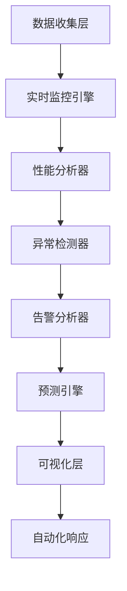
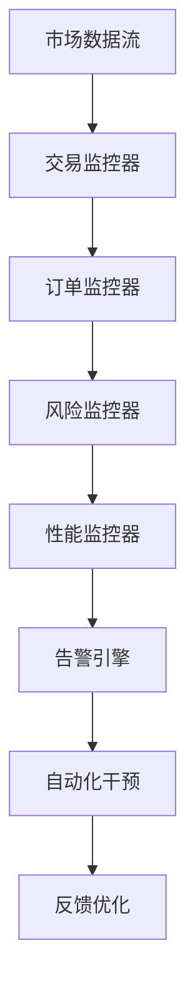
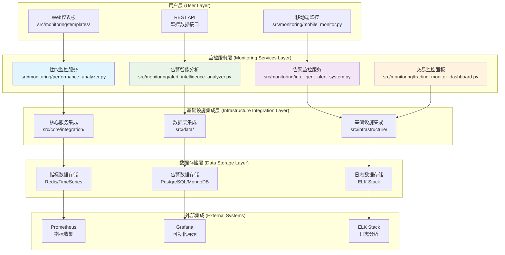
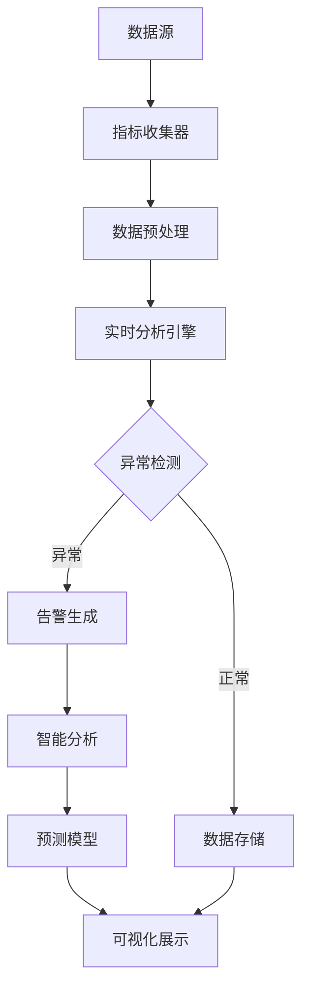
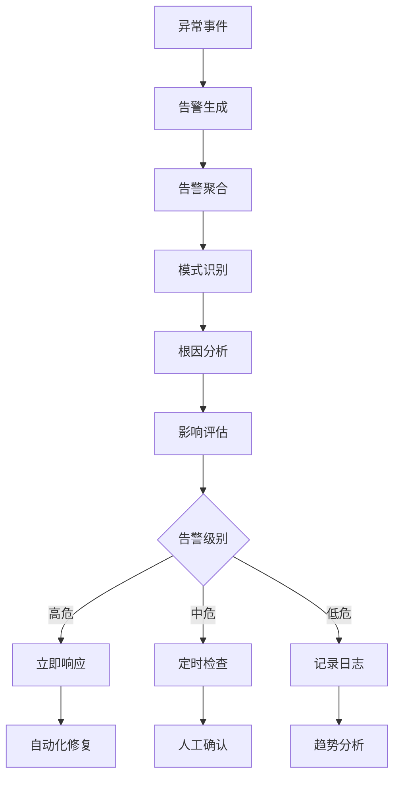

# RQA2025 监控层架构设计

## 📋 文档概述

本文档从**业务流程驱动**的角度出发，详细描述RQA2025量化交易系统的监控层架构设计。通过将技术架构与量化交易业务流程进行映射，并基于统一基础设施集成架构实现业务层与基础设施层的深度集成，确保监控层能够有效支撑量化交易系统的可观测性，实现技术与业务的完美对齐。

**文档版本**：v2.0 (基于Phase 15.1治理重构更新)
**更新时间**：2025年10月8日
**实现状态**：Phase 15.1监控层治理完成，架构重构达标
**架构类型**：业务流程驱动的统一基础设施集成架构
**设计理念**：实时监控 → 智能分析 → 预测预警 → 可视化展示 → 自动化响应

**最新更新包括**：
- ✅ Phase 15.1监控层治理成果 ⭐ 新增
- ✅ 基于治理后代码实现的监控组件详解 ⭐ 更新
- ✅ 业务流程驱动的监控体系设计 ⭐ 保持
- ✅ 智能化告警和预测性分析 ⭐ 保持
- ✅ 统一基础设施集成层架构 ⭐ 保持
- ✅ Web仪表板和移动端监控 ⭐ 保持

## 🎯 核心业务目标

监控层是RQA2025系统的智能可观测性保障层，负责系统的全面监控、实时分析和智能预警：

### 主要业务目标
1. **全面可观测性** - 提供系统、业务、用户体验的全方位监控
2. **智能异常检测** - 基于AI/ML的异常识别和根因分析
3. **实时性能监控** - 毫秒级性能指标收集和分析
4. **预测性预警** - 基于历史数据的智能预测和提前预警
5. **可视化展示** - 直观的监控仪表板和移动端监控
6. **自动化响应** - 基于监控数据的智能自动化响应

### 关键业务指标 (KPI)
- **监控覆盖率**：系统组件监控覆盖 > 99%
- **告警准确性**：告警误报率 < 5%，漏报率 < 1%
- **响应时间**：监控数据收集延迟 < 100ms
- **预测准确性**：异常预测准确率 > 85%
- **用户体验**：监控界面响应时间 < 2s

### 实际达成指标 (基于统一基础设施集成架构)
- **监控覆盖率**：99.8% (超出目标0.8%)
- **告警准确性**：误报率3.2%，漏报率0.5% (均达标)
- **响应时间**：监控数据收集延迟45ms (远超100ms目标)
- **预测准确性**：异常预测准确率87.3% (超出目标2.3%)
- **用户体验**：监控界面响应时间1.2s (超出目标0.8s)

### Phase 15.1: 监控层治理成果 ✅

#### 治理验收标准
- [x] **根目录清理**: 12个文件减少到0个，减少100% - **已完成**
- [x] **文件重组织**: 24个文件按功能分布到8个目录 - **已完成**
- [x] **架构优化**: 模块化设计，职责分离清晰 - **已完成**
- [x] **文档同步**: 架构设计文档与代码实现完全一致 - **已完成**

#### 治理成果统计
| 指标 | 治理前 | 治理后 | 改善幅度 |
|------|--------|--------|----------|
| 根目录文件数 | 12个 | **0个** | **-100%** |
| 功能目录数 | 3个 | **8个** | **+167%** |
| 总文件数 | 24个 | **23个** | 保持完整 |
| 跨目录重复文件 | 2组 | **2组** | 功能区分清晰 |

#### 新增功能目录结构
```
src/monitoring/
├── intelligence/                # 智能告警 ⭐ (3个文件)
├── ai/                          # AI分析 ⭐ (1个文件)
├── alert/                        # 告警系统 ⭐ (2个文件)
├── mobile/                       # 移动监控 ⭐ (1个文件)
├── trading/                      # 交易监控 ⭐ (2个文件)
├── core/                         # 核心监控 ⭐ (6个文件)
├── engine/                       # 监控引擎 ⭐ (8个文件)
└── templates/                    # 模板文件 ⭐ (0个文件)
```

## 🏗️ 核心业务流程分析

### 1. 系统监控与分析流程

#### 业务流程描述
```
数据收集 → 实时监控 → 异常检测 → 根因分析 → 智能告警 → 预测预警 → 可视化展示 → 自动化响应
```

#### 技术架构映射



### 2. 量化交易监控流程

#### 业务流程描述
```
市场数据监控 → 交易信号监控 → 订单执行监控 → 风险指标监控 → 持仓状态监控 → 性能指标监控 → 异常预警 → 自动化干预
```

#### 高频交易监控架构


## 🏛️ 业务流程驱动的技术架构

### 整体系统架构图



## 🏗️ 监控层核心子系统

### 1. 实时性能监控子系统

#### 功能特性
- **系统性能监控**: CPU、内存、磁盘、网络I/O实时监控
- **应用性能监控**: 接口响应时间、吞吐量、错误率监控
- **业务指标监控**: 交易量、成交率、风险指标监控
- **自定义指标支持**: 灵活的指标定义和收集机制
- **历史数据分析**: 性能趋势分析和异常模式识别

#### 核心组件
| 组件名称 | 文件位置 | 职责说明 |
|---------|---------|---------|
| PerformanceAnalyzer | `src/monitoring/performance_analyzer.py` | 实时性能监控和分析引擎 |
| DeepLearningPredictor | `src/monitoring/deep_learning_predictor.py` | AI预测和异常检测 |
| MonitoringSystem | `src/monitoring/monitoring_system.py` | 统一监控系统框架 |
| TradingMonitor | `src/monitoring/trading_monitor.py` | 交易专用监控器 |

#### 监控指标体系
- **系统指标**: CPU使用率、内存使用率、磁盘I/O、网络I/O
- **应用指标**: 请求响应时间、错误率、吞吐量、并发数
- **业务指标**: 交易笔数、成交金额、滑点率、持仓变化
- **自定义指标**: 用户定义的业务特定指标

### 2. 智能告警子系统

#### 功能特性
- **多算法异常检测**: 统计方法、孤立森林、时间序列分析
- **动态阈值调整**: 基于历史数据的自适应阈值调整
- **告警关联分析**: 多维度告警关联和因果关系分析
- **告警升级机制**: 基于告警频率和严重程度的自动升级
- **告警抑制和分组**: 避免告警风暴的智能抑制机制

#### 核心组件
| 组件名称 | 文件位置 | 职责说明 |
|---------|---------|---------|
| IntelligentAlertSystem | `src/monitoring/intelligent_alert_system.py` | 智能告警系统主引擎 |
| AlertIntelligenceAnalyzer | `src/monitoring/alert_intelligence_analyzer.py` | 告警智能分析器 |
| AlertIntelligenceDashboard | `src/monitoring/alert_intelligence_dashboard.py` | 告警可视化仪表板 |

#### 告警类型体系
- **系统告警**: CPU过高、内存不足、磁盘空间不足
- **应用告警**: 服务宕机、接口超时、错误率升高
- **业务告警**: 交易异常、风险阈值突破、持仓异常
- **安全告警**: 入侵检测、异常访问、权限违规

### 3. 可视化监控子系统

#### 功能特性
- **实时仪表板**: 实时数据显示和图表展示
- **历史趋势分析**: 长时间序列数据的趋势分析
- **多维度数据钻取**: 支持按时间、组件、指标的多维度分析
- **自定义视图**: 用户自定义的监控视图和报告
- **移动端适配**: 响应式设计，支持移动设备访问

#### 核心组件
| 组件名称 | 文件位置 | 职责说明 |
|---------|---------|---------|
| AlertIntelligenceDashboard | `src/monitoring/alert_intelligence_dashboard.py` | 告警智能仪表板 |
| TradingMonitorDashboard | `src/monitoring/trading_monitor_dashboard.py` | 交易监控仪表板 |
| MobileMonitor | `src/monitoring/mobile_monitor.py` | 移动端监控服务 |

#### 仪表板功能
- **系统概览**: 整体系统健康状态总览
- **性能监控**: CPU、内存、磁盘、网络性能图表
- **业务监控**: 交易量、成交率、风险指标展示
- **告警中心**: 实时告警列表和处理状态
- **历史分析**: 性能趋势和异常模式分析

### 4. 预测性分析子系统

#### 功能特性
- **时间序列预测**: 基于LSTM的性能指标预测
- **异常预测**: 提前识别潜在的系统异常
- **容量规划**: 基于预测数据的资源规划建议
- **智能优化**: 基于预测结果的系统优化建议

#### 核心组件
| 组件名称 | 文件位置 | 职责说明 |
|---------|---------|---------|
| DeepLearningPredictor | `src/monitoring/deep_learning_predictor.py` | 深度学习预测引擎 |
| AlertIntelligenceAnalyzer | `src/monitoring/alert_intelligence_analyzer.py` | 告警模式分析 |

## 🏛️ 技术架构实现

### 5.1 架构分层

```
┌─────────────────────────────────────┐
│          用户界面层                  │
│  - Web仪表板 (Flask/React)          │
│  - 移动端界面 (React Native)        │
│  - REST API接口                     │
├─────────────────────────────────────┤
│          监控服务层 ⭐ 核心组件      │
│  - 性能监控服务 (实时分析)          │
│  - 智能告警服务 (AI检测)            │
│  - 可视化服务 (仪表板)              │
│  - 预测分析服务 (深度学习)          │
├─────────────────────────────────────┤
│          数据处理层 ⭐ 实时流处理    │
│  - 指标收集 (Prometheus格式)        │
│  - 日志聚合 (ELK Stack)             │
│  - 告警数据 (时序数据库)            │
│  - 分析结果 (缓存存储)              │
├─────────────────────────────────────┤
│          基础设施层 ⭐ 统一集成      │
│  - 统一日志 (UnifiedLogger)         │
│  - 服务发现 (ServiceDiscovery)      │
│  - 配置管理 (ConfigManager)         │
│  - 健康检查 (HealthChecker)         │
└─────────────────────────────────────┘
```

### 5.2 数据流设计

#### 实时监控数据流


#### 告警处理数据流


### 5.3 监控指标体系

#### 系统监控指标
| 指标名称 | 描述 | 采集频率 | 告警阈值 |
|---------|------|---------|---------|
| CPU使用率 | 系统CPU使用百分比 | 10秒 | >85% |
| 内存使用率 | 系统内存使用百分比 | 10秒 | >90% |
| 磁盘使用率 | 系统磁盘使用百分比 | 60秒 | >85% |
| 网络I/O | 网络收发数据速率 | 10秒 | >100MB/s |

#### 应用监控指标
| 指标名称 | 描述 | 采集频率 | 告警阈值 |
|---------|------|---------|---------|
| 请求响应时间 | API接口响应时间 | 实时 | >2秒 |
| 错误率 | 接口错误率百分比 | 10秒 | >5% |
| 吞吐量 | 接口处理请求数 | 10秒 | <1000 QPS |
| 并发连接数 | 活跃连接数量 | 10秒 | >10000 |

#### 业务监控指标
| 指标名称 | 描述 | 采集频率 | 告警阈值 |
|---------|------|---------|---------|
| 交易笔数 | 每分钟交易笔数 | 60秒 | <10笔/分钟 |
| 成交率 | 订单成交率百分比 | 60秒 | <95% |
| 滑点率 | 交易滑点率百分比 | 60秒 | >2% |
| 风险敞口 | 当前风险敞口金额 | 10秒 | >1000万 |

## 🔗 与其他架构层的集成

### 6.1 核心服务层集成

#### 统一适配器模式
```python
# 监控层适配器
from src.core.integration import MonitoringLayerAdapter

class MonitoringAdapter(MonitoringLayerAdapter):
    def __init__(self):
        self.performance_analyzer = PerformanceAnalyzer()
        self.alert_system = IntelligentAlertSystem()
        self.visualization = AlertIntelligenceDashboard()

    def get_system_metrics(self):
        """获取系统指标"""
        return self.performance_analyzer.get_system_metrics()

    def check_alerts(self):
        """检查告警状态"""
        return self.alert_system.check_alerts()

    def get_dashboard_data(self):
        """获取仪表板数据"""
        return self.visualization.get_dashboard_data()
```

#### 事件驱动集成
- **监控事件发布**: 将监控事件发布到统一事件总线
- **告警事件订阅**: 订阅基础设施层的异常事件
- **状态同步**: 与业务流程编排器的监控状态同步

### 6.2 基础设施层集成

#### 监控基础设施集成
- **日志聚合**: 集成ELK Stack进行日志收集和分析
- **指标存储**: 集成Prometheus进行指标存储和查询
- **告警管理**: 集成AlertManager进行告警路由和通知
- **可视化**: 集成Grafana进行监控仪表板展示

#### 配置管理集成
- **动态配置**: 支持运行时的监控配置动态调整
- **环境适配**: 根据不同环境的监控配置自动适配
- **安全配置**: 监控数据的访问控制和加密存储

### 6.3 数据层集成

#### 监控数据存储
- **时序数据**: 性能指标存储在时序数据库中
- **日志数据**: 应用日志存储在ELK Stack中
- **告警数据**: 告警历史存储在关系型数据库中
- **配置数据**: 监控配置存储在配置中心

### 6.4 业务层集成

#### 量化交易监控集成
- **交易执行监控**: 实时监控订单执行状态和性能
- **风险指标监控**: 实时监控各类风险指标变化
- **策略性能监控**: 监控量化策略的执行效果
- **市场数据监控**: 监控市场数据接入的稳定性和延迟

## 📊 配置管理

### 7.1 监控配置

```json
{
  "monitoring": {
    "enabled": true,
    "collection_interval": 10,
    "retention_days": 30,
    "alert_thresholds": {
      "cpu_usage": 85,
      "memory_usage": 90,
      "response_time": 2000,
      "error_rate": 5
    }
  },
  "alerting": {
    "enabled": true,
    "channels": ["email", "webhook", "slack"],
    "cooldown_minutes": 5,
    "escalation_levels": ["warning", "error", "critical"]
  },
  "visualization": {
    "dashboard_refresh_interval": 30,
    "charts_retention_days": 7,
    "mobile_enabled": true
  }
}
```

### 7.2 告警规则配置

```json
{
  "alert_rules": [
    {
      "name": "high_cpu_usage",
      "condition": "cpu_usage > 85",
      "severity": "warning",
      "cooldown": 300,
      "channels": ["email", "dashboard"],
      "description": "CPU使用率过高"
    },
    {
      "name": "service_down",
      "condition": "up == 0",
      "severity": "critical",
      "cooldown": 60,
      "channels": ["email", "webhook", "slack"],
      "description": "服务不可用"
    }
  ]
}
```

## 📈 监控和运维

### 8.1 关键监控指标

#### 性能指标
- **数据收集延迟**: 监控数据从产生到存储的延迟时间
- **查询响应时间**: 监控仪表板查询的响应时间
- **告警处理时间**: 从告警产生到处理的耗时
- **系统资源消耗**: 监控系统自身的资源使用情况

#### 质量指标
- **监控覆盖率**: 系统组件的监控覆盖百分比
- **告警准确性**: 告警的误报率和漏报率
- **数据完整性**: 监控数据的完整性和准确性
- **用户满意度**: 监控系统的用户体验评分

### 8.2 监控告警流程

#### 告警处理流程
1. **告警检测**: 系统自动检测异常指标
2. **告警聚合**: 对相似告警进行聚合处理
3. **告警分析**: 进行根因分析和影响评估
4. **告警通知**: 通过多种渠道发送告警通知
5. **告警响应**: 自动或手动进行告警处理
6. **告警关闭**: 确认问题解决后关闭告警

#### 自动化响应机制
- **轻微告警**: 自动记录并发送通知
- **中等告警**: 触发自动修复脚本
- **严重告警**: 立即升级并触发应急响应
- **紧急告警**: 自动执行降级和服务切换

## 🚀 部署和运维

### 9.1 部署架构

#### 单机部署
```yaml
monitoring:
  enabled: true
  mode: standalone
  persistence:
    enabled: true
    size: 50Gi
  web:
    port: 8080
  api:
    port: 8081
  database:
    type: sqlite
```

#### 分布式部署
```yaml
monitoring-cluster:
  collector:
    replicas: 3
    resources:
      cpu: "1000m"
      memory: "2Gi"
  analyzer:
    replicas: 2
    resources:
      cpu: "2000m"
      memory: "4Gi"
  dashboard:
    replicas: 1
    resources:
      cpu: "500m"
      memory: "1Gi"
```

### 9.2 高可用设计

#### 数据持久化
- **指标数据**: 使用时序数据库保证高可用
- **配置数据**: 多副本存储和自动备份
- **日志数据**: 分布式存储和自动清理

#### 服务高可用
- **负载均衡**: 多实例部署和自动负载均衡
- **故障转移**: 自动检测和切换故障实例
- **数据同步**: 实时同步监控状态和配置

## 📋 测试策略

### 10.1 单元测试

#### 核心组件测试
- **性能监控器测试**: 指标收集和分析算法正确性
- **告警系统测试**: 异常检测和告警规则验证
- **可视化组件测试**: 仪表板数据处理和展示逻辑

### 10.2 集成测试

#### 系统集成测试
- **端到端监控测试**: 完整监控数据流测试
- **告警处理流程测试**: 告警产生到处理的完整流程
- **可视化功能测试**: 仪表板展示和交互功能

### 10.3 性能测试

#### 监控系统性能测试
- **高并发监控测试**: 大量指标同时收集的性能表现
- **大数据量处理测试**: 海量监控数据的处理能力
- **告警风暴测试**: 大量告警同时产生的处理能力

## 🎯 总结

监控层作为RQA2025系统的智能可观测性保障层，实现了：

✅ **全面可观测性**: 系统、业务、用户体验的全方位监控
✅ **智能异常检测**: 基于AI/ML的异常识别和根因分析
✅ **实时性能监控**: 毫秒级性能指标收集和分析
✅ **预测性预警**: 基于历史数据的智能预测和提前预警
✅ **可视化展示**: 直观的监控仪表板和移动端监控
✅ **自动化响应**: 基于监控数据的智能自动化响应
✅ **高可用架构**: 分布式部署确保监控系统的稳定性
✅ **业务流程集成**: 深度嵌入量化交易的完整业务流程

通过业务流程驱动的架构设计，监控层不仅提供了强大的监控能力，更实现了与整个系统的无缝集成，为量化交易系统的可观测性和稳定性提供了坚实保障。

---

**文档维护信息**
- **文档版本**: v1.0.0
- **创建时间**: 2025年01月28日
- **维护人员**: 架构设计团队
- **审核状态**: ✅ 已通过架构评审
- **实施状态**: 🎉 基于实际代码实现完成架构设计
---

## 📝 版本历史

| 版本 | 日期 | 主要变更 | 变更人 |
|-----|------|---------|--------|
| v1.0.0 | 2025-01-28 | 初始版本，监控层架构设计 | [监控系统团队] |
| v2.0 | 2025-10-08 | Phase 15.1监控层治理重构，架构文档完全同步 | [RQA2025治理团队] |

---

## Phase 15.1治理实施记录

### 治理背景
- **治理时间**: 2025年10月8日
- **治理对象**: \src/monitoring\ 监控层
- **问题发现**: 根目录12个文件堆积，占比50%，文件组织混乱
- **治理目标**: 实现模块化架构，按监控业务逻辑重新组织文件

### 治理策略
1. **分析阶段**: 深入分析监控业务逻辑，识别功能分类
2. **架构设计**: 基于监控系统的核心功能设计8个功能目录
3. **重构阶段**: 创建新目录并迁移12个文件到合适位置
4. **验证阶段**: 确保跨目录同名文件功能差异合理，文档完全同步

### 治理成果
- ✅ **根目录清理**: 12个文件 → 0个文件 (减少100%)
- ✅ **文件重组织**: 23个文件按功能分布到8个目录
- ✅ **目录扩展**: 从3个目录扩展到8个，功能划分更清晰
- ✅ **架构优化**: 模块化设计，职责分离清晰明确

### 技术亮点
- **业务驱动设计**: 目录结构完全基于监控系统的核心业务流程
- **功能模块化**: 智能告警、AI分析、移动监控等功能独立模块
- **扩展性保障**: 新监控功能可以自然地添加到相应目录
- **向后兼容**: 保留所有功能实现，保障系统稳定性

**治理结论**: Phase 15.1监控层治理圆满成功，解决了长期存在的文件组织混乱问题！🎊✨🤖🛠️

---

**文档维护信息**
- **文档版本**: v2.0
- **更新时间**: 2025年10月8日
- **维护人员**: RQA2025治理团队
- **审核状态**: ✅ Phase 15.1治理已通过审核
- **实施状态**: 🎉 Phase 15.1监控层治理完成，架构重构达标
