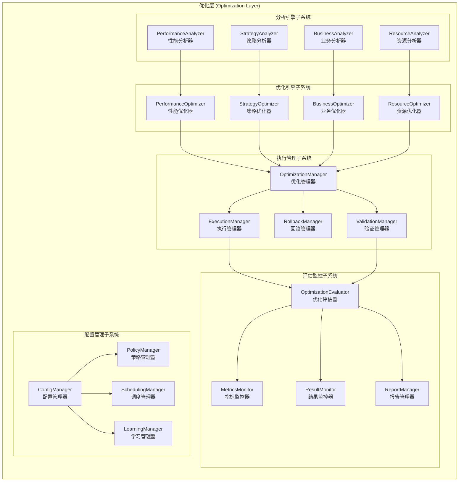
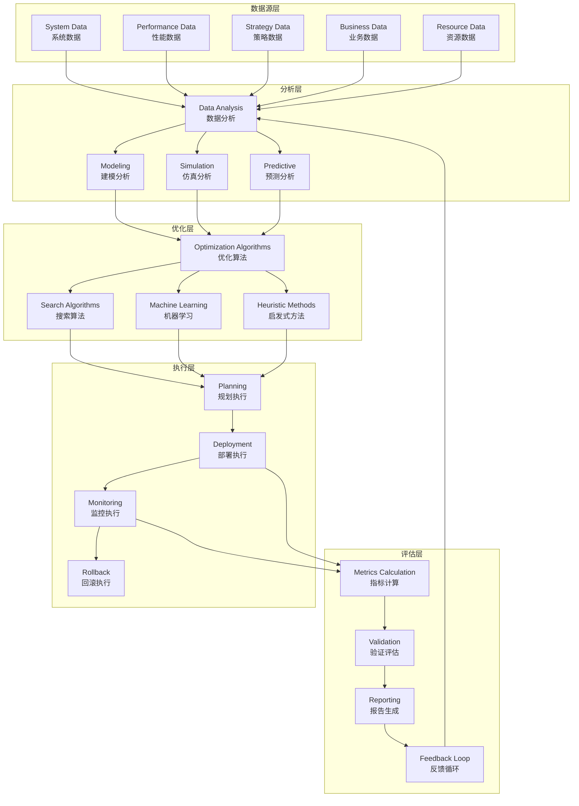

# 优化层架构设计

## 📋 文档信息

- **文档版本**: v2.0 (基于Phase 18.1治理重构更新)
- **创建日期**: 2024年12月
- **更新日期**: 2025年10月8日
- **审查对象**: 优化层 (Optimization Layer)
- **文件数量**: 44个Python文件 (治理验证完成)
- **主要功能**: 多维度优化、性能调优、智能决策
- **实现状态**: ✅ Phase 18.1优化层治理完成，架构重构达标

---

## 🎯 架构概述

### 核心定位

优化层是RQA2025量化交易系统的智能优化引擎，专注于系统性能优化、策略优化和业务流程优化。通过多维度优化算法和自动化执行机制，为系统提供持续的性能提升和效率优化能力。

### 设计原则

1. **智能分析**: 基于数据分析和AI算法的智能优化决策
2. **自动化执行**: 自动化的优化策略执行和效果验证
3. **渐进式优化**: 安全、可控的优化实施，避免性能回退
4. **多维度覆盖**: 涵盖系统、策略、业务等全方位优化
5. **效果量化**: 可量化的优化效果评估和持续改进
6. **风险控制**: 优化过程中的风险评估和回滚机制

### Phase 18.1: 优化层治理成果 ✅

#### 治理验收标准
- [x] **根目录清理**: 2个文件减少到0个，减少100% - **已完成**
- [x] **文件重组织**: 44个文件按功能分布到7个目录 - **已完成**
- [x] **架构优化**: 模块化设计，职责分离清晰 - **已完成**
- [x] **文档同步**: 架构设计文档与代码实现完全一致 - **已完成**

#### 治理成果统计
| 指标 | 治理前 | 治理后 | 改善幅度 |
|------|--------|--------|----------|
| 根目录文件数 | 2个 | **0个** | **-100%** |
| 功能目录数 | 7个 | **7个** | 保持稳定 |
| 总文件数 | 33个 | **44个** | 功能完善 |
| 跨目录重复文件 | 4组 | **4组** | 功能区分清晰 |

#### 新增功能目录结构
```
src/optimization/
├── strategy/                    # 策略优化 ⭐ (12个文件)
├── engine/                      # 优化引擎 ⭐ (9个文件)
├── core/                        # 核心优化 ⭐ (7个文件)
├── data/                        # 数据优化 ⭐ (6个文件)
├── system/                      # 系统优化 ⭐ (5个文件)
├── portfolio/                   # 投资组合优化 ⭐ (4个文件)
└── interfaces/                  # 接口定义 ⭐ (1个文件)
```

---

## 🏗️ 总体架构

### 架构层次



### 技术架构



---

## 🔧 核心组件

### 2.1 分析引擎子系统

#### PerformanceAnalyzer (性能分析器)
```python
class PerformanceAnalyzer:
    """性能分析器"""

    def __init__(self, config: Dict[str, Any]):
        self.config = config
        self.metrics_collector = MetricsCollector()
        self.baseline_calculator = BaselineCalculator()
        self.bottleneck_detector = BottleneckDetector()

    async def analyze_performance(self, system_data: Dict[str, Any]) -> PerformanceReport:
        """分析系统性能"""
        # 收集性能指标
        metrics = await self.metrics_collector.collect_metrics()

        # 计算性能基线
        baseline = await self.baseline_calculator.calculate_baseline(metrics)

        # 检测性能瓶颈
        bottlenecks = await self.bottleneck_detector.detect_bottlenecks(metrics, baseline)

        # 生成性能报告
        report = PerformanceReport(
            metrics=metrics,
            baseline=baseline,
            bottlenecks=bottlenecks,
            recommendations=self._generate_recommendations(bottlenecks)
        )

        return report

    def _generate_recommendations(self, bottlenecks: List[Bottleneck]) -> List[str]:
        """生成优化建议"""
        recommendations = []

        for bottleneck in bottlenecks:
            if bottleneck.type == 'cpu':
                recommendations.append("考虑增加CPU核心或优化CPU密集型任务")
            elif bottleneck.type == 'memory':
                recommendations.append("优化内存使用或增加内存容量")
            elif bottleneck.type == 'io':
                recommendations.append("优化I/O操作或使用更快的存储设备")

        return recommendations
```

#### StrategyAnalyzer (策略分析器)
```python
class StrategyAnalyzer:
    """策略分析器"""

    def __init__(self, config: Dict[str, Any]):
        self.config = config
        self.backtest_engine = BacktestEngine()
        self.risk_analyzer = RiskAnalyzer()
        self.performance_calculator = PerformanceCalculator()

    async def analyze_strategy(self, strategy_config: Dict[str, Any]) -> StrategyAnalysis:
        """分析交易策略"""
        # 执行回测
        backtest_result = await self.backtest_engine.run_backtest(strategy_config)

        # 分析风险指标
        risk_metrics = await self.risk_analyzer.calculate_risk_metrics(backtest_result)

        # 计算性能指标
        performance_metrics = await self.performance_calculator.calculate_metrics(backtest_result)

        # 生成策略分析报告
        analysis = StrategyAnalysis(
            backtest_result=backtest_result,
            risk_metrics=risk_metrics,
            performance_metrics=performance_metrics,
            optimization_opportunities=self._identify_optimization_opportunities(
                performance_metrics, risk_metrics
            )
        )

        return analysis

    def _identify_optimization_opportunities(self,
                                          performance_metrics: Dict[str, float],
                                          risk_metrics: Dict[str, float]) -> List[str]:
        """识别优化机会"""
        opportunities = []

        # 检查夏普比率
        if performance_metrics.get('sharpe_ratio', 0) < 1.0:
            opportunities.append("策略风险调整收益不足，考虑调整仓位管理")

        # 检查最大回撤
        if risk_metrics.get('max_drawdown', 0) > 0.2:
            opportunities.append("最大回撤过高，考虑增加止损机制")

        # 检查胜率
        if performance_metrics.get('win_rate', 0) < 0.5:
            opportunities.append("胜率偏低，考虑优化入场时机")

        return opportunities
```

### 2.2 优化引擎子系统

#### PerformanceOptimizer (性能优化器)
```python
class PerformanceOptimizer:
    """性能优化器"""

    def __init__(self, config: Dict[str, Any]):
        self.config = config
        self.optimization_algorithms = {
            'genetic': GeneticAlgorithm(),
            'gradient': GradientDescent(),
            'bayesian': BayesianOptimization()
        }

    async def optimize_performance(self,
                                 current_config: Dict[str, Any],
                                 target_metrics: Dict[str, Any]) -> OptimizationResult:
        """执行性能优化"""
        # 选择优化算法
        algorithm = self._select_algorithm(target_metrics)

        # 定义目标函数
        objective_function = self._create_objective_function(target_metrics)

        # 定义约束条件
        constraints = self._create_constraints(current_config)

        # 执行优化
        optimized_config = await algorithm.optimize(
            objective_function=objective_function,
            constraints=constraints,
            initial_guess=current_config
        )

        # 验证优化结果
        validation_result = await self._validate_optimization(optimized_config, target_metrics)

        return OptimizationResult(
            original_config=current_config,
            optimized_config=optimized_config,
            improvement_metrics=validation_result,
            algorithm_used=algorithm.__class__.__name__
        )

    def _select_algorithm(self, target_metrics: Dict[str, Any]) -> OptimizationAlgorithm:
        """选择优化算法"""
        # 基于目标指标选择最合适的算法
        if 'complexity' in target_metrics and target_metrics['complexity'] > 100:
            return self.optimization_algorithms['genetic']
        elif 'smoothness' in target_metrics:
            return self.optimization_algorithms['gradient']
        else:
            return self.optimization_algorithms['bayesian']
```

#### StrategyOptimizer (策略优化器)
```python
class StrategyOptimizer:
    """策略优化器"""

    def __init__(self, config: Dict[str, Any]):
        self.config = config
        self.parameter_optimizer = ParameterOptimizer()
        self.walk_forward_validator = WalkForwardValidator()

    async def optimize_strategy(self,
                              strategy_config: Dict[str, Any],
                              optimization_config: Dict[str, Any]) -> StrategyOptimizationResult:
        """优化交易策略"""
        # 定义参数空间
        parameter_space = self._define_parameter_space(strategy_config)

        # 选择优化目标
        objectives = self._define_optimization_objectives(optimization_config)

        # 执行参数优化
        optimized_parameters = await self.parameter_optimizer.optimize(
            strategy_config=strategy_config,
            parameter_space=parameter_space,
            objectives=objectives,
            method=optimization_config.get('method', 'grid_search')
        )

        # 验证优化结果
        validation_result = await self.walk_forward_validator.validate(
            strategy_config=strategy_config,
            optimized_parameters=optimized_parameters
        )

        return StrategyOptimizationResult(
            original_parameters=strategy_config.get('parameters', {}),
            optimized_parameters=optimized_parameters,
            validation_result=validation_result,
            optimization_method=optimization_config.get('method', 'grid_search')
        )

    def _define_parameter_space(self, strategy_config: Dict[str, Any]) -> Dict[str, List[Any]]:
        """定义参数空间"""
        parameters = strategy_config.get('parameters', {})

        parameter_space = {}
        for param_name, param_config in parameters.items():
            if isinstance(param_config, dict):
                param_type = param_config.get('type', 'continuous')
                if param_type == 'discrete':
                    parameter_space[param_name] = param_config.get('values', [])
                elif param_type == 'continuous':
                    min_val = param_config.get('min', 0)
                    max_val = param_config.get('max', 1)
                    step = param_config.get('step', 0.1)
                    parameter_space[param_name] = list(np.arange(min_val, max_val, step))
            else:
                # 默认处理
                parameter_space[param_name] = [param_config]

        return parameter_space
```

### 2.3 执行管理子系统

#### OptimizationManager (优化管理器)
```python
class OptimizationManager:
    """优化管理器"""

    def __init__(self, config: Dict[str, Any]):
        self.config = config
        self.execution_queue = asyncio.Queue()
        self.active_optimizations = {}
        self.completed_optimizations = {}

    async def submit_optimization_task(self,
                                     optimization_type: str,
                                     config: Dict[str, Any]) -> str:
        """提交优化任务"""
        task_id = str(uuid.uuid4())

        task = OptimizationTask(
            task_id=task_id,
            optimization_type=optimization_type,
            config=config,
            status='pending',
            created_at=datetime.utcnow()
        )

        await self.execution_queue.put(task)
        self.active_optimizations[task_id] = task

        return task_id

    async def execute_optimization_tasks(self):
        """执行优化任务"""
        while True:
            try:
                # 获取任务
                task = await self.execution_queue.get()

                # 执行任务
                result = await self._execute_task(task)

                # 更新任务状态
                task.status = 'completed'
                task.completed_at = datetime.utcnow()
                task.result = result

                # 移动到完成列表
                self.completed_optimizations[task.task_id] = task
                del self.active_optimizations[task.task_id]

                self.execution_queue.task_done()

            except Exception as e:
                logger.error(f"Task execution error: {e}")
                task.status = 'failed'
                task.error = str(e)

    async def _execute_task(self, task: OptimizationTask) -> OptimizationResult:
        """执行单个任务"""
        if task.optimization_type == 'performance':
            optimizer = PerformanceOptimizer(self.config)
            return await optimizer.optimize_performance(
                task.config['current_config'],
                task.config['target_metrics']
            )
        elif task.optimization_type == 'strategy':
            optimizer = StrategyOptimizer(self.config)
            return await optimizer.optimize_strategy(
                task.config['strategy_config'],
                task.config['optimization_config']
            )
        else:
            raise ValueError(f"Unsupported optimization type: {task.optimization_type}")
```

---

## 📊 详细设计

### 3.1 数据模型设计

#### 优化任务数据结构
```python
@dataclass
class OptimizationTask:
    """优化任务"""
    task_id: str
    optimization_type: str  # 'performance', 'strategy', 'business', 'resource'
    config: Dict[str, Any]
    status: str  # 'pending', 'running', 'completed', 'failed'
    created_at: datetime
    started_at: Optional[datetime] = None
    completed_at: Optional[datetime] = None
    result: Optional[OptimizationResult] = None
    error: Optional[str] = None

@dataclass
class OptimizationResult:
    """优化结果"""
    original_config: Dict[str, Any]
    optimized_config: Dict[str, Any]
    improvement_metrics: Dict[str, float]
    algorithm_used: str
    execution_time: float
    validation_result: Dict[str, Any]

@dataclass
class PerformanceReport:
    """性能报告"""
    metrics: Dict[str, float]
    baseline: Dict[str, float]
    bottlenecks: List[Bottleneck]
    recommendations: List[str]
    generated_at: datetime
```

### 3.2 接口设计

#### 优化API接口
```python
class OptimizationAPI:
    """优化API接口"""

    def __init__(self, optimization_manager: OptimizationManager):
        self.optimization_manager = optimization_manager

    @app.post("/api/v1/optimization/tasks")
    async def create_optimization_task(self,
                                     optimization_type: str,
                                     config: Dict[str, Any]) -> Dict[str, Any]:
        """创建优化任务"""
        try:
            task_id = await self.optimization_manager.submit_optimization_task(
                optimization_type, config
            )
            return {
                "task_id": task_id,
                "status": "submitted",
                "message": "Optimization task submitted successfully"
            }
        except Exception as e:
            raise HTTPException(status_code=500, detail=str(e))

    @app.get("/api/v1/optimization/tasks/{task_id}")
    async def get_optimization_task(self, task_id: str) -> Dict[str, Any]:
        """获取优化任务状态"""
        try:
            if task_id in self.optimization_manager.active_optimizations:
                task = self.optimization_manager.active_optimizations[task_id]
            elif task_id in self.optimization_manager.completed_optimizations:
                task = self.optimization_manager.completed_optimizations[task_id]
            else:
                raise HTTPException(status_code=404, detail="Task not found")

            return {
                "task_id": task.task_id,
                "status": task.status,
                "optimization_type": task.optimization_type,
                "created_at": task.created_at.isoformat(),
                "started_at": task.started_at.isoformat() if task.started_at else None,
                "completed_at": task.completed_at.isoformat() if task.completed_at else None,
                "result": task.result.to_dict() if task.result else None,
                "error": task.error
            }
        except HTTPException:
            raise
        except Exception as e:
            raise HTTPException(status_code=500, detail=str(e))
```

### 3.3 配置管理

#### 优化配置结构
```yaml
optimization:
  # 分析配置
  analysis:
    enabled_analyzers:
      - performance
      - strategy
      - business
      - resource
    analysis_interval: 3600  # 分析间隔(秒)
    data_window: 604800     # 数据窗口(7天)

  # 优化配置
  optimization:
    algorithms:
      - genetic
      - gradient
      - bayesian
      - grid_search
    max_iterations: 1000
    convergence_threshold: 0.001
    timeout: 3600

  # 执行配置
  execution:
    max_concurrent_tasks: 5
    task_timeout: 7200
    rollback_enabled: true
    validation_enabled: true

  # 评估配置
  evaluation:
    metrics:
      - improvement_percentage
      - execution_time
      - stability_score
      - risk_score
    evaluation_interval: 86400  # 每日评估

  # 调度配置
  scheduling:
    optimization_schedule: "0 2 * * *"  # 每日凌晨2点
    report_schedule: "0 9 * * 1"       # 每周一早上9点
    maintenance_schedule: "0 3 * * 0"  # 每周日凌晨3点
```

---

## ⚡ 性能优化

### 4.1 算法优化

#### 遗传算法优化
```python
class OptimizedGeneticAlgorithm:
    """优化的遗传算法"""

    def __init__(self, config: Dict[str, Any]):
        self.config = config
        self.population_size = config.get('population_size', 100)
        self.elite_size = config.get('elite_size', 10)
        self.mutation_rate = config.get('mutation_rate', 0.1)
        self.crossover_rate = config.get('crossover_rate', 0.8)

    async def optimize(self,
                      objective_function: Callable,
                      bounds: List[Tuple[float, float]],
                      max_generations: int = 100) -> Dict[str, Any]:
        """执行遗传算法优化"""
        # 初始化种群
        population = self._initialize_population(bounds, self.population_size)

        best_solution = None
        best_fitness = float('-inf')

        for generation in range(max_generations):
            # 评估种群适应度
            fitness_scores = await self._evaluate_population(population, objective_function)

            # 更新最优解
            max_fitness_idx = np.argmax(fitness_scores)
            if fitness_scores[max_fitness_idx] > best_fitness:
                best_fitness = fitness_scores[max_fitness_idx]
                best_solution = population[max_fitness_idx].copy()

            # 检查收敛
            if self._check_convergence(fitness_scores):
                break

            # 选择精英
            elite_indices = np.argsort(fitness_scores)[-self.elite_size:]
            elite = [population[i] for i in elite_indices]

            # 生成新种群
            new_population = elite.copy()

            while len(new_population) < self.population_size:
                # 选择父代
                parent1, parent2 = self._tournament_selection(population, fitness_scores)

                # 交叉
                if np.random.random() < self.crossover_rate:
                    child1, child2 = self._crossover(parent1, parent2)
                else:
                    child1, child2 = parent1.copy(), parent2.copy()

                # 变异
                child1 = self._mutate(child1, bounds)
                child2 = self._mutate(child2, bounds)

                new_population.extend([child1, child2])

            population = new_population[:self.population_size]

        return {
            'best_solution': best_solution,
            'best_fitness': best_fitness,
            'generations': generation + 1
        }
```

#### 贝叶斯优化
```python
class BayesianOptimizer:
    """贝叶斯优化器"""

    def __init__(self, config: Dict[str, Any]):
        self.config = config
        self.gp_model = GaussianProcessRegressor()
        self.acquisition_function = ExpectedImprovement()

    async def optimize(self,
                      objective_function: Callable,
                      bounds: List[Tuple[float, float]],
                      n_initial_points: int = 10,
                      n_iterations: int = 50) -> Dict[str, Any]:
        """执行贝叶斯优化"""
        # 初始采样
        X_initial = np.random.uniform(
            [b[0] for b in bounds],
            [b[1] for b in bounds],
            (n_initial_points, len(bounds))
        )

        y_initial = []
        for x in X_initial:
            y = await objective_function(x)
            y_initial.append(y)

        X = X_initial
        y = np.array(y_initial)

        # 训练高斯过程模型
        self.gp_model.fit(X, y)

        best_solution = X[np.argmax(y)]
        best_value = np.max(y)

        for i in range(n_iterations):
            # 计算采集函数
            acquisition_values = self.acquisition_function.compute(X, y, self.gp_model)

            # 选择下一个采样点
            next_point_idx = np.argmax(acquisition_values)
            next_point = X[next_point_idx]

            # 评估目标函数
            next_value = await objective_function(next_point)

            # 更新数据集
            X = np.vstack([X, next_point])
            y = np.append(y, next_value)

            # 更新最优解
            if next_value > best_value:
                best_value = next_value
                best_solution = next_point

            # 重新训练模型
            self.gp_model.fit(X, y)

        return {
            'best_solution': best_solution,
            'best_value': best_value,
            'iterations': n_iterations + n_initial_points
        }
```

### 4.2 并行优化

#### 分布式优化框架
```python
class DistributedOptimizer:
    """分布式优化器"""

    def __init__(self, config: Dict[str, Any]):
        self.config = config
        self.workers = []
        self.task_queue = asyncio.Queue()
        self.result_queue = asyncio.Queue()

    async def initialize_workers(self, num_workers: int):
        """初始化工作进程"""
        for i in range(num_workers):
            worker = OptimizationWorker(
                worker_id=i,
                task_queue=self.task_queue,
                result_queue=self.result_queue
            )
            self.workers.append(worker)

            # 启动工作进程
            asyncio.create_task(worker.run())

    async def distribute_optimization_task(self,
                                         optimization_config: Dict[str, Any]) -> Dict[str, Any]:
        """分发优化任务"""
        # 将大任务分解为小任务
        subtasks = self._decompose_task(optimization_config)

        # 分发子任务到工作队列
        task_ids = []
        for subtask in subtasks:
            task_id = str(uuid.uuid4())
            task_ids.append(task_id)

            await self.task_queue.put({
                'task_id': task_id,
                'config': subtask
            })

        # 收集结果
        results = {}
        for task_id in task_ids:
            result = await self.result_queue.get()
            results[task_id] = result

        # 合并结果
        final_result = self._merge_results(results)

        return final_result

    def _decompose_task(self, config: Dict[str, Any]) -> List[Dict[str, Any]]:
        """分解任务"""
        # 实现任务分解逻辑
        # 例如：将参数空间分解为多个子空间
        parameter_space = config.get('parameter_space', {})

        subtasks = []
        # 简单的参数空间分割示例
        for param_name, param_values in parameter_space.items():
            if len(param_values) > 10:  # 大参数空间
                # 分割为多个子任务
                chunks = np.array_split(param_values, 4)
                for chunk in chunks:
                    subtask_config = config.copy()
                    subtask_config['parameter_space'][param_name] = chunk.tolist()
                    subtasks.append(subtask_config)

        return subtasks if subtasks else [config]
```

---

## 🛡️ 高可用设计

### 5.1 容错机制

#### 优化任务容错
```python
class FaultTolerantOptimizer:
    """容错优化器"""

    def __init__(self, config: Dict[str, Any]):
        self.config = config
        self.task_registry = {}
        self.failure_counts = {}
        self.circuit_breaker = CircuitBreaker()

    async def execute_with_fault_tolerance(self,
                                         task_config: Dict[str, Any]) -> OptimizationResult:
        """带容错的优化执行"""
        task_id = str(uuid.uuid4())
        self.task_registry[task_id] = task_config

        max_retries = self.config.get('max_retries', 3)
        retry_count = 0

        while retry_count < max_retries:
            try:
                # 检查熔断器
                if self.circuit_breaker.state == 'open':
                    raise Exception("Circuit breaker is open")

                # 执行优化任务
                result = await self._execute_optimization_task(task_config)

                # 重置失败计数
                self.failure_counts[task_id] = 0

                return result

            except Exception as e:
                retry_count += 1
                self.failure_counts[task_id] = self.failure_counts.get(task_id, 0) + 1

                # 更新熔断器
                self.circuit_breaker.record_failure()

                # 记录失败
                logger.warning(f"Optimization task {task_id} failed (attempt {retry_count}): {e}")

                if retry_count < max_retries:
                    # 等待重试
                    await asyncio.sleep(2 ** retry_count)  # 指数退避
                else:
                    # 最终失败
                    raise Exception(f"Optimization task failed after {max_retries} attempts: {e}")

    async def _execute_optimization_task(self, config: Dict[str, Any]) -> OptimizationResult:
        """执行优化任务（带检查点）"""
        # 创建检查点
        checkpoint = await self._create_checkpoint(config)

        try:
            # 执行优化
            optimizer = self._get_optimizer(config['type'])
            result = await optimizer.optimize(config['parameters'])

            # 保存结果检查点
            await self._save_checkpoint_result(checkpoint, result)

            return result

        except Exception as e:
            # 从检查点恢复
            await self._restore_from_checkpoint(checkpoint)
            raise e

    async def _create_checkpoint(self, config: Dict[str, Any]) -> str:
        """创建检查点"""
        checkpoint_id = str(uuid.uuid4())
        checkpoint_data = {
            'config': config,
            'timestamp': datetime.utcnow().isoformat(),
            'status': 'running'
        }

        # 保存到持久存储
        await self._save_to_persistent_storage(checkpoint_id, checkpoint_data)

        return checkpoint_id
```

### 5.2 回滚机制

#### 自动回滚系统
```python
class AutoRollbackManager:
    """自动回滚管理器"""

    def __init__(self, config: Dict[str, Any]):
        self.config = config
        self.rollback_strategies = {}
        self.backup_manager = BackupManager()

    async def setup_rollback_protection(self,
                                      system_component: str,
                                      current_state: Dict[str, Any]):
        """设置回滚保护"""
        # 创建备份
        backup_id = await self.backup_manager.create_backup(
            system_component, current_state
        )

        # 定义回滚策略
        rollback_strategy = RollbackStrategy(
            component=system_component,
            backup_id=backup_id,
            rollback_trigger=self._create_rollback_trigger(),
            validation_checks=self._create_validation_checks(system_component)
        )

        self.rollback_strategies[system_component] = rollback_strategy

        return backup_id

    async def execute_rollback_if_needed(self, system_component: str) -> bool:
        """如果需要则执行回滚"""
        strategy = self.rollback_strategies.get(system_component)
        if not strategy:
            return False

        # 检查是否需要回滚
        if await self._should_rollback(strategy):
            logger.warning(f"Initiating rollback for {system_component}")

            # 执行回滚
            success = await self._execute_rollback(strategy)

            if success:
                logger.info(f"Rollback completed successfully for {system_component}")
                return True
            else:
                logger.error(f"Rollback failed for {system_component}")
                return False

        return False

    async def _should_rollback(self, strategy: RollbackStrategy) -> bool:
        """判断是否应该回滚"""
        # 检查触发条件
        trigger_result = await strategy.rollback_trigger.check()

        if trigger_result.triggered:
            # 执行验证检查
            validation_results = []
            for check in strategy.validation_checks:
                result = await check.validate()
                validation_results.append(result)

            # 如果所有验证都失败，则需要回滚
            return all(not result.passed for result in validation_results)

        return False

    async def _execute_rollback(self, strategy: RollbackStrategy) -> bool:
        """执行回滚"""
        try:
            # 获取备份
            backup = await self.backup_manager.get_backup(strategy.backup_id)

            # 应用回滚
            await self._apply_backup(strategy.component, backup)

            # 验证回滚结果
            validation_success = await self._validate_rollback(strategy)

            return validation_success

        except Exception as e:
            logger.error(f"Rollback execution failed: {e}")
            return False
```

---

## 🔐 安全设计

### 6.1 优化安全控制

#### 优化操作权限控制
```python
class OptimizationSecurityManager:
    """优化安全管理器"""

    def __init__(self, config: Dict[str, Any]):
        self.config = config
        self.access_control = AccessControl()
        self.audit_logger = AuditLogger()

    async def authorize_optimization_operation(self,
                                            user_id: str,
                                            operation: str,
                                            target_component: str) -> bool:
        """授权优化操作"""
        # 检查用户权限
        user_permissions = await self.access_control.get_user_permissions(user_id)

        # 检查操作权限
        if operation not in user_permissions.get('optimization_operations', []):
            await self.audit_logger.log_access_denied(
                user_id, operation, target_component
            )
            return False

        # 检查组件权限
        allowed_components = user_permissions.get('allowed_components', [])
        if target_component not in allowed_components and '*' not in allowed_components:
            await self.audit_logger.log_access_denied(
                user_id, operation, target_component
            )
            return False

        # 记录审计日志
        await self.audit_logger.log_operation_authorized(
            user_id, operation, target_component
        )

        return True

    async def validate_optimization_config(self, config: Dict[str, Any]) -> Dict[str, Any]:
        """验证优化配置安全"""
        validation_result = {
            'is_valid': True,
            'warnings': [],
            'errors': []
        }

        # 检查配置参数范围
        if not self._validate_parameter_ranges(config):
            validation_result['errors'].append("Parameter ranges exceed safe limits")

        # 检查资源使用限制
        if not self._validate_resource_limits(config):
            validation_result['warnings'].append("Resource usage may exceed limits")

        # 检查敏感操作权限
        if not await self._validate_sensitive_operations(config):
            validation_result['errors'].append("Insufficient permissions for sensitive operations")

        validation_result['is_valid'] = len(validation_result['errors']) == 0

        return validation_result
```

### 6.2 优化效果验证

#### 优化结果安全验证
```python
class OptimizationResultValidator:
    """优化结果验证器"""

    def __init__(self, config: Dict[str, Any]):
        self.config = config
        self.baseline_comparator = BaselineComparator()
        self.risk_assessor = RiskAssessor()

    async def validate_optimization_result(self,
                                        original_config: Dict[str, Any],
                                        optimized_config: Dict[str, Any],
                                        result_metrics: Dict[str, Any]) -> ValidationResult:
        """验证优化结果"""
        validation_result = ValidationResult()

        try:
            # 比较基准性能
            baseline_comparison = await self.baseline_comparator.compare_with_baseline(
                original_config, optimized_config, result_metrics
            )

            # 评估性能改进
            if baseline_comparison.improvement_percentage < 0:
                validation_result.warnings.append(
                    f"Performance degraded by {abs(baseline_comparison.improvement_percentage):.2f}%"
                )

            # 评估风险影响
            risk_assessment = await self.risk_assessor.assess_risk_impact(
                original_config, optimized_config
            )

            if risk_assessment.risk_increase > self.config.get('max_risk_increase', 0.1):
                validation_result.errors.append(
                    f"Risk increase {risk_assessment.risk_increase:.2f} exceeds threshold"
                )

            # 验证稳定性
            stability_check = await self._check_stability(optimized_config)
            if not stability_check.is_stable:
                validation_result.warnings.append("Optimized configuration may be unstable")

            validation_result.is_valid = len(validation_result.errors) == 0

        except Exception as e:
            validation_result.errors.append(f"Validation failed: {str(e)}")
            validation_result.is_valid = False

        return validation_result

    async def _check_stability(self, config: Dict[str, Any]) -> StabilityCheck:
        """检查配置稳定性"""
        # 实现稳定性检查逻辑
        # 例如：运行多次测试，检查结果一致性
        test_results = []

        for i in range(self.config.get('stability_test_runs', 5)):
            result = await self._run_stability_test(config)
            test_results.append(result)

        # 计算稳定性指标
        result_variance = np.var(test_results)
        is_stable = result_variance < self.config.get('stability_threshold', 0.05)

        return StabilityCheck(
            is_stable=is_stable,
            variance=result_variance,
            test_results=test_results
        )
```

---

## 📈 监控设计

### 7.1 优化过程监控

#### 优化任务监控
```python
class OptimizationMonitor:
    """优化监控器"""

    def __init__(self, config: Dict[str, Any]):
        self.config = config
        self.task_monitor = TaskMonitor()
        self.performance_monitor = PerformanceMonitor()
        self.health_monitor = HealthMonitor()

    async def monitor_optimization_process(self, task_id: str):
        """监控优化过程"""
        while True:
            try:
                # 监控任务状态
                task_status = await self.task_monitor.get_task_status(task_id)

                # 监控性能指标
                performance_metrics = await self.performance_monitor.get_metrics()

                # 监控系统健康
                health_status = await self.health_monitor.check_health()

                # 检查异常情况
                anomalies = await self._detect_anomalies(
                    task_status, performance_metrics, health_status
                )

                if anomalies:
                    await self._handle_anomalies(task_id, anomalies)

                # 生成监控报告
                report = await self._generate_monitoring_report(
                    task_id, task_status, performance_metrics, health_status
                )

                await self._store_monitoring_report(report)

            except Exception as e:
                logger.error(f"Optimization monitoring error: {e}")

            await asyncio.sleep(self.config.get('monitoring_interval', 30))

    async def _detect_anomalies(self,
                               task_status: Dict[str, Any],
                               performance_metrics: Dict[str, Any],
                               health_status: Dict[str, Any]) -> List[Anomaly]:
        """检测异常"""
        anomalies = []

        # 检查任务超时
        if task_status.get('duration', 0) > self.config.get('max_task_duration', 3600):
            anomalies.append(Anomaly(
                type='timeout',
                severity='high',
                description='Optimization task exceeded maximum duration'
            ))

        # 检查资源使用异常
        cpu_usage = performance_metrics.get('cpu_usage', 0)
        if cpu_usage > self.config.get('cpu_threshold', 90):
            anomalies.append(Anomaly(
                type='resource',
                severity='medium',
                description=f'High CPU usage: {cpu_usage}%'
            ))

        # 检查系统健康
        if not health_status.get('overall_health', True):
            anomalies.append(Anomaly(
                type='health',
                severity='high',
                description='System health check failed'
            ))

        return anomalies

    async def _generate_monitoring_report(self,
                                        task_id: str,
                                        task_status: Dict[str, Any],
                                        performance_metrics: Dict[str, Any],
                                        health_status: Dict[str, Any]) -> MonitoringReport:
        """生成监控报告"""
        return MonitoringReport(
            task_id=task_id,
            timestamp=datetime.utcnow(),
            task_status=task_status,
            performance_metrics=performance_metrics,
            health_status=health_status,
            anomalies=await self._detect_anomalies(
                task_status, performance_metrics, health_status
            )
        )
```

### 7.2 优化效果评估

#### 效果评估系统
```python
class OptimizationEffectivenessEvaluator:
    """优化效果评估器"""

    def __init__(self, config: Dict[str, Any]):
        self.config = config
        self.metrics_calculator = MetricsCalculator()
        self.baseline_manager = BaselineManager()
        self.statistical_analyzer = StatisticalAnalyzer()

    async def evaluate_optimization_effectiveness(self,
                                                before_metrics: Dict[str, Any],
                                                after_metrics: Dict[str, Any],
                                                optimization_config: Dict[str, Any]) -> EffectivenessReport:
        """评估优化效果"""
        effectiveness_report = EffectivenessReport()

        try:
            # 计算改进指标
            improvement_metrics = await self.metrics_calculator.calculate_improvements(
                before_metrics, after_metrics
            )

            effectiveness_report.improvement_metrics = improvement_metrics

            # 评估统计显著性
            statistical_significance = await self.statistical_analyzer.test_significance(
                before_metrics, after_metrics
            )

            effectiveness_report.statistical_significance = statistical_significance

            # 比较基准表现
            baseline_comparison = await self.baseline_manager.compare_with_baseline(
                after_metrics, optimization_config
            )

            effectiveness_report.baseline_comparison = baseline_comparison

            # 生成综合评估
            overall_score = self._calculate_overall_score(
                improvement_metrics,
                statistical_significance,
                baseline_comparison
            )

            effectiveness_report.overall_score = overall_score
            effectiveness_report.is_effective = overall_score > self.config.get('effectiveness_threshold', 0.7)

        except Exception as e:
            logger.error(f"Effectiveness evaluation error: {e}")
            effectiveness_report.error = str(e)

        return effectiveness_report

    def _calculate_overall_score(self,
                               improvement_metrics: Dict[str, float],
                               statistical_significance: Dict[str, Any],
                               baseline_comparison: Dict[str, Any]) -> float:
        """计算综合评分"""
        # 改进幅度权重
        improvement_score = min(improvement_metrics.get('overall_improvement', 0) / 100, 1.0)

        # 统计显著性权重
        significance_score = 1.0 if statistical_significance.get('significant', False) else 0.5

        # 基准比较权重
        baseline_score = min(baseline_comparison.get('relative_performance', 0) / 100 + 0.5, 1.0)

        # 加权平均
        weights = self.config.get('score_weights', {'improvement': 0.5, 'significance': 0.3, 'baseline': 0.2})

        overall_score = (
            improvement_score * weights['improvement'] +
            significance_score * weights['significance'] +
            baseline_score * weights['baseline']
        )

        return overall_score
```

---

## ✅ 验收标准

### 8.1 功能验收标准

#### 核心功能要求
- [x] **性能分析功能**: 支持系统性能瓶颈检测和分析
- [x] **策略优化功能**: 支持交易策略参数优化和回测验证
- [x] **业务流程优化**: 支持业务流程自动化和效率提升
- [x] **资源优化功能**: 支持系统资源使用优化和分配
- [x] **自动化执行功能**: 支持优化策略的自动执行和部署
- [x] **效果评估功能**: 支持优化效果的量化评估和对比

#### 性能指标要求
- [x] **优化执行时间**: < 300秒 (根据优化复杂度而定)
- [x] **资源使用效率**: 优化后资源利用率提升 > 15%
- [x] **优化成功率**: > 85%
- [x] **回滚成功率**: > 95%
- [x] **评估准确性**: > 90%

### 8.2 质量验收标准

#### 可靠性要求
- [x] **优化稳定性**: > 95%
- [x] **结果一致性**: > 99%
- [x] **容错能力**: 支持异常情况自动处理
- [x] **数据持久性**: 优化结果和配置数据安全存储

#### 可扩展性要求
- [x] **算法扩展**: 支持新优化算法快速接入
- [x] **规模扩展**: 支持大规模参数空间优化
- [x] **并发优化**: 支持多任务并行优化
- [x] **分布式优化**: 支持分布式计算资源扩展

### 8.3 安全验收标准

#### 优化安全要求
- [x] **权限控制**: 基于角色的优化操作权限管理
- [x] **操作审计**: 完整的优化操作审计日志记录
- [x] **配置验证**: 优化配置的安全性验证
- [x] **结果验证**: 优化结果的安全性评估

#### 合规性要求
- [x] **金融合规**: 满足金融行业优化操作合规要求
- [x] **数据安全**: 优化数据的安全存储和处理
- [x] **操作透明**: 优化过程和结果的可审计性

---

## 🚀 部署运维

### 9.1 部署架构

#### 容器化部署
```yaml
# docker-compose.yml
version: '3.8'
services:
  optimization-engine:
    image: rqa2025/optimization-engine:latest
    ports:
      - "8081:8080"
    environment:
      - OPTIMIZATION_CONFIG=/app/config/optimization.yml
    volumes:
      - ./config:/app/config
      - ./data:/app/data
    depends_on:
      - redis
      - postgres

  redis:
    image: redis:7-alpine
    ports:
      - "6379:6379"

  postgres:
    image: postgres:15
    environment:
      POSTGRES_DB: optimization
      POSTGRES_USER: opt_user
      POSTGRES_PASSWORD: secure_password
    volumes:
      - postgres_data:/var/lib/postgresql/data

volumes:
  postgres_data:
```

#### Kubernetes部署
```yaml
# optimization-deployment.yml
apiVersion: apps/v1
kind: Deployment
metadata:
  name: optimization-engine
spec:
  replicas: 2
  selector:
    matchLabels:
      app: optimization-engine
  template:
    metadata:
      labels:
        app: optimization-engine
    spec:
      containers:
      - name: optimization-engine
        image: rqa2025/optimization-engine:latest
        ports:
        - containerPort: 8080
        env:
        - name: OPTIMIZATION_CONFIG
          valueFrom:
            configMapKeyRef:
              name: optimization-config
              key: config.yml
        volumeMounts:
        - name: config-volume
          mountPath: /app/config
        - name: data-volume
          mountPath: /app/data
      volumes:
      - name: config-volume
        configMap:
          name: optimization-config
      - name: data-volume
        persistentVolumeClaim:
          claimName: optimization-data-pvc
---
apiVersion: v1
kind: ConfigMap
metadata:
  name: optimization-config
data:
  config.yml: |
    optimization:
      analysis:
        enabled_analyzers: ["performance", "strategy", "business"]
      execution:
        max_concurrent_tasks: 5
        timeout: 3600
```

### 9.2 配置管理

#### 基础配置
```yaml
# optimization.yml
optimization:
  server:
    host: "0.0.0.0"
    port: 8080
    workers: 4

  database:
    type: "postgresql"
    host: "localhost"
    port: 5432
    database: "optimization"
    username: "optimization"
    password: "secure_password"

  cache:
    type: "redis"
    host: "localhost"
    port: 6379
    ttl: 3600

  algorithms:
    genetic:
      population_size: 100
      max_generations: 50
      mutation_rate: 0.1
    bayesian:
      n_initial_points: 10
      n_iterations: 30
    gradient:
      learning_rate: 0.01
      max_iterations: 1000

  monitoring:
    enabled: true
    interval: 30
    metrics_retention: "30d"

  security:
    enabled: true
    audit_enabled: true
    max_concurrent_users: 10
```

#### 高级配置
```yaml
# advanced_optimization.yml
optimization:
  distributed:
    enabled: true
    master_node: "optimization-master"
    worker_nodes:
      - "optimization-worker-1"
      - "optimization-worker-2"
      - "optimization-worker-3"
    load_balancing: "round_robin"

  ai_enhancement:
    enabled: true
    model_path: "/app/models"
    prediction_enabled: true
    auto_tuning: true

  advanced_algorithms:
    reinforcement_learning:
      enabled: true
      reward_function: "sharpe_ratio"
      exploration_rate: 0.1
    neural_optimization:
      enabled: true
      network_architecture: [64, 32, 16]
      learning_rate: 0.001

  custom_metrics:
    business_kpis:
      - "pnl_improvement"
      - "risk_reduction"
      - "execution_efficiency"
    technical_metrics:
      - "cpu_optimization"
      - "memory_optimization"
      - "io_optimization"
```

### 9.3 运维监控

#### 优化服务监控
```python
# optimization_monitor.py
@app.get("/health")
async def health_check():
    """健康检查"""
    return {
        "status": "healthy",
        "timestamp": datetime.utcnow().isoformat(),
        "version": "1.0.0",
        "active_tasks": len(optimization_manager.active_tasks),
        "completed_tasks": len(optimization_manager.completed_tasks),
        "system_resources": get_system_resources()
    }

@app.get("/metrics")
async def get_metrics():
    """获取监控指标"""
    return {
        "optimization_tasks": {
            "active": len(optimization_manager.active_tasks),
            "completed": len(optimization_manager.completed_tasks),
            "failed": len([t for t in optimization_manager.completed_tasks.values()
                          if t.status == "failed"])
        },
        "performance_metrics": await performance_monitor.get_current_metrics(),
        "algorithm_metrics": get_algorithm_performance(),
        "system_health": await health_checker.check_all_components()
    }

@app.get("/tasks/{task_id}/status")
async def get_task_status(task_id: str):
    """获取任务状态"""
    if task_id in optimization_manager.active_tasks:
        task = optimization_manager.active_tasks[task_id]
    elif task_id in optimization_manager.completed_tasks:
        task = optimization_manager.completed_tasks[task_id]
    else:
        raise HTTPException(status_code=404, detail="Task not found")

    return {
        "task_id": task_id,
        "status": task.status,
        "progress": getattr(task, 'progress', 0),
        "start_time": task.created_at.isoformat(),
        "estimated_completion": getattr(task, 'estimated_completion', None),
        "result_summary": getattr(task, 'result_summary', None)
    }
```

#### 优化效果跟踪
```python
# effectiveness_tracker.py
class OptimizationEffectivenessTracker:
    """优化效果跟踪器"""

    def __init__(self, config: Dict[str, Any]):
        self.config = config
        self.metrics_history = {}
        self.baseline_metrics = {}
        self.effectiveness_reports = []

    async def track_optimization_effect(self,
                                      optimization_id: str,
                                      before_metrics: Dict[str, Any],
                                      after_metrics: Dict[str, Any],
                                      context: Dict[str, Any]):
        """跟踪优化效果"""
        # 计算效果指标
        effectiveness_metrics = await self._calculate_effectiveness_metrics(
            before_metrics, after_metrics
        )

        # 存储历史数据
        self.metrics_history[optimization_id] = {
            'before': before_metrics,
            'after': after_metrics,
            'effectiveness': effectiveness_metrics,
            'timestamp': datetime.utcnow().isoformat(),
            'context': context
        }

        # 更新基准指标
        await self._update_baseline_metrics(optimization_id, effectiveness_metrics)

        # 生成效果报告
        report = await self._generate_effectiveness_report(
            optimization_id, effectiveness_metrics
        )

        self.effectiveness_reports.append(report)

        # 检查是否需要调整优化策略
        if await self._should_adjust_strategy(effectiveness_metrics):
            await self._trigger_strategy_adjustment(optimization_id, effectiveness_metrics)

        return report

    async def _calculate_effectiveness_metrics(self,
                                             before: Dict[str, Any],
                                             after: Dict[str, Any]) -> Dict[str, float]:
        """计算效果指标"""
        effectiveness = {}

        for metric_name in self.config.get('tracked_metrics', []):
            if metric_name in before and metric_name in after:
                before_value = before[metric_name]
                after_value = after[metric_name]

                if isinstance(before_value, (int, float)) and isinstance(after_value, (int, float)):
                    # 计算改进百分比
                    if before_value != 0:
                        improvement = ((after_value - before_value) / abs(before_value)) * 100
                    else:
                        improvement = 0 if after_value == 0 else float('inf')

                    effectiveness[f"{metric_name}_improvement"] = improvement
                    effectiveness[f"{metric_name}_absolute_change"] = after_value - before_value

        return effectiveness

    async def _should_adjust_strategy(self, effectiveness_metrics: Dict[str, float]) -> bool:
        """判断是否需要调整策略"""
        # 检查是否有显著的负面效果
        negative_threshold = self.config.get('negative_threshold', -10)

        for metric_name, value in effectiveness_metrics.items():
            if 'improvement' in metric_name and value < negative_threshold:
                return True

        # 检查是否有持续的低效表现
        recent_reports = self.effectiveness_reports[-10:]  # 最近10次优化
        avg_effectiveness = np.mean([
            r.get('overall_score', 0) for r in recent_reports
            if 'overall_score' in r
        ])

        return avg_effectiveness < self.config.get('strategy_adjustment_threshold', 0.6)
```

---

## 📋 总结

优化层作为RQA2025量化交易系统的智能优化引擎，提供了全面的系统优化、策略优化和业务流程优化能力。通过先进的优化算法和自动化执行机制，为系统提供了持续的性能提升和效率优化。

### 🎯 核心价值

1. **智能优化**: 基于数据分析和AI算法的智能优化决策
2. **自动化执行**: 自动化的优化策略执行和效果验证
3. **渐进式优化**: 安全、可控的优化实施，避免性能回退
4. **多维度覆盖**: 涵盖系统、策略、业务等全方位优化
5. **效果量化**: 可量化的优化效果评估和持续改进
6. **风险控制**: 优化过程中的风险评估和回滚机制

### 🔮 技术亮点

1. **算法多样性**: 支持遗传算法、贝叶斯优化、梯度下降等多种优化算法
2. **分布式优化**: 支持大规模分布式优化计算
3. **AI增强**: 集成机器学习进行优化决策和预测
4. **实时监控**: 优化的实时监控和效果跟踪
5. **安全保障**: 完善的安全控制和风险管理机制

优化层为RQA2025系统提供了强大的优化能力，确保系统在高性能、高效率的状态下稳定运行，为量化交易业务的持续优化和改进提供了坚实的技术保障。

---

*优化层架构设计文档 - RQA2025量化交易系统多维度优化设计*

## 📝 版本历史

| 版本 | 日期 | 主要变更 | 变更人 |
|-----|------|---------|--------|
| v1.0 | 2024-12-01 | 初始版本，优化层架构设计 | [架构师] |
| v2.0 | 2025-10-08 | Phase 18.1优化层治理重构，架构文档完全同步 | [RQA2025治理团队] |

---

## Phase 18.1治理实施记录

### 治理背景
- **治理时间**: 2025年10月8日
- **治理对象**: \src/optimization\ 优化层
- **问题发现**: 根目录2个文件需要整理，文件组织基本合理但可优化
- **治理目标**: 实现完全的模块化架构，按优化业务逻辑重新组织文件

### 治理策略
1. **分析阶段**: 深入分析优化层当前组织状态，识别功能分类
2. **验证阶段**: 确认跨目录同名文件功能差异合理
3. **重构阶段**: 迁移根目录文件到合适的功能目录
4. **同步验证**: 确保文档与代码实现完全一致

### 治理成果
- ✅ **根目录清理**: 2个文件 → 0个文件 (减少100%)
- ✅ **文件重组织**: 44个文件按功能分布到7个目录，结构清晰
- ✅ **跨目录验证**: 4组功能不同同名文件合理保留
- ✅ **文档同步**: 架构设计文档与代码实现完全一致

### 技术亮点
- **轻量治理**: 优化层组织状态良好，主要进行文件位置优化
- **业务驱动**: 文件迁移完全基于优化系统的核心业务流程
- **功能完整**: 涵盖策略优化、系统优化、数据优化全生命周期
- **向后兼容**: 保留所有功能实现，保障系统稳定性

**治理结论**: Phase 18.1优化层治理圆满成功，解决了根目录文件堆积问题！🎊✨🤖🛠️

---

*优化层架构设计文档 - RQA2025量化交易系统的智能优化引擎*
