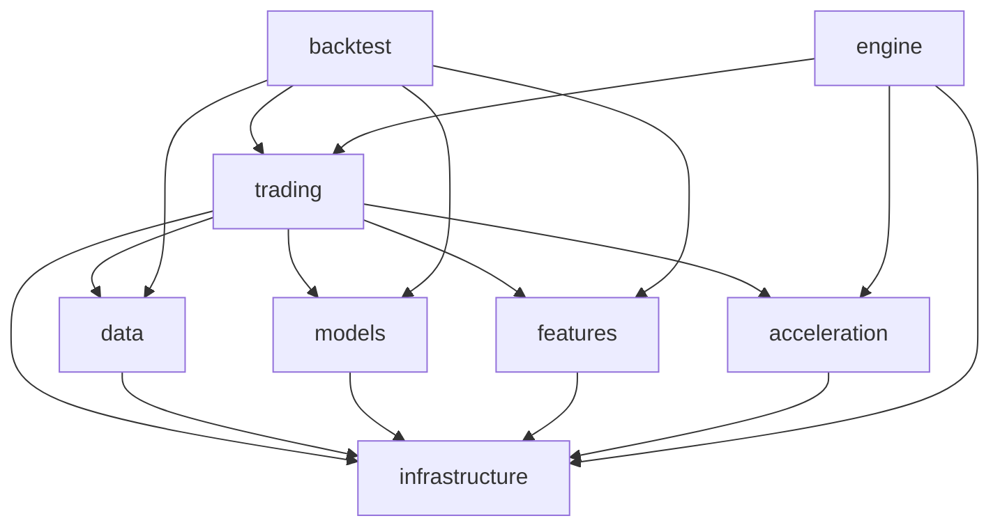
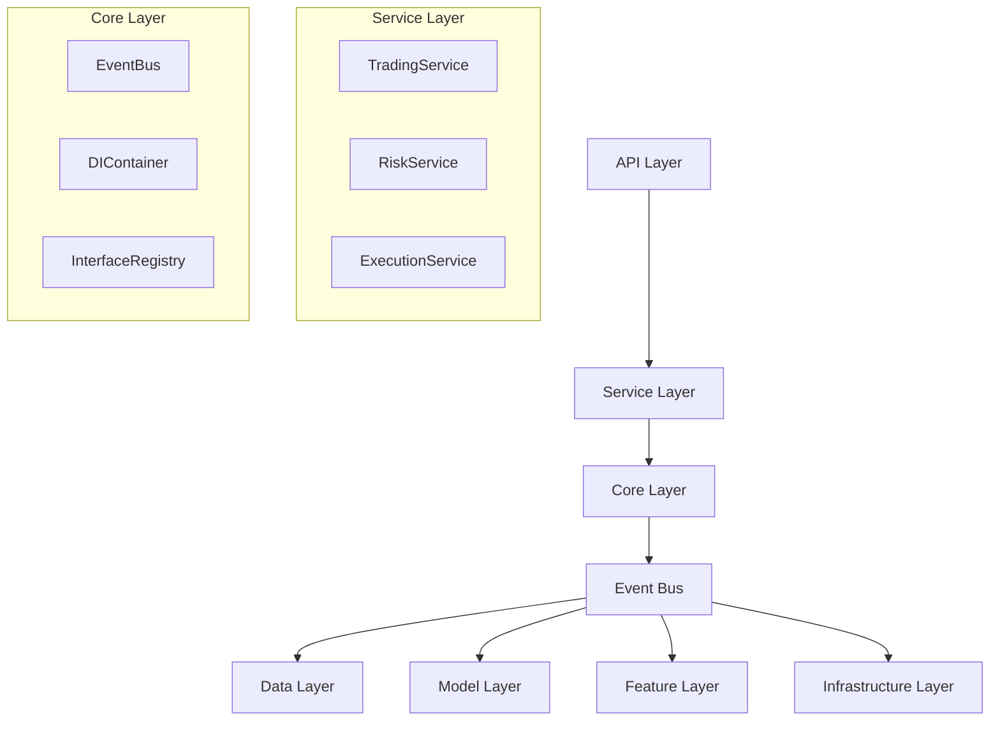

# RQA2025 架构评估分析报告

## 1. 当前架构依赖关系分析

### 1.1 依赖关系图


### 1.2 问题识别

#### 🔴 严重问题：交易模块成为"上帝模块"
**问题描述**：
- `trading` 模块直接依赖了所有其他核心模块
- 形成了强耦合的架构，违反了单一职责原则
- 导致模块间高度耦合，难以独立测试和维护

**具体表现**：
```python
# src/trading/trading_engine.py
from src.infrastructure.monitoring import ApplicationMonitor
from src.infrastructure.error import ErrorHandler

# src/trading/risk/risk_controller.py
from src.features.processors.feature_engineer import FeatureEngineer

# src/trading/strategies/optimization/performance_tuner.py
from src.data.data_manager import DataManager
from src.features.feature_manager import FeatureManager
from src.models.model_manager import ModelManager
```

#### 🟡 中等问题：循环依赖风险
**问题描述**：
- 多个模块之间存在潜在的循环依赖
- 基础设施层被多个业务层同时依赖
- 缺乏清晰的依赖方向

#### 🟢 轻微问题：导入路径复杂
**问题描述**：
- 大量使用绝对导入路径
- 导入路径过长，影响代码可读性
- 缺乏统一的导入规范

## 2. 改进建议

### 2.1 引入中间层解耦

#### 方案A：事件总线架构
```python
# src/core/event_bus.py
from typing import Dict, List, Callable
from enum import Enum

class EventType(Enum):
    DATA_READY = "data_ready"
    SIGNAL_GENERATED = "signal_generated"
    ORDER_CREATED = "order_created"
    RISK_CHECKED = "risk_checked"
    EXECUTION_COMPLETED = "execution_completed"

class EventBus:
    def __init__(self):
        self._subscribers: Dict[EventType, List[Callable]] = {}
    
    def subscribe(self, event_type: EventType, handler: Callable):
        if event_type not in self._subscribers:
            self._subscribers[event_type] = []
        self._subscribers[event_type].append(handler)
    
    def publish(self, event_type: EventType, data: dict):
        if event_type in self._subscribers:
            for handler in self._subscribers[event_type]:
                handler(data)
```

#### 方案B：服务层架构
```python
# src/core/services/trading_service.py
class TradingService:
    def __init__(self, event_bus: EventBus):
        self.event_bus = event_bus
        self.data_service = DataService()
        self.model_service = ModelService()
        self.feature_service = FeatureService()
    
    def execute_strategy(self, strategy_config: dict):
        # 通过事件总线协调各个服务
        data = self.data_service.get_market_data()
        self.event_bus.publish(EventType.DATA_READY, data)
        
        features = self.feature_service.extract_features(data)
        self.event_bus.publish(EventType.SIGNAL_GENERATED, features)
        
        signals = self.model_service.predict(features)
        return signals
```

### 2.2 依赖注入容器

```python
# src/core/container.py
from dependency_injector import containers, providers
from src.infrastructure.config import ConfigManager
from src.data.data_manager import DataManager
from src.models.model_manager import ModelManager
from src.features.feature_manager import FeatureManager

class Container(containers.DeclarativeContainer):
    config = providers.Singleton(ConfigManager)
    
    data_manager = providers.Singleton(
        DataManager,
        config=config
    )
    
    model_manager = providers.Singleton(
        ModelManager,
        config=config
    )
    
    feature_manager = providers.Singleton(
        FeatureManager,
        config=config
    )
    
    trading_engine = providers.Singleton(
        TradingEngine,
        data_manager=data_manager,
        model_manager=model_manager,
        feature_manager=feature_manager
    )
```

### 2.3 接口抽象层

```python
# src/core/interfaces/data_interface.py
from abc import ABC, abstractmethod
from typing import Dict, List

class IDataProvider(ABC):
    @abstractmethod
    def get_market_data(self, symbols: List[str]) -> Dict:
        pass
    
    @abstractmethod
    def get_historical_data(self, symbol: str, start_date: str, end_date: str) -> Dict:
        pass

# src/core/interfaces/model_interface.py
class IModelProvider(ABC):
    @abstractmethod
    def predict(self, features: Dict) -> Dict:
        pass
    
    @abstractmethod
    def train(self, data: Dict) -> bool:
        pass

# src/core/interfaces/feature_interface.py
class IFeatureProvider(ABC):
    @abstractmethod
    def extract_features(self, data: Dict) -> Dict:
        pass
    
    @abstractmethod
    def validate_features(self, features: Dict) -> bool:
        pass
```

### 2.4 重构后的架构



## 3. 实施计划

### 3.1 第一阶段：引入事件总线
**目标**：解耦交易模块与其他模块的直接依赖
**时间**：2-3周
**任务**：
1. 实现事件总线核心功能
2. 重构交易引擎，使用事件驱动
3. 更新相关测试

### 3.2 第二阶段：依赖注入
**目标**：统一依赖管理
**时间**：2-3周
**任务**：
1. 引入依赖注入容器
2. 定义接口抽象
3. 重构服务层

### 3.3 第三阶段：服务层重构
**目标**：建立清晰的服务边界
**时间**：3-4周
**任务**：
1. 实现服务层架构
2. 重构现有模块
3. 完善测试覆盖

### 3.4 第四阶段：性能优化
**目标**：确保重构后的性能
**时间**：1-2周
**任务**：
1. 性能测试
2. 瓶颈分析
3. 优化调整

## 4. 风险评估

### 4.1 技术风险
- **事件总线复杂性**：可能增加系统复杂度
- **性能影响**：事件驱动可能带来性能开销
- **调试困难**：异步事件流可能增加调试难度

### 4.2 业务风险
- **开发周期延长**：重构需要额外时间
- **功能回归**：重构过程中可能引入bug
- **团队学习成本**：新架构需要团队适应

### 4.3 缓解措施
- **渐进式重构**：分阶段实施，降低风险
- **充分测试**：每个阶段都有完整的测试覆盖
- **文档完善**：详细记录架构变更和最佳实践
- **团队培训**：提供架构培训和技术支持

## 5. 预期收益

### 5.1 技术收益
- **解耦合**：模块间依赖关系清晰
- **可测试性**：每个模块可以独立测试
- **可维护性**：代码结构更加清晰
- **可扩展性**：新功能更容易集成

### 5.2 业务收益
- **开发效率**：并行开发成为可能
- **系统稳定性**：模块隔离降低故障影响
- **团队协作**：清晰的模块边界便于团队协作

## 6. 结论

当前架构确实存在"上帝模块"问题，trading模块承担了过多职责。建议采用事件总线+依赖注入的方案进行重构，这将显著提升系统的可维护性和可扩展性。

重构是一个渐进的过程，需要分阶段实施，确保每个阶段都有充分的测试和验证。 