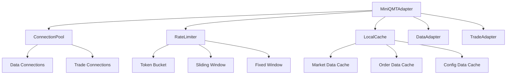
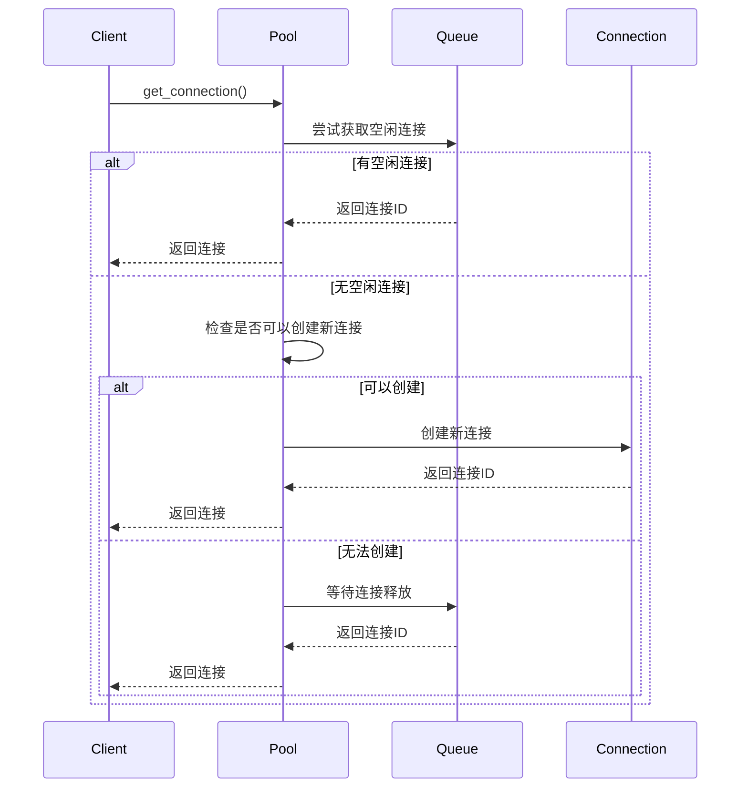

# MiniQMT增强设计文档

## 1. 概述

本文档描述了MiniQMT适配器的增强功能，包括连接池管理、限流机制和本地缓存等改进，以提升系统的可用性、性能和容错能力。

## 2. 改进目标

### 2.1 原有问题
- 频繁建立/断开连接导致性能下降
- 高频请求可能导致服务拒绝
- 网络中断时无法提供有限服务

### 2.2 改进目标
- 增加连接池管理，避免频繁建立/断开连接
- 补充限流机制，防止高频请求导致服务拒绝
- 增加本地缓存，在网络中断时提供有限服务

## 3. 架构设计

### 3.1 整体架构


### 3.2 核心组件

#### 3.2.1 连接池管理器 (ConnectionPool)
```python
class ConnectionPool:
    """MiniQMT连接池管理器"""
    
    def __init__(self, config):
        self.max_connections = config.get('max_connections', 10)
        self.min_connections = config.get('min_connections', 2)
        self.connection_timeout = config.get('connection_timeout', 30)
        self.idle_timeout = config.get('idle_timeout', 300)
        self.max_lifetime = config.get('max_lifetime', 3600)
```

**功能特性**:
- 连接复用：避免频繁建立/断开连接
- 自动管理：自动创建、释放、清理连接
- 故障恢复：连接错误时自动重新初始化
- 统计监控：提供详细的连接池统计信息

#### 3.2.2 限流器 (RateLimiter)
```python
class RateLimiter:
    """MiniQMT限流器"""
    
    def __init__(self, config):
        self.limiters = {}
        self._stats = {
            'total_requests': 0,
            'limited_requests': 0,
            'rejected_requests': 0,
            'queued_requests': 0,
            'degraded_requests': 0,
            'retry_requests': 0
        }
```

**支持的限流算法**:
- 固定窗口 (Fixed Window)
- 滑动窗口 (Sliding Window)
- 漏桶算法 (Leaky Bucket)
- 令牌桶算法 (Token Bucket)

**限流策略**:
- 直接拒绝 (REJECT)
- 排队等待 (QUEUE)
- 降级处理 (DEGRADE)
- 重试机制 (RETRY)

#### 3.2.3 本地缓存 (LocalCache)
```python
class LocalCache:
    """MiniQMT本地缓存管理器"""
    
    def __init__(self, config):
        self.max_size = config.get('max_size', 100 * 1024 * 1024)  # 100MB
        self.max_items = config.get('max_items', 10000)
        self.default_ttl = config.get('default_ttl', 300)
        self.strategy = CacheStrategy(config.get('strategy', 'lru'))
```

**缓存类型**:
- 行情数据缓存 (MARKET_DATA)
- 订单数据缓存 (ORDER_DATA)
- 账户数据缓存 (ACCOUNT_DATA)
- 配置数据缓存 (CONFIG_DATA)

**缓存策略**:
- 最近最少使用 (LRU)
- 最少使用频率 (LFU)
- 先进先出 (FIFO)
- 基于时间过期 (TTL)

## 4. 实现细节

### 4.1 连接池实现

#### 4.1.1 连接状态管理
```python
class ConnectionStatus(Enum):
    IDLE = "idle"          # 空闲
    BUSY = "busy"          # 忙碌
    ERROR = "error"         # 错误
    CLOSED = "closed"       # 已关闭
```

#### 4.1.2 连接信息
```python
@dataclass
class ConnectionInfo:
    connection_id: str
    connection_type: ConnectionType
    status: ConnectionStatus
    created_time: float
    last_used_time: float
    error_count: int = 0
    max_retries: int = 3
```

#### 4.1.3 连接获取流程


### 4.2 限流器实现

#### 4.2.1 令牌桶算法
```python
class TokenBucketLimiter:
    def __init__(self, config):
        self.capacity = config.max_requests
        self.tokens = config.max_requests
        self.refill_rate = config.max_requests / config.time_window
        self.last_refill_time = time.time()
    
    def is_allowed(self, request_id=None):
        current_time = time.time()
        time_passed = current_time - self.last_refill_time
        new_tokens = time_passed * self.refill_rate
        
        self.tokens = min(self.capacity, self.tokens + new_tokens)
        self.last_refill_time = current_time
        
        if self.tokens >= 1:
            self.tokens -= 1
            return True
        return False
```

#### 4.2.2 滑动窗口算法
```python
class SlidingWindowLimiter:
    def __init__(self, config):
        self.max_requests = config.max_requests
        self.time_window = config.time_window
        self.requests = deque()
    
    def is_allowed(self, request_id=None):
        current_time = time.time()
        
        # 清理过期请求
        while self.requests and current_time - self.requests[0] > self.time_window:
            self.requests.popleft()
        
        if len(self.requests) < self.max_requests:
            self.requests.append(current_time)
            return True
        return False
```

### 4.3 本地缓存实现

#### 4.3.1 缓存项结构
```python
@dataclass
class CacheItem:
    key: str
    value: Any
    cache_type: CacheType
    created_time: float
    last_access_time: float
    access_count: int = 0
    ttl: Optional[float] = None
    size: int = 0
```

#### 4.3.2 缓存淘汰策略
```python
def _evict_items(self, required_size: int, count: int = 0):
    if self.strategy == CacheStrategy.LRU:
        # 移除最久未使用的项
        while (self._current_size + required_size > self.max_size or 
               (count > 0 and len(self._cache) > self.max_items - count)):
            if not self._cache:
                break
            key = next(iter(self._cache))
            self._remove_item(key)
            self._stats['evictions'] += 1
```

## 5. 配置示例

### 5.1 完整配置
```yaml
miniqmt:
  data:
    host: 127.0.0.1
    port: 6001
    timeout: 10
    reconnect_interval: 5
  trade:
    account: "123456789"
    trade_server: "tcp://127.0.0.1:6002"
    cert_file: "/path/to/cert.pem"
    heartbeat_interval: 30
  connection_pool:
    max_connections: 10
    min_connections: 2
    connection_timeout: 30
    idle_timeout: 300
    max_lifetime: 3600
  rate_limit:
    strategy: "lru"
  local_cache:
    max_size: 100MB
    max_items: 10000
    default_ttl: 300
    strategy: "lru"
    persistence_enabled: true
    persistence_file: "miniqmt_cache.dat"
    persistence_interval: 60
```

### 5.2 限流配置
```python
# 数据查询限流
data_query_config = RateLimitConfig(
    limit_type=RateLimitType.TOKEN_BUCKET,
    max_requests=100,
    time_window=60,
    strategy=RateLimitStrategy.QUEUE
)

# 交易操作限流
trade_config = RateLimitConfig(
    limit_type=RateLimitType.SLIDING_WINDOW,
    max_requests=50,
    time_window=60,
    strategy=RateLimitStrategy.REJECT
)

# 连接获取限流
connection_config = RateLimitConfig(
    limit_type=RateLimitType.FIXED_WINDOW,
    max_requests=20,
    time_window=60,
    strategy=RateLimitStrategy.RETRY
)
```

## 6. 使用示例

### 6.1 基本使用
```python
from src.adapters.miniqmt.adapter import MiniQMTAdapter

# 创建适配器
config = {
    'connection_pool': {'max_connections': 10},
    'rate_limit': {'strategy': 'lru'},
    'local_cache': {'max_size': '100MB'}
}

adapter = MiniQMTAdapter(config)

# 使用上下文管理器
with adapter:
    # 连接服务
    adapter.connect()
    
    # 订阅行情
    adapter.subscribe_market_data(['600001.SH'])
    
    # 获取实时数据
    data = adapter.get_realtime_data(['600001.SH'])
    
    # 发送订单
    order = {
        'symbol': '600001.SH',
        'price': 10.0,
        'quantity': 100,
        'order_type': 'LIMIT'
    }
    order_id = adapter.send_order(order)
    
    # 获取统计信息
    stats = adapter.get_comprehensive_stats()
    print(f"连接池统计: {stats['connection_pool']}")
    print(f"限流统计: {stats['rate_limit']}")
    print(f"缓存统计: {stats['cache']}")
```

### 6.2 降级处理
```python
# 网络故障时的降级处理
try:
    data = adapter.get_realtime_data(['600001.SH'])
except ConnectionError:
    # 自动降级到缓存数据
    cached_data = adapter._get_cached_data(['600001.SH'])
    print(f"使用缓存数据: {cached_data}")
```

### 6.3 监控和统计
```python
# 获取连接池统计
pool_stats = adapter.get_connection_pool_stats()
print(f"总连接数: {pool_stats['total_connections']}")
print(f"活跃连接数: {pool_stats['active_connections']}")
print(f"空闲连接数: {pool_stats['idle_connections']}")

# 获取限流统计
rate_stats = adapter.get_rate_limit_stats()
print(f"总请求数: {rate_stats['total_requests']}")
print(f"被限流请求数: {rate_stats['limited_requests']}")
print(f"被拒绝请求数: {rate_stats['rejected_requests']}")

# 获取缓存统计
cache_stats = adapter.get_cache_stats()
print(f"缓存项数: {cache_stats['total_items']}")
print(f"命中率: {cache_stats['hit_rate']:.2%}")
print(f"淘汰次数: {cache_stats['evictions']}")
```

## 7. 性能优化

### 7.1 连接池优化
- **连接复用**: 减少连接建立/断开的开销
- **自动清理**: 定期清理过期和错误连接
- **负载均衡**: 在多个连接间分配请求

### 7.2 限流优化
- **多级限流**: 不同操作使用不同的限流策略
- **智能降级**: 限流时自动降级到缓存
- **动态调整**: 根据系统负载动态调整限流参数

### 7.3 缓存优化
- **分层缓存**: 内存缓存 + 持久化缓存
- **智能淘汰**: 根据访问模式智能淘汰缓存项
- **预加载**: 预加载常用数据到缓存

## 8. 故障处理

### 8.1 连接故障
```python
def handle_connection_error(self, connection_id, connection_type):
    """处理连接错误"""
    # 标记连接错误
    self.connection_pool.mark_connection_error(connection_id, connection_type)
    
    # 尝试重新初始化
    try:
        self.connection_pool._reinitialize_connection(connection_id, connection_type)
    except Exception as e:
        logger.error(f"重新初始化连接失败: {e}")
        # 创建新连接
        new_conn_id = self.connection_pool._create_connection(connection_type)
        return new_conn_id
```

### 8.2 限流处理
```python
def handle_rate_limit(self, operation_type):
    """处理限流"""
    if not self.rate_limiter.acquire(operation_type, timeout=5.0):
        if operation_type == 'data_query':
            # 降级到缓存
            return self._get_cached_data()
        elif operation_type == 'trade_operation':
            # 拒绝请求
            raise Exception("交易请求被限流")
        else:
            # 重试
            time.sleep(1)
            return self.handle_rate_limit(operation_type)
```

### 8.3 缓存故障
```python
def handle_cache_failure(self, operation):
    """处理缓存故障"""
    try:
        # 尝试从持久化文件恢复
        self.local_cache._load_persistence()
        return operation()
    except Exception as e:
        logger.error(f"缓存恢复失败: {e}")
        # 降级到直接访问
        return self._direct_access(operation)
```

## 9. 监控指标

### 9.1 连接池指标
- `total_connections`: 总连接数
- `active_connections`: 活跃连接数
- `idle_connections`: 空闲连接数
- `error_connections`: 错误连接数
- `connection_requests`: 连接请求数
- `connection_timeouts`: 连接超时数

### 9.2 限流指标
- `total_requests`: 总请求数
- `limited_requests`: 被限流请求数
- `rejected_requests`: 被拒绝请求数
- `queued_requests`: 排队请求数
- `degraded_requests`: 降级请求数
- `retry_requests`: 重试请求数

### 9.3 缓存指标
- `total_items`: 缓存项总数
- `current_size`: 当前缓存大小
- `hits`: 缓存命中次数
- `misses`: 缓存未命中次数
- `evictions`: 缓存淘汰次数
- `expirations`: 缓存过期次数
- `hit_rate`: 缓存命中率

## 10. 测试验证

### 10.1 单元测试
```python
def test_connection_pool_integration(self, adapter):
    """测试连接池集成"""
    data_conn_id = adapter.connection_pool.get_connection(ConnectionType.DATA)
    trade_conn_id = adapter.connection_pool.get_connection(ConnectionType.TRADE)
    
    assert data_conn_id is not None
    assert trade_conn_id is not None
    
    stats = adapter.get_connection_pool_stats()
    assert stats['active_connections'] >= 2
```

### 10.2 集成测试
```python
def test_enhanced_send_order(self, adapter):
    """测试增强的下单功能"""
    order = {
        'symbol': '600001.SH',
        'price': 10.0,
        'quantity': 100,
        'order_type': 'LIMIT'
    }
    
    order_id = adapter.send_order(order)
    assert order_id == 'ORDER123'
    
    # 验证连接池和限流使用
    pool_stats = adapter.get_connection_pool_stats()
    rate_stats = adapter.get_rate_limit_stats()
    assert pool_stats['connection_requests'] >= 1
    assert rate_stats['total_requests'] >= 1
```

### 10.3 压力测试
```python
def test_high_concurrency(self, adapter):
    """测试高并发场景"""
    import threading
    
    def worker():
        for i in range(100):
            try:
                data = adapter.get_realtime_data(['600001.SH'])
                assert '600001.SH' in data
            except Exception as e:
                print(f"Worker error: {e}")
    
    threads = [threading.Thread(target=worker) for _ in range(10)]
    for t in threads:
        t.start()
    for t in threads:
        t.join()
    
    # 验证统计信息
    stats = adapter.get_comprehensive_stats()
    assert stats['rate_limit']['total_requests'] >= 1000
```

## 11. 部署建议

### 11.1 配置优化
- 根据实际负载调整连接池大小
- 根据业务需求设置合适的限流参数
- 根据数据量设置合理的缓存大小

### 11.2 监控告警
- 设置连接池使用率告警
- 设置限流触发告警
- 设置缓存命中率告警

### 11.3 故障恢复
- 实现自动重连机制
- 实现缓存数据恢复
- 实现降级服务策略

## 12. 总结

通过引入连接池管理、限流机制和本地缓存，MiniQMT适配器的可用性、性能和容错能力得到了显著提升：

1. **连接池管理**: 避免了频繁建立/断开连接，提升了性能
2. **限流机制**: 防止了高频请求导致的服务拒绝，保护了系统稳定性
3. **本地缓存**: 在网络中断时提供了有限服务，增强了容错能力

这些改进使得MiniQMT适配器能够更好地应对高并发、网络故障等挑战，为交易系统提供了更加可靠的数据和交易服务。 