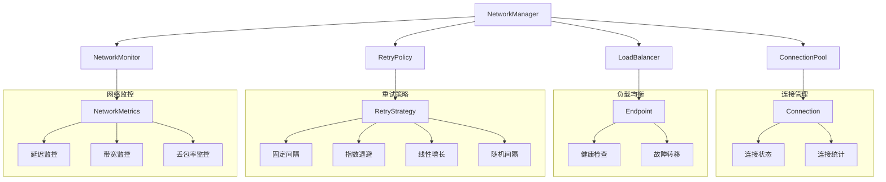

# 网络管理架构设计

## 📋 概述

网络管理模块是RQA2025系统的基础设施层核心组件，提供完整的网络服务能力，包括连接池管理、负载均衡、重试策略和网络监控。

## 🏗️ 架构设计

### 整体架构


### 核心组件

#### 1. NetworkManager - 统一网络管理接口
```python
class NetworkManager:
    """统一网络管理接口"""
    
    def __init__(self, max_connections=20, 
                 load_balancing_strategy=LoadBalancingStrategy.ROUND_ROBIN,
                 retry_strategy=RetryStrategy.EXPONENTIAL):
        self.connection_pool = ConnectionPool(max_connections)
        self.load_balancer = LoadBalancer(strategy=load_balancing_strategy)
        self.retry_policy = RetryPolicy(strategy=retry_strategy)
        self.network_monitor = NetworkMonitor()
    
    def add_endpoint(self, name: str, url: str, weight: int = 1):
        """添加端点"""
        self.load_balancer.add_endpoint(url, weight)
        self.network_monitor.add_monitoring_target(url)
    
    def execute_request(self, request_func, endpoint_name=None, client_ip=None):
        """执行网络请求"""
        endpoint = self.load_balancer.get_endpoint(client_ip)
        connection = self.connection_pool.get_connection(endpoint.url)
        
        try:
            result = self.retry_policy.execute_with_retry(
                lambda: request_func(connection)
            )
            return result
        finally:
            self.connection_pool.release_connection(connection)
    
    def get_network_health(self):
        """获取网络健康状态"""
        return {
            'overall_health': self.network_monitor.get_overall_health(),
            'components': {
                'connection_pool': self.connection_pool.get_health(),
                'load_balancer': self.load_balancer.get_health(),
                'network_monitor': self.network_monitor.get_health()
            },
            'recommendations': self._get_recommendations()
        }
```

#### 2. ConnectionPool - 连接池管理
```python
class ConnectionPool:
    """连接池管理"""
    
    def __init__(self, max_connections=20, min_connections=5):
        self.max_connections = max_connections
        self.min_connections = min_connections
        self.connections = {}
        self.stats = {
            'total_connections': 0,
            'active_connections': 0,
            'idle_connections': 0,
            'error_connections': 0
        }
    
    def get_connection(self, endpoint: str) -> Connection:
        """获取连接"""
        # 查找可用连接
        available_connection = self._find_available_connection(endpoint)
        if available_connection:
            available_connection.status = ConnectionStatus.BUSY
            self.stats['active_connections'] += 1
            return available_connection
        
        # 创建新连接
        if len(self.connections) < self.max_connections:
            new_connection = self._create_connection(endpoint)
            self.connections[new_connection.id] = new_connection
            self.stats['total_connections'] += 1
            self.stats['active_connections'] += 1
            return new_connection
        
        raise ConnectionPoolExhaustedError(f"连接池已满: {self.max_connections}")
    
    def release_connection(self, connection: Connection):
        """释放连接"""
        if connection.id in self.connections:
            connection.status = ConnectionStatus.IDLE
            self.stats['active_connections'] -= 1
            self.stats['idle_connections'] += 1
```

#### 3. LoadBalancer - 负载均衡器
```python
class LoadBalancer:
    """负载均衡器"""
    
    def __init__(self, strategy=LoadBalancingStrategy.ROUND_ROBIN):
        self.strategy = strategy
        self.endpoints = []
        self.current_index = 0
        self.stats = {
            'total_requests': 0,
            'successful_requests': 0,
            'failed_requests': 0
        }
    
    def add_endpoint(self, url: str, weight: int = 1):
        """添加端点"""
        endpoint = Endpoint(url=url, weight=weight)
        self.endpoints.append(endpoint)
    
    def get_endpoint(self, client_ip: str = None) -> Endpoint:
        """获取端点"""
        healthy_endpoints = [ep for ep in self.endpoints if ep.is_healthy]
        if not healthy_endpoints:
            raise NetworkUnavailableError("没有健康的端点")
        
        self.stats['total_requests'] += 1
        
        if self.strategy == LoadBalancingStrategy.ROUND_ROBIN:
            return self._round_robin_select(healthy_endpoints)
        elif self.strategy == LoadBalancingStrategy.LEAST_CONNECTIONS:
            return self._least_connections_select(healthy_endpoints)
        elif self.strategy == LoadBalancingStrategy.WEIGHTED_ROUND_ROBIN:
            return self._weighted_round_robin_select(healthy_endpoints)
        elif self.strategy == LoadBalancingStrategy.RANDOM:
            return self._random_select(healthy_endpoints)
        elif self.strategy == LoadBalancingStrategy.IP_HASH:
            return self._ip_hash_select(healthy_endpoints, client_ip)
        else:
            return healthy_endpoints[0]
```

#### 4. RetryPolicy - 重试策略
```python
class RetryPolicy:
    """重试策略"""
    
    def __init__(self, max_retries=3, base_delay=1.0, 
                 strategy=RetryStrategy.EXPONENTIAL):
        self.max_retries = max_retries
        self.base_delay = base_delay
        self.strategy = strategy
        self.stats = {
            'total_retries': 0,
            'successful_retries': 0,
            'failed_retries': 0,
            'total_delay': 0.0
        }
    
    def execute_with_retry(self, func, *args, **kwargs):
        """执行带重试的函数"""
        last_exception = None
        
        for attempt in range(self.max_retries + 1):
            try:
                result = func(*args, **kwargs)
                
                if attempt > 0:
                    self.stats['successful_retries'] += 1
                
                return result
                
            except Exception as e:
                last_exception = e
                self.stats['total_retries'] += 1
                
                if attempt < self.max_retries:
                    delay = self._calculate_delay(attempt)
                    self.stats['total_delay'] += delay
                    time.sleep(delay)
                else:
                    self.stats['failed_retries'] += 1
        
        raise RetryPolicyExhaustedError(f"重试策略耗尽: {self.max_retries}") from last_exception
    
    def _calculate_delay(self, attempt: int) -> float:
        """计算延迟时间"""
        if self.strategy == RetryStrategy.FIXED:
            return self.base_delay
        elif self.strategy == RetryStrategy.EXPONENTIAL:
            return min(self.base_delay * (2 ** attempt), 60.0)
        elif self.strategy == RetryStrategy.LINEAR:
            return min(self.base_delay * (attempt + 1), 60.0)
        elif self.strategy == RetryStrategy.RANDOM:
            return random.uniform(0.1, self.base_delay * (2 ** attempt))
        else:
            return self.base_delay
```

#### 5. NetworkMonitor - 网络监控
```python
class NetworkMonitor:
    """网络监控"""
    
    def __init__(self, check_interval=30.0):
        self.check_interval = check_interval
        self.monitoring_targets = []
        self.metrics_history = deque(maxlen=1000)
        self.stats = {
            'health_checks': 0,
            'failed_checks': 0,
            'total_latency': 0.0
        }
    
    def add_monitoring_target(self, target: str):
        """添加监控目标"""
        self.monitoring_targets.append(target)
    
    def get_current_metrics(self) -> NetworkMetrics:
        """获取当前网络指标"""
        return NetworkMetrics(
            latency=self._measure_latency(),
            bandwidth=self._measure_bandwidth(),
            packet_loss=self._measure_packet_loss(),
            jitter=self._measure_jitter()
        )
    
    def check_network_health(self) -> dict:
        """检查网络健康状态"""
        self.stats['health_checks'] += 1
        
        try:
            metrics = self.get_current_metrics()
            self.metrics_history.append(metrics)
            
            health_status = {
                'overall_health': self._calculate_overall_health(metrics),
                'latency_health': self._check_latency_health(metrics.latency),
                'bandwidth_health': self._check_bandwidth_health(metrics.bandwidth),
                'packet_loss_health': self._check_packet_loss_health(metrics.packet_loss),
                'recommendations': self._get_health_recommendations(metrics)
            }
            
            return health_status
            
        except Exception as e:
            self.stats['failed_checks'] += 1
            return {
                'overall_health': 'unhealthy',
                'error': str(e),
                'recommendations': ['检查网络连接', '验证监控目标']
            }
```

## 🔧 配置管理

### 网络管理器配置
```yaml
network:
  manager:
    max_connections: 20
    min_connections: 5
    connection_timeout: 30.0
    idle_timeout: 300.0
    
  load_balancer:
    strategy: "round_robin"  # round_robin, least_connections, weighted_round_robin, random, ip_hash
    health_check_interval: 30.0
    health_check_timeout: 5.0
    
  retry_policy:
    max_retries: 3
    base_delay: 1.0
    max_delay: 60.0
    strategy: "exponential"  # fixed, exponential, linear, random
    jitter: true
    
  monitor:
    check_interval: 30.0
    metrics_history_size: 1000
    alert_thresholds:
      latency: 1000  # ms
      packet_loss: 0.05  # 5%
      bandwidth: 0.8  # 80% of expected
```

### 端点配置
```yaml
endpoints:
  - name: "api_server_1"
    url: "http://api1.example.com"
    weight: 2
    max_connections: 10
    health_check_url: "http://api1.example.com/health"
    
  - name: "api_server_2"
    url: "http://api2.example.com"
    weight: 1
    max_connections: 5
    health_check_url: "http://api2.example.com/health"
```

## 📊 监控指标

### 连接池指标
```python
connection_pool_metrics = {
    'total_connections': 15,
    'active_connections': 8,
    'idle_connections': 6,
    'error_connections': 1,
    'connection_requests': 150,
    'connection_timeouts': 2,
    'connection_utilization': 0.53  # 8/15
}
```

### 负载均衡指标
```python
load_balancer_metrics = {
    'total_requests': 1000,
    'successful_requests': 985,
    'failed_requests': 15,
    'health_checks': 50,
    'endpoint_failures': 3,
    'endpoints': {
        'total': 3,
        'healthy': 2,
        'unhealthy': 1
    }
}
```

### 重试策略指标
```python
retry_policy_metrics = {
    'total_retries': 45,
    'successful_retries': 38,
    'failed_retries': 7,
    'total_delay': 125.5,
    'average_delay': 2.79,
    'retry_success_rate': 0.84  # 38/45
}
```

### 网络监控指标
```python
network_monitor_metrics = {
    'health_checks': 100,
    'failed_checks': 5,
    'total_latency': 5000.0,
    'average_latency': 50.0,
    'current_metrics': {
        'latency': 45.2,
        'bandwidth': 0.85,
        'packet_loss': 0.02,
        'jitter': 5.1
    }
}
```

## 🚀 使用示例

### 基本使用
```python
from src.infrastructure.network import NetworkManager
from src.infrastructure.network import LoadBalancingStrategy, RetryStrategy

# 创建网络管理器
network_manager = NetworkManager(
    max_connections=20,
    load_balancing_strategy=LoadBalancingStrategy.ROUND_ROBIN,
    retry_strategy=RetryStrategy.EXPONENTIAL
)

# 添加端点
network_manager.add_endpoint("api_server_1", "http://api1.example.com", weight=2)
network_manager.add_endpoint("api_server_2", "http://api2.example.com", weight=1)

# 执行请求
def api_request(connection):
    # 使用连接执行API请求
    return connection.get("/api/data")

try:
    result = network_manager.execute_request(api_request)
    print(f"请求成功: {result}")
except Exception as e:
    print(f"请求失败: {e}")

# 获取网络健康状态
health = network_manager.get_network_health()
print(f"网络健康状态: {health}")
```

### 高级配置
```python
# 自定义重试策略
from src.infrastructure.network import RetryPolicy, RetryStrategy

retry_policy = RetryPolicy(
    max_retries=5,
    base_delay=0.5,
    strategy=RetryStrategy.EXPONENTIAL
)

# 自定义负载均衡器
from src.infrastructure.network import LoadBalancer, LoadBalancingStrategy

load_balancer = LoadBalancer(strategy=LoadBalancingStrategy.LEAST_CONNECTIONS)

# 自定义连接池
from src.infrastructure.network import ConnectionPool

connection_pool = ConnectionPool(
    max_connections=50,
    min_connections=10,
    connection_timeout=60.0,
    idle_timeout=600.0
)
```

## 🔍 故障诊断

### 常见问题

#### 1. 连接池耗尽
**症状**: `ConnectionPoolExhaustedError: 连接池已满`
**解决方案**:
- 增加最大连接数
- 检查连接释放逻辑
- 优化连接复用

#### 2. 网络不可用
**症状**: `NetworkUnavailableError: 没有健康的端点`
**解决方案**:
- 检查端点健康状态
- 验证网络连接
- 调整健康检查参数

#### 3. 重试策略耗尽
**症状**: `RetryPolicyExhaustedError: 重试策略耗尽`
**解决方案**:
- 增加最大重试次数
- 调整重试延迟策略
- 检查目标服务状态

### 性能优化

#### 1. 连接池优化
```python
# 根据负载调整连接池大小
if load > 0.8:
    connection_pool.max_connections = 50
elif load < 0.3:
    connection_pool.max_connections = 10
```

#### 2. 负载均衡优化
```python
# 根据响应时间动态调整权重
for endpoint in load_balancer.endpoints:
    if endpoint.response_time > 1000:  # 1秒
        endpoint.weight = max(1, endpoint.weight - 1)
    elif endpoint.response_time < 100:  # 100毫秒
        endpoint.weight = min(10, endpoint.weight + 1)
```

#### 3. 监控告警
```python
# 设置告警阈值
if network_monitor.get_current_metrics().latency > 1000:
    send_alert("网络延迟过高", {"latency": metrics.latency})

if network_monitor.get_current_metrics().packet_loss > 0.05:
    send_alert("丢包率过高", {"packet_loss": metrics.packet_loss})
```

## 📝 总结

网络管理模块提供了完整的网络服务能力：

### ✅ 核心功能
- **连接池管理**: 连接复用，减少开销
- **负载均衡**: 5种负载均衡策略
- **重试策略**: 4种重试策略，智能延迟
- **网络监控**: 性能监控和健康检查

### ✅ 技术特点
- **线程安全**: 并发安全的实现
- **高性能**: 连接复用和智能调度
- **可扩展**: 支持策略模式扩展
- **可监控**: 详细的统计和监控

### ✅ 生产就绪
- **错误处理**: 完整的异常处理机制
- **健康检查**: 自动健康检查和故障转移
- **性能优化**: 连接池和负载均衡优化
- **监控告警**: 实时监控和告警机制

---

*文档版本: v1.0*  
*最后更新: 2025-07-20*  
*状态: ✅ 生产就绪* 