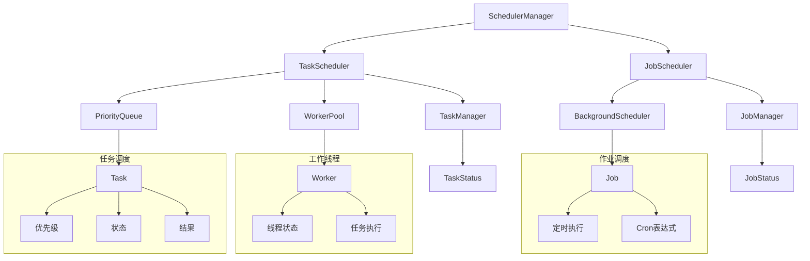

# 任务调度架构设计

## 📋 概述

任务调度模块是RQA2025系统的基础设施层核心组件，提供高效的任务调度和作业管理能力，包括任务调度器、优先级队列、作业调度器和调度器管理。

## 🏗️ 架构设计

### 整体架构


### 核心组件

#### 1. SchedulerManager - 统一调度器管理
```python
class SchedulerManager:
    """统一调度器管理接口"""
    
    def __init__(self):
        self.task_scheduler = TaskScheduler(max_workers=10, queue_size=1000)
        self.job_scheduler = JobScheduler()
        self.stats = {
            'total_tasks': 0,
            'total_jobs': 0,
            'completed_tasks': 0,
            'completed_jobs': 0,
            'failed_tasks': 0,
            'failed_jobs': 0
        }
    
    def submit_task(self, name: str, func, priority: TaskPriority = TaskPriority.NORMAL) -> str:
        """提交任务"""
        task_id = self.task_scheduler.submit_task(name, func, priority)
        self.stats['total_tasks'] += 1
        return task_id
    
    def schedule_job(self, job_id: str, func, schedule: str) -> str:
        """调度作业"""
        job_id = self.job_scheduler.schedule_job(job_id, func, schedule)
        self.stats['total_jobs'] += 1
        return job_id
    
    def get_task_scheduler(self) -> TaskScheduler:
        """获取任务调度器"""
        return self.task_scheduler
    
    def get_job_scheduler(self) -> JobScheduler:
        """获取作业调度器"""
        return self.job_scheduler
    
    def get_stats(self) -> dict:
        """获取统计信息"""
        task_stats = self.task_scheduler.get_stats()
        job_stats = self.job_scheduler.get_stats()
        
        return {
            **self.stats,
            'task_scheduler': task_stats,
            'job_scheduler': job_stats
        }
```

#### 2. TaskScheduler - 任务调度器
```python
class TaskScheduler:
    """任务调度器"""
    
    def __init__(self, max_workers=10, queue_size=1000):
        self.max_workers = max_workers
        self.queue_size = queue_size
        self.priority_queue = PriorityQueue(max_size=queue_size)
        self.tasks = {}
        self.workers = []
        self.running = False
        self.stats = {
            'total_tasks': 0,
            'completed_tasks': 0,
            'failed_tasks': 0,
            'cancelled_tasks': 0,
            'active_workers': 0,
            'queue_size': 0
        }
    
    def start(self):
        """启动调度器"""
        if not self.running:
            self.running = True
            self._start_workers()
    
    def stop(self):
        """停止调度器"""
        if self.running:
            self.running = False
            self._stop_workers()
    
    def submit_task(self, name: str, func, priority: TaskPriority = TaskPriority.NORMAL) -> str:
        """提交任务"""
        task_id = f"task_{uuid.uuid4().hex[:8]}"
        
        task = Task(
            id=task_id,
            name=name,
            priority=priority,
            func=func,
            status=TaskStatus.PENDING,
            created_at=time.time()
        )
        
        # 添加到优先级队列
        if self.priority_queue.put(task):
            self.tasks[task_id] = task
            self.stats['total_tasks'] += 1
            self.stats['queue_size'] = self.priority_queue.size()
            return task_id
        else:
            raise QueueFullError(f"任务队列已满: {self.queue_size}")
    
    def cancel_task(self, task_id: str) -> bool:
        """取消任务"""
        if task_id in self.tasks:
            task = self.tasks[task_id]
            if task.status == TaskStatus.PENDING:
                self.priority_queue.remove(task_id)
                task.status = TaskStatus.CANCELLED
                self.stats['cancelled_tasks'] += 1
                self.stats['queue_size'] = self.priority_queue.size()
                return True
        return False
    
    def get_task_status(self, task_id: str) -> TaskStatus:
        """获取任务状态"""
        if task_id in self.tasks:
            return self.tasks[task_id].status
        raise TaskNotFoundException(f"任务未找到: {task_id}")
    
    def get_task_result(self, task_id: str):
        """获取任务结果"""
        if task_id in self.tasks:
            task = self.tasks[task_id]
            if task.status == TaskStatus.COMPLETED:
                return task.result
            elif task.status == TaskStatus.FAILED:
                raise task.exception
            else:
                raise TaskNotCompletedError(f"任务未完成: {task_id}")
        raise TaskNotFoundException(f"任务未找到: {task_id}")
```

#### 3. PriorityQueue - 优先级队列
```python
class PriorityQueue:
    """优先级队列"""
    
    def __init__(self, max_size=1000):
        self.max_size = max_size
        self.queue = []
        self.task_map = {}
        self.stats = {
            'total_tasks': 0,
            'completed_tasks': 0,
            'failed_tasks': 0,
            'average_wait_time': 0.0
        }
    
    def put(self, task: Task) -> bool:
        """添加任务到队列"""
        if len(self.queue) >= self.max_size:
            return False
        
        if task.id in self.task_map:
            return False
        
        # 使用堆排序插入
        heapq.heappush(self.queue, (task.priority.value, task.created_at, task))
        self.task_map[task.id] = task
        
        self.stats['total_tasks'] += 1
        return True
    
    def get(self) -> Optional[Task]:
        """获取最高优先级任务"""
        if not self.queue:
            return None
        
        priority, created_at, task = heapq.heappop(self.queue)
        del self.task_map[task.id]
        
        # 更新统计信息
        wait_time = time.time() - created_at
        self.stats['average_wait_time'] = (
            (self.stats['average_wait_time'] * (self.stats['total_tasks'] - 1) + wait_time) /
            self.stats['total_tasks']
        )
        
        return task
    
    def peek(self) -> Optional[Task]:
        """查看最高优先级任务（不移除）"""
        if not self.queue:
            return None
        
        priority, created_at, task = self.queue[0]
        return task
    
    def remove(self, task_id: str) -> bool:
        """移除指定任务"""
        if task_id in self.task_map:
            task = self.task_map[task_id]
            # 从堆中移除（需要重建堆）
            self.queue = [(p, t, task_obj) for p, t, task_obj in self.queue if task_obj.id != task_id]
            heapq.heapify(self.queue)
            del self.task_map[task_id]
            return True
        return False
    
    def is_empty(self) -> bool:
        """检查队列是否为空"""
        return len(self.queue) == 0
    
    def size(self) -> int:
        """获取队列大小"""
        return len(self.queue)
```

#### 4. JobScheduler - 作业调度器
```python
class JobScheduler:
    """作业调度器"""
    
    def __init__(self):
        self.jobs = {}
        self.scheduler = BackgroundScheduler()
        self.scheduler.start()
        self.stats = {
            'total_jobs': 0,
            'active_jobs': 0,
            'completed_jobs': 0,
            'failed_jobs': 0
        }
    
    def schedule_job(self, job_id: str, func, schedule: str) -> str:
        """调度作业"""
        if job_id in self.jobs:
            raise JobAlreadyExistsError(f"作业已存在: {job_id}")
        
        try:
            # 解析Cron表达式
            cron_parts = schedule.split()
            if len(cron_parts) != 5:
                raise InvalidScheduleError(f"无效的Cron表达式: {schedule}")
            
            # 添加到调度器
            job = self.scheduler.add_job(
                func=func,
                trigger='cron',
                minute=cron_parts[0],
                hour=cron_parts[1],
                day=cron_parts[2],
                month=cron_parts[3],
                day_of_week=cron_parts[4],
                id=job_id
            )
            
            self.jobs[job_id] = {
                'job': job,
                'func': func,
                'schedule': schedule,
                'status': JobStatus.SCHEDULED,
                'created_at': time.time()
            }
            
            self.stats['total_jobs'] += 1
            self.stats['active_jobs'] += 1
            
            return job_id
            
        except Exception as e:
            raise InvalidScheduleError(f"调度作业失败: {e}")
    
    def cancel_job(self, job_id: str) -> bool:
        """取消作业"""
        if job_id in self.jobs:
            try:
                self.scheduler.remove_job(job_id)
                self.jobs[job_id]['status'] = JobStatus.CANCELLED
                self.stats['active_jobs'] -= 1
                return True
            except Exception:
                return False
        return False
    
    def get_job_status(self, job_id: str) -> JobStatus:
        """获取作业状态"""
        if job_id in self.jobs:
            return self.jobs[job_id]['status']
        raise JobNotFoundException(f"作业未找到: {job_id}")
    
    def get_stats(self) -> dict:
        """获取统计信息"""
        return {
            **self.stats,
            'scheduler_jobs': len(self.scheduler.get_jobs())
        }
```

## 🔧 配置管理

### 调度器配置
```yaml
scheduler:
  task_scheduler:
    max_workers: 10
    queue_size: 1000
    worker_timeout: 300.0
    task_timeout: 600.0
    
  job_scheduler:
    max_jobs: 100
    job_timeout: 3600.0
    timezone: "Asia/Shanghai"
    
  priority_levels:
    CRITICAL: 1
    HIGH: 2
    NORMAL: 3
    LOW: 4
    BACKGROUND: 5
```

### 任务配置
```yaml
tasks:
  - name: "data_sync"
    priority: "HIGH"
    timeout: 300
    retry_count: 3
    retry_delay: 60
    
  - name: "model_training"
    priority: "NORMAL"
    timeout: 3600
    retry_count: 1
    retry_delay: 300
    
  - name: "report_generation"
    priority: "LOW"
    timeout: 1800
    retry_count: 2
    retry_delay: 120
```

### 作业配置
```yaml
jobs:
  - id: "daily_data_sync"
    schedule: "0 2 * * *"  # 每天凌晨2点
    timeout: 1800
    enabled: true
    
  - id: "weekly_report"
    schedule: "0 9 * * 1"  # 每周一上午9点
    timeout: 3600
    enabled: true
    
  - id: "monthly_cleanup"
    schedule: "0 3 1 * *"  # 每月1号凌晨3点
    timeout: 7200
    enabled: true
```

## 📊 监控指标

### 任务调度器指标
```python
task_scheduler_metrics = {
    'total_tasks': 1500,
    'completed_tasks': 1450,
    'failed_tasks': 30,
    'cancelled_tasks': 20,
    'active_workers': 8,
    'queue_size': 45,
    'queue_stats': {
        'pending_tasks': 45,
        'running_tasks': 8,
        'average_wait_time': 12.5
    }
}
```

### 优先级队列指标
```python
priority_queue_metrics = {
    'total_tasks': 1500,
    'completed_tasks': 1450,
    'failed_tasks': 30,
    'average_wait_time': 12.5,
    'priority_distribution': {
        'CRITICAL': 50,
        'HIGH': 200,
        'NORMAL': 800,
        'LOW': 300,
        'BACKGROUND': 150
    }
}
```

### 作业调度器指标
```python
job_scheduler_metrics = {
    'total_jobs': 25,
    'active_jobs': 20,
    'completed_jobs': 150,
    'failed_jobs': 5,
    'scheduler_jobs': 20,
    'job_status_distribution': {
        'SCHEDULED': 15,
        'RUNNING': 3,
        'COMPLETED': 2,
        'FAILED': 0
    }
}
```

## 🚀 使用示例

### 基本使用
```python
from src.infrastructure.scheduler import SchedulerManager
from src.infrastructure.scheduler import TaskPriority, TaskStatus

# 创建调度器管理器
scheduler_manager = SchedulerManager()

# 提交任务
def data_sync_task():
    # 数据同步逻辑
    return "数据同步完成"

task_id = scheduler_manager.submit_task(
    name="data_sync",
    func=data_sync_task,
    priority=TaskPriority.HIGH
)

# 检查任务状态
status = scheduler_manager.get_task_scheduler().get_task_status(task_id)
print(f"任务状态: {status}")

# 获取任务结果
if status == TaskStatus.COMPLETED:
    result = scheduler_manager.get_task_scheduler().get_task_result(task_id)
    print(f"任务结果: {result}")
```

### 定时作业
```python
# 调度定时作业
def daily_report():
    # 生成日报逻辑
    return "日报生成完成"

job_id = scheduler_manager.schedule_job(
    job_id="daily_report",
    func=daily_report,
    schedule="0 9 * * *"  # 每天上午9点
)

# 检查作业状态
job_status = scheduler_manager.get_job_scheduler().get_job_status(job_id)
print(f"作业状态: {job_status}")
```

### 高级配置
```python
# 自定义任务调度器
from src.infrastructure.scheduler import TaskScheduler

task_scheduler = TaskScheduler(
    max_workers=20,
    queue_size=2000
)

# 自定义优先级队列
from src.infrastructure.scheduler import PriorityQueue

priority_queue = PriorityQueue(max_size=2000)

# 自定义作业调度器
from src.infrastructure.scheduler import JobScheduler

job_scheduler = JobScheduler()
```

## 🔍 故障诊断

### 常见问题

#### 1. 任务队列已满
**症状**: `QueueFullError: 任务队列已满`
**解决方案**:
- 增加队列大小
- 优化任务执行效率
- 调整任务优先级

#### 2. 任务超时
**症状**: `TaskTimeoutError: 任务执行超时`
**解决方案**:
- 增加任务超时时间
- 优化任务逻辑
- 实现任务分片

#### 3. 工作线程不足
**症状**: 任务执行缓慢，队列堆积
**解决方案**:
- 增加工作线程数
- 优化线程池配置
- 实现动态线程池

### 性能优化

#### 1. 线程池优化
```python
# 根据负载动态调整线程数
current_load = len(running_tasks) / max_workers
if current_load > 0.8:
    task_scheduler.max_workers = min(50, task_scheduler.max_workers + 5)
elif current_load < 0.3:
    task_scheduler.max_workers = max(5, task_scheduler.max_workers - 2)
```

#### 2. 优先级优化
```python
# 根据任务类型动态调整优先级
if task_type == "critical_business":
    priority = TaskPriority.CRITICAL
elif task_type == "data_processing":
    priority = TaskPriority.HIGH
elif task_type == "background_cleanup":
    priority = TaskPriority.BACKGROUND
```

#### 3. 监控告警
```python
# 设置告警阈值
if task_scheduler.stats['queue_size'] > 500:
    send_alert("任务队列堆积", {"queue_size": task_scheduler.stats['queue_size']})

if task_scheduler.stats['failed_tasks'] > 10:
    send_alert("任务失败率过高", {"failed_tasks": task_scheduler.stats['failed_tasks']})
```

## 📝 总结

任务调度模块提供了高效的任务调度和作业管理能力：

### ✅ 核心功能
- **任务调度**: 优先级任务调度，工作线程池管理
- **优先级队列**: 基于堆排序的高效实现
- **作业调度**: 定时任务调度，Cron表达式支持
- **调度器管理**: 统一调度接口，资源管理

### ✅ 技术特点
- **线程安全**: 并发安全的实现
- **高性能**: 基于堆排序的优先级队列
- **可扩展**: 支持动态线程池和队列大小
- **可监控**: 详细的统计和监控

### ✅ 生产就绪
- **错误处理**: 完整的异常处理机制
- **任务管理**: 任务生命周期管理
- **性能优化**: 线程池和优先级队列优化
- **监控告警**: 实时监控和告警机制

---

*文档版本: v1.0*  
*最后更新: 2025-07-20*  
*状态: ✅ 生产就绪* 