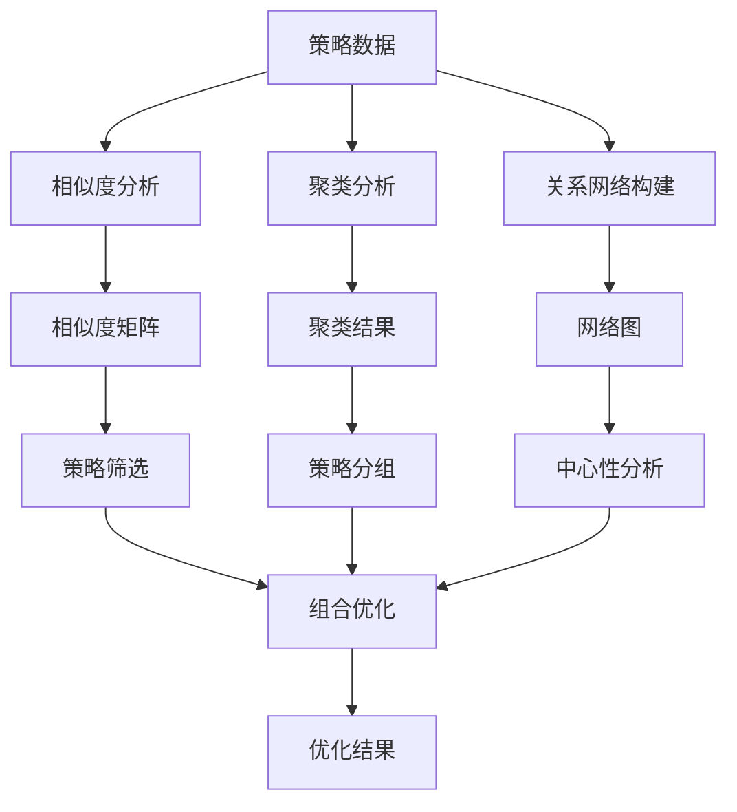

# RQA2025 高级分析模块架构设计

## 1. 模块概述

高级分析模块为RQA2025系统提供策略相似度分析、聚类分析、关系网络分析等高级分析功能，帮助用户深入理解策略间的关联关系和特征。

## 2. 核心组件

### 2.1 相似度分析器 (AdvancedSimilarityAnalyzer)
- **功能**: 多维度策略相似度分析
- **支持维度**: 收益相似度、风险相似度、交易行为相似度、模式相似度
- **算法**: 余弦相似度、皮尔逊相关系数、斯皮尔曼相关系数
- **应用场景**: 策略筛选、组合优化、风险分散

### 2.2 聚类引擎 (ClusteringEngine)
- **功能**: 策略聚类分析
- **算法**: K-means、层次聚类、DBSCAN
- **特征提取**: 收益特征、风险特征、交易行为特征
- **可视化**: 聚类结果可视化、聚类质量评估

### 2.3 关系网络分析器 (RelationshipNetwork)
- **功能**: 策略关系网络构建与分析
- **网络类型**: 加权网络、无权网络、有向网络
- **分析指标**: 中心性指标、社区检测、网络拓扑分析
- **可视化**: 网络图可视化、节点颜色映射

### 2.4 组合优化器 (PortfolioOptimizer)
- **功能**: 策略组合优化
- **优化目标**: 收益最大化、风险最小化、夏普比率最大化
- **约束条件**: 权重约束、风险约束、流动性约束
- **算法**: 遗传算法、粒子群优化、蒙特卡洛模拟

## 3. 数据流设计

### 3.1 输入数据格式
```python
strategy_data = {
    'id': 'strategy_001',
    'returns': pd.Series(...),  # 收益序列
    'risk_metrics': {
        'volatility': 0.02,
        'max_drawdown': 0.05,
        'sharpe_ratio': 1.2,
        'var_95': -0.03
    },
    'trades': pd.DataFrame({
        'size': [...],
        'pnl': [...],
        'holding_time': [...]
    })
}
```

### 3.2 分析流程


## 4. 核心算法

### 4.1 相似度计算
```python
def calculate_comprehensive_similarity(strategy1, strategy2):
    """综合相似度计算"""
    similarities = []
    
    # 收益相似度
    returns_sim = calculate_returns_similarity(
        strategy1['returns'], 
        strategy2['returns']
    )
    similarities.append(returns_sim * 0.4)
    
    # 风险相似度
    risk_sim = calculate_risk_similarity(
        strategy1['risk_metrics'], 
        strategy2['risk_metrics']
    )
    similarities.append(risk_sim * 0.3)
    
    # 行为相似度
    behavior_sim = calculate_behavior_similarity(
        strategy1['trades'], 
        strategy2['trades']
    )
    similarities.append(behavior_sim * 0.2)
    
    # 模式相似度
    pattern_sim = calculate_pattern_similarity(
        strategy1['returns'], 
        strategy2['returns']
    )
    similarities.append(pattern_sim * 0.1)
    
    return sum(similarities)
```

### 4.2 网络构建
```python
def build_network(strategies_data):
    """构建关系网络"""
    # 计算相似度矩阵
    similarity_matrix = calculate_similarity_matrix(strategies_data)
    
    # 创建网络图
    graph = nx.Graph()
    
    # 添加节点
    for strategy in strategies_data:
        graph.add_node(strategy['id'])
    
    # 添加边
    for i, strategy1 in enumerate(strategies_data):
        for j, strategy2 in enumerate(strategies_data[i+1:], i+1):
            similarity = similarity_matrix[i, j]
            if similarity >= self.similarity_threshold:
                graph.add_edge(
                    strategy1['id'], 
                    strategy2['id'], 
                    weight=similarity
                )
    
    return graph
```

### 4.3 中心性分析
```python
def find_central_strategies(graph, top_k=5):
    """查找中心策略"""
    # 计算各种中心性指标
    degree_cent = nx.degree_centrality(graph)
    betweenness_cent = nx.betweenness_centrality(graph)
    closeness_cent = nx.closeness_centrality(graph)
    
    # 综合中心性
    combined_centrality = {}
    for node in graph.nodes():
        combined_centrality[node] = (
            degree_cent[node] * 0.4 + 
            betweenness_cent[node] * 0.3 + 
            closeness_cent[node] * 0.3
        )
    
    # 排序返回top_k
    return sorted(
        combined_centrality.items(), 
        key=lambda x: x[1], 
        reverse=True
    )[:top_k]
```

## 5. 性能优化

### 5.1 计算优化
- **并行计算**: 使用多进程并行计算相似度矩阵
- **缓存机制**: 缓存中间计算结果，避免重复计算
- **增量更新**: 支持增量更新网络结构

### 5.2 内存优化
- **数据压缩**: 对大型网络数据进行压缩存储
- **分块处理**: 对大规模数据进行分块处理
- **流式处理**: 支持流式处理大规模策略数据

## 6. 扩展性设计

### 6.1 插件化架构
```python
class SimilarityCalculator(ABC):
    """相似度计算器基类"""
    
    @abstractmethod
    def calculate(self, data1, data2) -> float:
        pass

class ReturnsSimilarityCalculator(SimilarityCalculator):
    """收益相似度计算器"""
    
    def calculate(self, returns1, returns2) -> float:
        # 实现收益相似度计算
        pass
```

### 6.2 配置驱动
```python
# 配置文件示例
similarity_config = {
    'weights': {
        'returns': 0.4,
        'risk': 0.3,
        'behavior': 0.2,
        'pattern': 0.1
    },
    'methods': ['cosine', 'pearson', 'spearman'],
    'threshold': 0.3
}
```

## 7. 测试策略

### 7.1 单元测试
- **相似度计算测试**: 验证各种相似度算法的正确性
- **网络构建测试**: 验证网络构建过程的正确性
- **中心性分析测试**: 验证中心性指标计算的正确性

### 7.2 集成测试
- **端到端测试**: 验证完整分析流程
- **性能测试**: 验证大规模数据处理性能
- **边界测试**: 验证边界条件的处理

## 8. 监控与日志

### 8.1 性能监控
- **计算时间**: 监控各阶段计算时间
- **内存使用**: 监控内存使用情况
- **网络规模**: 监控网络节点和边数

### 8.2 错误处理
- **数据验证**: 验证输入数据的完整性
- **异常处理**: 处理计算过程中的异常
- **降级策略**: 提供降级处理方案

## 9. 部署与维护

### 9.1 部署配置
```yaml
# 部署配置示例
advanced_analysis:
  similarity_threshold: 0.3
  network_type: 'weighted'
  max_strategies: 1000
  cache_enabled: true
  parallel_processing: true
```

### 9.2 维护策略
- **定期清理**: 定期清理缓存和临时文件
- **性能调优**: 根据实际使用情况调优参数
- **版本管理**: 管理算法版本和配置版本

## 10. 未来规划

### 10.1 功能扩展
- **深度学习**: 集成深度学习模型进行相似度分析
- **实时分析**: 支持实时策略关系分析
- **多维度可视化**: 提供更丰富的可视化功能

### 10.2 性能提升
- **GPU加速**: 利用GPU加速大规模计算
- **分布式计算**: 支持分布式计算框架
- **流式处理**: 支持实时流式数据处理 