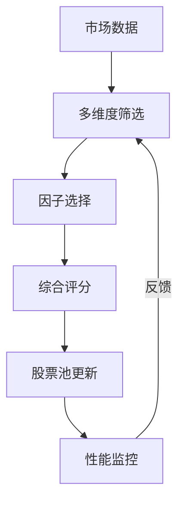

# RQA2025 动态股票池管理架构设计文档

## 1. 概述

动态股票池管理系统实现智能化的标的筛选和更新机制，主要功能包括：
- 多维度动态筛选
- 自适应因子选择
- 智能股票池更新
- 综合评分排名
- 实时性能监控

## 2. 系统架构

### 2.1 核心组件
```text
DynamicUniverseManager    - 动态股票池管理器
MultiDimensionalFilter    - 多维度筛选器
AdaptiveMultiFactorModel  - 自适应多因子模型
IntelligentUniverseUpdater - 智能股票池更新器
ComprehensiveScoringModel - 综合评分模型
DynamicWeightAdjuster     - 动态权重调整器
```

### 2.2 工作流程


## 3. 多维度筛选机制

### 3.1 筛选维度
| 维度 | 指标 | 权重 | 更新频率 |
|------|------|------|----------|
| 流动性 | 成交量、换手率 | 20% | 实时 |
| 波动率 | 历史波动率、Beta | 15% | 日频 |
| 基本面 | ROE、PE、PB | 25% | 周频 |
| 技术面 | 技术指标、趋势 | 20% | 实时 |
| 情感面 | 新闻情感、舆情 | 10% | 小时级 |
| 风险面 | 信用评级、风险指标 | 10% | 日频 |

### 3.2 筛选条件
```python
# 流动性筛选
liquidity_conditions = {
    'min_daily_volume': 1000000,  # 最小日成交量
    'min_turnover_rate': 0.01,    # 最小换手率
    'min_market_cap': 1000000000  # 最小市值
}

# 波动率筛选
volatility_conditions = {
    'max_volatility': 0.5,        # 最大波动率
    'max_beta': 2.0,              # 最大Beta值
    'min_sharpe_ratio': 0.1       # 最小夏普比率
}

# 基本面筛选
fundamental_conditions = {
    'min_roe': 0.05,              # 最小ROE
    'max_pe': 50,                 # 最大PE
    'max_pb': 5,                  # 最大PB
    'min_profit_growth': 0.05     # 最小利润增长率
}
```

## 4. 自适应多因子模型

### 4.1 因子类型
| 因子类别 | 具体因子 | 适用市场状态 |
|----------|----------|--------------|
| 动量因子 | 价格动量、成交量动量 | 趋势市场 |
| 价值因子 | PE、PB、ROE | 震荡市场 |
| 质量因子 | 盈利质量、财务健康度 | 所有市场 |
| 波动率因子 | 历史波动率、隐含波动率 | 高波动市场 |

### 4.2 动态权重调整
```python
# 市场状态权重调整
market_state_adjustments = {
    'BULL': {
        'momentum': 1.3,      # 牛市动量因子权重增加
        'value': 0.8,         # 价值因子权重降低
        'quality': 1.1,       # 质量因子权重略增
        'volatility': 0.7     # 波动率因子权重降低
    },
    'BEAR': {
        'momentum': 0.7,      # 熊市动量因子权重降低
        'value': 1.2,         # 价值因子权重增加
        'quality': 1.4,       # 质量因子权重增加
        'volatility': 1.3     # 波动率因子权重增加
    }
}
```

## 5. 智能更新机制

### 5.1 更新触发器
| 触发器类型 | 触发条件 | 更新频率 |
|------------|----------|----------|
| 时间触发器 | 每日开盘前 | 每日 |
| 市场状态触发器 | 市场状态变化>10% | 实时 |
| 性能触发器 | 组合表现变化>5% | 实时 |
| 流动性触发器 | 流动性变化>20% | 实时 |
| 波动率触发器 | 波动率变化>30% | 实时 |

### 5.2 更新策略
```python
# 更新策略配置
update_strategies = {
    'conservative': {
        'max_turnover': 0.1,      # 最大换手率10%
        'min_holding_period': 5,   # 最小持有期5天
        'update_threshold': 0.05   # 更新阈值5%
    },
    'aggressive': {
        'max_turnover': 0.3,       # 最大换手率30%
        'min_holding_period': 1,   # 最小持有期1天
        'update_threshold': 0.02   # 更新阈值2%
    },
    'balanced': {
        'max_turnover': 0.2,       # 最大换手率20%
        'min_holding_period': 3,   # 最小持有期3天
        'update_threshold': 0.03   # 更新阈值3%
    }
}
```

## 6. 综合评分系统

### 6.1 评分维度权重
```python
scoring_weights = {
    'liquidity': 0.20,    # 流动性权重20%
    'volatility': 0.15,   # 波动率权重15%
    'fundamental': 0.25,  # 基本面权重25%
    'technical': 0.20,    # 技术面权重20%
    'sentiment': 0.10,    # 情感面权重10%
    'risk': 0.10          # 风险面权重10%
}
```

### 6.2 评分算法
```python
# 综合评分计算公式
composite_score = (
    liquidity_score * 0.20 +
    volatility_score * 0.15 +
    fundamental_score * 0.25 +
    technical_score * 0.20 +
    sentiment_score * 0.10 +
    risk_score * 0.10
)
```

## 7. 性能监控

### 7.1 关键指标
| 指标 | 目标值 | 监控频率 |
|------|--------|----------|
| 换手率 | <20% | 日频 |
| 夏普比率 | >0.5 | 日频 |
| 最大回撤 | <15% | 实时 |
| 信息比率 | >0.3 | 周频 |
| 因子有效性 | >0.6 | 月频 |

### 7.2 监控告警
```python
# 告警配置
alerts = {
    'high_turnover': {
        'threshold': 0.25,
        'level': 'warning',
        'action': 'reduce_update_frequency'
    },
    'low_performance': {
        'threshold': 0.3,
        'level': 'critical',
        'action': 'review_strategy'
    },
    'high_risk': {
        'threshold': 0.2,
        'level': 'critical',
        'action': 'stop_trading'
    }
}
```

## 8. 系统集成

### 8.1 数据接口
```python
class UniverseDataInterface:
    """股票池数据接口"""
    
    def get_market_data(self) -> pd.DataFrame:
        """获取市场数据"""
        pass
    
    def get_fundamental_data(self) -> pd.DataFrame:
        """获取基本面数据"""
        pass
    
    def get_sentiment_data(self) -> pd.DataFrame:
        """获取情感数据"""
        pass
    
    def get_risk_data(self) -> pd.DataFrame:
        """获取风险数据"""
        pass
```

### 8.2 配置管理
```python
# 配置文件结构
universe_config = {
    'filters': {
        'liquidity': {
            'min_daily_volume': 1000000,
            'min_turnover_rate': 0.01,
            'min_market_cap': 1000000000
        },
        'volatility': {
            'max_volatility': 0.5,
            'max_beta': 2.0,
            'min_sharpe_ratio': 0.1
        }
    },
    'factors': {
        'momentum': {'weight': 0.25, 'lookback': 20},
        'value': {'weight': 0.25, 'lookback': 60},
        'quality': {'weight': 0.25, 'lookback': 252},
        'volatility': {'weight': 0.25, 'lookback': 20}
    },
    'update': {
        'frequency': 'daily',
        'max_turnover': 0.2,
        'min_holding_period': 3
    }
}
```

## 9. 实施计划

### 9.1 第一阶段（1-2个月）
- [x] 实现基础动态股票池管理
- [x] 建立多维度筛选框架
- [x] 实现简单的自适应因子选择

### 9.2 第二阶段（2-3个月）
- [ ] 完善智能更新机制
- [ ] 实现综合评分系统
- [ ] 添加动态权重调整

### 9.3 第三阶段（3-4个月）
- [ ] 优化性能和稳定性
- [ ] 完善监控和告警
- [ ] 进行回测验证

## 10. 版本历史

- v1.0 (2025-01-01): 基础动态股票池管理
- v1.1 (2025-01-15): 多维度筛选框架
- v1.2 (2025-02-01): 自适应因子选择
- v1.3 (2025-02-15): 智能更新机制
- v1.4 (2025-03-01): 综合评分系统
- v1.5 (2025-03-15): 动态权重调整
- v1.6 (2025-04-01): 性能优化和监控 