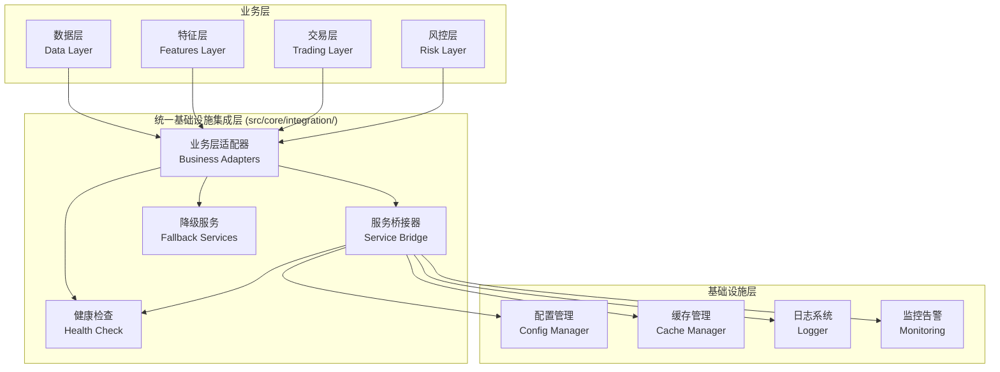

# RQA2025 统一基础设施集成指南

## 📋 文档概述

本文档介绍RQA2025的统一基础设施集成架构，该架构通过适配器模式实现了所有业务层与基础设施层的深度集成，消除了代码重复，提高了系统的可维护性和扩展性。

**文档版本**：v2.0.0
**更新时间**：2025年01月27日
**适用范围**：数据层、特征层、交易层、风控层等所有业务层

## 🎯 架构目标

### 核心问题解决
1. **消除代码重复**：各业务层重复实现基础设施集成代码
2. **统一接口规范**：标准化基础设施服务访问接口
3. **集中化管理**：基础设施集成逻辑集中管理
4. **提高可维护性**：集成逻辑变更只需在一个地方修改
5. **增强可扩展性**：新业务层可以轻松集成

### 架构优势
- **标准化**：统一的API接口，降低学习成本
- **可靠性**：内置降级服务，确保系统稳定性
- **性能优化**：智能缓存和监控，提升系统性能
- **监控完善**：全方位健康检查和性能监控

## 🏗️ 架构设计

### 整体架构图



### 核心组件

#### 1. 业务层适配器 (Business Adapters)
专门为每个业务层提供定制化的基础设施服务访问接口：

- **DataLayerAdapter**: 数据层适配器
- **FeaturesLayerAdapter**: 特征层适配器
- **TradingLayerAdapter**: 交易层适配器
- **RiskLayerAdapter**: 风控层适配器

#### 2. 统一服务桥接器 (Service Bridge)
提供标准化的基础设施服务访问接口，屏蔽底层实现差异。

#### 3. 降级服务 (Fallback Services)
当基础设施服务不可用时，提供基本的备用实现，确保系统继续运行。

#### 4. 健康监控 (Health Monitoring)
提供全方位的基础设施服务健康检查和性能监控。

## 📖 使用指南

### 基本使用模式

#### 1. 获取业务层适配器

```python
from src.core.integration import get_data_adapter, get_features_adapter

# 获取数据层适配器
data_adapter = get_data_adapter()

# 获取特征层适配器
features_adapter = get_features_adapter()
```

#### 2. 访问基础设施服务

```python
# 获取配置管理器
config_manager = data_adapter.get_infrastructure_services()['config_manager']

# 获取缓存管理器
cache_manager = data_adapter.get_infrastructure_services()['cache_manager']

# 获取监控服务
monitoring = data_adapter.get_infrastructure_services()['monitoring']
```

#### 3. 使用业务特定功能

```python
# 数据层特定功能
data_cache_bridge = data_adapter.get_data_cache_bridge()
data_config_bridge = data_adapter.get_data_config_bridge()

# 特征层特定功能
features_engine = features_adapter.get_features_engine()
features_config = features_adapter.get_features_config_manager()
```

### 高级使用模式

#### 1. 健康检查

```python
from src.core.integration import health_check_business_adapters

# 检查所有业务层适配器的健康状态
health_status = health_check_business_adapters()
print(f"整体状态: {health_status['overall_status']}")

# 检查特定业务层的健康状态
data_health = data_adapter.health_check()
print(f"数据层状态: {data_health['overall_status']}")
```

#### 2. 性能监控

```python
# 获取业务层性能指标
data_metrics = data_adapter.get_data_layer_metrics()
features_metrics = features_adapter.get_features_layer_metrics()

# 记录自定义指标
monitoring = data_adapter.get_infrastructure_services()['monitoring']
monitoring.record_metric('custom_metric', 1.0, {'layer': 'data'})
```

#### 3. 基础设施支持的业务操作

```python
# 特征处理（带基础设施支持）
from src.core.integration import process_features_with_infrastructure

result = process_features_with_infrastructure({
    'feature_data': {...},
    'processing_config': {...}
})

if result['processed']:
    print("特征处理成功")
    if 'infrastructure_used' in result:
        print(f"使用的基础设施服务: {result['infrastructure_used']}")
```

## 🔄 迁移指南

### 从原有架构迁移到统一架构

#### 1. 数据层迁移

**原有代码**：
```python
# 原有方式：直接导入桥接器
from src.data.infrastructure_bridge.cache_bridge import DataCacheBridge
from src.data.infrastructure_bridge.config_bridge import DataConfigBridge

cache_bridge = DataCacheBridge()
config_bridge = DataConfigBridge()
```

**新架构**：
```python
# 新方式：使用统一适配器
from src.core.integration import get_data_layer_adapter

adapter = get_data_layer_adapter()
cache_bridge = adapter.get_data_cache_bridge()
config_bridge = adapter.get_data_config_bridge()
```

#### 2. 特征层迁移

**原有代码**：
```python
# 原有方式：直接导入基础设施桥接器
from src.features.core.infrastructure_bridge import InfrastructureServiceBridge

bridge = InfrastructureServiceBridge()
config_manager = bridge.get_service('config_manager')
```

**新架构**：
```python
# 新方式：使用统一适配器
from src.core.integration import get_features_layer_adapter

adapter = get_features_layer_adapter()
config_manager = adapter.get_features_config_manager()
cache_manager = adapter.get_features_cache_manager()
```

### 渐进式迁移策略

#### 第一阶段：并行运行
```python
# 同时支持新旧两种方式
try:
    # 优先使用新架构
    from src.core.integration import get_data_adapter
    adapter = get_data_adapter()
    cache_manager = adapter.get_infrastructure_services()['cache_manager']
except ImportError:
    # 回退到旧架构
    from src.data.infrastructure_bridge.cache_bridge import DataCacheBridge
    cache_manager = DataCacheBridge()
```

#### 第二阶段：逐步替换
```python
# 在测试验证后，逐步替换为新架构
from src.core.integration import get_data_adapter

adapter = get_data_adapter()
# 使用新架构的所有功能
cache_bridge = adapter.get_data_cache_bridge()
config_bridge = adapter.get_data_config_bridge()
monitoring_bridge = adapter.get_data_monitoring_bridge()
```

#### 第三阶段：完全迁移
```python
# 完全使用新架构，删除旧代码
from src.core.integration import (
    get_data_adapter,
    get_features_adapter,
    get_trading_adapter,
    get_risk_adapter
)

# 统一的管理和监控
adapters = [get_data_adapter(), get_features_adapter(), get_trading_adapter(), get_risk_adapter()]
for adapter in adapters:
    health = adapter.health_check()
    print(f"{adapter.layer_type.value}层状态: {health['overall_status']}")
```

## 📊 监控和维护

### 健康检查

```python
from src.core.integration import health_check_business_adapters

def check_system_health():
    """检查整个系统的健康状态"""
    health_status = health_check_business_adapters()

    if health_status['overall_status'] != 'healthy':
        print("系统存在健康问题:")
        for layer_type, layer_health in health_status['adapters'].items():
            if layer_health['overall_status'] != 'healthy':
                print(f"- {layer_type}层: {layer_health['overall_status']}")

    return health_status
```

### 性能监控

```python
def monitor_system_performance():
    """监控系统性能指标"""
    from src.core.integration import get_all_business_adapters

    adapters = get_all_business_adapters()
    performance_report = {}

    for layer_type, adapter in adapters.items():
        if hasattr(adapter, f'get_{layer_type.value}_layer_metrics'):
            metrics_method = getattr(adapter, f'get_{layer_type.value}_layer_metrics')
            performance_report[layer_type.value] = metrics_method()

    return performance_report
```

### 降级服务监控

```python
from src.core.integration import health_check_fallback_services

def check_fallback_services():
    """检查降级服务的状态"""
    fallback_health = health_check_fallback_services()
    return fallback_health
```

## 🛠️ 最佳实践

### 1. 初始化模式

```python
# 推荐：在应用启动时初始化所有适配器
from src.core.integration import (
    get_all_business_adapters,
    health_check_business_adapters
)

def initialize_system():
    """系统初始化"""
    # 获取所有适配器
    adapters = get_all_business_adapters()

    # 执行健康检查
    health_status = health_check_business_adapters()

    if health_status['overall_status'] == 'healthy':
        print("系统初始化成功")
        return True
    else:
        print("系统初始化失败，存在健康问题")
        return False
```

### 2. 错误处理

```python
def safe_infrastructure_operation(operation_func, *args, **kwargs):
    """安全的基础设施操作，带降级处理"""
    try:
        return operation_func(*args, **kwargs)
    except Exception as e:
        # 记录错误
        logger = get_fallback_logger()
        logger.error(f"基础设施操作失败: {e}")

        # 尝试使用降级服务
        fallback_service = get_fallback_service('target_service')
        if fallback_service:
            return fallback_service.fallback_operation(*args, **kwargs)

        raise e
```

### 3. 性能优化

```python
def optimized_business_operation(data, adapter):
    """优化的业务操作"""
    # 使用缓存
    cache_key = f"operation_{hash(str(data))}"
    cache_manager = adapter.get_infrastructure_services()['cache_manager']

    # 检查缓存
    cached_result = cache_manager.get(cache_key)
    if cached_result:
        return cached_result

    # 执行实际操作
    result = perform_business_operation(data)

    # 缓存结果
    cache_manager.set(cache_key, result, 3600)

    # 记录性能指标
    monitoring = adapter.get_infrastructure_services()['monitoring']
    monitoring.record_metric('business_operation_duration', execution_time)

    return result
```

## 🔧 配置和部署

### 配置示例

```yaml
# infrastructure_integration.yaml
unified_integration:
  enabled: true
  health_check_interval: 30  # 秒
  cache_ttl: 3600  # 秒
  monitoring_enabled: true

business_adapters:
  data:
    cache_enabled: true
    monitoring_enabled: true
  features:
    cache_enabled: true
    monitoring_enabled: true
  trading:
    cache_enabled: true
    monitoring_enabled: true
  risk:
    cache_enabled: true
    monitoring_enabled: true

fallback_services:
  enabled: true
  log_to_console: true
  max_metrics_history: 1000
```

### 部署检查清单

- [ ] 所有业务层适配器正确导入
- [ ] 基础设施服务正常连接
- [ ] 降级服务配置正确
- [ ] 健康检查功能正常
- [ ] 性能监控正常工作
- [ ] 日志记录正常输出
- [ ] 缓存功能正常工作

## 📈 性能优化

### 缓存策略

```python
def configure_caching(adapter):
    """配置缓存策略"""
    cache_manager = adapter.get_infrastructure_services()['cache_manager']

    # 设置缓存策略
    cache_manager.set_cache_policy({
        'default_ttl': 3600,
        'max_size': 10000,
        'policy': 'LRU'
    })

    # 配置预热
    cache_manager.enable_preloading([
        'frequent_config_keys',
        'common_data_queries'
    ])
```

### 监控优化

```python
def setup_monitoring(adapter):
    """设置监控"""
    monitoring = adapter.get_infrastructure_services()['monitoring']

    # 配置指标收集
    monitoring.configure_metrics({
        'collection_interval': 30,
        'batch_size': 100,
        'async_processing': True
    })

    # 设置告警规则
    monitoring.add_alert_rule({
        'name': 'high_error_rate',
        'condition': 'error_rate > 0.05',
        'severity': 'critical',
        'action': 'notify_admin'
    })
```

## 🎯 总结

统一基础设施集成架构通过适配器模式成功解决了RQA2025系统中业务层与基础设施层深度集成时的代码重复问题：

### 主要成就
1. **消除重复**：统一管理所有基础设施集成逻辑
2. **标准化接口**：提供一致的API接口
3. **提高可维护性**：集成逻辑集中管理
4. **增强可靠性**：内置降级服务和健康检查
5. **提升性能**：智能缓存和监控优化

### 使用建议
- 新业务层优先使用统一适配器
- 逐步迁移现有代码到新架构
- 充分利用健康检查和监控功能
- 根据业务需求定制适配器功能

---

**文档维护**：基础设施团队
**最后更新**：2025年01月27日
**版本**：v2.0.0

