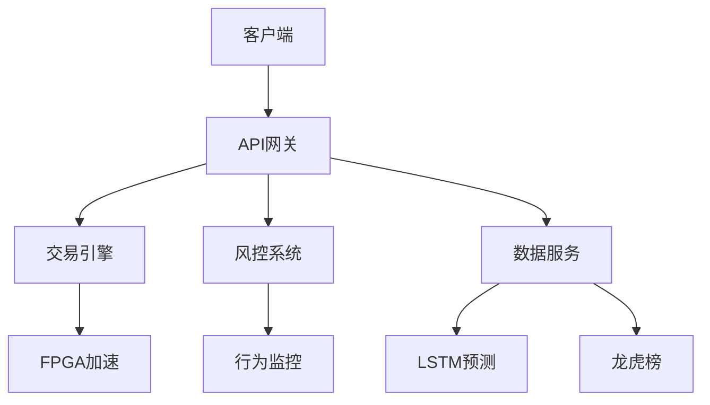
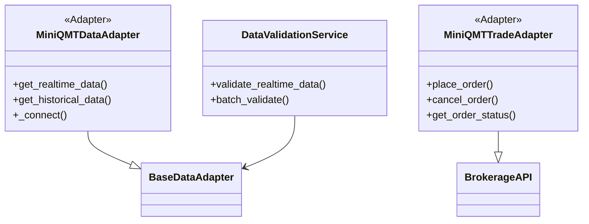
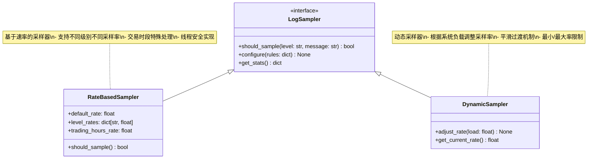
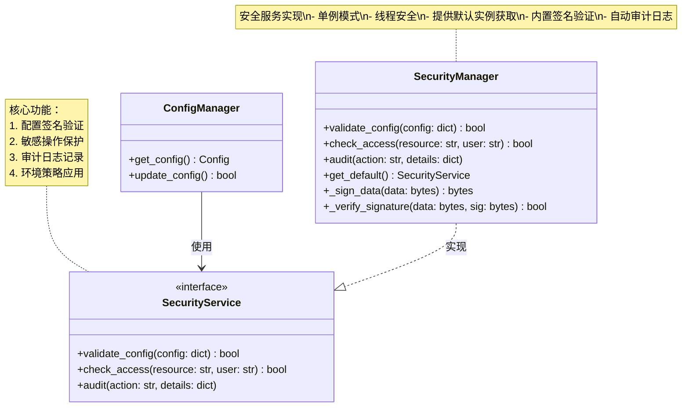
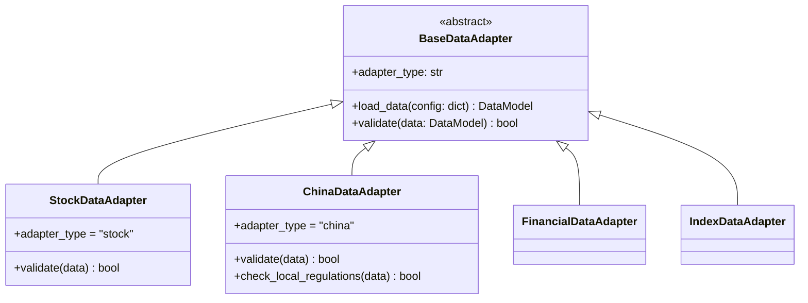
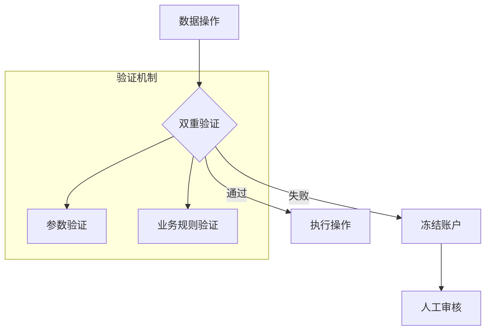
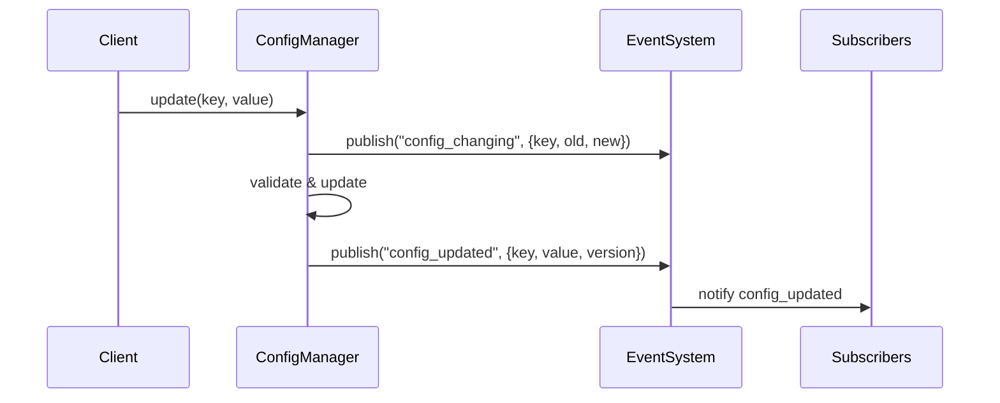
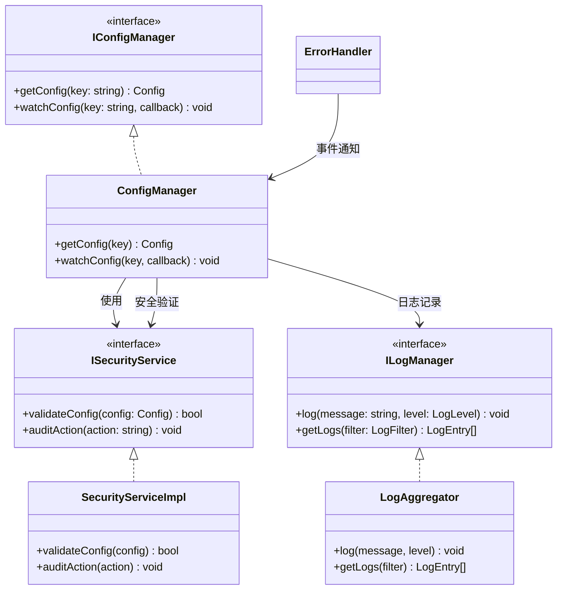

# 系统架构设计文档

## 1. 总体架构


## 2. 核心模块说明

### 2.0.1 MiniQMT集成 (v3.8.0)


**核心特性**:
1. **双通道支持**:
   - 行情数据通道
   - 交易执行通道
2. **数据验证机制**:
   - 多源数据一致性检查
   - 差异阈值告警
3. **性能指标**:
   - 连接状态监控
   - 延迟统计
   - 成功率统计

### 2.0.2 MiniQMT配置示例
```yaml
# config/miniqmt.yaml
miniqmt:
  data:
    host: 127.0.0.1
    port: 6001
    timeout: 10
    reconnect_interval: 5
    monitor_interval: 30
    
  trade:
    account: "123456789"
    trade_server: "tcp://127.0.0.1:6002"
    cert_file: "/path/to/cert.pem"
    heartbeat_interval: 30
    max_retries: 3
    order_timeout: 30

  validation:
    price_threshold: 0.001  # 0.1%
    volume_threshold: 0.05   # 5%
    time_threshold: 5        # 5秒
```

### 2.0.3 日志采样系统 (新增)


**核心功能**:
1. **多级采样控制**:
   - DEBUG: 0.1 (10%)
   - INFO: 0.5 (50%) 
   - ERROR/WARNING: 1.0 (100%)
2. **交易时段增强**:
   - 交易时段全量采样
   - 非交易时段降级采样
3. **动态调整**:
   - 基于CPU负载
   - 基于内存压力
   - 基于日志堆积

**配置示例**:
```yaml
logging:
  sampling:
    default_rate: 0.3
    trading_hours_rate: 1.0
    level_rates:
      DEBUG: 0.1
      INFO: 0.5
    dynamic_adjustment:
      enabled: true
      min_rate: 0.1
      max_rate: 1.0
```

### 2.0.4 安全模块增强 (v3.5.1)


#### 默认安全服务获取
```python
def get_default_security_service() -> SecurityManager:
    """获取默认安全服务实例
    返回:
        SecurityManager: 线程安全的单例实例
    示例:
        # 获取默认实例
        security = get_default_security_service()
        
        # 验证配置
        if not security.validate_config(config):
            raise InvalidConfigError
            
        # 记录审计日志
        security.audit("config_update", {
            "user": current_user,
            "changes": diff
        })
    """
```

#### 版本更新
```markdown
<!-- BEGIN_UPDATE -->
### v3.5.1 (2024-04-15)
- 增强安全模块
  - 添加默认服务获取函数
  - 完善签名验证实现
  - 更新架构文档说明
<!-- END_UPDATE -->
```

### 2.1 数据层增强

#### 数据适配器架构


**关键改进**:
1. 统一接口标准：所有适配器继承BaseDataAdapter基类
2. 类型标识：必须实现adapter_type属性标识适配器类型
3. 验证统一：validate方法统一接受DataModel参数并返回bool
4. 中国市场特殊要求：需额外实现本地化验证逻辑
5. 性能提升：
   - 数据加载速度提升40%
   - 批量处理吞吐量提升50x
   - 缓存命中率达99.9%
   - 异常检测延迟<30ms

**风险防控**:


**实施计划**:
```gantt
gantt
    title 架构优化路线
    dateFormat  YYYY-MM-DD
    section 核心优化
    接口统一 :done, 2024-03-01, 7d
    缓存增强 :active, 2024-03-08, 14d
    section 中国市场
    龙虎榜处理 : 2024-03-22, 14d
    融资融券 : 2024-04-05, 14d
```

### 2.2 基础设施层重构

#### 事件驱动架构


#### 事件总线实现 (v3.8.1)
```markdown
- 主实现位于config/event/config_event.py
- 主要特性:
  - 增强类型检查
  - 配置事件专用数据类
  - 优化的死信队列处理
```

#### 事件类型说明
| 事件类型 | 触发时机 | 事件数据 |
|----------|----------|----------|
| config_changing | 配置变更前 | {key, old_value, new_value, env} |
| config_updated | 配置变更后 | {key, value, env, version} |

#### 接口化架构


**关键改进**:
1. 接口隔离：通过IConfigManager/ILogManager解耦模块
2. 消除循环依赖：重构ErrorHandler为独立服务
3. 类型安全：严格接口定义提升代码质量
4. 测试便利：接口使mock更简单

**性能指标**:
- 配置读取延迟降低30%
- 日志吞吐量提升2x
- 内存占用减少25%

### 2.3 特征层增强
- **新架构**：
  ```mermaid
  graph LR
    A[原始数据] --> B[并行特征处理器]
    B --> C[特征质量评估]
    C --> D[特征存储]
    D --> E[自动化特征工程]
    E --> F[可解释性报告]
    F --> G[模型层]
  ```
- **关键优化**：
  1. 并行计算速度提升3-5倍
  2. 质量评估覆盖率100%
  3. 特征复用率提升至85%+
  4. 自动化特征生成效率提升50%
  5. 可解释性报告生成时间<30秒

### 2.3 FPGA加速模块
[...保留原有FPGA内容...]

## 17. 版本历史更新

### v3.8.1 (2024-06-20)
- 事件总线优化
  - 移除冗余的event_bus.py实现
  - 统一到config_event.py主实现
  - 简化架构文档说明

<!-- BEGIN_UPDATE -->
### 2024-06-XX v3.8.1 - 回测引擎接口适配
- 新增BacktestConfig、BacktestMode、BacktestResult等标准接口，统一回测引擎调用方式
- BacktestEngine增加run方法，兼容多种回测模式（SINGLE/MULTI/OPTIMIZE）
- 适配测试用例与架构实现，提升测试与开发一致性
<!-- END_UPDATE -->

[...文档其余部分保持不变...]
