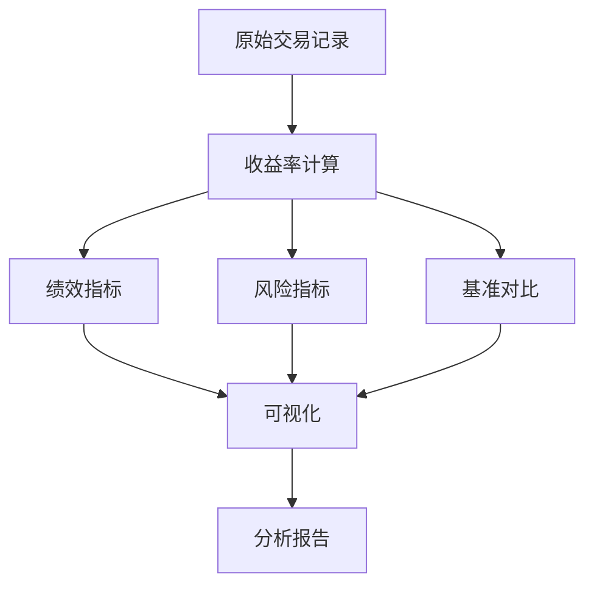

# RQA2025 回测分析设计文档

## 1. 概述

回测分析模块提供全面的策略评估能力，主要功能包括：
- 多维度绩效指标计算
- 风险收益分析
- 基准对比分析
- 交互式可视化
- 结构化报告生成

## 2. 系统架构

### 2.1 核心组件
```text
PerformanceAnalyzer - 绩效指标计算引擎
RiskAnalyzer       - 风险度量引擎
BenchmarkComparator - 基准对比分析
VisualizationEngine - 可视化生成器
ReportGenerator     - 报告生成器
```

### 2.2 分析流程


## 3. 绩效指标

### 3.1 收益指标
| 指标 | 公式 | 说明 |
|------|------|------|
| 累计收益率 | (1+r1)*(1+r2)*...*(1+rn)-1 | 策略整体表现 |
| 年化收益率 | (1+总收益率)^(252/天数)-1 | 年化收益 |
| 胜率 | 盈利交易数/总交易数 | 交易稳定性 |

### 3.2 风险指标
| 指标 | 公式 | 说明 |
|------|------|------|
| 年化波动率 | σ_daily*√252 | 收益波动性 |
| 最大回撤 | max(Peak-Trough)/Peak | 最大损失幅度 |
| VaR(95%) | Percentile(5%) | 风险价值 |
| CVaR(95%) | Mean(r < VaR) | 条件风险价值 |

## 4. 基准对比

### 4.1 比较指标
| 指标 | 公式 | 说明 |
|------|------|------|
| Alpha | r_p - [r_f + β*(r_m - r_f)] | 超额收益 |
| Beta | Cov(r_p,r_m)/Var(r_m) | 系统风险 |
| 信息比率 | E[r_p - r_b]/σ(r_p - r_b) | 主动管理能力 |
| 跟踪误差 | σ(r_p - r_b) | 偏离程度 |

### 4.2 对比方法
```python
def compare_with_benchmark(strategy, benchmark):
    # 计算主动收益
    active_returns = strategy - benchmark
    
    # 计算各项指标
    metrics = {
        'alpha': calculate_alpha(strategy, benchmark),
        'beta': calculate_beta(strategy, benchmark),
        'ir': calculate_information_ratio(active_returns),
        'te': calculate_tracking_error(active_returns)
    }
    return metrics
```

## 5. 可视化方案

### 5.1 图表类型
| 图表 | 数据 | 用途 |
|------|------|------|
| 累计收益曲线 | 策略vs基准 | 整体表现 |
| 回撤曲线 | 策略回撤 | 风险控制 |
| 月度热力图 | 月度收益 | 季节性分析 |
| 指标雷达图 | 多维指标 | 综合评估 |

### 5.2 交互功能
```javascript
// 示例：交互式图表
function initInteractiveChart() {
    const chart = new PerformanceChart({
        container: '#chart-container',
        metrics: ['return', 'volatility', 'max_dd'],
        benchmark: true
    });
    chart.render();
}
```

## 6. 报告生成

### 6.1 报告结构
```text
1. 摘要
   - 关键指标概览
   - 策略评级

2. 详细分析
   - 收益分析
   - 风险分析
   - 基准对比

3. 附录
   - 完整指标表
   - 参数设置
```

### 6.2 输出格式
| 格式 | 说明 | 适用场景 |
|------|------|----------|
| HTML | 交互式报告 | 网页展示 |
| PDF | 静态报告 | 文档存档 |
| Markdown | 轻量级报告 | 代码集成 |
| Excel | 结构化数据 | 进一步分析 |

## 7. 版本历史

- v1.0 (2024-06-01): 基础绩效指标
- v1.1 (2024-06-15): 风险度量增强
- v1.2 (2024-07-01): 可视化引擎
- v1.3 (2024-07-15): 自动化报告
