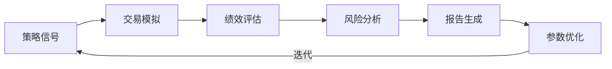

# RQA2025 回测系统设计文档

## 1. 概述

回测系统模块实现策略历史模拟与评估，主要功能包括：
- 多频次回测引擎
- 绩效评估体系
- 风险分析模型
- 可视化报告
- 参数优化框架

## 2. 系统架构

### 2.1 核心组件
```text
BacktestEngine     - 回测执行引擎
PerformanceAnalyzer - 绩效评估器
RiskAnalyzer       - 风险分析器
ReportGenerator    - 报告生成器
Optimizer          - 参数优化器
```

### 2.2 回测流程


## 3. 回测引擎

### 3.1 回测模式
| 模式 | 特点 | 适用场景 |
|------|------|----------|
| 向量化 | 批量计算 | 简单策略 |
| 事件驱动 | 逐笔模拟 | 高频策略 |
| 蒙特卡洛 | 随机路径 | 压力测试 |

### 3.2 关键配置
```python
class BacktestConfig:
    def __init__(
        self,
        start_date: str,
        end_date: str,
        frequency: str = 'daily',
        slippage: float = 0.0005,
        commission: float = 0.0003,
        initial_capital: float = 1e6,
        benchmark: str = '000300.SH'
    ):
        self.start_date = start_date
        self.end_date = end_date
        self.frequency = frequency  # daily/hourly/minutely
        self.slippage = slippage    # 滑点比例
        self.commission = commission # 佣金比例
        self.initial_capital = initial_capital
        self.benchmark = benchmark
```

## 4. 绩效评估

### 4.1 核心指标
| 指标 | 公式 | 评估维度 |
|------|------|----------|
| 年化收益 | (1+总收益)^(252/天数)-1 | 盈利能力 |
| 年化波动 | 日收益标准差*√252 | 风险水平 |
| 夏普比率 | 年化收益/年化波动 | 风险调整收益 |
| 最大回撤 | 峰值到谷值最大跌幅 | 下行风险 |
| 胜率 | 盈利交易数/总交易数 | 策略稳定性 |

### 4.2 统计检验
```python
def calculate_t_test(strat_returns, bench_returns):
    """计算策略与基准的T检验"""
    diff = strat_returns - bench_returns
    t_stat, p_value = stats.ttest_1samp(diff, 0)
    return {
        't_statistic': t_stat,
        'p_value': p_value,
        'significant_95': p_value < 0.05
    }
```

## 5. 风险分析

### 5.1 风险指标
| 指标 | 计算方法 | 预警阈值 |
|------|----------|----------|
| VaR(95%) | 历史收益5%分位数 | < -5% |
| ES(95%) | 尾部5%平均损失 | < -7% |
| 流动性风险 | 成交量/持仓量比率 | > 20% |
| 集中度风险 | 最大头寸/总资产 | > 30% |

### 5.2 压力测试
```python
def stress_test(strategy, scenarios):
    """多场景压力测试"""
    results = {}
    for name, params in scenarios.items():
        # 模拟极端市场条件
        modified_data = apply_scenario(data, params)
        results[name] = strategy.run(modified_data)
    return results
```

## 6. 可视化方案

### 6.1 核心图表
```plantuml
component "绩效看板" {
    [累计收益曲线]
    [回撤曲线]
    [月度收益热力图]
    [收益分布直方图]
}

component "风险分析" {
    [VaR-ES曲线]
    [风险贡献图]
    [流动性监测]
}
```

### 6.2 交互功能
```javascript
function addInteractiveFeatures() {
    // 添加图表交互
    chart.on('click', function(params) {
        showTradeDetails(params.dataIndex);
    });
    
    // 添加参数调节
    slider.on('change', function(value) {
        updateAnalysisWithNewParams(value);
    });
}
```

## 7. 参数优化

### 7.1 优化方法
| 方法 | 优点 | 缺点 |
|------|------|------|
| 网格搜索 | 简单全面 | 计算量大 |
| 贝叶斯优化 | 高效收敛 | 需要先验 |
| 遗传算法 | 全局最优 | 参数敏感 |

### 7.2 过拟合防护
```python
def walk_forward_optimization(strategy, params_space, n_splits=5):
    """Walk Forward优化"""
    best_params = []
    for train, test in TimeSeriesSplit(n_splits).split(data):
        # 训练集优化
        opt_result = bayesian_optimize(strategy, params_space, train)
        # 测试集验证
        test_perf = strategy.run(test, opt_result.params)
        best_params.append((opt_result.params, test_perf))
    return best_params
```

## 8. 版本历史

- v1.0 (2025-03-01): 基础回测引擎
- v1.1 (2025-03-15): 高级绩效指标
- v1.2 (2025-04-01): 风险分析模块
- v1.3 (2025-04-15): Walk Forward优化
