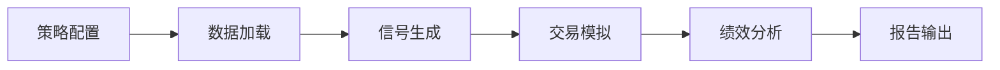
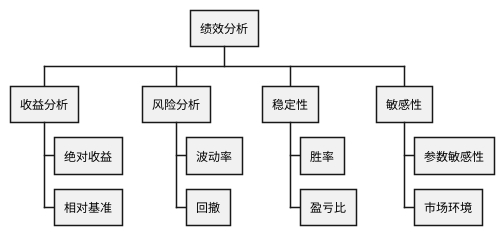

# RQA2025 回测系统设计文档

## 1. 概述

回测系统实现策略历史表现验证，主要功能包括：
- 多频率回测支持
- 交易成本模拟
- 策略绩效分析
- 组合风险评估
- 可视化报告生成

## 2. 系统架构

### 2.1 核心组件
```text
DataFeed       - 历史数据加载
StrategyRunner - 策略执行器
TradeSimulator - 交易模拟器
PerformanceAnalyzer - 绩效分析器
ReportGenerator - 报告生成器
```

### 2.2 工作流程


## 3. 回测方法

### 3.1 频率支持
| 频率 | 时间粒度 | 适用场景 |
|------|----------|----------|
| 分钟 | 1min | 高频策略 |
| 日线 | 1day | 中频策略 |
| 周线 | 1week | 低频策略 |
| 月线 | 1month | 长线策略 |

### 3.2 成本模型
```python
class CostConfig:
    def __init__(self,
                commission: float = 0.0003,
                slippage: float = 0.0005,
                impact: float = 0.001):
        """
        Args:
            commission: 佣金比例(0.03%)
            slippage: 滑点比例(0.05%)
            impact: 冲击成本系数(0.1bps/万元)
        """
```

## 4. 绩效分析

### 4.1 核心指标
| 指标 | 公式 | 说明 |
|------|------|------|
| 年化收益 | (1+总收益)^(252/天数)-1 | 标准化收益 |
| 波动率 | σ(日收益)*√252 | 风险度量 |
| 夏普比率 | 年化收益/波动率 | 风险调整收益 |
| 最大回撤 | max(1-当前/峰值) | 下行风险 |

### 4.2 分析维度


## 5. 系统集成

### 5.1 数据接口
```python
class BacktestDataFeed:
    def load_history(self,
                    symbol: str,
                    start: str,
                    end: str,
                    freq: str) -> pd.DataFrame:
        """加载历史数据"""
        
    def get_benchmark(self) -> pd.DataFrame:
        """获取基准数据"""
```

### 5.2 生产部署
```text
                   +---------------+
                   | 回测管理系统  |
                   +-------+-------+
                           | API
+------------------+       |       +-----------------+
| 量化策略仓库     | <-----+-----> | 数据服务平台    |
+------------------+               +-----------------+
```

## 6. 版本历史

- v1.0 (2025-11-01): 基础回测框架
- v1.1 (2025-11-15): 多频率支持
- v1.2 (2025-12-01): 成本模型增强
- v1.3 (2025-12-15): 高级分析模块
