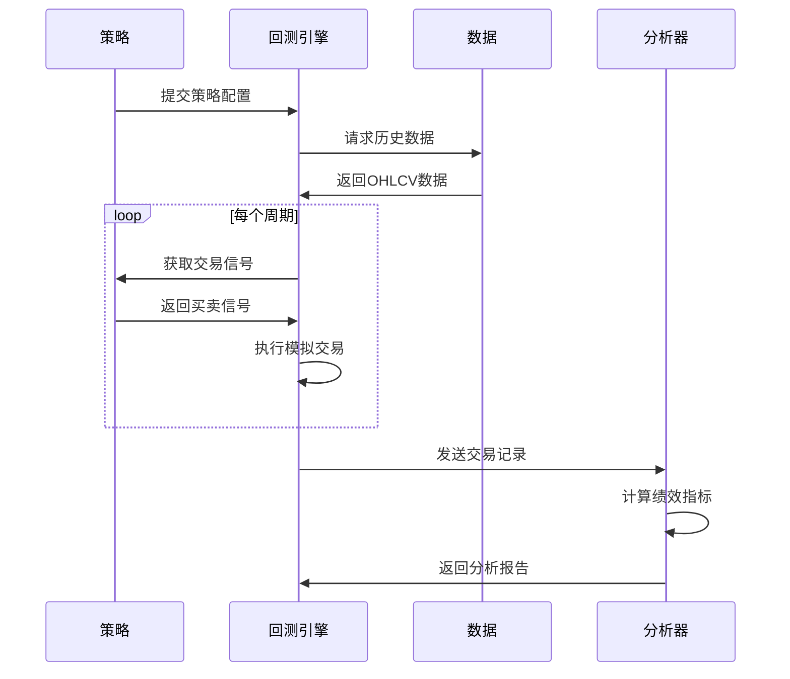

# RQA2025 回测系统设计文档

## 1. 概述

回测系统用于验证量化策略的历史表现，主要功能包括：
- 多频率策略回测
- 交易成本精确模拟
- 组合绩效分析
- 可视化报告生成

## 2. 系统架构

### 2.1 核心组件
```text
BacktestEngine      - 回测引擎核心
DataAdapter        - 多频次数据适配器
CostModel          - 交易成本模型
Analyzer           - 绩效分析器
Visualizer         - 结果可视化
```

### 2.2 数据流


## 3. 核心功能

### 3.1 多频率回测
```python
# 支持的回测频率
FREQUENCY_OPTIONS = {
    'tick': '逐笔回测',
    'minute': '分钟级回测',
    'hourly': '小时级回测', 
    'daily': '日线回测',
    'weekly': '周线回测'
}

# 频率转换逻辑
def convert_frequency(data, target_freq):
    if target_freq == 'daily':
        return data.resample('1D').agg({
            'open': 'first',
            'high': 'max',
            'low': 'min',
            'close': 'last',
            'volume': 'sum'
        })
    # 其他频率转换...
```

### 3.2 交易成本模型
```python
class CostModel:
    """交易成本计算模型"""
    
    def __init__(self, config):
        self.commission_rate = config.get('commission', 0.0003)  # 佣金率
        self.slippage = config.get('slippage', 0.001)  # 滑点
        self.tax_rate = config.get('tax', 0.001)  # 印花税
        
    def calculate_cost(self, order, market_data):
        """计算交易成本"""
        # 佣金成本
        commission = abs(order.quantity) * order.price * self.commission_rate
        
        # 滑点成本
        slippage_cost = abs(order.quantity) * self.slippage
        
        # 税费(仅卖出收取)
        if order.direction == OrderDirection.SELL:
            tax = abs(order.quantity) * order.price * self.tax_rate
        else:
            tax = 0
            
        return {
            'commission': commission,
            'slippage': slippage_cost,
            'tax': tax,
            'total': commission + slippage_cost + tax
        }
```

## 4. 绩效分析

### 4.1 核心指标
| 指标名称 | 计算公式 | 说明 |
|---------|---------|------|
| 年化收益 | (1+总收益)^(252/天数)-1 | 折算到年度的收益率 |
| 波动率 | 日收益标准差*√252 | 风险度量 |
| 夏普比率 | 年化收益/波动率 | 风险调整后收益 |
| 最大回撤 | Max(1-当日净值/历史峰值) | 最大损失幅度 |
| 胜率 | 盈利交易数/总交易数 | 策略稳定性 |

### 4.2 分析模块
```python
class PerformanceAnalyzer:
    """绩效分析器"""
    
    def __init__(self, portfolio_values, trades):
        self.portfolio_values = portfolio_values
        self.trades = trades
        
    def calculate_metrics(self):
        """计算核心指标"""
        returns = self.portfolio_values.pct_change().dropna()
        
        metrics = {
            'total_return': self._calc_total_return(),
            'annualized_return': self._calc_annualized_return(),
            'volatility': returns.std() * np.sqrt(252),
            'max_drawdown': self._calc_max_drawdown(),
            'win_rate': len([t for t in self.trades if t['pnl'] > 0]) / len(self.trades)
        }
        metrics['sharpe_ratio'] = metrics['annualized_return'] / metrics['volatility']
        
        return metrics
    
    def generate_report(self):
        """生成详细报告"""
        metrics = self.calculate_metrics()
        report = {
            'summary': metrics,
            'daily_returns': self._get_daily_returns(),
            'drawdown': self._get_drawdown_series(),
            'trade_analysis': self._analyze_trades()
        }
        return report
```

## 5. 可视化方案

### 5.1 核心图表
```python
def create_equity_curve(portfolio_values):
    """创建净值曲线图"""
    plt.figure(figsize=(12, 6))
    portfolio_values.plot(title='Portfolio Equity Curve')
    plt.xlabel('Date')
    plt.ylabel('Value')
    plt.grid(True)
    return plt

def create_drawdown_plot(drawdown):
    """创建回撤图"""
    plt.figure(figsize=(12, 4))
    drawdown.plot(title='Portfolio Drawdown', color='red')
    plt.fill_between(drawdown.index, drawdown, 0, color='red', alpha=0.1)
    plt.xlabel('Date')
    plt.ylabel('Drawdown')
    plt.grid(True)
    return plt
```

## 6. 最佳实践

### 6.1 回测注意事项
```text
1. 避免前视偏差 - 确保不使用未来数据
2. 考虑交易成本 - 精确模拟滑点和佣金
3. 样本外测试 - 保留部分数据用于验证
4. 参数敏感性 - 测试参数鲁棒性
5. 多空平衡 - 检查多空头寸比例
```

### 6.2 回测流程


## 7. 版本历史

- v1.0 (2023-07-01): 基础回测框架
- v1.1 (2023-08-01): 多频率支持
- v1.2 (2023-08-15): 高级分析模块
- v1.3 (2023-09-01): 可视化增强
