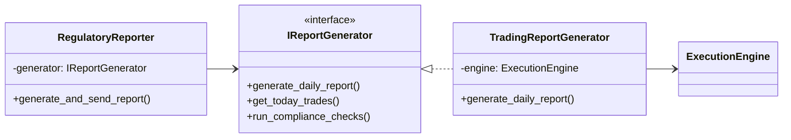

# 合规报告模块代码结构

## 1. 文件结构
```
src/
├── infrastructure/
│   ├── compliance/
│   │   ├── __init__.py      # 接口定义
│   │   └── regulatory_reporter.py  # 报告服务
│   └── notification/        # 通知服务
│
├── trading/
│   └── execution/
│       ├── reporting.py     # 报告生成器实现
│       └── execution_engine.py
│
└── features/               # 特征工程
    └── technical.py

tests/
└── infrastructure/
    └── compliance/
        └── test_regulatory_reporter.py
```

## 2. 关键类关系


## 3. 依赖管理

### 允许的依赖方向
✅ 基础设施层 → 接口层  
✅ 业务层 → 接口层  
✅ 测试层 → 所有层  

### 禁止的依赖方向
❌ 基础设施层 → 业务层  
❌ 接口层 → 实现层  

## 4. 扩展建议

### 添加新报告类型
1. 创建新的实现类：
```python
class CustomReportGenerator(IReportGenerator):
    def __init__(self, custom_service):
        self.service = custom_service
        
    def generate_daily_report(self) -> str:
        # 自定义实现
        return "/custom/report.pdf"
```

2. 通过依赖注入使用：
```python
# 在应用初始化时
generator = CustomReportGenerator(custom_service)
reporter = RegulatoryReporter(generator)
```

## 5. 开发规范

1. **接口实现**：
   - 必须实现所有抽象方法
   - 方法签名必须严格匹配
   - 遵循接口文档中的返回值约定

2. **异常处理**：
   - 捕获实现特定的异常
   - 转换为接口定义的异常类型
   - 添加足够的上下文信息

3. **测试要求**：
   - 100%接口方法覆盖率
   - 模拟所有外部依赖
   - 包含边界条件测试
