# RQA2025 代码结构指南
<!-- 
版本更新记录：
2024-04-10 v1.3.0 - 新增安全配置功能
    - 添加配置签名验证
    - 实现安全加载接口
    - 更新架构设计文档
2024-03-20 v1.2.0 - 新增工具函数模块文档
-->

## 1. 基础设施层模块位置
<!-- BEGIN_MODULE_DOC -->

### 1.22 工具函数模块 (新增)
| 模块 | 路径 | 功能说明 |
|------|------|---------|
| 通用工具 | `src/infrastructure/utils/tools.py` | 提供数据处理、验证等基础功能 |
| 配置管理 | `src/infrastructure/config/services/` | 系统配置加载、验证和管理 |
>

### 1.23 配置加载器模块 (更新)
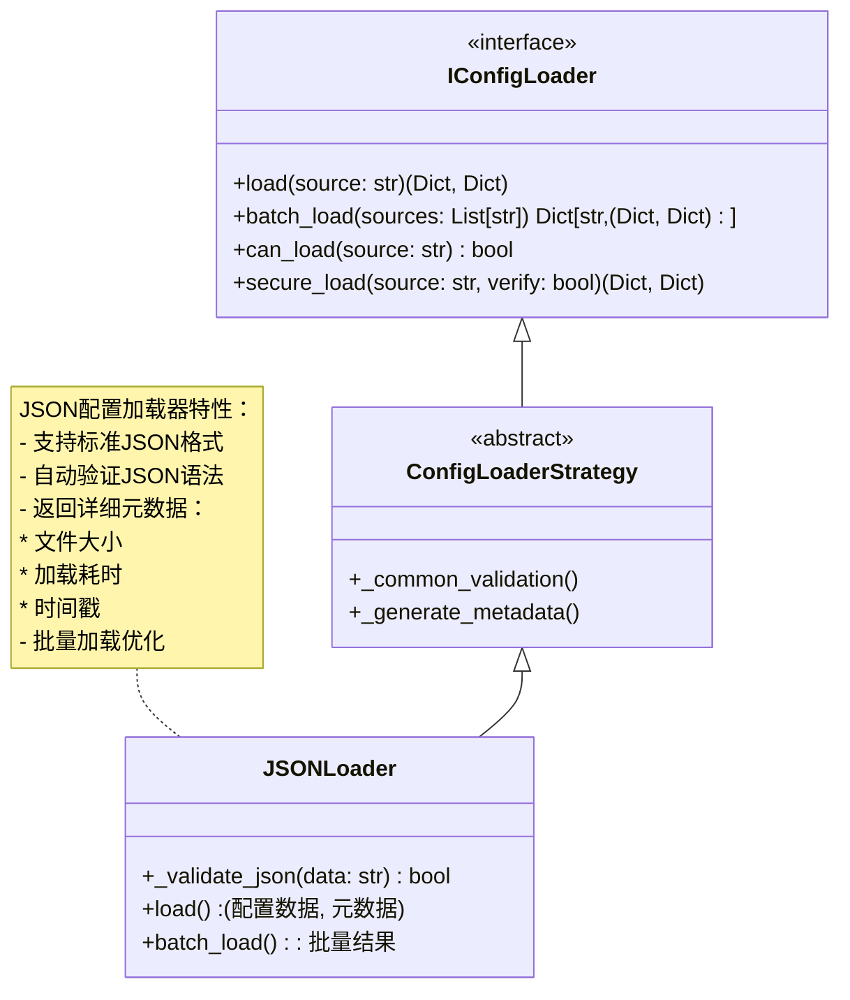

**核心功能**:
1. **格式支持**:
   - 标准JSON (RFC 8259)
   - 支持注释(通过预处理)
   - 大文件流式处理

2. **元数据**:
   ```python
   {
       'format': 'json',
       'source': '/path/to/file.json',
       'size': 1024,  # 字节
       'load_time': 0.002,  # 秒
       'timestamp': 1630000000.0  # Unix时间戳
   }
   ```

3. **使用示例**:
```python
# 初始化
loader = JSONLoader()

# 加载单个文件
data, meta = loader.load('config.json')
if meta['size'] > 1024*1024:
    print("警告: 大配置文件")

# 批量加载
results = loader.batch_load(['app.json', 'user.json'])
```

### 1.24 日志管理模块 (更新)
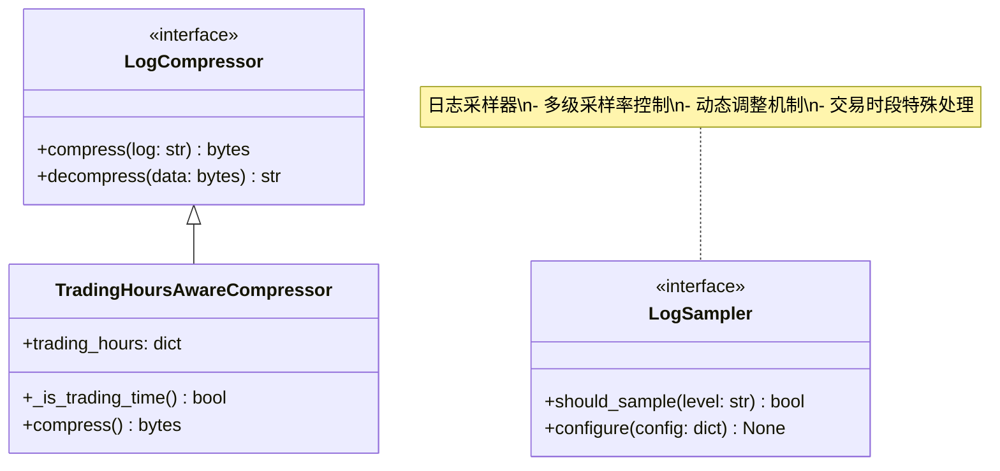

**采样功能配置**:
```yaml
logging:
  sampling:
    enabled: true
    default_rate: 0.3  # 默认采样率
    level_rates:
      DEBUG: 0.1
      INFO: 0.5
      WARNING: 1.0
      ERROR: 1.0
    trading_hours:
      enabled: true
      rate: 1.0  # 交易时段全量采样
    dynamic:
      enabled: true
      min_rate: 0.1
      max_rate: 1.0
      load_threshold: 0.7  # CPU负载阈值
```

**核心配置**:
1. **配置项分类**:
   ```mermaid
   graph LR
       A[日志配置] --> B[必需配置]
       A --> C[可选配置]
       B --> B1["trading_hours<br>(交易时段)"]
       B --> B2["initial_rate<br>(初始速率)"]
       C --> C1["algorithm<br>(压缩算法)"]
       C --> C2["backoff_factor<br>(回退因子)"]
   ```

2. **详细配置说明**:
   - **必需配置**:
     ```python
     # 交易时段配置
     trading_hours = {
         "morning": ("09:30", "11:30"),
         "afternoon": ("13:00", "15:00")
     }
     
     # 速率限制配置
     initial_rate = 1000  # 日志条数/秒
     ```

   - **可选配置**:
     ```python
     # 压缩算法配置
     algorithm = "zstd"  # 默认值
     compression_level = 3  # 1-9, 默认3
     
     # 回退因子
     backoff_factor = 0.5  # 0.1-1.0, 默认0.5
     ```

3. **完整配置示例**:
```python
{
    "compression": {
        # 必需配置
        "trading_hours": {
            "morning": ("09:30", "11:30"),
            "afternoon": ("13:00", "15:00")
        },
        # 可选配置
        "algorithm": "zstd",
        "level": 3,
        "backoff_factor": 0.5
    },
    "backpressure": {
        # 必需配置
        "initial_rate": 1000,
        "max_rate": 10000,
        "window_size": 60,
        # 可选配置
        "backoff_factor": 0.5
    }
}
```

**版本更新**:
```markdown
<!-- BEGIN_UPDATE -->
### v1.6.0 (2024-06-25)
- 增强日志模块配置说明
  - 明确区分必需和可选配置项
  - 添加配置项分类图表
  - 提供完整配置示例
  - 更新相关测试用例
<!-- END_UPDATE -->
```

### 1.25 连接池模块 (新增)
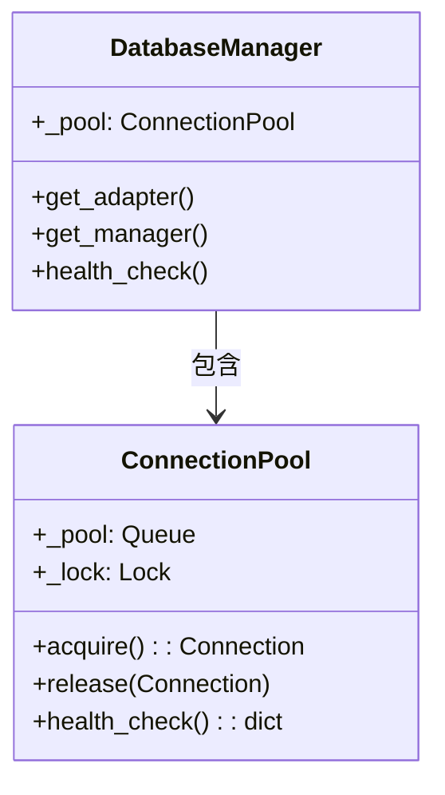

**核心功能**:
1. 线程安全连接管理
2. 连接复用机制
3. 自动健康检查
4. 泄漏防护

**使用示例**:
```python
from infrastructure.database import DatabaseManager

# 获取带连接池的适配器
adapter = DatabaseManager.get_adapter()

# 检查连接池状态
health = DatabaseManager.health_check()
print(f"Active connections: {health['active']}")
print(f"Leak detection: {health['config']['leak_detection']}")

# 动态更新配置
DatabaseManager.update_config(
    max_size=50,
    idle_timeout=300,
    leak_detection=True
)

# 高级监控
health = DatabaseManager.health_check()
if health.get('leaks', 0) > 0:
    print(f"Warning: {health['leaks']} potential leaks detected")
```

### 1.26 监控装饰器模块 (新增)
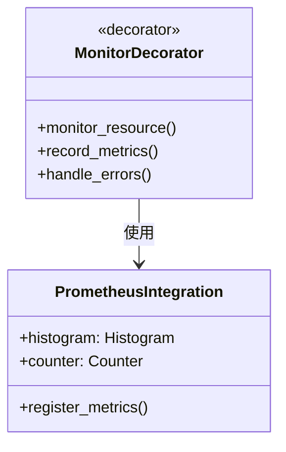

**核心功能**:
1. 方法级资源监控
2. Prometheus指标集成
3. 错误自动记录
4. 性能指标收集

**使用示例**:
```python
from infrastructure.monitoring.decorators import monitor_resource

@monitor_resource('json_loader')
def load_config(path):
    # 配置加载实现
    ...
```

### 1.27 错误处理器模块 (补充)
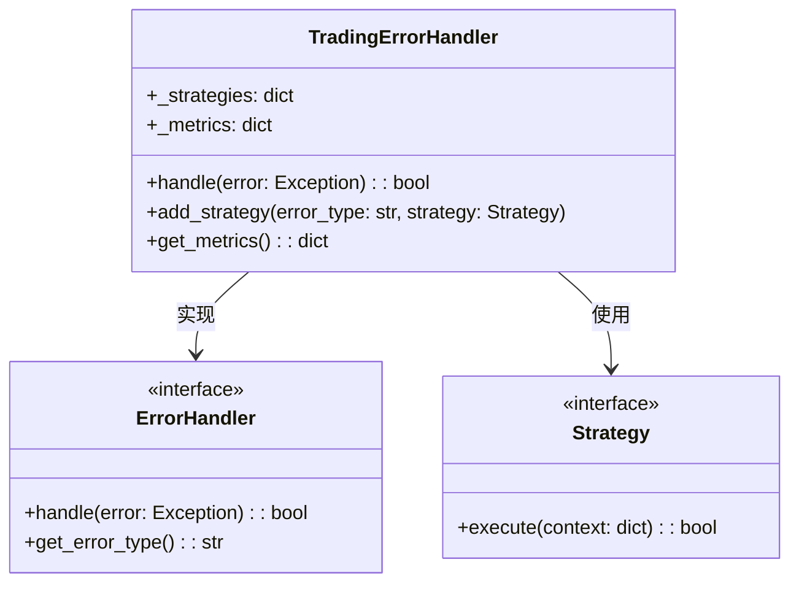

### 1.28 安全模块 (新增)
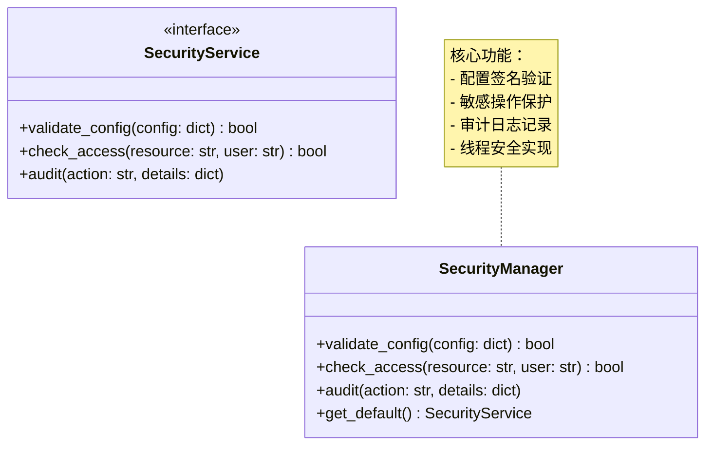

**核心功能**:
1. **配置验证**:
   - 自动签名检查
   - 敏感数据过滤
   - 环境策略应用

2. **访问控制**:
   ```python
   # 使用示例
   service = get_default_security_service()
   if not service.check_access("config/update", current_user):
       raise PermissionError
   ```

3. **审计日志**:
   ```python
   service.audit("config_update", {
       "user": current_user,
       "changes": diff
   })
   ```

**类型提示**:
```python
def get_default_security_service() -> SecurityManager:
    """获取默认安全服务实例"""
    ...
```

**版本更新**:
```markdown
<!-- BEGIN_UPDATE -->
### v1.4.0 (2024-04-15)
- 增强安全模块文档
  - 添加类图和接口说明
  - 补充使用示例
  - 添加类型提示指南
<!-- END_UPDATE -->
```

**核心功能**:
1. 多策略错误处理
2. 自动错误分类
3. 处理指标收集
4. 上下文安全管理

**使用示例**:
```python
from infrastructure.error import TradingErrorHandler
from infrastructure.error.strategies import RetryStrategy

handler = TradingErrorHandler()
handler.add_strategy("network", RetryStrategy(max_attempts=3))

try:
    make_remote_call()
except NetworkError as e:
    handler.handle(e)  # 自动应用重试策略
```
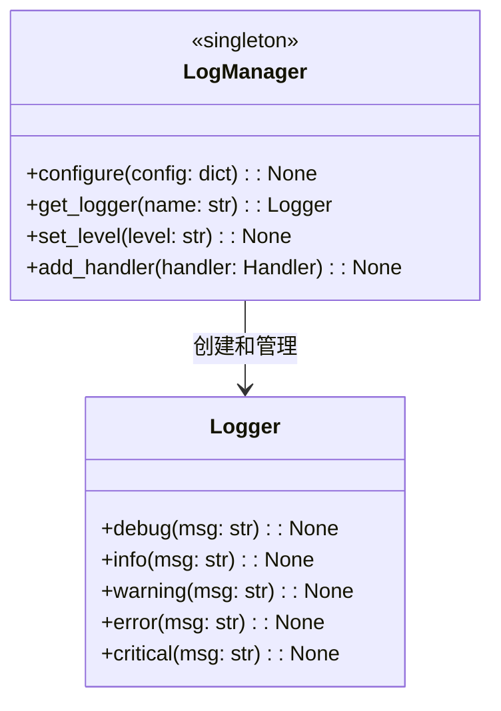

**核心功能**:
1. 多级别日志记录(DEBUG/INFO/WARNING/ERROR/CRITICAL)
2. 多输出目标支持(文件/控制台/远程)
3. 日志格式自定义
4. 日志轮转管理

**使用示例**:
```python
from infrastructure.m_logging import LogManager

# 初始化日志配置
LogManager.configure({
    'level': 'INFO',
    'format': '%(asctime)s - %(name)s - %(levelname)s - %(message)s',
    'handlers': [
        {'type': 'file', 'filename': 'app.log'},
        {'type': 'console'}
    ]
})

# 获取日志器
logger = LogManager.get_logger('main')
logger.info('Application started')
```
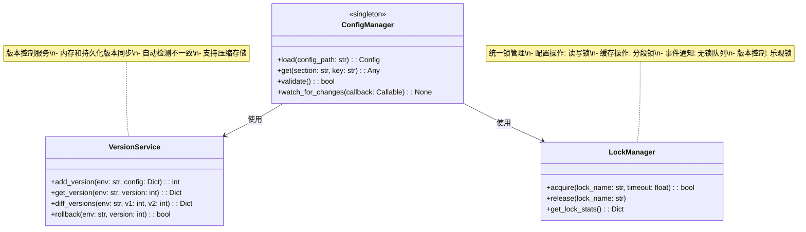

**核心功能**:
1. **多格式支持**:
   - YAML/JSON/INI配置加载
   - 环境变量覆盖机制
   - 动态配置热更新

2. **版本控制**:
   - 保留50个历史版本
   - 版本差异比较
   - 安全回滚机制

3. **线程安全**:
   - 细粒度锁控制
   - 死锁检测
   - 锁争用监控

4. **安全验证**:
   - 配置签名验证
   - 敏感数据脱敏
   - 操作审计日志

5. **配置更新**:
   ```python
   def update(self, key: str, value: Any, env: str = "default") -> bool:
       """线程安全的配置更新
       Args:
           key: 配置键
           value: 新值
           env: 环境名称
       Returns:
           是否成功
       Raises:
           ConfigValidationError: 验证失败
       """
       # 实现包含:
       # - 锁管理
       # - 版本控制
       # - 审计日志
       # - 事件通知
   ```

**使用示例**:
```python
# 获取带版本控制的配置
config = ConfigManager().load("prod", enable_versioning=True)

# 安全更新配置
with LockManager().acquire("config"):
    old_ver = VersionService().get_version("prod", -1)
    ConfigManager().update("db.host", "new_host")
    new_ver = VersionService().add_version("prod", config)

# 比较版本差异
diff = VersionService().diff_versions("prod", old_ver, new_ver)
```

**使用示例**:
```python
from infrastructure.config import ConfigManager

# 加载配置
config = ConfigManager.load("config/prod.yaml")

# 获取数据库配置
db_host = config.get("database", "host")
```
| 日期工具 | `src/infrastructure/utils/date*.py` | 日期处理和格式化 |
| 异常工具 | `src/infrastructure/utils/exception*.py` | 异常处理和验证 |
| 性能工具 | `src/infrastructure/utils/performance.py` | 性能监控和分析 |
| 缓存工具 | `src/infrastructure/cache/thread_safe_cache.py` | 增强型缓存管理 |
| | | - 内存感知缓存 |
| | | - 批量操作支持 |
| | | - 实时监控集成 |
| | | - LRU淘汰策略 |
| | | - 大对象压缩存储 |
| | | - 高频访问优化 |

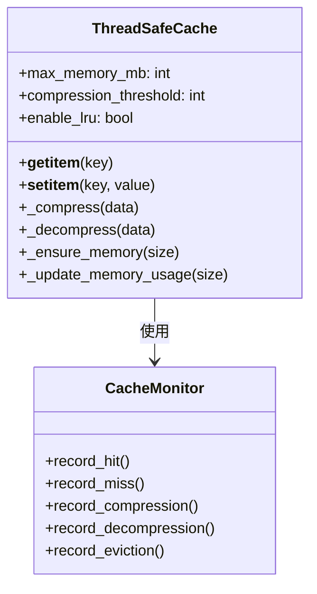

**核心功能**:
1. **内存管理**:
   - 精确内存计算
   - 自动内存回收
   - 压缩大对象

2. **淘汰策略**:
   - LRU访问跟踪
   - 智能淘汰算法
   - 优先级回收

3. **监控指标**:
   - 命中率统计
   - 压缩率监控
   - 淘汰次数记录

**使用示例**:
```python
from infrastructure.cache import ThreadSafeCache

# 初始化带内存限制和压缩的缓存
cache = ThreadSafeCache(
    max_memory_mb=1024,  # 1GB内存限制
    compression_threshold=1024*1024,  # 1MB以上自动压缩
    enable_lru=True  # 启用LRU淘汰
)

# 存储大对象(自动压缩)
cache["large_data"] = get_large_data()  

# 获取数据(自动解压)
data = cache["large_data"]
```

**最佳实践**:
1. 根据数据特点设置压缩阈值
2. 监控内存使用率调整max_memory_mb
3. 高频访问数据预加载
4. 交易时段调整淘汰策略

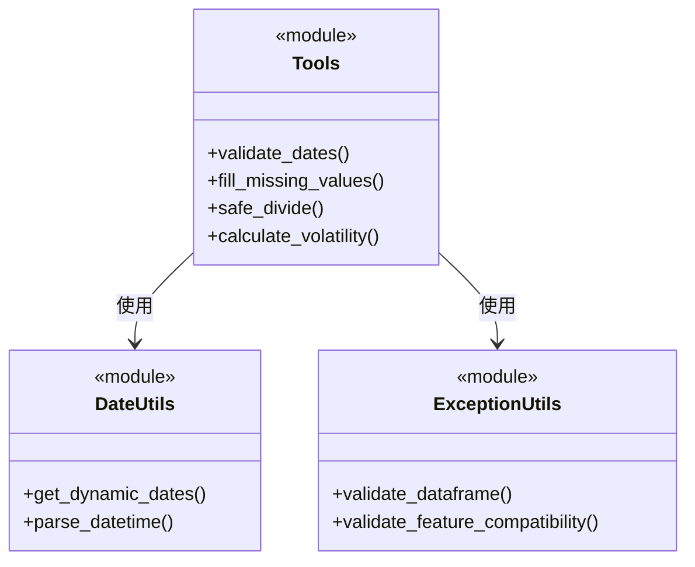

**模块功能说明**:
1. **核心功能**:
   - 数据验证和清洗
   - 日期时间处理
   - 金融计算工具
   - 异常安全操作

2. **使用示例**:
```python
from infrastructure.utils import tools, date_utils

# 日期验证
start, end = tools.validate_dates("2023-01-01", "2023-12-31")

# 缺失值处理
cleaned_data = tools.fill_missing_values(raw_data, method='mean')

# 动态日期范围
start_date, end_date = date_utils.get_dynamic_dates(days_back=30)
```

3. **最佳实践**:
   - 优先使用安全操作函数（如safe_divide）
   - 复杂数据处理前先验证数据完整性
   - 性能敏感场景使用向量化操作

## 2. API参考文档

### 2.1 事件总线API
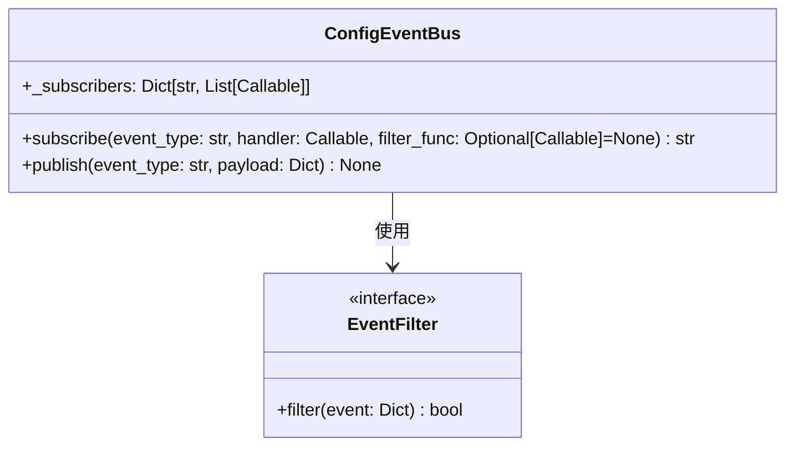

#### 方法说明
1. **subscribe()**:
```python
def subscribe(
    event_type: str, 
    handler: Callable[[Dict], None],
    filter_func: Optional[Callable[[Dict], bool]] = None
) -> str:
    """订阅配置事件
    Args:
        event_type: 事件类型
        handler: 事件处理函数
        filter_func: 可选过滤器函数，返回True时才会调用handler
    Returns:
        订阅ID字符串
    """
```

2. **publish()**:
```python
def publish(event_type: str, payload: Dict) -> None:
    """发布配置事件
    Args:
        event_type: 事件类型
        payload: 事件数据字典
    """
```

#### 使用示例
```python
# 带过滤器的订阅
def handle_high_priority(event):
    print(f"处理高优先级事件: {event}")

event_bus.subscribe(
    "alert",
    handle_high_priority,
    lambda e: e.get("priority") == "high"
)

# 发布事件
event_bus.publish("alert", {
    "message": "系统警告",
    "priority": "high"  # 会被处理
})

event_bus.publish("alert", {
    "message": "普通通知", 
    "priority": "normal"  # 会被过滤
})
```

### 2.2 版本更新
```markdown
<!-- BEGIN_UPDATE -->
### v3.5.0 (2024-09-04)
- 新增事件过滤器功能
  - 支持订阅时传入过滤函数
  - 保持向后兼容性
  - 更新API文档
<!-- END_UPDATE -->
```

## 3. 最佳实践 (原有内容保持不变)
...
