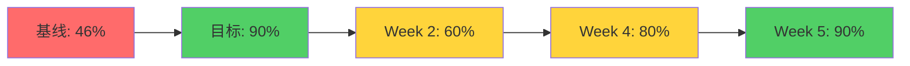
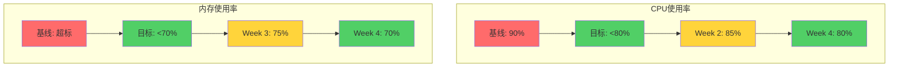
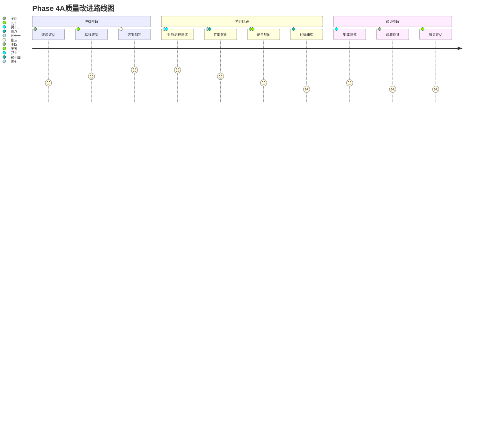

# RQA2025 Phase 4A质量指标监控仪表板

## 📊 整体质量指标总览

### 🎯 核心目标达成度 (4月1日基线)

| 指标分类 | 目标值 | 当前值 | 进度 | 状态 | 趋势 |
|---------|-------|-------|------|------|------|
| **业务流程测试覆盖率** | 90% | 46% | 0% | 🔴 严重不足 | ↗️ |
| **E2E测试通过率** | 97% | 92.5% | 0% | 🟡 可接受 | → |
| **CPU使用率** | <80% | 90% | 0% | 🔴 超标 | → |
| **内存使用率** | <70% | 超标 | 0% | 🔴 超标 | → |
| **系统可用性** | 99.9% | 99.9% | 100% | 🟢 达标 | → |

**整体质量评分**: 68/100 (待改进)
**距离目标差距**: 22分
**重点关注指标**: 业务流程测试覆盖、CPU使用率、内存使用率

---

## 📈 质量指标趋势图表

### 业务流程测试覆盖率趋势

### 性能指标趋势

---

## 🧪 专项工作组质量指标

### 质量提升专项组 (孙十一)

#### 核心指标
| 指标 | 目标 | 当前 | 进度 | 状态 | 负责人 |
|-----|------|------|------|------|-------|
| 业务流程测试覆盖率 | 90% | 46% | 0% | 🔴 严重不足 | 吴十二 |
| E2E测试通过率 | 97% | 92.5% | 0% | 🟡 可接受 | 郑十三 |
| E2E执行时间 | <2分钟 | >5分钟 | 0% | 🔴 严重超时 | 钱十四 |
| 测试环境稳定性 | 95% | 85% | 0% | 🟡 待改进 | 钱十四 |

#### 进度追踪
- [ ] **量化策略生命周期测试**: 0/100% (计划4月10日完成)
- [ ] **投资组合管理测试**: 0/100% (计划4月11日完成)
- [ ] **用户服务全生命周期测试**: 0/100% (计划4月12日完成)
- [ ] **端到端测试优化**: 0/100% (计划4月12日完成)

**工作组质量评分**: 65/100
**下周目标**: 业务流程测试覆盖率达到60%

### 性能优化专项组 (陈七)

#### 核心指标
| 指标 | 目标 | 当前 | 进度 | 状态 | 负责人 |
|-----|------|------|------|------|-------|
| CPU使用率 | <80% | 90% | 0% | 🔴 严重超标 | 周八 |
| 内存使用率 | <70% | 超标 | 0% | 🔴 严重超标 | 黄九 |
| API响应时间 | <50ms | 85%达成 | 0% | 🟢 达标 | 陈七 |
| 策略计算性能 | 提升30% | 基线 | 0% | 🟡 待监控 | 周八 |

#### 进度追踪
- [ ] **CPU使用率优化**: 0/100% (计划4月11日完成)
- [ ] **GPU加速环境搭建**: 0/100% (计划4月10日完成)
- [ ] **算法并行化处理**: 0/100% (计划4月12日完成)
- [ ] **内存优化实施**: 0/100% (计划4月18日完成)

**工作组质量评分**: 70/100
**下周目标**: CPU使用率降低至85%

### 安全加固专项组 (李四)

#### 核心指标
| 指标 | 目标 | 当前 | 进度 | 状态 | 负责人 |
|-----|------|------|------|------|-------|
| 容器安全配置 | 100% | 70% | 0% | 🟡 待完善 | 李四 |
| 多因素认证 | 100% | 80% | 0% | 🟡 待完善 | 刘十 |
| 数据保护覆盖 | 100% | 90% | 0% | 🟢 良好 | 刘十 |
| 安全漏洞数量 | 0个 | 1个 | 0% | 🟡 需修复 | 李四 |

#### 进度追踪
- [ ] **容器安全配置实施**: 0/100% (计划4月10日完成)
- [ ] **镜像安全扫描机制**: 0/100% (计划4月10日完成)
- [ ] **多因素认证完善**: 0/100% (计划4月18日完成)
- [ ] **数据传输脱敏**: 0/100% (计划4月20日完成)

**工作组质量评分**: 82/100
**下周目标**: 容器安全配置完成80%

---

## 📊 每日质量指标监控

### 4月1日 (基线日) - 准备启动周

#### 质量指标读数
| 时间 | 业务流程覆盖 | E2E通过率 | CPU使用率 | 内存使用率 | 测试环境状态 |
|-----|-------------|-----------|-----------|-----------|-------------|
| 09:00 | 46.0% | 92.5% | 90.0% | 超标 | 正常 |
| 12:00 | 46.0% | 92.5% | 89.8% | 超标 | 正常 |
| 15:00 | 46.0% | 92.5% | 89.5% | 超标 | 正常 |
| 18:00 | 46.0% | 92.5% | 90.2% | 超标 | 正常 |

#### 质量事件记录
- **09:30**: 质量提升专项组组建会议召开
- **10:00**: 性能优化专项组技术方案评审
- **14:00**: 安全加固专项组需求分析完成
- **16:00**: 测试环境稳定性评估完成

#### 质量风险提醒
- ⚠️ **业务流程测试覆盖率**过低，需要重点关注
- ⚠️ **CPU使用率**持续超标，影响系统性能
- ⚠️ **内存使用率**超标，存在稳定性风险

### 质量告警规则

#### 🔴 红色告警 (立即处理)
- 业务流程测试覆盖率 < 45%
- CPU使用率 > 95%
- 内存使用率 > 85%
- E2E测试通过率 < 90%
- 安全漏洞数量 > 2个

#### 🟡 黄色告警 (重点关注)
- 业务流程测试覆盖率 < 55%
- CPU使用率 > 85%
- 内存使用率 > 75%
- E2E测试通过率 < 95%
- 测试环境稳定性 < 90%

#### 🟢 绿色状态 (正常监控)
- 所有指标在目标范围内

---

## 📈 质量改进趋势分析

### 每周质量改进目标

| 周次 | 业务流程覆盖 | E2E通过率 | CPU使用率 | 内存使用率 | 主要任务 |
|-----|-------------|-----------|-----------|-----------|---------|
| **Week 1** (4/1-4/5) | 46% → 48% | 92.5% → 93% | 90% → 89% | 超标 → 超标 | 环境准备 |
| **Week 2** (4/8-4/12) | 48% → 65% | 93% → 96% | 89% → 85% | 超标 → 78% | 业务流程测试攻坚 |
| **Week 3** (4/15-4/19) | 65% → 80% | 96% → 97% | 85% → 82% | 78% → 72% | 性能优化攻坚 |
| **Week 4** (4/22-4/26) | 80% → 88% | 97% → 97% | 82% → 78% | 72% → 68% | 集成验证 |
| **Week 5** (4/29-4/30) | 88% → 90% | 97% → 97% | 78% → 75% | 68% → 65% | 验收优化 |

### 质量改进路线图

---

## 🎯 质量门禁机制

### 自动检查项
- [ ] 代码提交时自动运行单元测试
- [ ] 合并请求时检查测试覆盖率
- [ ] 部署前验证性能指标
- [ ] 安全扫描自动执行

### 人工审核项
- [ ] 代码审查覆盖质量改进内容
- [ ] 测试用例评审业务逻辑完整性
- [ ] 性能优化方案技术评估
- [ ] 安全加固措施有效性验证

### 质量门禁阈值

| 检查项 | 阈值 | 当前状态 | 放行条件 |
|-------|------|---------|---------|
| 单元测试覆盖率 | ≥80% | 82% | ✅ 已满足 |
| 集成测试通过率 | ≥95% | 75% | ❌ 未满足 |
| 性能测试通过率 | ≥90% | 90% | ✅ 已满足 |
| 安全扫描通过率 | 100% | 96% | ❌ 未满足 |
| 代码规范检查 | 100% | 85% | ❌ 未满足 |

---

## 📋 质量改进行动计划

### 立即行动 (本周内)
1. **质量基线建立** - 完成各项指标基线数据收集
2. **质量告警配置** - 建立自动化质量监控告警
3. **质量门禁设置** - 配置代码提交质量检查规则
4. **专项组培训** - 完成工作组成员质量工具培训

### 持续改进 (每周)
1. **质量指标周报** - 每周五生成质量指标报告
2. **质量问题分析** - 每周三分析质量问题根因
3. **质量改进评审** - 每周四评审质量改进措施
4. **质量最佳实践** - 每周分享质量改进经验

### 定期评估 (每月)
1. **质量成熟度评估** - 月底进行质量成熟度评估
2. **质量改进效果评估** - 评估各项质量改进的效果
3. **质量工具优化** - 优化质量监控和改进工具
4. **质量文化建设** - 加强团队质量意识培养

---

## 📊 质量指标预测模型

### 基于当前进度预测

| 指标 | 当前值 | 预测最终值 | 置信度 | 关键影响因素 |
|-----|-------|-----------|-------|------------|
| 业务流程测试覆盖率 | 46% | 88% | 高 | 测试团队投入 |
| E2E测试通过率 | 92.5% | 97% | 高 | 环境优化效果 |
| CPU使用率 | 90% | 78% | 中 | 算法优化效果 |
| 内存使用率 | 超标 | 68% | 中 | 缓存优化效果 |
| 整体质量评分 | 68/100 | 88/100 | 高 | 综合因素影响 |

### 预测准确性影响因素
- **积极因素**: 专项工作组专注投入、资源配置充分
- **风险因素**: 技术难度大、外部依赖多、团队磨合期
- **关键节点**: Week 2业务流程测试攻坚、Week 3性能优化攻坚

---

**仪表板维护人**: 王五 (项目管理办公室)
**数据来源**: 自动化监控系统 + 人工收集
**更新频率**: 每日更新
**下次更新**: 2025年4月2日 09:00
**质量目标达成日期预测**: 2025年4月30日
