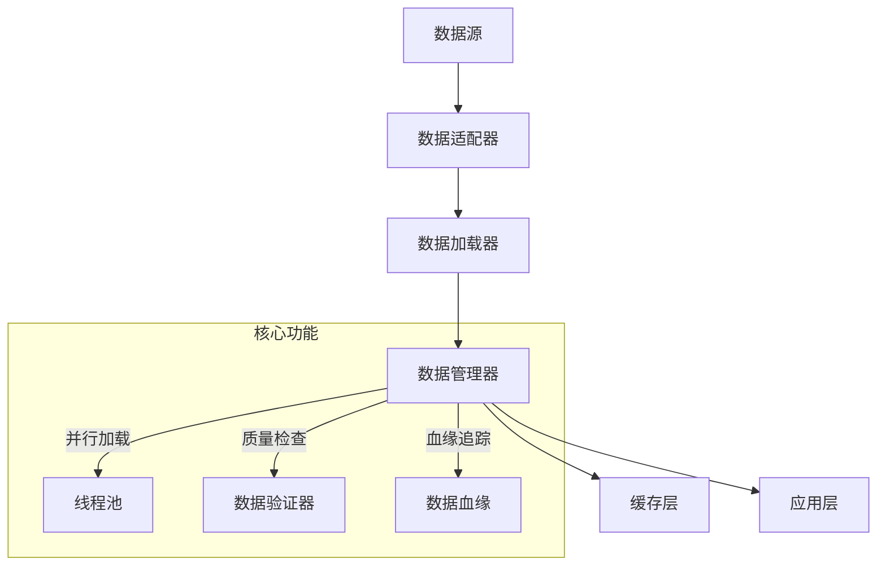
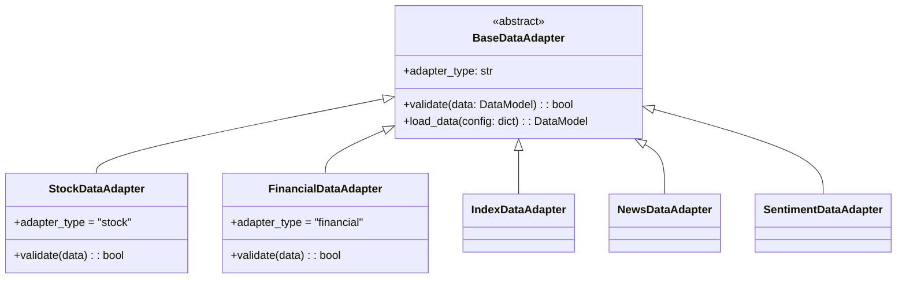
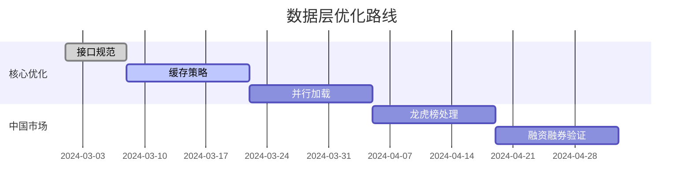
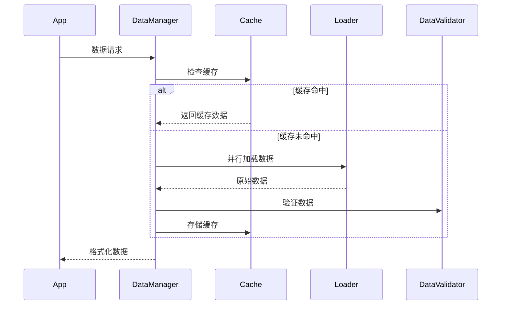
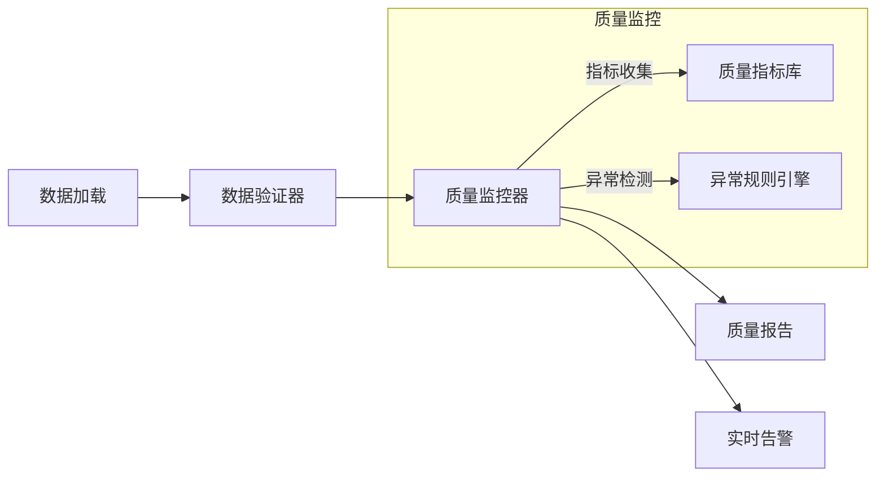

# RQA2025 数据层设计文档

## 1. 概述

数据层负责统一管理各类金融数据，采用分层架构设计：



## 2. 核心组件

### 2.1 数据适配器架构


**适配器统一接口规范**:
1. 所有适配器继承`BaseDataAdapter`基类
2. 必须实现`adapter_type`属性标识适配器类型
3. `validate`方法必须接受`DataModel`参数并返回`bool`
4. 中国市场适配器需额外实现：
   - `check_local_regulations()` 监管合规检查
   - `validate_trading_halt()` 停牌验证
   - `check_price_limit()` 涨跌停验证
   - `dual_source_verify()` 双源校验

**实施路线图**:


### 2.2 数据管理器(DataManager)
```text
核心功能：
1. 统一数据访问接口
2. 智能缓存管理
3. 多线程并行加载
4. 数据质量验证
5. 数据血缘追踪

新增组件：
- CacheManager: 管理内存和磁盘缓存
- DataValidator: 数据质量验证
- DataRegistry: 加载器注册中心
```

## 3. 数据加载流程

### 3.1 优化后的加载流程


### 3.2 增强的缓存机制
```python
# 缓存配置示例
cache_strategy = CacheStrategy({
    'max_cache_size': '1GB',  # 最大缓存大小
    'cache_ttl': 86400,       # 缓存有效期(秒)
    'compress': True          # 启用压缩
})

# 多级缓存策略
1. 内存缓存: LRU策略，保存热点数据
2. 磁盘缓存: Parquet格式，持久化存储
3. 网络缓存: CDN加速远程数据
```

**缓存策略优化**:
| 数据类型       | 缓存时间 | 压缩 | 存储级别 |
|---------------|---------|------|---------|
| 行情数据       | 24小时  | 是   | 内存+磁盘 |
| 财务数据       | 7天     | 是   | 磁盘     |
| 新闻数据       | 12小时  | 否   | 内存     |
| 情感分析       | 不缓存  | -    | -       |

### 3.3 并行批量加载
```python
# 并行加载示例
results = data_manager.load_multi_source(
    stock_symbols=["600000", "000001"],
    index_symbols=["000300"],
    start="2023-01-01",
    end="2023-01-31"
)

# 性能指标
| 操作类型       | 平均延迟 | 吞吐量 |
|---------------|---------|--------|
| 单股票加载     | 50ms    | 1000+/分钟 |
| 批量加载(100支)| 200ms   | 100+/分钟 |
| 财务数据加载   | 100ms   | 500+/分钟 |
```

## 4. 数据质量控制

### 4.1 验证规则
```python
class DataValidator:
    """数据验证器"""
    
    RULES = {
        'stock': [
            ('ohlc', self._validate_ohlc),
            ('volume', self._validate_volume),
            ('price_limit', self._validate_price_limit)
        ],
        'news': [
            ('publish_time', self._validate_timestamp),
            ('content', self._validate_text)
        ]
    }
```

### 4.2 数据血缘追踪
```python
# 血缘记录示例
{
    "data_type": "stock",
    "symbol": "600000",
    "source": "jqdata",
    "processing_steps": [
        "raw -> cleaned",
        "cleaned -> aligned"
    ],
    "timestamp": "2023-01-01T00:00:00"
}
```
```

### 3.4 缓存管理
```python
# 清理过期缓存(保留最近30天)
data_manager.clear_cache(older_than_days=30)

# 手动删除特定缓存
data_manager._save_to_cache(key, data, ttl=0)  # 立即过期
```

### 3.5 性能建议
1. 高频访问数据设置较长TTL
2. 批量操作使用batch_load方法
3. 定期清理过期缓存
4. 大数据集分批次加载

## 4. 数据质量控制

### 4.1 验证架构


### 4.2 质量监控组件
```python
class DataQualityMonitor:
    """数据质量监控器"""
    
    METRICS = {
        'stock': [
            ('price_gap', self._calc_price_gap),
            ('volume_spike', self._detect_volume_spike),
            ('missing_rate', self._calc_missing_rate)
        ]
    }
    
    def track_metrics(self, data):
        """跟踪数据质量指标"""
        # 实现指标计算和异常检测
```

### 4.3 质量报告API
```python
# 获取质量报告
report = data_manager.get_quality_report(
    symbol="600000",
    start="2023-01-01",
    end="2023-01-31"
)

# 报告格式示例
{
    "symbol": "600000",
    "period": "2023-01",
    "metrics": {
        "price_gap": 0.02,
        "volume_spike": 3,
        "missing_rate": 0.001
    },
    "anomalies": [
        {"timestamp": "2023-01-15", "type": "price_gap", "value": 0.15}
    ]
}
```

### 4.4 异常处理增强
```python
try:
    data = data_manager.get_stock_data(...)
    if data.quality_score < 0.8:
        logger.warning(f"数据质量警告: {data.symbol}")
except DataQualityError as e:
    logger.error(f"数据质量异常: {e}")
    # 触发质量告警流程
```

## 5. 扩展接口

### 5.1 自定义加载器
```python
class CustomDataLoader:
    def load(self, *args, **kwargs):
        """实现自定义数据加载逻辑"""
        pass

# 注册到DataManager
data_manager.register_loader("custom", CustomDataLoader())
```

### 5.2 数据预处理
```python
@data_manager.register_preprocessor("stock")
def preprocess_stock_data(raw_data):
    """股票数据预处理"""
    # 数据清洗和转换
    return processed_data
```

## 6. 性能指标

| 操作类型 | 平均耗时 | 并发能力 |
|---------|---------|---------|
| 单股票加载 | 50ms | 1000+/分钟 |
| 批量加载(100支) | 200ms | 100+/分钟 |
| 财务数据加载 | 100ms | 500+/分钟 |

## 7. 最佳实践

```python
# 示例1：高效获取多股票数据
symbols = ["600000", "000001", "601318"]
start_date = "2023-01-01"
end_date = "2023-01-31"

# 批量获取
stock_data = data_manager.batch_load_stock_data(symbols, start_date, end_date)

# 获取指数基准
index_data = data_manager.get_index_data("000001", start_date, end_date)

# 组合分析
portfolio = {
    "stocks": stock_data,
    "benchmark": index_data
}
```

## 8. 版本历史

- v1.0 (2023-06-01): 初始版本
- v1.1 (2023-07-15): 添加缓存机制
- v1.2 (2023-08-20): 增加批量加载功能
