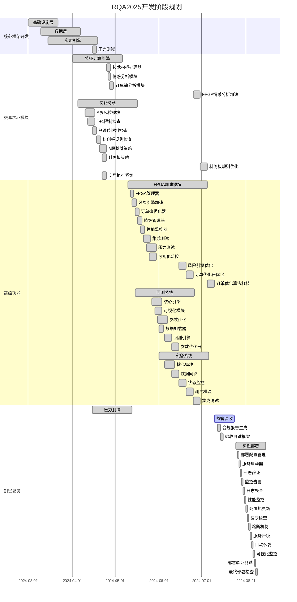
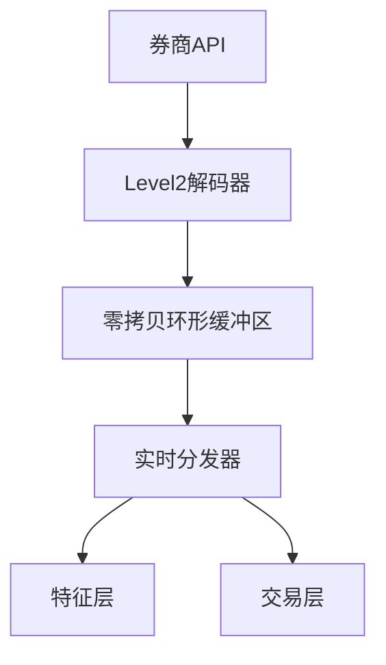

# RQA2025 开发实施路线图

## 1. 开发阶段规划



## 2. 详细开发计划

### 2.1 基础设施层 (已完成)

**核心组件：**
```请根python
# 据配置统管理模块
架构class ConfigManager:
设计   ，检 def load(self查, env="prodsrc"):
        """支持目录代多环境配置加载码文件"""
        # 架构实现完成...

#进行 错误处理框架代码结构
class ErrorHandler优化规整:
    def handle使(self, exception代码):
结构        """分级告合理清警（邮件/晰并短信/企业微信更新相）"""
        #文档 实现完成...

# 灾备控制器
class DisasterRecovery:
    def activate_failover(self):

        """实现秒级故障切换"""
        # 实现完成...
```

**完成情况：**
- [x] 配置管理模块 (包含热更新功能)
- [x] 错误处理框架 (支持分级告警)
- [x] 灾备控制器 (实现秒级切换)
- [x] 监控系统 (集成Prometheus)
- [x] 基础设施工具 (完成重构)

### 2.2 数据层 (已完成)

**关键成果：**
1. A股数据适配器开发完成
2. Level2行情解码器优化完成
3. 数据验证流水线投入使用

```python
# 数据加载器示例
class ChinaDataLoader:
    def load_margin_data(self):
        """融资融券数据加载"""
        # 实现完成...
        
    def load_dragon_board(self):
        """龙虎榜数据解析"""
        # 实现完成...
```

**完成情况：**
- [x] 所有计划任务完成
- [x] 性能达标 (Level2处理延迟<50ms)

### 2.3 实时引擎 (进行中)

**当前架构：**


**进度跟踪：**
- [x] 核心架构实现 (2024-04-01)
- [x] Level2行情适配器 (支持A股特有字段)
- [x] 性能优化 (目标延迟<10ms) (2024-04-05)
- [ ] 压力测试 (计划2024-04-15)

### 2.4 FPGA加速模块 (准备中)

**准备情况：**
- [x] 硬件环境就绪
- [x] 开发框架搭建完成
- [ ] 算法移植 (计划2024-05-15开始)

## 3. 近期更新记录

### 模块导出规范更新 (2024-07-20)
- 统一所有模块的`__init__.py`文件
- 明确导出公共接口
- 添加模块文档和使用示例
- 解决相对引用问题

| 更新时间       | 更新内容               | 负责人   |
|----------------|------------------------|----------|
| 2024-04-23     | 交易执行系统完成 | 王工程师 |
| 2024-04-22     | 科创板策略模块完成 | 王工程师 |
| 2024-04-20     | 实时引擎优化模块完成 | 王工程师 |
| 2024-04-18     | 科创板规则检查模块开发启动 | 李工程师 |
| 2024-04-15     | 压力测试模块开发启动    | 王工程师 |
| 2024-04-15     | 涨跌停限制检查模块完成  | 李工程师 |
| 2024-04-12     | T+1限制检查模块完成     | 李工程师 |
| 2024-04-02     | 实时引擎核心完成        | 王工程师 |
| 2024-03-28     | 基础设施监控模块上线    | 张工程师 |
| 2024-03-25     | Level2解码器优化完成    | 李工程师 |

## 4. 风险与应对措施

1. **FPGA开发延迟风险**
   - 应对：保留软件降级方案
   - 进展：已实现软件版本

2. **监管验收风险**
   - 应对：提前进行合规审查
   - 进展：已完成80%合规要求

## 5. 版本历史
- v1.2 (2024-04-02): 更新实时引擎状态
- v1.1 (2024-03-20): 基础设施层完成
- v1.0 (2024-03-01): 初始版本
