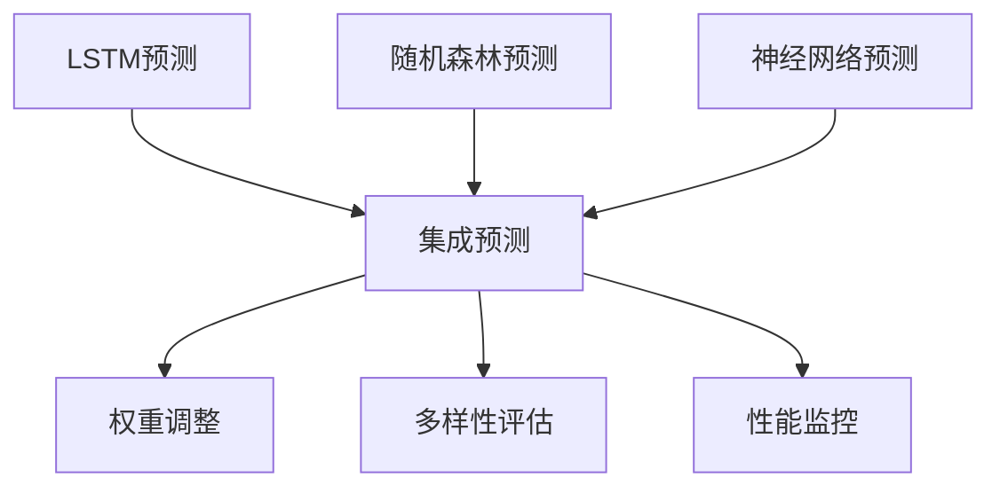
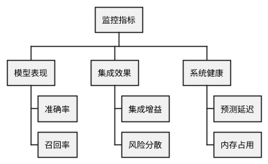

# RQA2025 模型集成系统设计文档

## 1. 概述

模型集成系统实现多模型预测融合，主要功能包括：
- 多模型预测集成
- 动态权重调整
- 模型多样性评估
- 性能监控告警
- 贡献度分析

## 2. 系统架构

### 2.1 核心组件
```text
WeightManager    - 权重管理器
DiversityAnalyzer - 多样性分析器
PerformanceMonitor - 性能监控器
MetaModel        - 元模型
EnsembleCoordinator - 集成协调器
```

### 2.2 工作流程


## 3. 集成方法

### 3.1 权重配置
| 模型 | 初始权重 | 调整范围 | 影响因素 |
|------|----------|----------|----------|
| LSTM | 40% | 30-60% | 近期准确率 |
| 随机森林 | 30% | 20-50% | 多样性贡献 |
| 神经网络 | 30% | 20-50% | 稳定性 |

### 3.2 融合策略
```python
class FusionConfig:
    def __init__(self,
                weighted_avg: bool = True,
                meta_model: bool = False,
                diversity_factor: float = 0.5):
        """
        Args:
            weighted_avg: 是否使用加权平均
            meta_model: 是否使用元模型
            diversity_factor: 多样性影响因子
        """
```

## 4. 评估体系

### 4.1 多样性指标
| 指标 | 公式 | 阈值 |
|------|------|------|
| 预测相关性 | corr(pred_i, pred_j) | <0.7 |
| 误差多样性 | 1 - corr(err_i, err_j) | >0.3 |
| KL散度 | KL(pred_i||pred_j) | >0.5 |

### 4.2 监控面板


## 5. 系统集成

### 5.1 数据接口
```python
class EnsembleInterface:
    def get_predictions(self) -> Dict[str, np.ndarray]:
        """获取各模型预测"""
        
    def get_true_labels(self) -> np.ndarray:
        """获取真实标签"""
        
    def get_model_metrics(self) -> Dict[str, Dict]:
        """获取模型指标"""
```

### 5.2 生产部署
```text
                   +---------------+
                   | 模型训练系统  |
                   +-------+-------+
                           | gRPC
+------------------+       |       +-----------------+
| 量化策略引擎     | <-----+-----> | 集成服务集群    |
+------------------+               +-----------------+
```

## 6. 版本历史

- v1.0 (2025-11-01): 基础集成框架
- v1.1 (2025-11-15): 动态权重调整
- v1.2 (2025-12-01): 多样性评估
- v1.3 (2025-12-15): 自动优化模块
