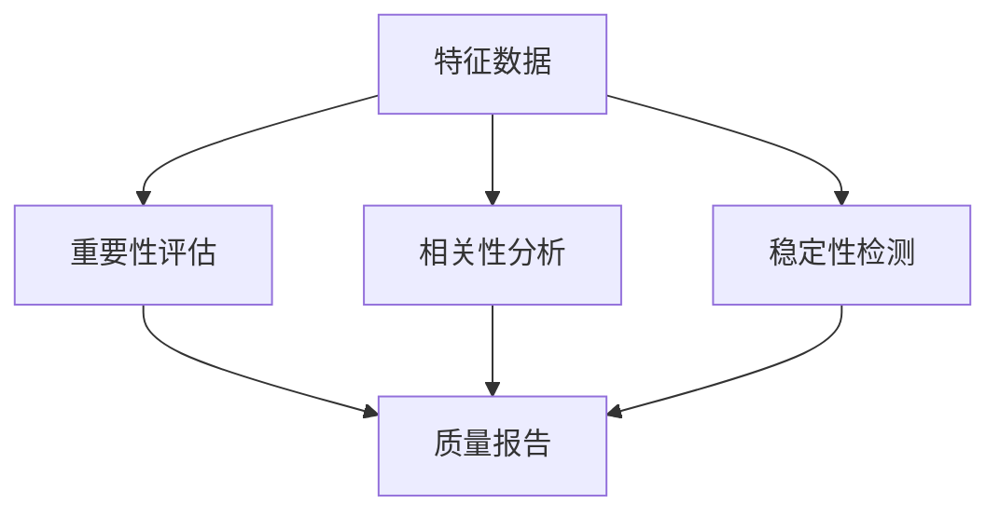

# RQA2025 特征层功能增强分析报告

## 1. 概述

特征层作为RQA2025项目的核心组成部分，负责将原始数据转换为模型可用的特征。本次增强旨在提升特征工程的效率、质量和可扩展性。

### 1.1 现状分析
当前特征层存在以下待改进点：
1. 特征计算采用串行方式，处理大量数据时效率低
2. 缺乏系统化的特征质量评估机制
3. 特征计算结果未有效存储和复用
4. 特征工程流程自动化程度不足
5. 特征可解释性工具缺失

### 1.2 目标
1. 实现并行特征计算，提升处理效率
2. 建立完整的特征质量评估体系
3. 开发特征存储和复用机制
4. 增强特征工程自动化能力
5. 提供丰富的特征可解释性工具

## 2. 详细设计

### 2.1 并行特征计算
```python
class ParallelFeatureProcessor:
    """并行特征处理器"""
    
    def __init__(self, n_jobs=-1):
        self.n_jobs = n_jobs if n_jobs > 0 else os.cpu_count()
        
    def process(self, data, feature_func):
        """并行处理特征"""
        with ProcessPoolExecutor(self.n_jobs) as executor:
            return list(executor.map(feature_func, data))
```

### 2.2 特征质量评估


### 2.3 特征存储机制
```python
class FeatureStore:
    """特征存储"""
    
    def store(self, feature_name, data, params):
        """存储特征数据"""
        feature_id = self._generate_id(feature_name, params)
        # 存储实现...
        
    def load(self, feature_id):
        """加载特征数据"""
        # 加载实现...
```

## 3. 实施计划

### 3.1 阶段一：核心功能开发（2周）
1. 并行计算框架实现
2. 基础质量评估工具
3. 特征存储原型

### 3.2 阶段二：增强功能开发（2周）
1. 自动化特征工程
2. 可解释性工具
3. 性能优化

## 4. 测试方案

### 4.1 单元测试
- 并行计算正确性验证
- 存储/加载功能测试
- 质量评估准确性测试

### 4.2 性能测试
- 并行计算加速比
- 存储系统吞吐量
- 质量评估延迟
