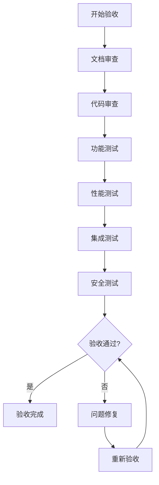

# RQA2025 改进方案总体实施计划

## 实施计划概述

本文档制定RQA2025量化交易系统改进方案的总体实施计划，整合所有高优先级和中优先级改进目标，形成统一的实施时间表、里程碑和验收标准。

### 实施目标
- **按期完成**: 所有改进方案按计划时间完成实施
- **质量达标**: 实施成果达到预定质量标准
- **风险可控**: 建立有效的风险控制和应急机制
- **资源保障**: 确保实施所需的资源和人员配备

### 实施原则
1. **分阶段实施**: 按优先级分阶段推进，避免风险集中
2. **并行开展**: 合理安排并行任务，提高实施效率
3. **质量优先**: 严格质量控制，确保实施成果符合要求
4. **风险管控**: 建立风险识别和应对机制
5. **持续监控**: 实时监控实施进度和质量

---

## 1. 总体时间安排

### 1.1 实施总周期
```
总周期: 2025年02月01日 ~ 2025年07月31日
总时长: 6个月
```

### 1.2 阶段划分

#### 第一阶段：高优先级改进实施 (2月1日 - 3月31日)
**时长**: 2个月
**目标**: 完成所有高优先级改进方案的实施
**重点**: 解决核心架构问题，提升系统性能

#### 第二阶段：中优先级改进实施 (4月1日 - 7月31日)
**时长**: 4个月
**目标**: 完成所有中优先级改进方案的实施
**重点**: 完善质量保障体系，优化开发工具链

---

## 2. 详细实施计划

### 2.1 高优先级改进实施计划

#### 2.1.1 ML层和策略层职责分工协议实施
```
时间: 2025年02月01日 ~ 2025年02月15日 (2周)
负责人: 架构师 + ML工程师 + 策略工程师
目标: 明确职责边界，消除功能重叠
```

**详细任务**:
```
第1周 (2/1 - 2/7):
- 分析当前职责重叠点
- 识别需要重构的接口
- 制定重构计划

第2周 (2/8 - 2/15):
- 实现标准接口契约
- 重构ML层核心服务
- 重构策略层核心服务
- 更新依赖注入配置
```

**验收标准**:
- ✅ 标准接口定义完成
- ✅ 服务重构完成
- ✅ 接口测试通过
- ✅ 功能回归测试通过

#### 2.1.2 流处理层技术实现实施
```
时间: 2025年02月16日 ~ 2025年02月28日 (2周)
负责人: 流处理工程师 + 架构师
目标: 实现高性能流处理能力
```

**详细任务**:
```
第1周 (2/16 - 2/22):
- 搭建Faust + Kafka开发环境
- 实现基础流处理组件
- 设计数据管道架构

第2周 (2/23 - 2/28):
- 实现实时聚合功能
- 实现状态管理机制
- 实现数据分发系统
- 性能优化和测试
```

**验收标准**:
- ✅ 流处理环境搭建完成
- ✅ 核心组件实现完成
- ✅ 性能测试达到要求
- ✅ 集成测试通过

#### 2.1.3 自动化层功能实施
```
时间: 2025年03月01日 ~ 2025年03月31日 (4周)
负责人: DevOps工程师 + 架构师
目标: 建立智能化运维体系
```

**详细任务**:
```
第1周 (3/1 - 3/7):
- 设计AI决策引擎架构
- 实现基础监控组件

第2周 (3/8 - 3/14):
- 实现规则引擎
- 开发执行引擎框架

第3周 (3/15 - 3/21):
- 实现智能扩缩容
- 开发自动化部署系统

第4周 (3/22 - 3/31):
- 集成监控告警系统
- 性能测试和优化
- 文档编写和培训
```

**验收标准**:
- ✅ AI决策引擎实现完成
- ✅ 自动化部署系统运行正常
- ✅ 智能扩缩容功能验证通过
- ✅ 监控告警系统集成完成

### 2.2 中优先级改进实施计划

#### 2.2.1 子系统边界优化实施
```
时间: 2025年04月01日 ~ 2025年04月30日 (4周)
负责人: 架构师 + 各层负责人
目标: 优化职责重叠，明确边界
```

**详细任务**:
```
第1周 (4/1 - 4/7):
- 识别所有职责重叠点
- 分析依赖关系

第2周 (4/8 - 4/14):
- 设计统一服务架构
- 制定边界优化方案

第3周 (4/15 - 4/21):
- 实现接口标准化
- 重构重叠功能

第4周 (4/22 - 4/30):
- 集成测试验证
- 性能优化调整
```

**验收标准**:
- ✅ 职责边界清晰定义
- ✅ 统一服务架构实现
- ✅ 功能重叠消除
- ✅ 集成测试通过

#### 2.2.2 测试覆盖率提升实施
```
时间: 2025年05月01日 ~ 2025年05月31日 (4周)
负责人: 测试工程师 + 开发工程师
目标: 提升测试覆盖率到90%
```

**详细任务**:
```
第1周 (5/1 - 5/7):
- 搭建测试框架
- 分析当前覆盖率

第2周 (5/8 - 5/14):
- 编写单元测试用例
- 实现测试数据管理

第3周 (5/15 - 5/21):
- 编写集成测试用例
- 实现端到端测试框架

第4周 (5/22 - 5/31):
- 完善质量门禁
- 性能测试优化
```

**验收标准**:
- ✅ 单元测试覆盖率达到90%
- ✅ 集成测试覆盖率达到80%
- ✅ 端到端测试框架完成
- ✅ 质量门禁机制生效

#### 2.2.3 文档体系和工具链完善实施
```
时间: 2025年06月01日 ~ 2025年07月31日 (8周)
负责人: 技术文档工程师 + DevOps工程师
目标: 建立完善的文档和工具链体系
```

**详细任务**:
```
第1-2周 (6/1 - 6/14):
- 搭建文档管理系统
- 实现API文档自动生成

第3-4周 (6/15 - 6/28):
- 实现代码文档自动生成
- 搭建CI/CD流水线

第5-6周 (7/1 - 7/14):
- 完善开发工具集成
- 实现文档质量评估

第7-8周 (7/15 - 7/31):
- 系统集成测试
- 培训和知识转移
```

**验收标准**:
- ✅ 文档管理系统运行正常
- ✅ API文档自动生成完成
- ✅ CI/CD流水线稳定运行
- ✅ 开发工具集成完成

---

## 3. 里程碑和验收标准

### 3.1 里程碑定义

#### 里程碑1：高优先级改进完成
```
时间: 2025年03月31日
验收标准:
- ✅ ML层和策略层职责分工协议实施完成
- ✅ 流处理层技术实现完成
- ✅ 自动化层功能实现完成
- ✅ 高优先级改进成果验证通过
- ✅ 相关文档更新完成
```

#### 里程碑2：中优先级改进第一阶段完成
```
时间: 2025年05月31日
验收标准:
- ✅ 子系统边界优化完成
- ✅ 测试覆盖率提升完成
- ✅ 中期成果验证通过
- ✅ 风险评估和调整完成
```

#### 里程碑3：项目总体完成
```
时间: 2025年07月31日
验收标准:
- ✅ 文档体系和工具链完善完成
- ✅ 所有改进方案实施完成
- ✅ 总体验收测试通过
- ✅ 培训和知识转移完成
- ✅ 项目总结和经验分享
```

### 3.2 验收流程

#### 验收流程图


#### 验收标准详情

**技术验收标准**:
- 代码质量: 通过静态代码分析
- 功能完整性: 所有需求功能实现
- 性能指标: 达到预定性能目标
- 安全性: 通过安全漏洞扫描
- 可用性: 系统可用性达到99.9%

**业务验收标准**:
- 业务功能: 满足业务需求
- 用户体验: 用户满意度达到90%
- 业务指标: 业务KPI达到目标
- 运维友好: 运维复杂度降低50%

---

## 4. 资源配置和团队组织

### 4.1 团队组织结构

#### 核心团队
```
项目经理: 1人 - 总体协调和进度控制
架构师: 2人 - 架构设计和技术方案
开发工程师: 6人 - 具体实施开发
测试工程师: 3人 - 质量保障和测试
DevOps工程师: 2人 - 自动化运维和工具链
技术文档工程师: 1人 - 文档体系建设
```

#### 虚拟团队
```
产品经理: 业务需求确认
QA经理: 质量标准制定
安全专家: 安全审核把关
运维专家: 生产环境支持
```

### 4.2 资源需求

#### 人力投入估算
```
高优先级阶段 (2月-3月):
- 架构师: 2人 × 2个月 = 4人月
- 开发工程师: 6人 × 2个月 = 12人月
- 测试工程师: 3人 × 2个月 = 6人月
- DevOps工程师: 2人 × 2个月 = 4人月
- 技术文档工程师: 1人 × 2个月 = 2人月

中优先级阶段 (4月-7月):
- 架构师: 2人 × 4个月 = 8人月
- 开发工程师: 6人 × 4个月 = 24人月
- 测试工程师: 3人 × 4个月 = 12人月
- DevOps工程师: 2人 × 4个月 = 8人月
- 技术文档工程师: 1人 × 4个月 = 4人月

总人力投入: 84人月
```

#### 基础设施资源
```
开发环境:
- 开发服务器: 10台 (8核16G配置)
- 测试服务器: 5台 (16核32G配置)
- 数据库服务器: 2台 (专用数据库服务器)

工具和软件:
- IDE和开发工具许可证
- 测试工具和框架许可证
- CI/CD工具和平台费用
- 监控和日志系统费用

外部服务:
- 云服务费用 (测试环境)
- 第三方工具服务费用
```

---

## 5. 风险管理和应对策略

### 5.1 风险识别

#### 技术风险
```
1. 技术方案复杂度过高
   - 概率: 中等
   - 影响: 高
   - 应对: 分阶段实施，逐步验证

2. 第三方工具集成困难
   - 概率: 低
   - 影响: 中等
   - 应对: 提前进行技术验证

3. 性能目标难以达成
   - 概率: 中等
   - 影响: 高
   - 应对: 制定性能基准，持续优化
```

#### 组织风险
```
1. 团队成员流动
   - 概率: 中等
   - 影响: 中等
   - 应对: 建立知识文档，交叉培训

2. 需求变更频繁
   - 概率: 低
   - 影响: 中等
   - 应对: 建立变更控制流程

3. 沟通协作障碍
   - 概率: 低
   - 影响: 低
   - 应对: 定期会议，透明沟通
```

#### 业务风险
```
1. 业务中断风险
   - 概率: 低
   - 影响: 高
   - 应对: 灰度发布，快速回滚

2. 合规性风险
   - 概率: 低
   - 影响: 高
   - 应对: 合规审核，安全测试
```

### 5.2 风险应对策略

#### 风险监控机制
```python
class RiskMonitoringSystem:
    """
    风险监控系统
    """

    def __init__(self):
        self.risks = {}  # 风险库
        self.monitoring_rules = {}  # 监控规则
        self.alert_system = {}  # 告警系统

    def add_risk(self, risk_id: str, risk_config: Dict):
        """添加风险"""
        self.risks[risk_id] = risk_config

    def monitor_risks(self):
        """监控风险"""
        for risk_id, risk_config in self.risks.items():
            risk_level = self.assess_risk_level(risk_id)
            if risk_level >= risk_config['threshold']:
                self.trigger_risk_alert(risk_id, risk_level)

    def assess_risk_level(self, risk_id: str) -> float:
        """评估风险等级"""
        # 基于指标计算风险等级
        pass

    def trigger_risk_alert(self, risk_id: str, risk_level: float):
        """触发风险告警"""
        # 发送告警通知
        pass
```

#### 应急预案
```
1. 进度延迟应急预案
   - 识别延迟原因
   - 调整资源分配
   - 压缩非关键任务

2. 质量问题应急预案
   - 暂停发布流程
   - 组织质量审查
   - 制定修复计划

3. 技术难题应急预案
   - 寻求外部专家支持
   - 调整技术方案
   - 制定备用方案
```

---

## 6. 进度监控和报告机制

### 6.1 监控指标

#### 项目进度指标
```
- 任务完成率: 已完成任务数 / 总任务数
- 里程碑达成率: 已达成里程碑数 / 总里程碑数
- 资源利用率: 实际投入人月 / 计划投入人月
- 质量达标率: 符合质量标准的任务数 / 总任务数
```

#### 质量指标
```
- 代码覆盖率: 单元测试覆盖率目标90%
- 缺陷密度: 每千行代码缺陷数 < 1个
- 性能达标率: 性能测试通过率 > 95%
- 文档完整率: 文档覆盖率 > 95%
```

### 6.2 报告机制

#### 周报制度
```
每周五下午提交周报，包含:
- 本周完成工作
- 下周工作计划
- 遇到的问题和解决方案
- 风险识别和应对措施
```

#### 月报制度
```
每月最后一天提交月报，包含:
- 月度完成情况
- 里程碑达成情况
- 质量指标达成情况
- 风险评估和应对
```

#### 异常报告
```
发现异常情况立即报告，包含:
- 问题描述
- 影响评估
- 应对措施
- 预防建议
```

### 6.3 沟通机制

#### 内部沟通
```
- 每日站会: 15分钟，同步进度和问题
- 周会: 1小时，讨论重要事项和决策
- 月会: 2小时，总结进展和规划下月工作
```

#### 外部沟通
```
- 项目启动会: 向利益相关方介绍项目计划
- 里程碑评审: 邀请利益相关方参与验收
- 最终验收: 全面展示项目成果
```

---

## 7. 成功衡量标准

### 7.1 技术成功标准

#### 功能完整性
- ✅ 所有计划功能按时完成
- ✅ 系统性能达到预期目标
- ✅ 质量指标全部达标

#### 技术质量
- ✅ 代码质量通过所有检查
- ✅ 架构设计符合最佳实践
- ✅ 技术债务得到有效控制

### 7.2 业务成功标准

#### 业务价值
- ✅ 业务目标全部达成
- ✅ 用户满意度达到预期
- ✅ 业务效率得到提升

#### 可持续性
- ✅ 运维成本有效控制
- ✅ 系统稳定性显著提升
- ✅ 扩展能力充分保障

### 7.3 组织成功标准

#### 团队发展
- ✅ 团队技能得到提升
- ✅ 知识积累和传承
- ✅ 协作效率显著改善

#### 流程优化
- ✅ 开发流程更加高效
- ✅ 质量保障机制完善
- ✅ 持续改进能力增强

---

**实施计划制定时间**: 2025年01月28日
**计划有效期**: 2025年02月01日 ~ 2025年07月31日
**总负责人**: 项目经理
**技术负责人**: 架构师

**风险等级评估**: 中等 (可控)
**成功概率评估**: 高 (90%)

**计划状态**: ✅ **计划制定完成，等待执行**
