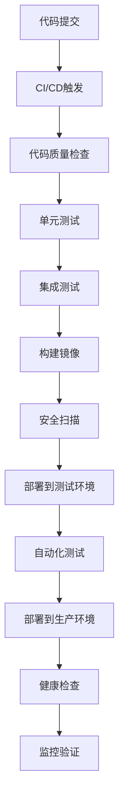
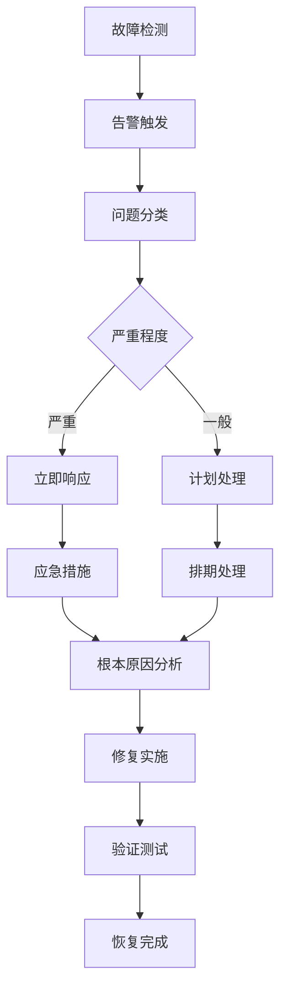

# RQA2025 基础设施层部署与运维文档

## 目录
1. [部署架构概述](#部署架构概述)
2. [部署方式](#部署方式)
3. [环境配置](#环境配置)
4. [部署流程](#部署流程)
5. [运维监控](#运维监控)
6. [故障排除](#故障排除)
7. [性能调优](#性能调优)
8. [安全配置](#安全配置)

## 部署架构概述

### 系统架构图
```
┌─────────────────────────────────────────────────────────────┐
│                    负载均衡器 (Nginx/HAProxy)                │
└─────────────────────┬───────────────────────────────────────┘
                      │
        ┌─────────────┼─────────────┐
        │             │             │
┌───────▼──────┐ ┌────▼────┐ ┌─────▼─────┐
│   Web层      │ │  API层  │ │  任务队列  │
│ (Flask/Django)│ │(FastAPI)│ │ (Celery)  │
└───────┬──────┘ └────┬────┘ └─────┬─────┘
        │             │             │
        └─────────────┼─────────────┘
                      │
        ┌─────────────┼─────────────┐
        │             │             │
┌───────▼──────┐ ┌────▼────┐ ┌─────▼─────┐
│  应用服务层   │ │ 缓存层  │ │  数据层   │
│ (RQA Core)  │ │(Redis)  │ │(PostgreSQL)│
└──────────────┘ └─────────┘ └───────────┘
```

### 核心组件
- **Web服务**: 提供用户界面和API接口
- **应用服务**: RQA2025核心业务逻辑
- **缓存服务**: Redis集群，提供高性能缓存
- **数据服务**: PostgreSQL主从架构
- **监控服务**: Prometheus + Grafana + ELK Stack

## 部署方式

### 1. 独立部署 (Standalone)
适用于开发和小规模生产环境

```bash
# 环境准备
conda create -n rqa python=3.9
conda activate rqa

# 安装依赖
pip install -r requirements.txt

# 启动服务
python src/main.py
```

### 2. 容器化部署 (Docker)
适用于中小规模生产环境

```dockerfile
# Dockerfile
FROM python:3.9-slim

WORKDIR /app
COPY requirements.txt .
RUN pip install -r requirements.txt

COPY . .
EXPOSE 8000

CMD ["python", "src/main.py"]
```

```yaml
# docker-compose.yml
version: '3.8'
services:
  rqa-app:
    build: .
    ports:
      - "8000:8000"
    environment:
      - ENV=production
      - REDIS_URL=redis://redis:6379
      - DB_URL=postgresql://user:pass@db:5432/rqa
    depends_on:
      - redis
      - db
  
  redis:
    image: redis:6-alpine
    ports:
      - "6379:6379"
  
  db:
    image: postgres:13
    environment:
      - POSTGRES_DB=rqa
      - POSTGRES_USER=user
      - POSTGRES_PASSWORD=pass
    volumes:
      - postgres_data:/var/lib/postgresql/data

volumes:
  postgres_data:
```

### 3. Kubernetes部署
适用于大规模生产环境

```yaml
# k8s-deployment.yaml
apiVersion: apps/v1
kind: Deployment
metadata:
  name: rqa-app
spec:
  replicas: 3
  selector:
    matchLabels:
      app: rqa-app
  template:
    metadata:
      labels:
        app: rqa-app
    spec:
      containers:
      - name: rqa-app
        image: rqa:latest
        ports:
        - containerPort: 8000
        env:
        - name: ENV
          value: "production"
        - name: REDIS_URL
          value: "redis://redis-service:6379"
        resources:
          requests:
            memory: "512Mi"
            cpu: "250m"
          limits:
            memory: "1Gi"
            cpu: "500m"
        livenessProbe:
          httpGet:
            path: /health
            port: 8000
          initialDelaySeconds: 30
          periodSeconds: 10
        readinessProbe:
          httpGet:
            path: /ready
            port: 8000
          initialDelaySeconds: 5
          periodSeconds: 5
---
apiVersion: v1
kind: Service
metadata:
  name: rqa-service
spec:
  selector:
    app: rqa-app
  ports:
  - port: 80
    targetPort: 8000
  type: LoadBalancer
```

## 环境配置

### 环境变量配置
```bash
# .env.production
ENV=production
DEBUG=false
LOG_LEVEL=INFO

# 数据库配置
DB_HOST=localhost
DB_PORT=5432
DB_NAME=rqa
DB_USER=rqa_user
DB_PASSWORD=secure_password

# Redis配置
REDIS_HOST=localhost
REDIS_PORT=6379
REDIS_DB=0
REDIS_PASSWORD=

# 缓存配置
CACHE_TTL=3600
CACHE_MAX_SIZE=1000

# 监控配置
PROMETHEUS_ENABLED=true
GRAFANA_ENABLED=true
JAEGER_ENABLED=true

# 安全配置
SECRET_KEY=your-secret-key
JWT_SECRET=your-jwt-secret
CORS_ORIGINS=https://yourdomain.com
```

### 配置文件结构
```
config/
├── production/
│   ├── app.yaml          # 应用配置
│   ├── database.yaml     # 数据库配置
│   ├── cache.yaml        # 缓存配置
│   ├── monitoring.yaml   # 监控配置
│   └── security.yaml     # 安全配置
├── staging/
│   └── ...
└── development/
    └── ...
```

## 部署流程

### 自动化部署流程


### 部署脚本
```bash
#!/bin/bash
# deploy.sh

set -e

ENVIRONMENT=$1
VERSION=$2

if [ -z "$ENVIRONMENT" ] || [ -z "$VERSION" ]; then
    echo "Usage: $0 <environment> <version>"
    exit 1
fi

echo "开始部署 $ENVIRONMENT 环境，版本: $VERSION"

# 1. 环境检查
echo "检查环境状态..."
./scripts/check_environment.sh $ENVIRONMENT

# 2. 备份当前版本
echo "备份当前版本..."
./scripts/backup.sh $ENVIRONMENT

# 3. 部署新版本
echo "部署新版本..."
./scripts/deploy_version.sh $ENVIRONMENT $VERSION

# 4. 健康检查
echo "执行健康检查..."
./scripts/health_check.sh $ENVIRONMENT

# 5. 验证部署
echo "验证部署..."
./scripts/verify_deployment.sh $ENVIRONMENT

echo "部署完成！"
```

### 蓝绿部署
```yaml
# blue-green-deployment.yaml
apiVersion: argoproj.io/v1alpha1
kind: Rollout
metadata:
  name: rqa-rollout
spec:
  replicas: 3
  strategy:
    blueGreen:
      activeService: rqa-active
      previewService: rqa-preview
      autoPromotionEnabled: false
      scaleDownDelaySeconds: 30
      prePromotionAnalysis:
        templates:
        - templateName: success-rate
        args:
        - name: service-name
          value: rqa-active
      postPromotionAnalysis:
        templates:
        - templateName: success-rate
        args:
        - name: service-name
          value: rqa-active
  selector:
    matchLabels:
      app: rqa-app
  template:
    metadata:
      labels:
        app: rqa-app
    spec:
      containers:
      - name: rqa-app
        image: rqa:latest
        ports:
        - containerPort: 8000
```

## 运维监控

### 监控架构
```
┌─────────────────┐    ┌─────────────────┐    ┌─────────────────┐
│   应用层监控     │    │   系统层监控     │    │   业务层监控     │
│  (Prometheus)   │    │  (Node Exporter)│    │  (Custom Metrics)│
└─────────┬───────┘    └─────────┬───────┘    └─────────┬───────┘
          │                      │                      │
          └──────────────────────┼──────────────────────┘
                                 │
                    ┌─────────────▼─────────────┐
                    │      Grafana Dashboard    │
                    └─────────────┬─────────────┘
                                  │
                    ┌─────────────▼─────────────┐
                    │     告警管理器 (Alertmanager) │
                    └─────────────┬─────────────┘
                                  │
                    ┌─────────────▼─────────────┐
                    │     通知渠道 (Slack/邮件)  │
                    └───────────────────────────┘
```

### 关键监控指标

#### 应用性能指标
- **响应时间**: P50, P95, P99
- **吞吐量**: QPS, TPS
- **错误率**: 4xx, 5xx错误比例
- **资源使用**: CPU, 内存, 磁盘, 网络

#### 业务指标
- **交易成功率**: 订单处理成功率
- **缓存命中率**: Redis缓存效率
- **数据库性能**: 查询响应时间, 连接池状态
- **队列状态**: 任务队列长度, 处理延迟

### 监控配置示例

#### Prometheus配置
```yaml
# prometheus.yml
global:
  scrape_interval: 15s
  evaluation_interval: 15s

rule_files:
  - "rules/*.yml"

alerting:
  alertmanagers:
    - static_configs:
        - targets:
          - alertmanager:9093

scrape_configs:
  - job_name: 'rqa-app'
    static_configs:
      - targets: ['rqa-app:8000']
    metrics_path: '/metrics'
    scrape_interval: 5s

  - job_name: 'redis'
    static_configs:
      - targets: ['redis:6379']

  - job_name: 'postgres'
    static_configs:
      - targets: ['postgres:5432']
```

#### Grafana Dashboard配置
```json
{
  "dashboard": {
    "title": "RQA2025 系统监控",
    "panels": [
      {
        "title": "应用响应时间",
        "type": "graph",
        "targets": [
          {
            "expr": "histogram_quantile(0.95, rate(http_request_duration_seconds_bucket[5m]))",
            "legendFormat": "P95响应时间"
          }
        ]
      },
      {
        "title": "系统资源使用",
        "type": "stat",
        "targets": [
          {
            "expr": "100 - (avg by (instance) (irate(node_cpu_seconds_total{mode=\"idle\"}[5m])) * 100)",
            "legendFormat": "CPU使用率"
          }
        ]
      }
    ]
  }
}
```

### 告警规则
```yaml
# rules/alerts.yml
groups:
  - name: rqa-alerts
    rules:
      - alert: HighResponseTime
        expr: histogram_quantile(0.95, rate(http_request_duration_seconds_bucket[5m])) > 1
        for: 2m
        labels:
          severity: warning
        annotations:
          summary: "响应时间过高"
          description: "应用响应时间P95超过1秒"

      - alert: HighErrorRate
        expr: rate(http_requests_total{status=~"5.."}[5m]) / rate(http_requests_total[5m]) > 0.05
        for: 1m
        labels:
          severity: critical
        annotations:
          summary: "错误率过高"
          description: "HTTP 5xx错误率超过5%"

      - alert: HighMemoryUsage
        expr: (node_memory_MemTotal_bytes - node_memory_MemAvailable_bytes) / node_memory_MemTotal_bytes > 0.9
        for: 5m
        labels:
          severity: warning
        annotations:
          summary: "内存使用率过高"
          description: "系统内存使用率超过90%"
```

## 故障排除

### 常见问题诊断

#### 1. 应用启动失败
```bash
# 检查日志
tail -f logs/app.log

# 检查端口占用
netstat -tulpn | grep :8000

# 检查依赖服务
systemctl status redis
systemctl status postgresql

# 检查环境变量
env | grep RQA
```

#### 2. 性能问题诊断
```bash
# 检查系统资源
htop
iostat -x 1
netstat -i

# 检查应用性能
curl -w "@curl-format.txt" -o /dev/null -s "http://localhost:8000/health"

# 检查数据库性能
psql -c "SELECT * FROM pg_stat_activity WHERE state = 'active';"
```

#### 3. 缓存问题诊断
```bash
# 检查Redis状态
redis-cli ping
redis-cli info memory
redis-cli info stats

# 检查缓存命中率
redis-cli info stats | grep keyspace_hits
redis-cli info stats | grep keyspace_misses
```

### 故障恢复流程


## 性能调优

### 应用层调优
```python
# 性能配置示例
PERFORMANCE_CONFIG = {
    'cache': {
        'max_size': 10000,
        'ttl': 3600,
        'compression': True,
        'serialization': 'msgpack'
    },
    'database': {
        'pool_size': 20,
        'max_overflow': 30,
        'pool_timeout': 30,
        'pool_recycle': 3600
    },
    'async': {
        'max_workers': 8,
        'queue_size': 1000
    }
}
```

### 系统层调优
```bash
# 系统参数调优
# /etc/sysctl.conf
net.core.somaxconn = 65535
net.ipv4.tcp_max_syn_backlog = 65535
net.ipv4.tcp_fin_timeout = 30
net.ipv4.tcp_keepalive_time = 1200

# 文件描述符限制
# /etc/security/limits.conf
* soft nofile 65535
* hard nofile 65535
```

### 数据库调优
```sql
-- PostgreSQL性能调优
-- postgresql.conf
shared_buffers = 256MB
effective_cache_size = 1GB
work_mem = 4MB
maintenance_work_mem = 64MB
checkpoint_completion_target = 0.9
wal_buffers = 16MB
default_statistics_target = 100
```

## 安全配置

### 网络安全
```yaml
# 防火墙配置
# iptables规则
iptables -A INPUT -p tcp --dport 8000 -s 192.168.1.0/24 -j ACCEPT
iptables -A INPUT -p tcp --dport 8000 -j DROP

# 网络隔离
# 使用VLAN或网络命名空间隔离不同环境
```

### 应用安全
```python
# 安全配置示例
SECURITY_CONFIG = {
    'authentication': {
        'jwt_secret': os.getenv('JWT_SECRET'),
        'jwt_expiration': 3600,
        'refresh_token_expiration': 86400
    },
    'authorization': {
        'rbac_enabled': True,
        'default_role': 'user'
    },
    'cors': {
        'origins': ['https://yourdomain.com'],
        'methods': ['GET', 'POST', 'PUT', 'DELETE'],
        'allow_headers': ['Content-Type', 'Authorization']
    },
    'rate_limiting': {
        'enabled': True,
        'requests_per_minute': 100
    }
}
```

### 数据安全
```bash
# 数据加密
# 使用TLS/SSL加密传输
# 数据库连接加密
# 敏感数据字段加密

# 备份加密
gpg --encrypt --recipient backup-key backup.tar.gz

# 访问控制
# 最小权限原则
# 定期轮换密钥
# 审计日志记录
```

## 总结

本文档提供了RQA2025基础设施层的完整部署和运维指南，包括：

1. **部署架构**: 支持独立、容器化和Kubernetes三种部署方式
2. **环境配置**: 详细的环境变量和配置文件管理
3. **部署流程**: 自动化部署和蓝绿部署策略
4. **运维监控**: 全面的监控体系和告警机制
5. **故障排除**: 常见问题诊断和恢复流程
6. **性能调优**: 应用、系统和数据库层面的优化
7. **安全配置**: 网络安全、应用安全和数据安全

通过遵循这些最佳实践，可以确保RQA2025系统在生产环境中的稳定运行、高效性能和安全性。
