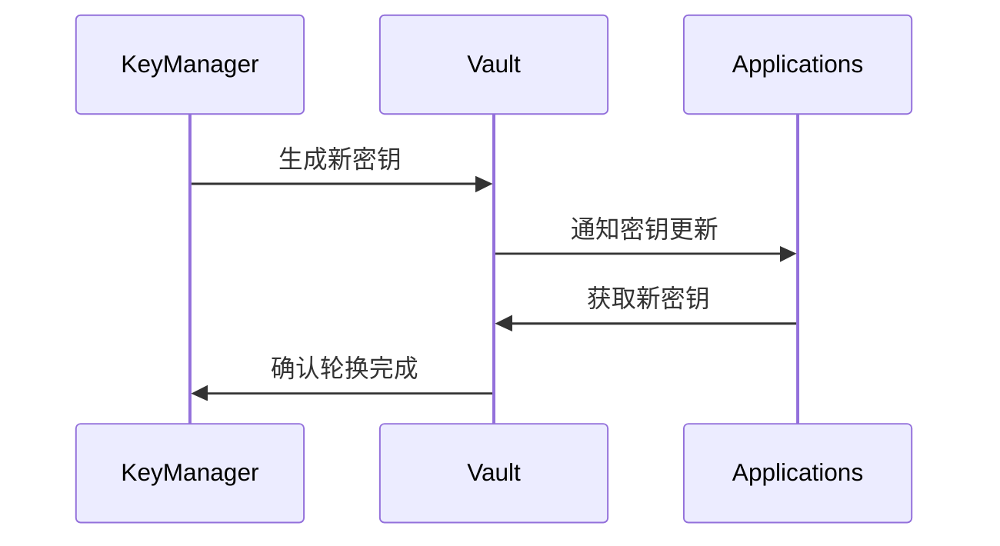

# 基础设施层增强实施指南

## 1. 环境准备

### 1.1 硬件要求
| 组件              | 最小配置                     | 生产环境推荐           |
|-------------------|-----------------------------|-----------------------|
| 控制节点          | 4核CPU/8GB内存/100GB存储    | 8核CPU/32GB内存/500GB |
| 监控节点          | 4核CPU/16GB内存/200GB存储   | 16核CPU/64GB内存/1TB  |
| 灾备节点          | 同生产环境配置               | 同生产环境+热备       |

### 1.2 软件依赖
```bash
# 基础依赖安装
sudo apt-get install -y \
    docker-ce \
    python3-pip \
    prometheus \
    grafana

# Python库安装
pip install \
    scikit-learn==1.2.2 \
    prometheus-client==0.16.0 \
    hashicorp-vault==1.0.0
```

## 2. 智能容灾系统部署

### 2.1 多中心配置
```yaml
# config/disaster_recovery.yaml
centers:
  primary:
    endpoint: "https://primary.example.com"
    weight: 100
  backup1:
    endpoint: "https://backup1.example.com" 
    weight: 80
  backup2:
    endpoint: "https://backup2.example.com"
    weight: 60

sync:
  interval: "5s"
  timeout: "10s"
```

### 2.2 部署步骤
1. 初始化状态同步服务
```bash
./disaster_recovery init \
    --config=config/disaster_recovery.yaml \
    --storage=etcd://localhost:2379
```

2. 启动健康监测
```bash
./disaster_recovery monitor \
    --interval=5s \
    --threshold=3
```

3. 验证容灾切换
```bash
# 模拟主中心故障
curl -X POST http://localhost:8080/failover/test

# 检查切换状态
curl http://localhost:8080/status
```

## 3. 智能监控体系配置

### 3.1 Prometheus配置示例
```yaml
# prometheus/config.yml
scrape_configs:
  - job_name: 'infra_metrics'
    scrape_interval: 15s
    static_configs:
      - targets: ['localhost:8000']
    
  - job_name: 'business_metrics'
    scrape_interval: 30s
    metrics_path: '/metrics'
    static_configs:
      - targets: ['app-server:8080']
```

### 3.2 异常检测规则
```yaml
# monitoring/alerts.yml
groups:
- name: infrastructure
  rules:
  - alert: HighErrorRate
    expr: rate(infra_errors_total[5m]) > 10
    for: 10m
    labels:
      severity: 'critical'
    annotations:
      summary: "High error rate detected"
```

### 3.3 部署验证
```bash
# 启动Prometheus
prometheus --config.file=./config.yml

# 验证指标采集
curl http://localhost:9090/api/v1/targets
```

## 4. 自适应资源管理

### 4.1 动态策略配置
```json
{
  "strategies": {
    "high_frequency": {
      "base_cpu": 30,
      "base_memory": "4Gi",
      "volatility_factor": 0.5,
      "liquidity_factor": 0.3
    }
  }
}
```

### 4.2 资源调节器部署
```bash
# 启动资源管理器
./resource_manager start \
    --config=config/resource_policy.json \
    --market-data-source=kafka://market-feed

# 验证调节效果
watch -n 1 "curl http://localhost:8080/quota/high_frequency"
```

## 5. 安全架构实施

### 5.1 RBAC策略定义
```yaml
# security/roles.yml
roles:
  admin:
    permissions:
      - "config:*"
      - "security:*"
  operator:
    permissions:
      - "monitoring:*"
      - "log:read"
```

### 5.2 密钥轮换流程


## 6. 混沌工程实施

### 6.1 实验定义
```yaml
# chaos/network_failure.yml
experiment:
  name: "network-partition"
  steps:
    - action: "network-loss"
      target: "payment-service"
      params:
        latency: "500ms"
        duration: "2m"
    - action: "monitor"
      metric: "transaction_success_rate"
      threshold: "95%"
```

### 6.2 执行验证
```bash
# 运行实验
chaos run chaos/network_failure.yml

# 生成报告
chaos report --export=html
```

## 7. 验证与验收

### 7.1 验收测试用例
| 测试项           | 方法                      | 预期结果              |
|------------------|--------------------------|----------------------|
| 容灾自动切换     | 停止主节点服务            | 30秒内完成切换       |
| 监控指标采集     | 生成测试负载              | 所有指标正常上报     |
| 资源动态调整     | 模拟市场波动              | CPU配额自动增减±20%  |
| 安全审计         | 尝试越权操作              | 操作被拒绝并记录日志 |

### 7.2 性能基准
```bash
# 运行压力测试
./load_test \
    --threads=100 \
    --duration=1h \
    --scenario=full

# 生成性能报告
python analyze_results.py load_test.log
```

## 8. 运维管理

### 8.1 日常维护命令
```bash
# 检查系统状态
./infra_tool status --all

# 执行密钥轮换
./security_tool rotate_keys --service=database

# 清理监控数据
./monitoring_tool purge --older-than=30d
```

### 8.2 故障排查指南
1. 容灾切换失败：
   - 检查网络连通性：`ping backup1.example.com`
   - 验证状态同步：`etcdctl get /infra/sync/last`
   
2. 监控数据缺失：
   - 检查Prometheus目标：`curl http://localhost:9090/targets`
   - 验证指标暴露端点：`curl http://app-server:8080/metrics`
```

<write_to_file>
<path>docs/infrastructure_enhancement_checklist.md</path>
<content><![CDATA[
# 基础设施增强实施检查清单

## 1. 预部署检查
- [ ] 验证所有节点网络互通
- [ ] 确认存储空间满足最低要求
- [ ] 检查依赖软件版本兼容性
- [ ] 备份现有配置和数据

## 2. 容灾系统
- [ ] 主备中心配置同步
- [ ] 状态同步服务正常运行
- [ ] 故障切换测试通过
- [ ] 监控集成验证

## 3. 监控体系
- [ ] Prometheus采集目标在线
- [ ] Grafana看板配置完成
- [ ] 告警规则测试验证
- [ ] 历史数据迁移完成

## 4. 资源管理
- [ ] 策略配置文件就位
- [ ] 市场数据接口连通
- [ ] 动态调节日志审核
- [ ] 资源限制测试通过

## 5. 安全架构
- [ ] RBAC角色分配完成
- [ ] 密钥管理服务初始化
- [ ] 审计日志配置验证
- [ ] 加密通信测试

## 6. 混沌工程
- [ ] 实验场景评审通过
- [ ] 测试环境隔离确认
- [ ] 恢复流程验证
- [ ] 应急方案准备

## 7. 验收标准
- [ ] 所有核心功能测试通过
- [ ] 性能指标达到SLA要求
- [ ] 文档更新完成
- [ ] 团队培训完成

## 8. 回滚计划
1. 停止所有增强组件服务
2. 恢复原有配置备份
3. 验证系统基础功能
4. 执行完整回归测试
