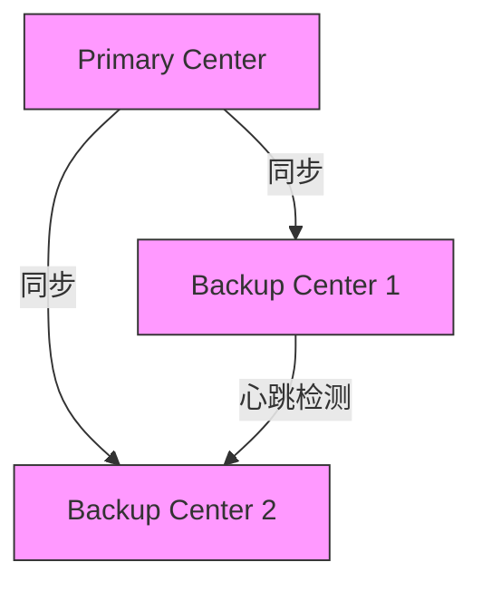
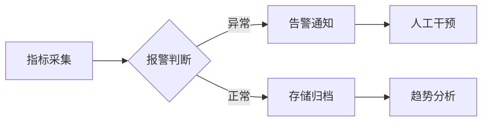
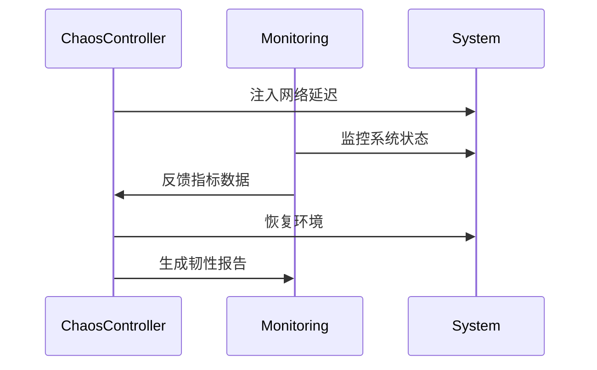
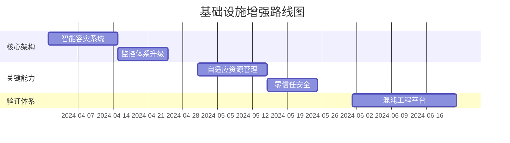

# 基础设施层增强方案技术提案

## 1. 智能容灾系统设计

### 1.1 多中心拓扑架构


### 1.2 核心算法实现
```python
class AIDisasterRecovery:
    def __init__(self):
        self.model = load_ai_model('failover_predictor.h5')
        
    def predict_failover(self, metrics):
        """基于机器学习的故障预测"""
        # 输入指标：网络延迟、节点负载、错误率
        prediction = self.model.predict(metrics)
        return prediction > 0.8  # 返回是否需要切换
    
    def execute_failover(self):
        """智能切换流程"""
        if self.predict_failover(collect_metrics()):
            optimal = self.select_optimal_backup()
            self.transfer_connections(optimal)
            self.verify_service_continuity()
```

### 1.3 关键SLA指标
| 指标          | 目标值       | 测量方法               |
|---------------|-------------|-----------------------|
| RPO(数据丢失) | <1秒        | 事务日志比对           |
| RTO(恢复时间) | <30秒       | 秒表测量故障注入到恢复 |
| 切换成功率    | 99.99%      | 统计年度切换记录        |

## 2. 智能监控体系升级

### 2.1 技术栈集成
```python
class MonitoringStack:
    def __init__(self):
        self.prometheus = PrometheusClient()
        self.loki = LokiLogAggregator()
        self.tempo = TempoTracing()
        
    def correlate_data(self):
        """实现指标-日志-追踪的关联分析"""
        return pd.merge(
            self.prometheus.get_metrics(),
            self.loki.get_logs(),
            on='trace_id'
        )
```

### 2.2 异常检测算法
```python
def detect_anomalies(data):
    # 使用孤立森林算法进行异常检测
    model = IsolationForest(contamination=0.01)
    anomalies = model.fit_predict(data)
    return np.where(anomalies == -1)
```

### 2.3 监控看板规范


## 3. 自适应资源管理系统

### 3.1 动态调整算法
```python
class ResourceOptimizer:
    def __init__(self):
        self.market_model = load_market_model()
        
    def calculate_demand(self, strategy):
        """基于市场状态的资源需求计算"""
        volatility = get_volatility_index()
        liquidity = get_liquidity_score()
        
        # 动态计算公式
        cpu_demand = base_cpu * (1 + 0.5*volatility) * liquidity
        workers = max(1, int(base_workers * (1 - 0.3*volatility)))
        
        return {'cpu': cpu_demand, 'workers': workers}
```

### 3.2 资源配额API设计
```python
@app.route('/api/v1/quota/adjust', methods=['POST'])
def adjust_quota():
    data = request.get_json()
    strategy = data['strategy']
    new_quota = ResourceOptimizer().calculate_demand(strategy)
    
    # 执行配额更新
    ResourceManager.update_quota(strategy, new_quota)
    return jsonify({'status': 'success'})
```

## 4. 零信任安全架构

### 4.1 安全控制矩阵
| 资源          | 角色        | 操作权限               | 审计级别 |
|---------------|------------|-----------------------|---------|
| 配置项        | admin      | 读写                  | HIGH    |
| 日志          | operator   | 只读                  | MEDIUM  |
| 监控数据      | viewer     | 只读                  | LOW     |

### 4.2 密钥管理方案
```python
class KeyManager:
    def __init__(self):
        self.vault = HashiCorpVault()
        
    def rotate_keys(self):
        """自动密钥轮换"""
        new_key = generate_aes_key()
        self.vault.store('database_key', new_key)
        migrate_data(old_key, new_key)
        invalidate(old_key)
```

## 5. 混沌工程工厂

### 5.1 实验设计模板
```yaml
experiment:
  name: config-service-failure
  scenarios:
    - type: network-latency
      target: config-service
      params: {delay: 500ms, duration: 5m}
    - type: pod-failure  
      target: config-service
      params: {kill-rate: 30%}
  metrics:
    - name: error-rate
      source: prometheus
      threshold: 5%
```

### 5.2 自动化测试流程


## 实施里程碑



## 预期技术指标

| 领域         | 改进前       | 改进后目标    | 提升幅度 |
|-------------|-------------|-------------|---------|
| 可用性      | 99.9%       | 99.99%      | 10倍    |
| 故障恢复    | 5分钟       | 30秒        | 90%     |
| 资源利用率  | 60%         | 85%         | 42%     |
| 安全事件    | 10次/月     | <2次/月     | 80%     |
