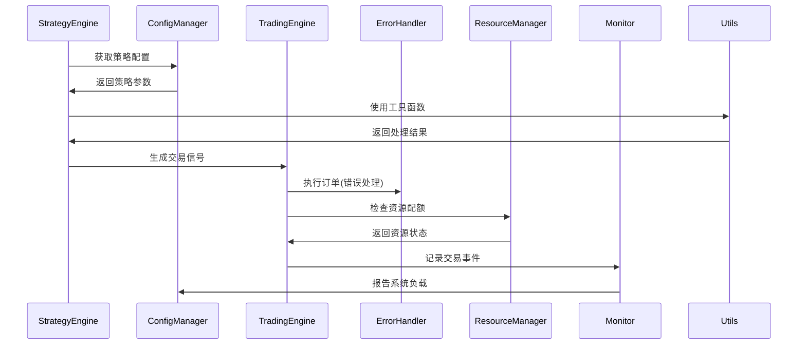

# 基础设施层组件集成指南

## 1. 核心业务流程集成点



## 2. 详细集成方案

### 2.1 配置管理集成

#### 策略配置加载
```python
class StrategyEngine:
    def __init__(self, config_manager):
        self.config_manager = config_manager
        
    def load_strategy_config(self, strategy_name):
        """加载策略配置"""
        base_config = self.config_manager.get(f'strategies.{strategy_name}')
        env_config = self.config_manager.get(f'env.{strategy_name}')
        return {**base_config, **env_config}
```

#### 热更新处理
```python
def on_config_change(event, new_config):
    if event == "config_changed":
        # 重新加载受影响的策略
        StrategyEngine.reload_affected_strategies(new_config)

config_manager.add_callback(on_config_change)
```

### 2.2 错误处理集成

#### 交易错误处理
```python
class TradingEngine:
    def __init__(self, error_handler):
        self.error_handler = error_handler
        self.retry_handler = RetryHandler(
            max_retries=3,
            retry_exceptions=[OrderRejectedError, BrokerConnectionError]
        )
    
    @retry_handler.with_retry()
    def execute_order(self, order):
        try:
            return broker_api.submit(order)
        except Exception as e:
            return self.error_handler.handle(e)
```

#### 自定义错误处理器
```python
class TradingErrorHandler(ErrorHandler):
    def __init__(self):
        super().__init__()
        self.register_handler(OrderRejectedError, self.handle_order_reject)
        
    def handle_order_reject(self, e):
        # 自定义订单拒绝处理逻辑
        logger.warning(f"Order rejected: {e.order_id}")
        return self.retry(e.retry_action)
```

### 2.3 资源管理集成

#### 策略资源配额
```python
# 初始化时设置策略资源配额
resource_manager.set_strategy_quota(
    strategy="high_frequency",
    cpu=30,  # 30% CPU
    gpu_memory=4096,  # 4GB GPU显存
    max_workers=10
)

# 执行前检查资源
class StrategyRunner:
    def run_strategy(self, strategy):
        if not resource_manager.check_quota(strategy.name):
            raise ResourceLimitExceeded()
        # 执行策略...
```

### 2.4 监控系统集成

#### 交易监控

### 2.5 工具模块集成

#### 模块概述
RQA2025工具模块分为两个层级：
1. **通用工具** (src/utils)
   - 日期处理、数据转换等基础功能
   - 与业务逻辑无关的纯工具函数
2. **基础设施专用工具** (src/infrastructure/utils)
   - 缓存管理、资源监控等基础设施相关功能
   - 与基础设施层紧密集成的工具

#### 缓存管理器集成示例
```python
from src.infrastructure.utils.cache import CacheManager

# 初始化缓存
cache = CacheManager(
    max_size=1000,  # 最大缓存条目数
    ttl=3600,      # 默认缓存时间(秒)
    strategy="lru" # 淘汰策略
)

# 使用缓存
@cache.memoize(key="features:{symbol}")
def calculate_features(symbol):
    """带缓存的特征计算"""
    # 复杂计算逻辑...
    return processed_features

# 手动缓存操作
cache.set("market_data", processed_data)
data = cache.get("market_data")
```

#### 兼容性导入
为保持向后兼容，旧代码可以继续使用原导入路径：
```python
# 新代码推荐使用
from src.infrastructure.utils.cache import CacheManager

# 旧代码兼容路径 (自动重定向到新位置)
from src.utils.cache import CacheManager  # 仍然有效
```

#### 最佳实践
1. **缓存使用**：
   - 对计算密集型函数使用@cache.memoize装饰器
   - 为不同的数据类型设置适当的TTL
   - 定期清理过期缓存

2. **性能优化**：
   ```python
   # 批量操作减少锁竞争
   with cache.batch():
       cache.set("key1", value1)
       cache.set("key2", value2)
   
   # 异步缓存更新
   cache.set_async("key", expensive_operation())
   ```

3. **错误处理**：
   ```python
   try:
       cache.set("critical", data)
   except CacheFullError:
       # 处理缓存满的情况
       cache.clear_oldest(10)  # 清理10个最旧条目
       cache.set("critical", data)  # 重试
   ```
```python
class TradingEngine:
    def __init__(self, app_monitor):
        self.monitor = app_monitor
        
    @app_monitor.monitor_function()
    def execute_order(self, order):
        # 订单执行逻辑
        self.monitor.record_trade(
            symbol=order.symbol,
            action=order.side,
            price=order.price,
            quantity=order.quantity
        )
```

#### 系统健康检查
```python
def check_system_health():
    cpu_usage = system_monitor.get_cpu_usage()
    if cpu_usage > 90:
        DisasterRecovery.activate_safe_mode()
        
system_monitor.add_alert_handler(check_system_health)
```

## 3. 集成验证步骤

### 3.1 配置管理验证
```python
# 测试配置热更新
original_value = config_manager.get('trading.max_order_size')
config_manager.set('trading.max_order_size', 1000, save=True)
assert trading_engine.config['max_order_size'] == 1000
config_manager.set('trading.max_order_size', original_value, save=True)
```

### 3.2 错误处理验证
```python
# 模拟失败请求验证重试
with patch('broker_api.submit', side_effect=BrokerConnectionError()):
    result = trading_engine.execute_order(test_order)
    assert result is not None  # 重试后应成功
```

### 3.3 资源管理验证
```python
# 测试资源超限
with patch('psutil.cpu_percent', return_value=95):
    assert not resource_manager.check_quota("high_frequency")
```

### 3.4 监控验证
```python
# 检查监控数据
trading_engine.execute_order(test_order)
assert len(app_monitor.get_trade_history()) > 0
assert system_monitor.get_cpu_usage() < 80
```

## 4. 性能优化建议

1. **配置缓存**：对频繁访问的配置项启用缓存
2. **批量监控**：对高频交易聚合监控数据
3. **资源检查优化**：
   ```python
   # 只在订单量超过阈值时检查资源
   if order_count > 100:
       resource_manager.check_quota(strategy)
   ```
4. **异步日志**：对性能敏感路径使用异步日志

## 5. 异常场景处理

### 5.1 配置加载失败
```python
try:
    config = config_manager.get('critical.path')
except ConfigError as e:
    error_handler.handle(e)
    config = load_default_config()
```

### 5.2 资源不足
```python
if not resource_manager.check_quota(strategy):
    # 优雅降级或排队等待
    strategy.adjust_parameters(reduce_load=True)
```

### 5.3 监控服务不可用
```python
try:
    monitor.record_trade(...)
except MonitorError:
    logger.warning("Monitor service unavailable, using local cache")
    cache_local_metrics(...)
```

## 6. 最佳实践

1. **配置分离**：业务配置与环境配置分开管理
2. **错误分类**：区分业务错误与系统错误
3. **资源隔离**：关键策略使用独立资源池
4. **监控分级**：区分关键指标与调试信息

## 7. 版本兼容性

| 组件          | 最低版本 | 备注                     |
|---------------|----------|--------------------------|
| ConfigManager | v1.2     | 支持热更新和变更通知      |
| ErrorHandler  | v2.0     | 支持自定义错误处理策略    |
| ResourceMgr   | v1.5     | 支持GPU和策略级配额       |
| SystemMonitor | v1.3     | 支持多维度指标聚合        |

通过以上集成方案，基础设施组件可以为业务系统提供可靠支持，同时保持系统架构的清晰和可维护性。

## 版本历史

### v3.8.0 (2024-06-20)
- 新增MiniQMT集成支持
  - 实现MiniQMT行情数据适配器
  - 实现MiniQMT交易接口适配器
  - 添加多源数据验证服务
  - 集成监控指标采集
  - 支持交易时段特殊处理

- v1.1 (2024-03-20): 添加工具模块集成指南
  - 新增工具模块概述
  - 添加缓存管理器集成示例
  - 包含兼容性导入说明
  - 添加最佳实践建议
- v1.0 (2024-02-15): 初始版本
