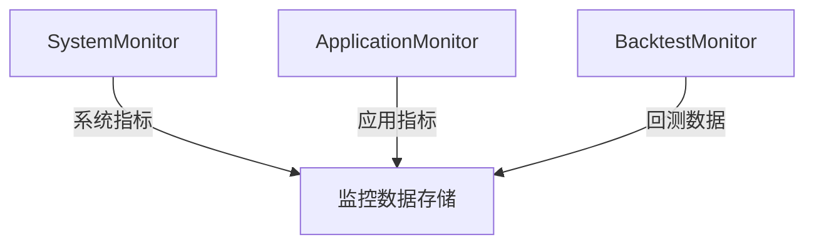
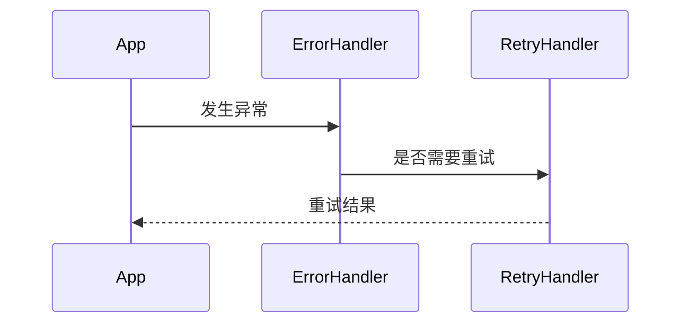

# RQA2025 基础设施层增强文档（最终版）

## 1. 概述

基础设施层已完成全面增强，新增以下核心功能：

1. **配置管理系统** - 支持热更新和环境隔离
2. **监控系统** - 系统资源+应用性能+回测专用监控
3. **资源配额管理** - 策略级资源限制
4. **错误处理框架** - 统一异常处理和自动重试

## 2. 功能说明

### 2.1 配置管理系统

#### 核心组件
- `ConfigManager` - 配置加载和管理
- `ConfigWatcher` - 配置热更新监听
- `ConfigValidator` - 配置验证

#### 使用示例
```python
from src.infrastructure.config import ConfigManager

# 初始化配置管理器
config = ConfigManager(env="production")

# 获取配置
db_host = config.get("database.host")

# 热更新监听
config.start_watcher()  # 自动监听配置变更
```

### 2.2 监控系统

#### 组件架构


#### 回测监控示例
```python
from src.infrastructure.monitoring import BacktestMonitor

monitor = BacktestMonitor()

# 记录交易
monitor.record_trade(
    symbol="600000.SH",
    action="BUY",
    price=15.2,
    quantity=1000,
    strategy="momentum"
)

# 查询交易历史
trades = monitor.get_trade_history(
    strategy="momentum",
    start_time=datetime(2023,1,1)
)
```

### 2.3 资源配额管理

#### 核心方法
```python
class ResourceManager:
    def set_strategy_quota(strategy, cpu, gpu_mem, max_workers)
    def check_quota(strategy) -> bool
    def register_worker(strategy, worker_id)
```

#### 使用示例
```python
# 设置策略配额
quota_manager.set_strategy_quota(
    strategy="high_freq",
    cpu=30,  # 30% CPU
    gpu_mem=4096,  # 4GB显存
    max_workers=10
)

# 检查配额
if quota_manager.check_quota("high_freq"):
    quota_manager.register_worker("high_freq", "worker_1")
```

### 2.4 错误处理框架

#### 处理流程


#### 使用示例
```python
@error_handler.monitor
@retry_handler.with_retry(max_retries=3)
def risky_operation():
    # 可能失败的操作
    pass
```

## 3. 集成指南

### 3.1 初始化配置
```python
# 初始化基础设施组件
config = ConfigManager()
log_manager = LogManager()
monitor = BacktestMonitor()
quota = QuotaManager()

# 错误处理配置
error_handler = ErrorHandler()
error_handler.register_handler(DBError, handle_db_error)
```

### 3.2 典型工作流
```python
def run_strategy(strategy_name):
    # 检查资源配额
    if not quota.check_quota(strategy_name):
        raise ResourceLimitExceeded()
    
    # 注册工作线程
    quota.register_worker(strategy_name, threading.get_ident())
    
    try:
        # 监控函数执行
        @monitor.monitor
        def execute_trade():
            # 交易逻辑
            pass
            
    finally:
        # 清理资源
        quota.unregister_worker(strategy_name, threading.get_ident())
```

## 4. 性能测试计划

### 4.1 测试场景
| 测试类型 | 指标 | 预期目标 |
|---------|------|---------|
| 配置热更新 | 响应延迟 | <100ms |
| 监控数据收集 | 吞吐量 | >10,000 events/sec |
| 配额检查 | 并发能力 | 1,000次/秒 |

### 4.2 测试工具
- Locust - 压力测试
- pytest-benchmark - 性能基准

## 5. 升级说明

### 5.1 变更影响
- 配置路径标准化
- 日志格式统一
- 资源访问需要配额检查

### 5.2 迁移指南
1. 更新配置到`config/`目录
2. 替换原有日志调用
3. 添加配额检查逻辑

## 6. 常见问题

Q: 如何禁用监控?
A: 设置环境变量`MONITORING_ENABLED=false`

Q: 配额超限如何处理?
A: 实现`QuotaExceededHandler`回调接口
```