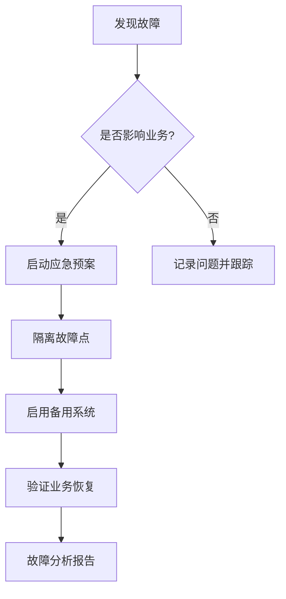
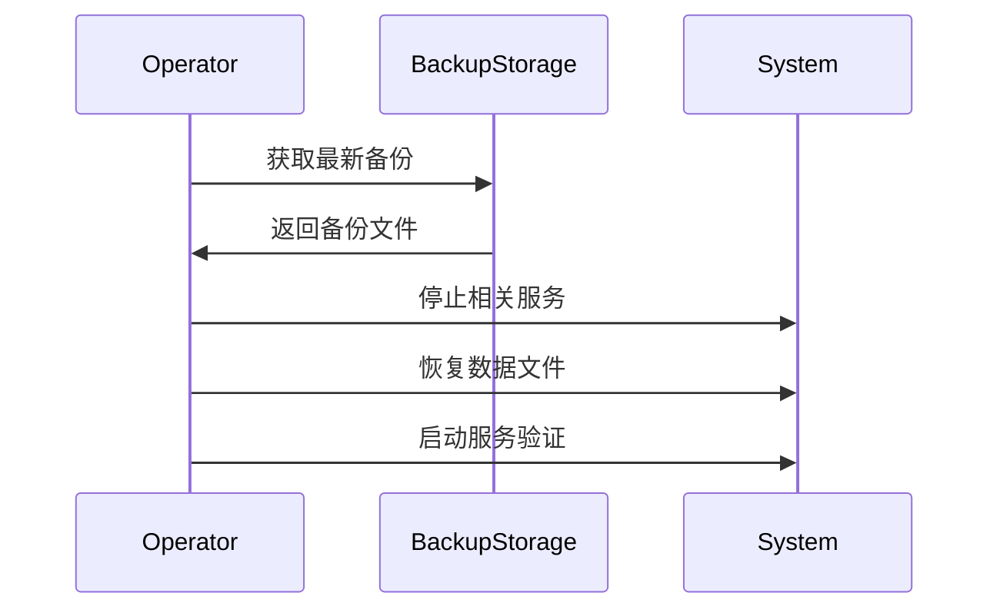
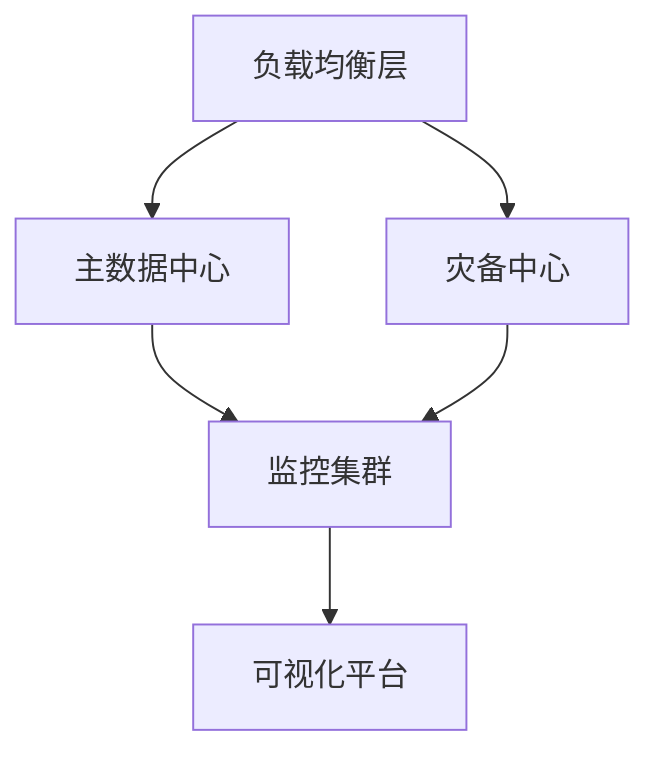

# 基础设施层运维操作手册

## 1. 日常运维流程

### 1.1 每日检查清单
```bash
# 检查系统健康状态
./infra_tool healthcheck --full

# 验证监控数据完整性
curl -s http://prometheus:9090/api/v1/targets | jq '.data.activeTargets[]|select(.health=="up")'

# 检查资源使用情况
./resource_monitor report --format=csv > daily_report_$(date +%F).csv
```

### 1.2 关键指标监控
| 指标名称              | 正常范围       | 检查命令                     |
|-----------------------|---------------|-----------------------------|
| 容灾同步延迟          | <500ms        | `curl http://dr-manager:8080/metrics | grep sync_latency` |
| CPU使用率            | <80%          | `promql:node_cpu_usage`      |
| 内存可用量           | >20%          | `promql:node_memory_available_bytes` |
| 磁盘空间使用率       | <90%          | `df -h`                     |

## 2. 故障处理指南

### 2.1 常见问题速查表
| 故障现象              | 可能原因               | 解决步骤                     |
|-----------------------|-----------------------|-----------------------------|
| 监控数据缺失          | Prometheus目标下线    | 1. 检查目标服务状态<br>2. 验证网络连通性<br>3. 重启exporter |
| 容灾切换失败          | 状态同步中断          | 1. 检查etcd集群健康状态<br>2. 验证网络带宽<br>3. 手动触发同步 |
| 资源分配异常          | 市场数据接口故障      | 1. 检查Kafka连接<br>2. 回退到静态配额模式<br>3. 重启资源管理器 |

### 2.2 紧急恢复流程


## 3. 性能调优指南

### 3.1 关键参数配置
```yaml
# 性能优化配置示例
tuning:
  prometheus:
    scrape_interval: "30s"  # 监控采集间隔
    retention: "30d"         # 数据保留周期
    
  resource_manager:
    adjustment_interval: "5s"  # 资源调整频率
    max_change_rate: 0.2        # 单次最大调整幅度
```

### 3.2 调优建议
1. **高负载场景**：
   - 增加Prometheus内存限制：`--storage.tsdb.retention.size=50GB`
   - 优化Grafana查询：使用`recording rules`减少实时计算

2. **低延迟要求**：
   - 缩短容灾检测间隔：`--heartbeat-interval=1s`
   - 启用快速失败模式：`--fail-fast=true`

## 4. 备份与恢复

### 4.1 关键数据备份
```bash
# 备份配置数据
tar czvf config_backup_$(date +%F).tar.gz /etc/infra/config/

# 备份监控数据
promtool tsdb backup --storage.tsdb.path=/data/prometheus backup_dir/
```

### 4.2 恢复流程示例


## 5. 安全运维规范

### 5.1 访问控制矩阵
| 操作类型          | 所需角色        | 审计级别 |
|-------------------|---------------|---------|
| 配置修改          | infra-admin   | HIGH    |
| 监控数据删除      | infra-operator | MEDIUM  |
| 日志查看          | infra-viewer  | LOW     |

### 5.2 密钥轮换流程
```bash
# 密钥轮换操作
./vault_manager rotate \
    --key-type=aes \
    --service=database \
    --expire-old=24h
```

## 6. 最佳实践

### 6.1 容量规划建议
| 组件              | 每万TPS资源需求       |
|-------------------|----------------------|
| 监控系统          | 2核CPU/4GB内存/50GB存储 |
| 容灾服务          | 1核CPU/2GB内存       |
| 资源管理器        | 1核CPU/1GB内存       |

### 6.2 部署拓扑建议


## 附录：常用命令速查

### 监控相关
```bash
# 查看Prometheus目标状态
curl http://localhost:9090/api/v1/targets

# 查询特定指标
promql -query 'rate(infra_errors_total[5m])'
```

### 容灾管理
```bash
# 手动触发切换
./disaster_recovery switchover --target=backup1

# 查看同步状态
./disaster_recovery status --detail
```

### 资源管理
```bash
# 强制调整配额
./resource_manager adjust --strategy=high_freq --cpu=40

# 查看当前分配
./resource_manager list --verbose
```
