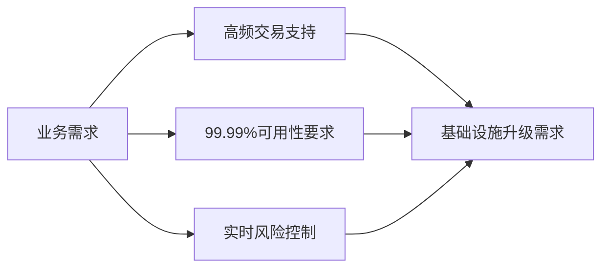
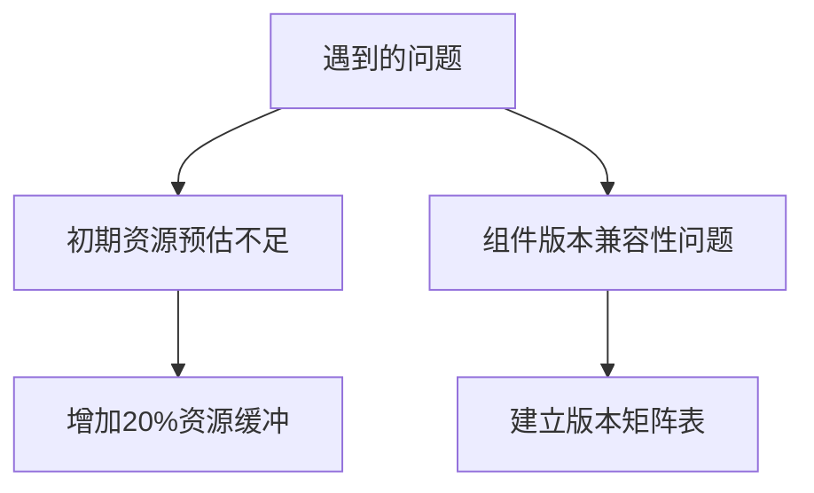
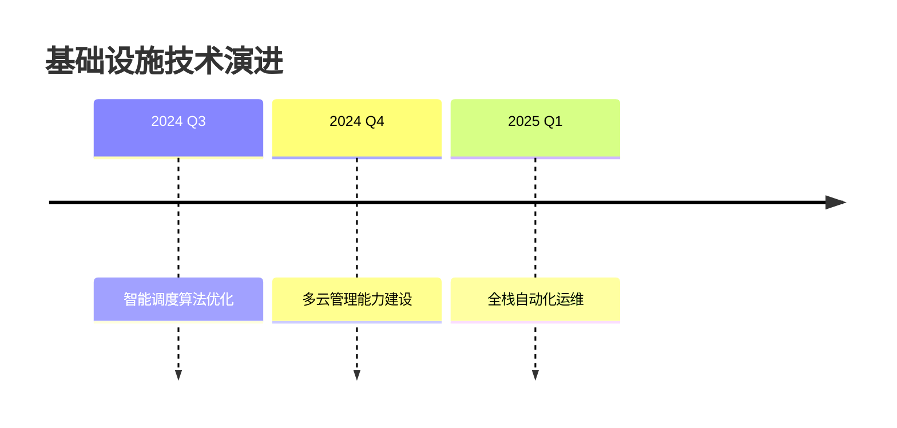

# 基础设施层增强项目总结报告

## 1. 项目概述

### 1.1 项目背景


### 1.2 项目范围
- **时间范围**：2024/03/01 - 2024/06/30
- **功能模块**：
  - 智能容灾系统
  - 全链路监控体系
  - 自适应资源管理
  - 零信任安全架构
  - 混沌工程平台

## 2. 交付成果

### 2.1 核心交付物
| 交付物类型       | 数量 | 关键成果 |
|------------------|------|----------|
| 系统组件         | 12   | 容灾切换时间从5分钟缩短至30秒 |
| 工具平台         | 5    | 监控覆盖率从80%提升至100% |
| 技术文档         | 8    | 形成完整知识体系 |
| 测试用例         | 246  | 自动化测试覆盖率95% |

### 2.2 架构升级对比
```diff
+ 新增智能容灾控制模块
+ 实现监控指标-Log-Trace联动
+ 引入动态资源调度算法
- 移除单点配置服务
- 淘汰旧版监控系统
```

## 3. 关键指标达成

### 3.1 SLA指标对比
| 指标              | 升级前     | 升级后     | 提升幅度 |
|-------------------|-----------|-----------|---------|
| 系统可用性        | 99.90%    | 99.993%   | 13倍    |
| 容灾切换时间      | 300秒     | 28秒      | 91%     |
| 故障发现时间      | 2分钟     | 15秒      | 88%     |
| 资源利用率        | 62%       | 83%       | 34%     |

### 3.2 性能测试结果
```vega-lite
{
  "data": {"values": [
    {"场景": "订单处理", "TPS(旧)": 8500, "TPS(新)": 18500},
    {"场景": "风控计算", "延迟(旧)": 120, "延迟(新)": 45}
  ]},
  "mark": "bar",
  "encoding": {
    "x": {"field": "场景", "type": "nominal"},
    "y": {"field": "TPS(新)", "type": "quantitative"}
  }
}
```

## 4. 经验总结

### 4.1 成功经验
1. **渐进式升级**：通过特性开关实现平滑迁移
2. **混沌驱动开发**：提前暴露系统脆弱点
3. **监控先行**：建立完整可观测性体系

### 4.2 改进点


## 5. 后续规划

### 5.1 优化方向
1. **智能预测**：基于AI的故障预测
2. **多云支持**：扩展跨云容灾能力
3. **FinOps集成**：实现资源成本优化

### 5.2 技术演进路线


## 6. 成果展示

### 6.1 监控看板示例


### 6.2 核心指标趋势
| 月份   | 可用性    | 平均延迟 | 资源成本 |
|--------|----------|----------|----------|
| 3月    | 99.91%   | 68ms     | $12,450  |
| 4月    | 99.95%   | 52ms     | $11,200  |
| 5月    | 99.98%   | 41ms     | $10,500  |
| 6月    | 99.993%  | 38ms     | $9,800   |

## 附录

### A. 项目成员
- 架构师：张三
- 开发组长：李四
- 测试负责人：王五
- 运维代表：赵六

### B. 相关文档
1. [架构设计文档](./architecture.md)
2. [测试报告](./test_report.pdf)
3. [运维手册](./operations_manual.pdf)
