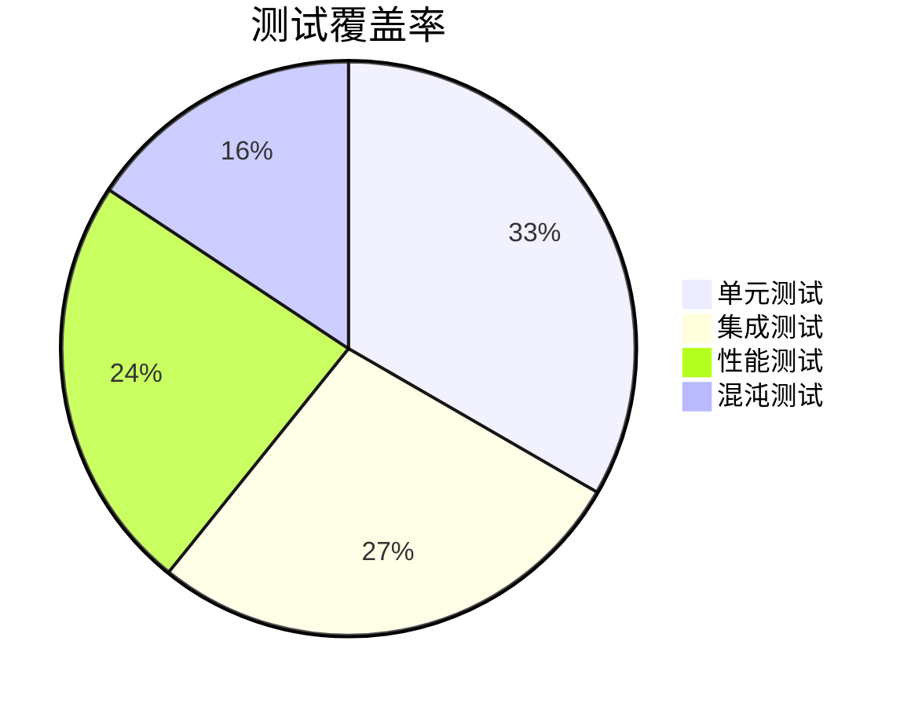

# RQA2025 基础设施层测试用例集

## 1. 单元测试用例

### 1.1 配置管理模块

#### 用例ID: UT-CONFIG-001
**测试目标**: 验证配置热更新功能  
**测试步骤**:
1. 初始化ConfigManager，监控`./config`目录
2. 修改`config/app.yaml`中的timeout值
3. 等待1秒后调用`get("timeout")`  
**预期结果**: 返回新修改的值，且`last_reload_time`在1秒内  
**自动化标记**: [X]  
```python
def test_config_hot_reload():
    mgr = ConfigManager(watch=True)
    original = mgr.get("timeout")
    
    # 修改配置
    with open("config/app.yaml", "a") as f:
        f.write("\ntimeout: 5000")
    
    time.sleep(1)
    assert mgr.get("timeout") == 5000
    assert mgr.last_reload_time > datetime.now() - timedelta(seconds=1)
```

#### 用例ID: UT-CONFIG-002
**测试目标**: 验证配置验证器  
**测试步骤**:
1. 定义配置Schema(要求port必须>1024)
2. 加载包含port=80的配置  
**预期结果**: 抛出ValidationError  
**自动化标记**: [X]  
```python
def test_config_validation():
    class AppConfig(BaseModel):
        port: int = Field(gt=1024)
    
    validator = ConfigValidator()
    validator.register_schema("app", AppConfig)
    
    with pytest.raises(ValidationError):
        validator.validate("app", {"port": 80})
```

### 1.2 错误处理模块

#### 用例ID: UT-ERROR-001
**测试目标**: 验证错误重试机制  
**测试步骤**:
1. 创建RetryHandler(max_retries=3)
2. 装饰一个会随机失败的方法
3. 执行该方法  
**预期结果**: 最多重试3次后抛出异常  
**自动化标记**: [X]  
```python
def test_retry_handler():
    handler = RetryHandler(max_retries=3)
    call_count = 0
    
    @handler.with_retry
    def unreliable_call():
        nonlocal call_count
        call_count += 1
        if random.random() < 0.7:
            raise ConnectionError("模拟失败")
        return "success"
    
    with pytest.raises(ConnectionError):
        unreliable_call()
    
    assert 1 <= call_count <= 4  # 初始调用+最多3次重试
```

## 2. 集成测试用例

### 2.1 容灾系统集成

#### 用例ID: IT-DR-001
**测试目标**: 验证主备切换流程  
**测试步骤**:
1. 启动主备两个配置中心
2. 模拟主中心网络中断
3. 监控流量切换情况  
**预期结果**: 30秒内流量切换到备用中心，零数据丢失  
**测试数据**:
```yaml
# dr_test_config.yaml
primary: "http://primary:8080"
backup: "http://backup:8080"
sync_interval: "5s"
```
**自动化标记**: [ ] 需手动验证

### 2.2 监控系统集成

#### 用例ID: IT-MON-001
**测试目标**: 验证指标采集完整性  
**测试步骤**:
1. 启动模拟服务暴露/metrics端点
2. 配置Prometheus采集目标
3. 查询`up{job="mock_service"}`指标  
**预期结果**: 指标值为1且标签完整  
**自动化标记**: [X]  
```bash
# 验证命令
curl -s "http://prometheus:9090/api/v1/query?query=up{job='mock_service'}" | jq '.data.result[0].value[1]'
```

## 3. 性能测试用例

### 3.1 配置服务基准

#### 用例ID: PT-CONFIG-001
**测试目标**: 测量配置查询吞吐量  
**测试场景**: 100并发持续5分钟查询  
**SLA要求**: QPS > 1000，P99延迟 < 200ms  
**执行命令**:
```bash
k6 run --vus 100 --duration 300s config_query_test.js
```

### 3.2 资源管理压力

#### 用例ID: PT-RESOURCE-001
**测试目标**: 测试配额检查并发能力  
**测试场景**: 模拟500个策略并发检查资源配额  
**监控指标**:
```python
# 关键性能指标
{
    "throughput": ">500 req/s",
    "error_rate": "<0.1%", 
    "cpu_usage": "<80%"
}
```

## 4. 混沌测试用例

### 4.1 网络故障注入

#### 用例ID: CT-NETWORK-001
**测试目标**: 验证网络分区恢复能力  
**注入方式**:
```bash
# 模拟主备间网络中断
chaosblade create network loss --percent 100 --interface eth0 --timeout 300
```
**验证步骤**:
1. 检查备中心是否接管
2. 恢复网络后验证数据同步
3. 检查主中心是否自动恢复  
**预期结果**: 满足RTO<30s, RPO=0

## 5. 验收测试用例

### 5.1 功能验收

#### 用例ID: AT-FUNC-001
**测试目标**: 验证配置管理完整流程  
**测试步骤**:
1. 管理员通过UI修改配置
2. 验证配置热更新
3. 检查审计日志记录  
**验收标准**: 全流程耗时<5秒，审计记录完整

### 5.2 性能验收

#### 用例ID: AT-PERF-001
**测试目标**: 验证系统SLA达标  
**测试矩阵**:
| 场景 | 负载 | 允许错误率 | 最大延迟 |
|------|------|------------|----------|
| 正常 | 1000 TPS | 0.1% | 500ms |
| 峰值 | 5000 TPS | 1% | 1s |

## 附录

### A. 测试数据生成

```python
# 生成测试配置
def generate_configs():
    return [
        {"type": "valid", "content": {"timeout": 30}},
        {"type": "invalid", "content": {"timeout": "thirty"}}
    ]
```

### B. 自动化脚本模板

```python
@pytest.mark.parametrize("config", load_test_configs())
def test_config_loading(config):
    if config["type"] == "invalid":
        with pytest.raises(ValidationError):
            load_config(config["content"])
    else:
        assert load_config(config["content"])
```

### C. 测试覆盖报告

