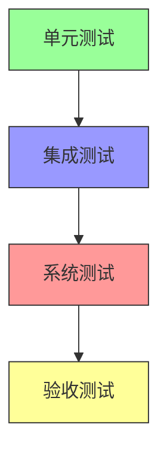
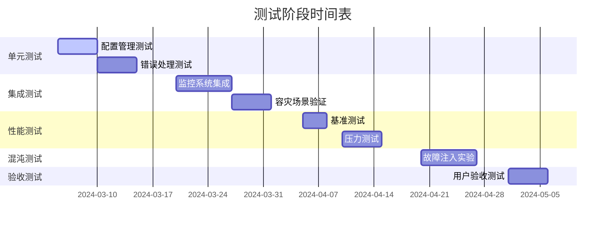
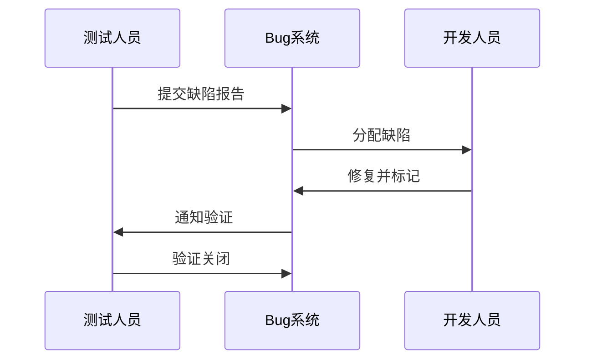

# RQA2025 基础设施层测试计划

## 1. 测试策略

### 1.1 测试金字塔


### 1.2 测试类型矩阵
| 测试类型 | 范围 | 工具 | 频率 | 负责人 |
|----------|------|------|------|--------|
| 单元测试 | 单个类/方法 | pytest | 代码提交时 | 开发工程师 |
| 集成测试 | 模块间交互 | pytest+Postman | 每日构建 | 测试工程师 |
| 性能测试 | 系统负载 | Locust+k6 | 每周 | 性能工程师 |
| 混沌测试 | 系统韧性 | ChaosMesh | 每两周 | 运维工程师 |
| 验收测试 | 业务需求 | Cucumber | 里程碑节点 | QA经理 |

## 2. 测试阶段规划

### 2.1 阶段安排


### 2.2 环境需求
| 环境类型 | 配置要求 | 数量 |
|----------|----------|------|
| 单元测试 | 4核CPU/8GB内存 | 10节点 |
| 集成测试 | 8核CPU/16GB内存 | 5节点集群 |
| 性能测试 | 16核CPU/32GB内存 | 3节点集群+负载发生器 |
| 生产验证 | 同生产环境1/10规模 | 独立环境 |

## 3. 详细测试方案

### 3.1 单元测试规范

#### 3.1.1 配置管理测试
```python
# tests/unit/config/test_config_manager.py
class TestConfigManager:
    @pytest.fixture
    def config_dir(tmp_path):
        # 创建测试配置目录结构
        dir_path = tmp_path / "config"
        dir_path.mkdir()
        (dir_path / "base.yaml").write_text("key: value")
        return dir_path

    def test_hot_reload(self, config_dir):
        """测试配置热重载功能"""
        manager = ConfigManager(config_dir)
        original = manager.get("key")
        
        # 修改配置文件
        (config_dir / "base.yaml").write_text("key: new_value")
        
        # 触发重载
        manager.reload()
        assert manager.get("key") == "new_value"
        assert manager.last_reload > datetime.now() - timedelta(seconds=1)
```

#### 3.1.2 错误处理测试
```python
# tests/unit/error/test_error_handler.py
def test_retry_mechanism():
    """测试指数退避重试策略"""
    handler = RetryHandler(
        max_retries=3,
        retry_delay=1.0,
        backoff_factor=2.0
    )
    
    call_count = 0
    
    @handler.with_retry
    def flaky_function():
        nonlocal call_count
        call_count += 1
        if call_count < 3:
            raise ConnectionError("模拟失败")
        return "success"
    
    result = flaky_function()
    assert result == "success"
    assert call_count == 3
```

### 3.2 集成测试用例

#### 3.2.1 监控系统集成
```yaml
# tests/integration/monitoring/test_scenarios.yaml
scenarios:
  - name: 指标采集完整性测试
    steps:
      - 启动模拟服务: {command: "mock_service --metrics-port 8080"}
      - 配置采集目标: {target: "localhost:8080"}
      - 验证指标: 
          query: "up{job='mock_service'}"
          expected: "1"
          timeout: 30s
  
  - name: 告警触发测试
    steps:
      - 注入高负载: {cpu: "90%", duration: "1m"}
      - 等待告警: {alert: "HighCPUUsage", timeout: "2m"}
      - 验证通知: {channel: "email", contains: "CPU usage alert"}
```

### 3.3 性能测试方案

#### 3.3.1 基准测试指标
| 组件 | 基准指标 | 测试方法 |
|------|---------|----------|
| 配置服务 | 1000次/秒查询 | wrk脚本模拟 |
| 错误处理 | 5000异常/秒处理 | 异常生成器 |
| 资源管理 | 100策略/秒配额检查 | 多线程测试工具 |

#### 3.3.2 压力测试场景
```python
# tests/performance/stress_test.py
class TestResourceManagerStress:
    @pytest.mark.parametrize("concurrency", [100, 200, 500])
    def test_quota_check(self, concurrency):
        """并发配额检查压力测试"""
        results = run_concurrent_checks(
            strategy="high_freq",
            concurrency=concurrency,
            duration="1m"
        )
        
        assert results.failure_rate < 0.1%, "失败率超过阈值"
        assert results.avg_latency < 100, "平均延迟超过100ms"
```

### 3.4 混沌测试设计

#### 3.4.1 实验矩阵
| 故障类型 | 注入方法 | 预期行为 |
|----------|---------|----------|
| 节点宕机 | kill -9 | 30秒内自动切换 |
| 网络分区 | iptables DROP | 业务降级运行 |
| 磁盘满 | dd填充 | 触发告警并保护 |

#### 3.4.2 实验示例
```yaml
# chaos/network_partition.yaml
experiment:
  name: "网络分区测试"
  steps:
    - action: "network-loss"
      target: "config_service"
      params: {loss: "100%", duration: "5m"}
    - action: "monitor"
      metrics:
        - name: "config_read_error_rate"
          threshold: "<10%"
      timeout: "2m"
```

## 4. 验收标准

### 4.1 功能验收
| 需求ID | 测试用例 | 通过标准 |
|--------|---------|----------|
| INF-01 | 配置热更新 | 变更生效时间<1s |
| INF-02 | 容灾切换 | RTO<30s, RPO=0 |
| INF-03 | 资源配额 | 动态调整响应<100ms |

### 4.2 性能验收
| 场景 | SLA指标 | 达标要求 |
|------|---------|----------|
| 正常负载 | 错误率 | <0.1% |
| 峰值负载 | 延迟P99 | <500ms |
| 持续运行 | 内存泄漏 | <1MB/hour |

## 5. 测试执行管理

### 5.1 进度跟踪模板
```markdown
# 测试日报 - {{date}}

## 今日完成
- [x] {{test_case_1}}
- [x] {{test_case_2}}

## 发现问题
1. {{issue_1}} (严重程度: {{level}})
2. {{issue_2}}

## 明日计划
- [ ] {{next_test_1}}
- [ ] {{next_test_2}}
```

### 5.2 缺陷管理流程


## 6. 测试资源

### 6.1 工具栈
| 用途 | 工具 | 版本 |
|------|------|------|
| 单元测试 | pytest | 7.4.0 |
| 接口测试 | Postman | 10.14 |
| 性能测试 | k6 | 0.45.0 |
| 混沌工程 | ChaosMesh | 2.5.0 |

### 6.2 测试数据
```python
# tests/data_generator.py
def generate_config_test_data():
    """生成配置测试数据集"""
    return {
        "valid": ["normal.yaml", "multi_env.yaml"],
        "invalid": ["malformed.yaml", "wrong_type.yaml"]
    }
```

## 7. 风险与应对

### 7.1 风险清单
| 风险描述 | 可能性 | 影响 | 缓解措施 |
|----------|--------|------|----------|
| 环境不一致 | 中 | 高 | 使用Docker标准化环境 |
| 测试数据不足 | 高 | 中 | 开发数据生成工具 |
| 性能瓶颈 | 低 | 高 | 提前进行基准测试 |

### 7.2 应急方案
1. **测试阻塞**：
   - 启用mock服务继续测试
   - 优先测试不受影响模块

2. **环境故障**：
   - 切换到备份测试集群
   - 使用历史快照恢复

## 8. 附录

### 8.1 术语表
- **RTO**: 恢复时间目标
- **RPO**: 恢复点目标
- **SLA**: 服务等级协议

### 8.2 参考文档
1. [架构设计文档](./architecture.md)
2. [API规范](./api_spec.yaml)
3. [性能基准报告](./performance_benchmark.md)
