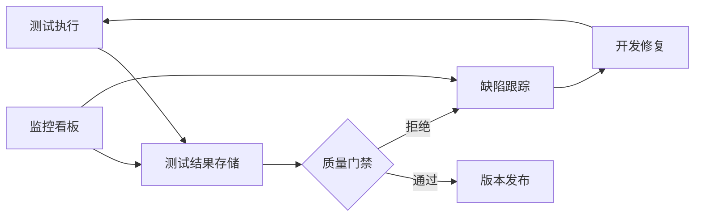
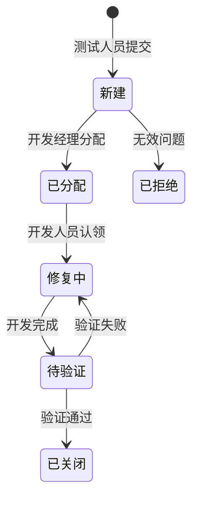
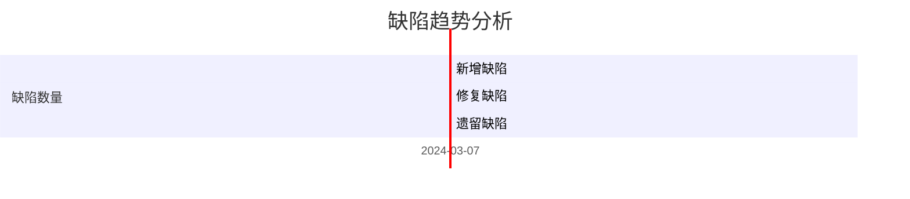
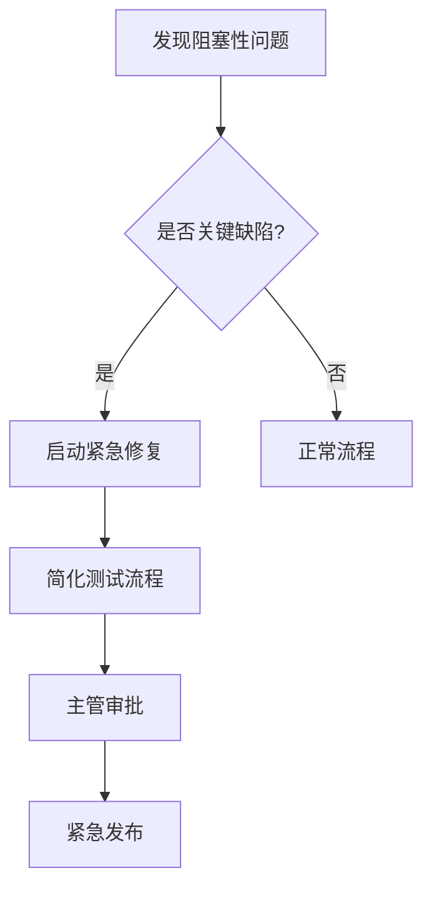

# RQA2025 基础设施层测试跟踪方案

## 1. 跟踪系统架构



## 2. 测试执行跟踪

### 2.1 实时状态报告
```python
# 测试状态数据结构
class TestStatus:
    def __init__(self):
        self.total = 0
        self.passed = 0
        self.failed = 0
        self.skipped = 0
        self.running = 0
        self.start_time = datetime.now()
        self.execution_time = None
```

### 2.2 跟踪字段定义
| 字段 | 类型 | 描述 |
|------|------|------|
| test_id | string | 测试用例唯一ID |
| status | enum | passed/failed/skipped/running |
| duration | float | 执行耗时(秒) |
| environment | string | 测试环境标识 |
| timestamp | datetime | 执行时间戳 |
| details | json | 详细日志和截图 |

## 3. 缺陷管理流程

### 3.1 缺陷生命周期


### 3.2 严重程度分类
| 等级 | 响应时限 | 处理优先级 |
|------|---------|-----------|
| 致命 | 2小时 | P0 |
| 严重 | 4小时 | P1 |
| 一般 | 1工作日 | P2 |
| 轻微 | 2工作日 | P3 |

## 4. 覆盖率跟踪

### 4.1 覆盖率指标
```vega-lite
{
  "data": {"values": [
    {"type": "行覆盖率", "value": 85},
    {"type": "分支覆盖率", "value": 75},
    {"type": "方法覆盖率", "value": 90}
  ]},
  "mark": "bar",
  "encoding": {
    "x": {"field": "type", "type": "nominal"},
    "y": {"field": "value", "type": "quantitative"}
  }
}
```

### 4.2 覆盖率提升计划
1. **增量覆盖率检查**：
   ```bash
   # 只检查新增代码的覆盖率
   pytest --cov --cov-fail-under=80 --cov-report=html:cov_html
   ```
2. **未覆盖代码标记**：
   ```python
   # pragma: no cover
   def legacy_code():
       pass  # 排除覆盖率统计
   ```

## 5. 质量门禁规则

### 5.1 发布标准
| 指标 | 阈值 | 检查阶段 |
|------|------|----------|
| 单元测试通过率 | 100% | 代码提交 |
| 集成测试通过率 | 95% | 每日构建 |
| 性能测试达标率 | 90% | 版本发布 |
| 关键缺陷数量 | 0 | 版本发布 |

### 5.2 自动化检查
```yaml
# .github/workflows/quality-gate.yml
steps:
  - name: 运行测试
    run: pytest --cov --junitxml=report.xml
  
  - name: 检查覆盖率
    run: |
      coverage report --fail-under=80
      coverage xml
      
  - name: 上传结果
    uses: actions/upload-artifact@v2
    with:
      name: test-reports
      path: |
        report.xml
        coverage.xml
```

## 6. 统计分析与报告

### 6.1 测试效率指标
| 指标 | 计算公式 | 目标值 |
|------|---------|-------|
| 缺陷发现率 | 缺陷数/测试用例数 | <0.2 |
| 平均修复时间 | 总修复时间/缺陷数 | <4h |
| 测试自动化率 | 自动化用例/总用例 | >80% |

### 6.2 趋势分析


## 7. 工具链集成

### 7.1 推荐工具栈
| 用途 | 开源方案 | 商业方案 |
|------|---------|----------|
| 测试管理 | TestLink | Jira+Zephyr |
| 缺陷跟踪 | Bugzilla | Jira |
| 覆盖率 | Coverage.py | SonarQube |
| 性能测试 | JMeter | LoadRunner |

### 7.2 CI集成示例
```groovy
// Jenkinsfile 示例
pipeline {
    agent any
    stages {
        stage('Test') {
            steps {
                sh 'pytest --junitxml=test-results.xml'
                junit 'test-results.xml'
                
                // 覆盖率检查
                sh 'coverage run -m pytest'
                sh 'coverage xml'
                cobertura coberturaReportFile: 'coverage.xml'
            }
        }
    }
}
```

## 8. 应急响应

### 8.1 测试阻塞处理
1. **环境问题**：
   - 启用备用测试环境
   - 使用mock服务替代

2. **用例缺陷**：
   - 临时跳过问题用例
   - 添加`@pytest.mark.skip(reason="待修复")`

### 8.2 紧急发布流程

