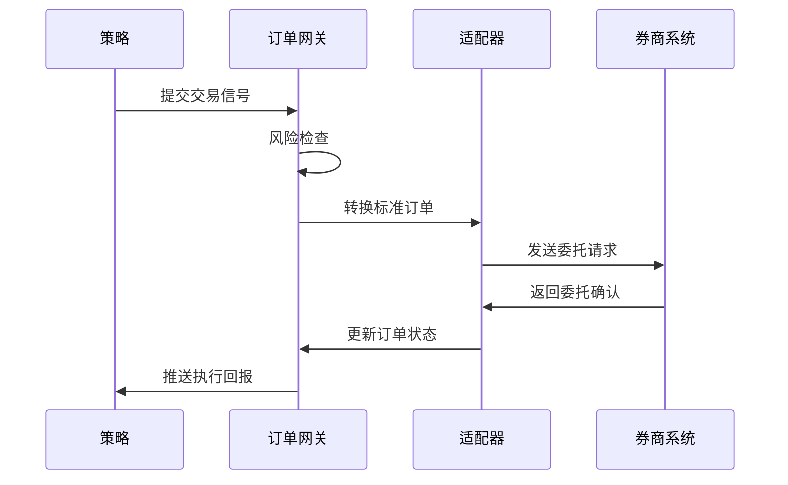
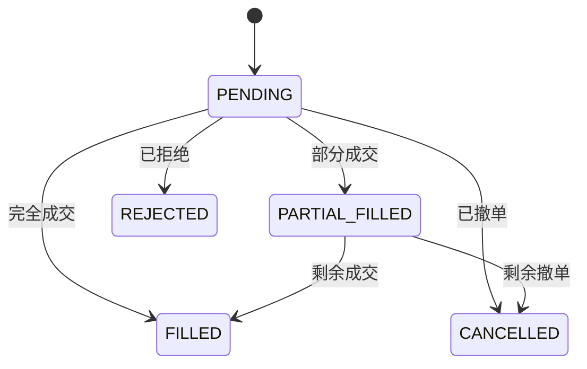

# RQA2025 实盘交易系统设计文档

## 1. 概述

实盘交易系统负责将策略信号转换为实际交易指令，主要功能包括：
- 多券商接口统一适配
- 可靠订单执行
- 实时风险控制
- 交易状态监控

## 2. 系统架构

### 2.1 核心组件
```text
BrokerAdapter       - 券商接口适配器
OrderGateway        - 订单路由网关
RiskEngine          - 实时风控引擎
PositionManager     - 持仓统一管理
MonitorDashboard    - 监控看板
```

### 2.2 数据流


## 3. 适配器设计

### 3.1 适配器模式
```python
class BrokerAdapter(ABC):
    """统一接口抽象基类"""
    
    @abstractmethod
    def place_order(self, order: Dict) -> str:
        """统一下单接口"""
        pass
    
    @abstractmethod 
    def cancel_order(self, order_id: str) -> bool:
        """统一撤单接口"""
        pass

class CTPAdapter(BrokerAdapter):
    """CTP柜台适配器"""
    
    def place_order(self, order: Dict) -> str:
        """CTP特定实现"""
        # 转换为CTP协议格式
        ctp_order = self._convert_to_ctp_format(order)
        # 调用CTP API
        return self._send_to_ctp(ctp_order)
```

### 3.2 支持券商
| 券商类型 | 协议 | 状态 |
|---------|------|------|
| CTP | 期货协议 | 已实现 |
| XTP | A股协议 | 开发中 |
| IB | 国际协议 | 计划中 |
| Simulator | 模拟协议 | 已实现 |

## 4. 订单管理

### 4.1 订单状态机


### 4.2 订单重试机制
```python
def send_order_with_retry(order, max_retries=3):
    """带重试的订单发送"""
    for attempt in range(max_retries):
        try:
            return adapter.place_order(order)
        except NetworkError as e:
            if attempt == max_retries - 1:
                raise
            time.sleep(1 * (attempt + 1))
```

## 5. 风险控制

### 5.1 风控检查点
```text
1. 单笔最大损失检查
2. 单日最大损失检查
3. 仓位集中度检查
4. 流动性检查
5. 黑名单检查
```

### 5.2 熔断机制
```python
class CircuitBreaker:
    """交易熔断器"""
    
    def __init__(self, threshold=0.05):
        self.threshold = threshold  # 单日损失阈值
        self.triggered = False
        
    def check(self, pnl):
        """检查是否触发熔断"""
        if pnl < -self.threshold and not self.triggered:
            self.triggered = True
            self._alert_risk_team()
            return True
        return False
```

## 6. 监控指标

### 6.1 核心监控项
| 指标 | 采样频率 | 阈值 |
|------|---------|------|
| 订单成功率 | 1分钟 | >99% |
| 平均延迟 | 1分钟 | <500ms |
| 系统负载 | 5秒 | <80% |
| 网络延迟 | 10秒 | <100ms |

### 6.2 监控看板
```python
def create_dashboard():
    """创建监控看板"""
    dash = Dashboard(title="交易监控")
    
    # 添加监控组件
    dash.add_panel(OrderRatePanel())
    dash.add_panel(LatencyPanel())
    dash.add_panel(RiskPanel())
    dash.add_panel(SystemHealthPanel())
    
    return dash
```

## 7. 部署方案

### 7.1 生产环境部署
```text
交易服务器1(主)
  ├─ Order Gateway
  ├─ Risk Engine
  └─ CTP Adapter
  
交易服务器2(备)
  ├─ Order Gateway 
  ├─ Risk Engine
  └─ CTP Adapter

监控服务器
  ├─ Monitor Dashboard
  └─ Alert Service
```

### 7.2 灾备方案
```text
1. 心跳检测主备切换
2. 订单状态同步
3. 断点续传
4. 数据一致性校验
```

## 8. 版本历史

- v1.0 (2023-09-01): 基础交易框架
- v1.1 (2023-09-15): CTP适配器实现
- v1.2 (2023-10-01): 风控引擎增强
- v1.3 (2023-10-15): 监控看板集成
